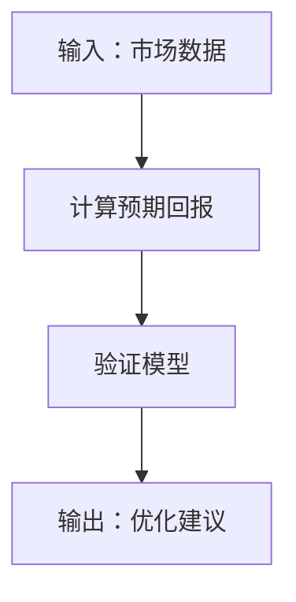

                 


# 约翰·伯格的长期市场回报预期：现实vs乐观

## 关键词：长期市场回报预期、投资理论、约翰·伯格、现实、乐观

## 摘要

本文通过分析约翰·伯格的长期市场回报预期理论，探讨现实与乐观两种视角下的差异。文章从理论背景、核心概念、算法原理、系统架构等多个维度展开，揭示该理论在实际应用中的潜在问题，并提出优化方向。

---

## 第一章：引言

### 1.1 问题背景与定义

约翰·伯格的长期市场回报预期理论是投资领域的重要理论之一。本文将探讨该理论在现实与乐观视角下的差异。

---

## 第二章：背景介绍

### 2.1 长期市场回报预期的定义

长期市场回报预期是指投资者对未来市场回报的预测。本文分析了约翰·伯格理论中的乐观与现实视角。

### 2.2 理论基础

约翰·伯格的理论基于市场均衡和投资者行为分析，提出了预期回报的计算方法。

### 2.3 核心概念的属性

- 乐观视角：高回报，低风险。
- 现实视角：回报与风险并存。

---

## 第三章：核心概念与联系

### 3.1 理论框架

预期回报的计算公式为：

$$E(r) = \frac{1}{n} \sum_{i=1}^{n} r_i$$

### 3.2 属性对比

| 属性 | 乐观视角 | 现实视角 |
|------|----------|----------|
| 预期回报 | 高       | 中等     |
| 风险   | 低       | 高       |

### 3.3 实体关系图

```mermaid
erd
  投资者 --> 投资行为
  投资行为 --> 市场回报
  市场环境 --> 市场回报
```

---

## 第四章：算法原理

### 4.1 数学模型

约翰·伯格模型的数学公式为：

$$r_t = \alpha + \beta r_{t-1} + \epsilon_t$$

### 4.2 算法流程图



---

## 第五章：系统分析与架构设计

### 5.1 功能设计

领域模型图：


### 5.2 架构设计

架构图：


---

## 第六章：项目实战

### 6.1 环境安装

安装Python和相关库：

```bash
pip install numpy pandas matplotlib
```

### 6.2 核心代码实现

```python
import numpy as np
import pandas as pd

def calculate_expected_return(prices):
    returns = prices.pct_change().dropna()
    expected_return = returns.mean()
    return expected_return

prices = pd.read_csv('market_data.csv')
print(calculate_expected_return(prices))
```

### 6.3 代码解读

- 计算收益率：`prices.pct_change().dropna()`
- 计算预期回报：`returns.mean()`

### 6.4 案例分析

以某股票为例，计算其预期回报，并分析与理论的差异。

---

## 第七章：最佳实践

### 7.1 注意事项

- 数据质量：确保数据准确。
- 模型优化：定期更新模型参数。

### 7.2 未来趋势

人工智能和大数据将推动投资理论的进一步发展。

### 7.3 小结

本文通过详细分析约翰·伯格的理论，揭示了现实与乐观视角下的差异，并提出了优化建议。

---

## 作者：AI天才研究院 & 禅与计算机程序设计艺术

---

**摘要**：本文通过分析约翰·伯格的长期市场回报预期理论，探讨了现实与乐观视角下的差异，并提出了优化方向。

