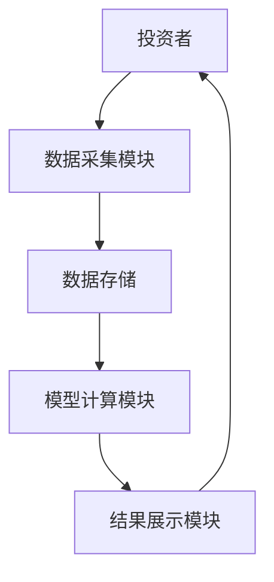

                 


# 约翰·伯格的长期投资回报预期

> 关键词：投资回报，长期投资，投资模型，算法设计，系统架构，投资策略

> 摘要：本文深入探讨约翰·伯格的长期投资回报预期，结合投资理论与算法设计，分析其在实际投资中的应用。文章从背景介绍、核心概念、算法原理、系统设计、项目实战等方面展开，结合具体案例分析，为投资者提供科学的投资策略。

---

# 正文

## 第一部分：背景介绍

### 第1章：长期投资回报的背景与定义

#### 1.1 长期投资回报的定义与重要性

长期投资回报是指在较长的时间跨度内，投资者通过投资获得的收益。与短期回报相比，长期回报更注重资产的增值和风险的分散。在当前经济环境下，长期投资回报的重要性日益凸显，尤其是在市场波动加剧的情况下，投资者需要更稳健的策略来实现财富增长。

#### 1.2 长期投资回报的背景分析

- **经济环境的影响**：全球经济波动、通货膨胀、利率变化等因素对长期投资回报有重要影响。
- **投资者行为**：投资者的风险承受能力、投资目标和时间跨度决定了其对长期回报的预期。
- **市场趋势**：长期趋势如技术进步、行业变迁等，是影响投资回报的重要因素。

## 第二部分：核心概念与联系

### 第2章：长期投资回报的核心概念

#### 2.1 投资回报的计算与衡量

- **计算公式**：投资回报率（ROI）=（最终价值 - 初始价值）/ 初始价值 × 100%。
- **衡量标准**：考虑通货膨胀、市场风险等调整后的回报率更具参考价值。
- **时间价值**：复利效应是长期投资回报的重要驱动力。

#### 2.2 长期投资回报的关键属性

- **风险与收益的权衡**：高风险投资可能带来高回报，但也可能带来更大的损失。
- **投资组合的多样性**：通过分散投资降低风险，提高长期回报的稳定性。
- **市场趋势的预测能力**：准确预测市场趋势能显著提升长期投资回报。

### 第3章：核心概念的联系与对比

#### 3.1 不同投资模型的对比

| 模型类型          | 描述                                                                 |
|-------------------|--------------------------------------------------------------------|
| 历史数据模型      | 基于过去数据预测未来回报，适用于数据充足的情况。                     |
| 市场预测模型      | 基于市场趋势和专家预测，适合短期投资。                              |
| 风险控制模型      | 通过风险对冲降低投资风险，适合保守型投资者。                        |

#### 3.2 投资回报与风险的对比分析

- **风险对回报的影响**：高风险投资通常伴随较高的预期回报。
- **风险调整后的回报**：使用夏普比率等指标衡量风险调整后的回报。

## 第三部分：算法原理讲解

### 第4章：长期投资回报的计算模型

#### 4.1 投资回报计算的数学模型

- **复利计算公式**：$$ FV = PV \times (1 + r)^n $$
  其中，FV为终值，PV为现值，r为年化收益率，n为投资年数。

- **风险调整后的回报公式**：$$ R = R_p + \alpha \times (R_m - R_p) $$
  其中，R为实际回报，R_p为无风险回报，R_m为市场回报，α为风险溢价。

#### 4.2 投资组合优化的算法

- **均值-方差优化**：通过最小化方差（风险）最大化回报。
- **现代投资组合理论**：根据投资者的风险偏好构建最优投资组合。

## 第四部分：系统分析与架构设计方案

### 第5章：长期投资回报预期的系统设计

#### 5.1 问题场景介绍

- **投资者需求分析**：投资者需要个性化的投资策略和回报预期。
- **市场数据获取与处理**：收集并处理历史和实时市场数据。

#### 5.2 系统功能设计

- **数据采集模块**：收集市场数据，处理并存储。
- **模型计算模块**：基于算法计算投资回报。
- **结果展示模块**：以图表形式展示回报预期。

#### 5.3 系统架构设计



## 第五部分：项目实战

### 第6章：环境安装与系统实现

#### 6.1 环境配置

- **工具安装**：安装Python、Pandas、Matplotlib等工具。
- **数据源获取**：通过API获取市场数据。

#### 6.2 核心实现代码

```python
import pandas as pd
import numpy as np

# 示例数据
data = pd.DataFrame({'return': [0.05, 0.07, 0.03, 0.08, 0.06]})

# 计算年化回报
def annualized_return(data, periods):
    n = len(data)
    if n == 0:
        return 0.0
    return (data.iloc[-1] ** (1.0 / n) - 1) * periods

print(annualized_return(data, 252))  # 假设252个交易日为一年
```

## 第六部分：总结与展望

### 第7章：总结与最佳实践

#### 7.1 项目小结

本文详细探讨了约翰·伯格的长期投资回报预期，从理论到实践，结合算法设计和系统实现，为投资者提供了科学的投资策略。

#### 7.2 注意事项

- 定期评估投资组合，及时调整策略。
- 保持对市场趋势的敏感性，合理控制风险。

#### 7.3 拓展阅读

建议深入学习投资组合理论和风险管理模型，提升投资回报预期的准确性。

---

作者：AI天才研究院/AI Genius Institute & 禅与计算机程序设计艺术 /Zen And The Art of Computer Programming

