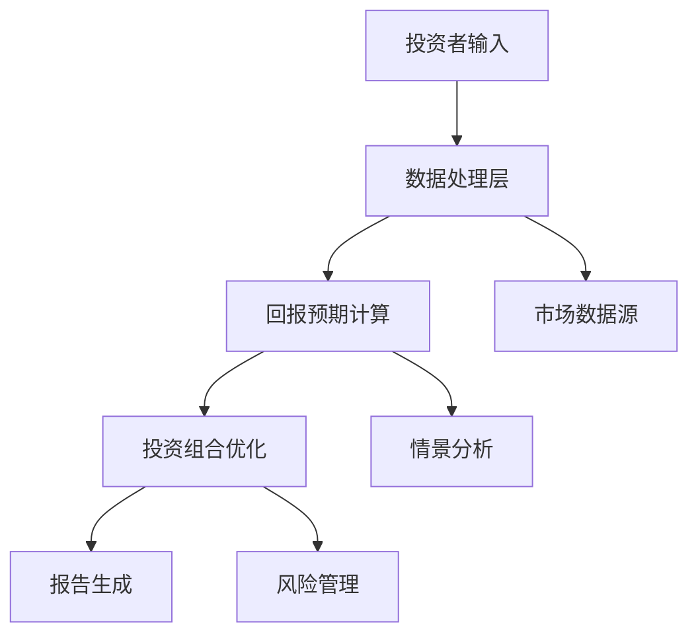
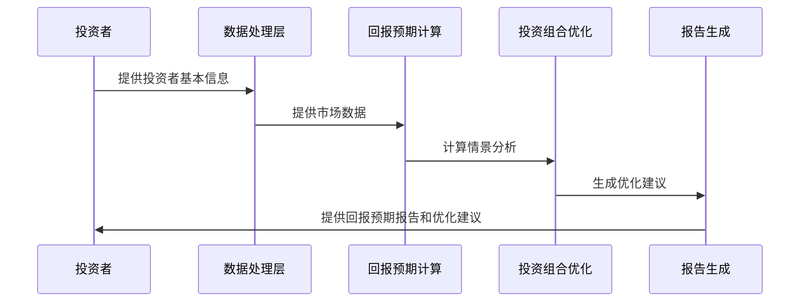

                 


# 约翰·伯格的长期投资回报预期设定

> **关键词：** 投资回报预期设定、约翰·伯格、长期投资、风险管理、投资策略

> **摘要：** 本文深入探讨了约翰·伯格的长期投资回报预期设定方法，分析了其投资哲学的核心要素，包括价值投资、风险管理、资产配置等。文章通过系统分析和案例研究，揭示了如何基于历史数据和情景分析设定合理的回报预期，并结合数学模型和算法原理，提供了可操作的实践指南。

---

## 第1章：引言：约翰·伯格的投资理念与长期回报设定的重要性

### 1.1 约翰·伯格的背景与投资哲学

约翰·伯格（John Bogle）是投资界的一位传奇人物，被誉为“指数基金之父”。他于1949年创立了先锋集团（Vanguard Group），并推出了第一只指数基金——Vanguard 500 Index Fund。伯格的投资哲学以价值投资和长期持有为核心，强调低成本、分散化和纪律性。他主张避免频繁交易和市场择时，而是通过长期持有优质资产来实现财富增长。

#### 1.1.1 约翰·伯格的生平简介

- **早年经历：** 伯格于1940年出生于美国宾夕法尼亚州，曾在宾夕法尼亚大学沃顿商学院学习，后转学到普林斯顿大学，但未完成学位。
- **职业生涯：** 1965年加入托雷斯特公司（T. Rowe Price），1974年创立先锋集团，逐步将其发展为全球最大的共同基金管理公司之一。
- **重要贡献：** 发明了指数基金，推动了低成本投资理念的发展。

#### 1.1.2 约翰·伯格的投资理念与方法

- **价值投资：** 伯格认为市场是有效的，长期来看，市场指数能够提供合理的回报，而主动管理难以持续跑赢指数。
- **分散化：** 通过分散投资来降低风险，避免过度依赖单一资产或行业。
- **低成本：** 伯格强调降低投资成本的重要性，认为长期来看，低成本基金能够为投资者带来更高的净回报。

### 1.2 长期投资回报预期设定的背景与意义

#### 1.2.1 投资者为何需要设定回报预期

- **目标导向：** 明确的回报预期能够帮助投资者制定合理的投资计划。
- **风险管理：** 回报预期是衡量投资绩效的重要基准。
- **决策依据：** 回报预期能够帮助投资者在市场波动中保持纪律，避免情绪化决策。

#### 1.2.2 长期投资回报设定的核心价值

- **长期视角：** 长期投资回报预期能够帮助投资者忽略短期市场波动，专注于长期价值。
- **风险控制：** 通过设定合理的回报预期，投资者可以更好地管理风险，避免过度冒险。
- **绩效评估：** 回报预期是评估投资组合表现的重要标准。

#### 1.2.3 回报预期设定的边界与外延

- **时间跨度：** 长期投资通常指5年以上的投资期限。
- **资产类别：** 包括股票、债券、房地产等多种资产。
- **风险偏好：** 根据投资者的风险承受能力调整回报预期。

### 1.3 本书的目标与结构安排

#### 1.3.1 本书的核心目标

- **知识传递：** 深入理解约翰·伯格的投资理念。
- **方法论：** 掌握长期投资回报预期设定的方法和技巧。
- **实践指导：** 提供可操作的投资策略和风险管理工具。

#### 1.3.2 本书的章节安排与逻辑框架

- **第一部分：引言** —— 介绍约翰·伯格的投资理念和长期回报设定的重要性。
- **第二部分：长期投资回报预期设定的核心概念与方法论** —— 详细讲解回报预期的核心概念和方法。
- **第三部分：约翰·伯格的投资策略与回报预期设定方法** —— 探讨伯格的投资策略及其在回报预期设定中的应用。
- **第四部分：投资回报预期设定的系统分析与架构设计** —— 从系统角度分析回报预期设定的实现。
- **第五部分：项目实战：基于约翰·伯格投资策略的回报预期设定** —— 通过实际案例展示回报预期设定的实践。
- **第六部分：总结与展望** —— 总结全文，并展望未来的研究方向。

---

## 第2章：长期投资回报预期设定的核心概念

### 2.1 投资回报预期的定义与分类

#### 2.1.1 投资回报预期的定义

投资回报预期是指投资者对未来投资组合可能实现的收益的估计。它通常以百分比形式表示，可以是名义回报（未扣除通胀影响）或实际回报（扣除通胀影响）。

#### 2.1.2 投资回报预期的分类

- **短期回报预期：** 通常指1年以内的预期回报。
- **中期回报预期：** 通常指1到5年的预期回报。
- **长期回报预期：** 通常指5年以上的预期回报。

### 2.2 投资回报预期设定的关键要素

#### 2.2.1 投资目标与风险承受能力

- **投资目标：** 包括财务目标（如购买房产、退休计划）和时间目标（如投资期限）。
- **风险承受能力：** 投资者对本金损失的容忍度，通常与年龄、财务状况和投资经验相关。

#### 2.2.2 市场环境与经济周期

- **经济周期：** 包括衰退、复苏、繁荣和衰退四个阶段，不同阶段的市场表现和风险特征不同。
- **市场环境：** 包括市场流动性、利率水平、通货膨胀率等因素。

#### 2.2.3 资产配置与投资策略

- **资产配置：** 将资金分配到不同资产类别（如股票、债券、房地产等）以实现风险分散和收益最大化。
- **投资策略：** 包括价值投资、成长投资、指数投资等不同策略。

### 2.3 投资回报预期设定的理论基础

#### 2.3.1 马科维茨的有效投资组合理论

马科维茨（Harry Markowitz）提出的有效投资组合理论是现代投资组合理论（MPT）的基础。他认为，投资者可以通过优化资产配置来最大化预期回报，同时最小化投资组合的波动性。

$$ E(r_p) = \sum w_i E(r_i) $$
$$ \sigma_p^2 = \sum \sum w_i w_j \sigma_i \sigma_j \rho_{ij} $$

其中，\( E(r_p) \) 是投资组合的期望回报率，\( \sigma_p \) 是投资组合的波动性，\( w_i \) 和 \( w_j \) 是资产i和j的权重，\( \sigma_i \) 和 \( \sigma_j \) 是资产i和j的波动性，\( \rho_{ij} \) 是资产i和j的相关性系数。

#### 2.3.2 凸优化模型在投资回报预期设定中的应用

凸优化模型可以通过数学优化方法，找到在给定风险水平下最优的投资组合，或者在给定收益下最小化风险的投资组合。

$$ \text{最大化 } E(r_p) $$
$$ \text{约束 } \sigma_p \leq \sigma_{target} $$

其中，\( \sigma_{target} \) 是目标波动性水平。

#### 2.3.3 现金流折现法与投资回报预期的关系

现金流折现法（DCF）是一种评估资产价值的方法，通过将未来现金流折现为现值来评估资产的内在价值。

$$ V = \sum \frac{CF_t}{(1 + r)^t} $$

其中，\( V \) 是资产的内在价值，\( CF_t \) 是第t年的现金流，\( r \) 是折现率。

---

## 第3章：约翰·伯格的投资策略与回报预期设定方法

### 3.1 约翰·伯格的投资策略概述

#### 3.1.1 价值投资与长期持有策略

伯格的价值投资策略强调购买低估的资产，并长期持有，避免频繁交易。他认为市场短期波动难以预测，但长期趋势可以通过分散化和低成本投资来实现。

#### 3.1.2 股票选择标准与投资组合构建

伯格选择那些具有强大基本面、合理估值和良好管理的公司。他的投资组合通常分散投资于多个行业和公司，以降低特定风险。

### 3.2 约翰·伯格的回报预期设定方法

#### 3.2.1 基于历史数据的回报预测

伯格认为，长期来看，股票的平均回报率可以通过历史数据来估计。例如，美国股票市场的长期平均回报率约为10%。

#### 3.2.2 基于情景分析的回报预期

伯格强调进行情景分析，考虑不同经济环境下的投资回报。例如，在经济繁荣时期，股票回报可能高于平均水平；在经济衰退时期，股票回报可能低于平均水平。

#### 3.2.3 基于风险调整的回报目标设定

通过调整风险水平，伯格设定合理的回报目标。例如，对于风险承受能力较低的投资者，目标回报可能设定为低于长期平均回报。

### 3.3 约翰·伯格投资策略的数学模型与公式

#### 3.3.1 投资组合回报的期望值计算公式

$$ E(r_p) = \sum w_i E(r_i) $$

其中，\( w_i \) 是资产i的权重，\( E(r_i) \) 是资产i的期望回报率。

#### 3.3.2 风险调整后的回报目标设定公式

$$ r_{target} = r_{market} - \text{风险溢价} $$

其中，\( r_{market} \) 是市场平均回报率，风险溢价是根据投资者的风险承受能力和市场环境确定的调整值。

---

## 第4章：投资回报预期设定的系统分析与架构设计

### 4.1 投资回报预期设定的系统分析

#### 4.1.1 问题场景介绍

投资者需要在不同的市场环境下，基于自身的风险承受能力和投资目标，设定合理的回报预期。

#### 4.1.2 系统功能设计

- **输入：** 投资者的基本信息（如风险承受能力、投资期限、财务目标）和市场数据（如历史回报率、波动率）。
- **处理：** 计算不同情景下的投资回报预期，生成优化的投资组合建议。
- **输出：** 投资回报预期报告和投资组合优化方案。

#### 4.1.3 系统架构设计

以下是系统架构的Mermaid图：



### 4.2 系统架构设计

以下是系统架构的Mermaid图：


### 4.3 系统接口设计

- **输入接口：** 投资者的基本信息和市场数据。
- **输出接口：** 投资回报预期报告和优化的投资组合建议。

### 4.4 系统交互流程

以下是系统交互的Mermaid序列图：



---

## 第5章：项目实战：基于约翰·伯格投资策略的回报预期设定

### 5.1 环境安装

- **工具安装：** 安装Python和相关库（如NumPy、Pandas、Matplotlib）。
- **数据获取：** 获取历史市场数据（如股票指数、债券收益率等）。

### 5.2 系统核心实现源代码

以下是Python代码示例：

```python
import numpy as np
import pandas as pd
import matplotlib.pyplot as plt

# 数据获取与处理
data = pd.read_csv('market_data.csv')
returns = data.pct_change().dropna()

# 计算期望回报率
expected_return = np.mean(returns) * 100
print(f"期望回报率：{expected_return:.2f}%")

# 计算波动率
volatility = np.std(returns) * 100
print(f"波动率：{volatility:.2f}%")

# 情景分析
scenarios = ['牛市', '熊市', '震荡市']
scenario_returns = {
    '牛市': 15,
    '熊市': -5,
    '震荡市': 8
}

# 风险调整后的回报目标
risk_adjusted_return = expected_return - (volatility * 0.5)
print(f"风险调整后的回报目标：{risk_adjusted_return:.2f}%")
```

### 5.3 代码应用解读与分析

- **数据获取与处理：** 从CSV文件中读取市场数据，并计算收益率。
- **期望回报率计算：** 计算历史平均回报率。
- **波动率计算：** 计算投资组合的波动率。
- **情景分析：** 根据不同市场情景调整回报预期。
- **风险调整后的回报目标：** 根据波动率调整回报目标。

### 5.4 实际案例分析和详细讲解剖析

以美国股票市场为例，假设历史平均回报率为10%，波动率为15%。根据情景分析，牛市下的回报率为15%，熊市下的回报率为-5%，震荡市下的回报率为8%。风险调整后的回报目标为：

$$ r_{target} = 10\% - (15\% \times 0.5) = 2.5\% $$

### 5.5 项目小结

通过实际案例分析，我们可以看到，基于约翰·伯格的投资策略，通过历史数据和情景分析设定回报预期是可行的。同时，风险调整后的回报目标能够帮助投资者更好地管理风险。

---

## 第6章：总结与展望

### 6.1 本书内容总结

- **核心内容：** 介绍了约翰·伯格的投资理念和长期回报设定方法。
- **方法论：** 探讨了基于历史数据和情景分析的回报预期设定。
- **系统设计：** 提供了投资回报预期设定的系统分析与架构设计。

### 6.2 最佳实践 tips

- **长期视角：** 投资者应以长期视角看待投资，避免短期波动的干扰。
- **风险控制：** 通过分散化和低成本投资来降低风险。
- **持续学习：** 投资者应持续学习和调整投资策略，以适应市场变化。

### 6.3 展望未来的研究方向

- **动态调整：** 研究如何根据市场变化动态调整回报预期。
- **人工智能应用：** 探讨人工智能技术在回报预期设定中的应用。
- **多资产配置：** 研究多资产配置下的回报预期设定方法。

---

## 作者：AI天才研究院/AI Genius Institute & 禅与计算机程序设计艺术 /Zen And The Art of Computer Programming

---

**附录：**

- **术语表：** 包括文章中涉及的专业术语及其定义。
- **参考文献：** 包括书中引用的主要文献和数据来源。
- **扩展资源：** 包括相关书籍、文章和在线资源链接。

---

以上是《约翰·伯格的长期投资回报预期设定》的完整目录和内容安排，希望对您有所帮助！

