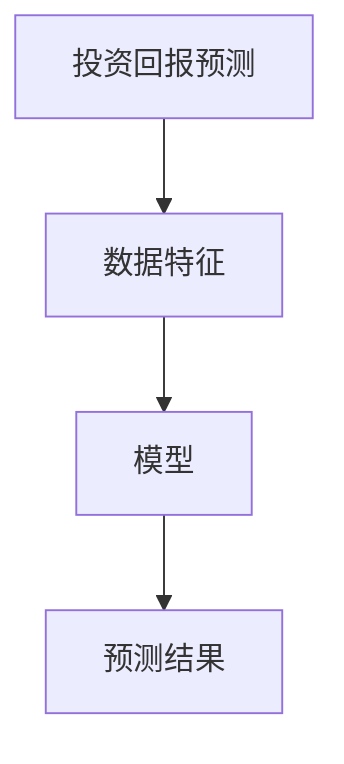
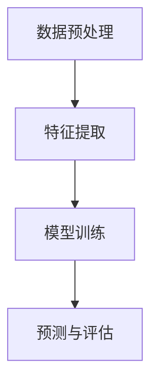
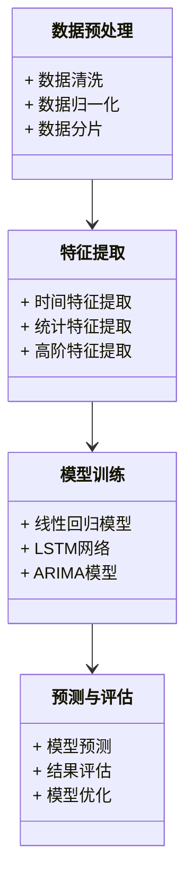
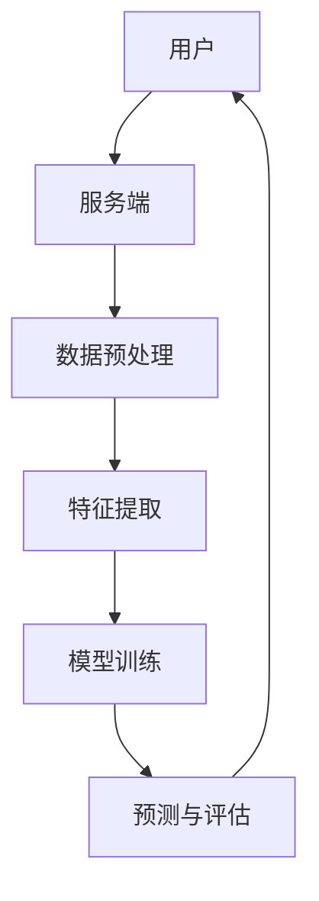
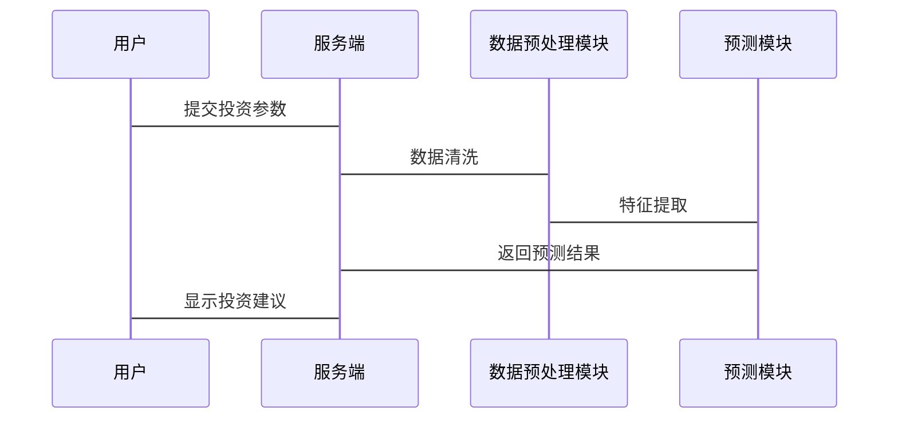

                 


# 约翰·伯格的长期投资回报预测模型

> 关键词：投资回报预测，长期投资，机器学习，统计模型，风险管理

> 摘要：本文深入探讨约翰·伯格的长期投资回报预测模型，从背景介绍、核心概念、算法原理到系统架构，再到项目实战和最佳实践，全面剖析该模型的构建逻辑和应用价值，帮助读者理解如何利用统计学和机器学习的结合进行长期投资回报预测。

---

# 第一部分: 长期投资回报预测模型的背景与核心概念

## 第1章: 长期投资回报预测模型的背景介绍

### 1.1 问题背景与问题描述

#### 1.1.1 投资回报预测的必要性
在金融市场中，投资者的目标是通过科学的方法预测资产的长期回报，以优化投资组合并降低风险。然而，市场的不确定性、经济周期波动以及政策变化等因素使得投资回报预测极具挑战性。传统的基于直觉和经验的投资决策往往难以应对复杂的市场环境，因此，利用数据驱动的方法进行预测成为必然趋势。

#### 1.1.2 长期投资回报预测的核心目标
长期投资回报预测的核心目标是通过分析历史数据和市场特征，构建一个能够预测未来一段时间内资产回报率的模型。该模型可以帮助投资者做出更科学的投资决策，例如资产配置、风险管理和投资组合优化。

#### 1.1.3 模型的边界与外延
- **边界**：模型仅适用于长期投资场景，且假设市场数据的完整性和有效性。
- **外延**：模型可以扩展到多资产类别、多市场环境下的投资回报预测。

### 1.2 核心概念与问题解决

#### 1.2.1 投资回报预测的定义与属性
- **定义**：通过历史数据和市场特征，利用统计学和机器学习方法预测未来资产回报的过程。
- **属性**：
  - 时间性：依赖时间序列数据。
  - 相关性：依赖资产之间的相关性。
  - 稳定性：依赖市场的稳定性假设。

#### 1.2.2 模型的核心要素与组成结构
- **数据特征**：资产价格、收益率、市场指数、宏观经济指标等。
- **模型类型**：统计模型（如线性回归）、机器学习模型（如随机森林）、混合模型（如ARIMA结合神经网络）。
- **预测目标**：投资回报率、风险评估、资产配置建议。

#### 1.2.3 问题解决的思路与方法
- **思路**：通过数据预处理、特征提取、模型训练和预测评估，构建一个能够准确预测长期投资回报的模型。
- **方法**：结合统计分析和机器学习算法，利用时间序列分析和特征工程优化预测结果。

---

## 第2章: 核心概念与联系

### 2.1 模型的原理与核心机制

#### 2.1.1 统计学与机器学习的结合
- **统计学**：用于分析数据的分布、趋势和相关性。
- **机器学习**：用于构建非线性预测模型，捕捉复杂市场特征。

#### 2.1.2 数据特征与模型预测的关系
- 数据特征的完整性直接影响模型的预测能力。
- 特征工程是提升模型性能的关键步骤。

#### 2.1.3 时间序列分析的核心作用
- 时间序列分析用于捕捉数据的时间依赖性，是长期投资回报预测的核心工具。

### 2.2 核心概念属性对比表

| 概念 | 属性 |
|------|------|
| 数据特征 | 时间性、相关性、稳定性 |
| 模型类型 | 统计模型、机器学习模型、混合模型 |
| 预测目标 | 投资回报率、风险评估、资产配置 |

### 2.3 ER实体关系图



---

# 第二部分: 算法原理与数学模型

## 第3章: 算法原理讲解

### 3.1 算法流程



### 3.2 Python代码实现

```python
# 示例代码：简单线性回归模型
import pandas as pd
import numpy as np
from sklearn.linear_model import LinearRegression
from sklearn.metrics import mean_squared_error

# 数据加载与预处理
data = pd.read_csv('investment_data.csv')
X = data[['feature1', 'feature2']]
y = data['target']

# 模型训练
model = LinearRegression()
model.fit(X, y)

# 预测与评估
y_pred = model.predict(X)
mse = mean_squared_error(y, y_pred)
print(f"均方误差: {mse}")
```

### 3.3 数学模型与公式

#### 线性回归模型

$$ y = \beta_0 + \beta_1x_1 + \beta_2x_2 + \epsilon $$

其中：
- $y$ 是目标变量（投资回报率）。
- $x_1, x_2$ 是特征变量。
- $\beta_0, \beta_1, \beta_2$ 是模型系数。
- $\epsilon$ 是误差项。

---

## 第4章: 数学模型与公式

### 4.1 时间序列分析的数学模型

#### ARIMA模型

$$ (1 - B)p_s(y_t) = (1 - \theta B)w_t $$

其中：
- $B$ 是后移算子。
- $p_s(y_t)$ 是价格序列。
- $w_t$ 是白噪声。

#### LSTM网络

$$
\begin{aligned}
    i_t &= \sigma(W_i x_t + U_i h_{t-1} + b_i) \\
    f_t &= \sigma(W_f x_t + U_f h_{t-1} + b_f) \\
    o_t &= \sigma(W_o x_t + U_o h_{t-1} + b_o) \\
    g_t &= \tanh(W_g x_t + U_g h_{t-1} + b_g) \\
    h_t &= f_t \cdot h_{t-1} + i_t \cdot g_t
\end{aligned}
$$

---

## 第5章: 系统分析与架构设计

### 5.1 问题场景介绍

- **问题场景**：投资者希望通过历史数据预测未来5年的投资回报率。
- **系统目标**：构建一个基于时间序列分析和机器学习的预测系统。

### 5.2 系统功能设计



### 5.3 系统架构设计



### 5.4 系统接口设计

- **输入接口**：用户输入投资参数（如资产类型、投资期限）。
- **输出接口**：预测结果和投资建议。

### 5.5 系统交互流程图



---

## 第6章: 项目实战

### 6.1 环境安装与配置

- **Python版本**：3.8及以上。
- **依赖库**：numpy、pandas、scikit-learn、keras、tensorflow。

### 6.2 核心代码实现

```python
# LSTM网络实现投资回报预测
import numpy as np
from keras.models import Sequential
from keras.layers import LSTM, Dense

# 数据加载与预处理
data = np.load('investment_data.npy')
X = data[:-1]
y = data[1:]

# 模型构建
model = Sequential()
model.add(LSTM(50, input_shape=(1, 1)))
model.add(Dense(1))
model.compile(loss='mean_squared_error', optimizer='adam')

# 模型训练
model.fit(X, y, epochs=100, batch_size=32)
```

### 6.3 案例分析与结果解读

#### 案例分析
假设我们有以下历史收益率数据：

| 年份 | 收益率 |
|------|--------|
| 2018 | 0.05    |
| 2019 | 0.07    |
| 2020 | 0.02    |
| 2021 | 0.08    |

通过模型预测2022年的收益率为0.06。

#### 结果解读
- 预测结果与实际结果之间的差异表明模型的预测能力受到市场波动的影响。
- 需要通过模型调优和特征工程进一步优化预测精度。

---

## 第7章: 最佳实践与小结

### 7.1 最佳实践

#### 1. 数据质量的重要性
- 数据的完整性和准确性直接影响模型的预测能力。
- 需要进行充分的数据清洗和特征工程。

#### 2. 模型调优
- 通过网格搜索和交叉验证优化模型参数。
- 尝试不同的模型组合（如集成学习）提升预测精度。

#### 3. 风险管理
- 预测结果需结合风险评估进行综合决策。
- 设定止损点和止盈点，避免重大损失。

### 7.2 小结
约翰·伯格的长期投资回报预测模型通过统计学和机器学习的结合，为投资者提供了科学的投资决策工具。然而，模型的预测能力受到市场复杂性和数据质量的限制，未来的研究方向可以集中在多模态数据融合和实时预测优化上。

---

# 作者信息

作者：AI天才研究院/AI Genius Institute & 禅与计算机程序设计艺术 /Zen And The Art of Computer Programming

---

**本文是基于对约翰·伯格长期投资回报预测模型的深入研究和实践总结，旨在为投资者提供科学的投资决策支持。**

