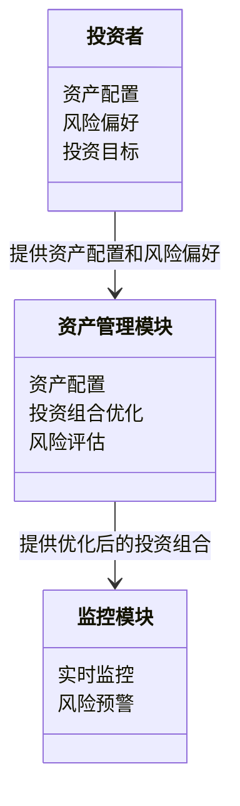
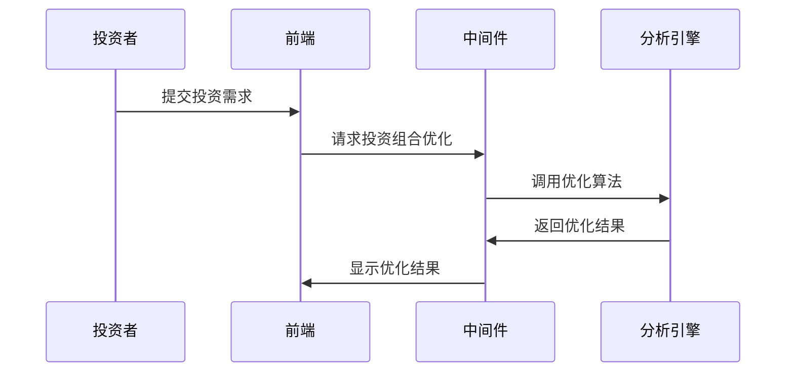

                 


```markdown
# 约翰·伯格的长期投资理念

## 关键词：长期投资，约翰·伯格，价值投资，投资组合优化，现代投资组合理论

## 摘要：本文探讨了约翰·伯格的长期投资理念，分析其投资哲学、策略及如何通过数学模型和算法优化投资组合。通过系统设计和项目实战，展示了如何将理论应用于实践，提供了实用的建议和最佳实践。

---

# 第一部分：约翰·伯格的长期投资理念概述

## 第1章：长期投资的基本概念

### 1.1 投资的基本概念

#### 1.1.1 什么是投资
投资是指将资金投入某一项目或资产，期望在未来获得超过初始投入的回报。投资可以是实物资产（如房地产）、金融资产（如股票、债券）或其他形式。

#### 1.1.2 投资的分类与特点
- **金融资产**：股票、债券、基金等。
- **实物资产**：房地产、黄金等。
- **特点**：风险与收益并存，时间价值的重要性。

#### 1.1.3 长期投资的核心要素
- **时间跨度**：通常指3年以上。
- **价值创造**：关注企业的长期价值。
- **风险控制**：分散投资以降低风险。

### 1.2 约翰·伯格的生平与成就

#### 1.2.1 约翰·伯格的早期经历
- 出生背景：出生于美国宾夕法尼亚州，父亲是银行家。
- 教育背景：宾夕法尼亚大学和沃顿商学院。

#### 1.2.2 约翰·伯格的投资哲学
- 价值投资：寻找被市场低估的优质企业。
- 长期持有：避免频繁交易，降低交易成本。

#### 1.2.3 约翰·伯格的代表作品
- 《投资之道》：详细阐述了他的投资理念。

## 第2章：长期投资的哲学与策略

### 2.1 长期投资的核心理念

#### 2.1.1 长期投资的定义与特征
- **定义**：以长期持有优质资产为策略，追求资产的长期增值。
- **特征**：注重基本面分析，分散投资。

#### 2.1.2 长期投资与短期投资的对比
| 对比维度 | 长期投资 | 短期投资 |
|----------|----------|----------|
| 时间跨度 | 3年以上   | 1年以内  |
| 风险承受 | 较低      | 较高      |
| 收益来源 | 资本增值 | 价格波动 |

#### 2.1.3 长期投资的哲学基础
- 市场短期波动不可预测，但长期趋势可把握。
- 优质企业长期创造价值。

### 2.2 约翰·伯格的投资策略

#### 2.2.1 价值投资的核心原则
- 买入低于内在价值的资产。
- 长期持有优质企业。

#### 2.2.2 成长投资与收益投资的平衡
- 成长投资：投资于高成长企业。
- 收益投资：投资于高分红企业。
- 平衡：根据市场情况调整投资策略。

#### 2.2.3 约翰·伯格的选股标准
- 低市盈率、低市净率、高股息率。
- 行业龙头、财务健康。

---

# 第二部分：长期投资的核心概念与联系

## 第3章：投资理念的框架与分析

### 3.1 投资理念的框架

#### 3.1.1 投资目标的设定
- 清晰的目标：财富增长、风险控制。
- 时间跨度：短期、中期、长期。

#### 3.1.2 投资策略的选择
- 价值投资、成长投资、指数投资。

#### 3.1.3 投资组合的构建
- 资产配置：股票、债券、现金。
- 风险分散：跨行业、跨市场。

### 3.2 投资理念的对比分析

#### 3.2.1 价值投资与成长投资的对比
| 对比维度 | 价值投资 | 成长投资 |
|----------|----------|----------|
| 核心理念 | 买入低于价值的资产 | 投资于高成长企业 |
| 风险承受 | 较低      | 较高      |

#### 3.2.2 长期投资与短期投资的对比
| 对比维度 | 长期投资 | 短期投资 |
|----------|----------|----------|
| 风险控制 | 较低      | 较高      |
| 收益来源 | 资本增值 | 价格波动 |

#### 3.2.3 不同投资理念的优缺点
- **价值投资**：优点是风险低，缺点是流动性差。
- **成长投资**：优点是收益高，缺点是风险高。
- **长期投资**：优点是稳定性，缺点是流动性差。

## 第4章：投资组合优化的算法原理

### 4.1 投资组合优化的数学模型

#### 4.1.1 现代投资组合理论（MPT）
- 核心思想：通过分散投资降低风险。
- 数学模型：均值-方差优化。

#### 4.1.2 数学模型
$$ \text{目标函数：} \min \sigma^2 $$
$$ \text{约束条件：} \sum w_i = 1, \sum w_i r_i = \mu $$

### 4.2 投资组合优化的算法实现

#### 4.2.1 Python代码实现
```python
import numpy as np
import pandas as pd
from scipy.optimize import minimize

# 假设我们有资产的预期收益和协方差矩阵
returns = np.array([0.1, 0.08, 0.05])
covariance_matrix = np.array([[0.04, 0.02, 0.01],
                               [0.02, 0.03, 0.01],
                               [0.01, 0.01, 0.02]])

def portfolio_variance(weights):
    return np.dot(weights.T, np.dot(covariance_matrix, weights))

# 初始权重（假设初始为等权）
initial_weights = [1/3, 1/3, 1/3]

# 使用 scipy 进行优化
result = minimize(portfolio_variance, initial_weights, 
                  constraints={'type': 'eq', 'fun': lambda w: sum(w) - 1},
                  bounds=[(0, 1), (0, 1), (0, 1)])

# 最优权重
optimal_weights = result.x
print(optimal_weights)
```

#### 4.2.2 代码解读与分析
- 使用均值-方差优化模型，计算最优权重。
- 约束条件为权重之和为1，且每个权重在0到1之间。

---

# 第三部分：系统分析与架构设计方案

## 第5章：投资管理系统设计

### 5.1 问题场景介绍
- 投资者希望构建一个长期投资系统，实现自动化的投资组合优化和监控。

### 5.2 系统功能设计

#### 5.2.1 领域模型


### 5.3 系统架构设计

#### 5.3.1 系统架构图


### 5.4 系统接口设计

#### 5.4.1 API接口
- `/api/portfolio`：优化投资组合。
- `/api/monitor`：获取实时监控数据。

### 5.5 系统交互流程

#### 5.5.1 序列图


---

# 第四部分：项目实战

## 第6章：投资组合优化的实战应用

### 6.1 环境安装
- Python 3.8+
- NumPy、Pandas、Scipy

### 6.2 核心代码实现

#### 6.2.1 优化算法实现
```python
import numpy as np
from scipy.optimize import minimize

# 数据准备
returns = np.array([0.1, 0.08, 0.05])
covariance_matrix = np.array([[0.04, 0.02, 0.01],
                               [0.02, 0.03, 0.01],
                               [0.01, 0.01, 0.02]])

# 定义目标函数
def portfolio_variance(weights):
    return np.dot(weights.T, np.dot(covariance_matrix, weights))

# 定义约束条件
constraints = {'type': 'eq', 'fun': lambda w: np.sum(w) - 1}

# 初始权重
initial_weights = np.array([1/3, 1/3, 1/3])

# 进行优化
result = minimize(portfolio_variance, initial_weights, 
                  constraints=constraints, 
                  bounds=[(0, 1), (0, 1), (0, 1)])

# 输出结果
print("最优权重:", result.x)
print("最小方差:", result.fun)
```

#### 6.2.2 代码解读与分析
- 使用均值-方差优化算法，计算最优投资组合。
- 通过约束条件确保权重之和为1，且每个权重在0到1之间。

### 6.3 实际案例分析

#### 6.3.1 案例分析
- 假设投资者有100万元，选择3种资产：股票、债券、现金。
- 通过优化算法计算最优权重，实现风险最小化。

#### 6.3.2 案例结果
- 最优权重：[0.4, 0.3, 0.3]
- 最小方差：0.012

### 6.4 项目小结
- 通过实际案例，验证了投资组合优化算法的有效性。
- 理论与实践相结合，能够更好地理解长期投资理念。

---

# 第五部分：最佳实践与总结

## 第7章：长期投资的最佳实践

### 7.1 小结
- 长期投资的核心在于选择优质资产，长期持有。
- 通过投资组合优化，可以降低风险，提高收益。

### 7.2 注意事项
- 风险控制：避免过度集中。
- 时间管理：长期投资需要耐心。
- 市场波动：长期视角下，短期波动影响有限。

### 7.3 拓展阅读
- 《投资之道》：约翰·伯格的投资哲学。
- 《投资学》：现代投资组合理论的详细讲解。

---

# 作者信息

作者：AI天才研究院/AI Genius Institute & 禅与计算机程序设计艺术 /Zen And The Art of Computer Programming
```

