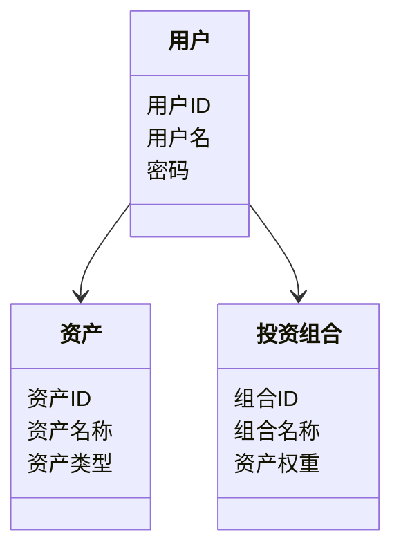

                 


# 约翰·伯格的长期投资观：时间是你的朋友

## 关键词：长期投资, 约翰·伯格, 时间价值, 投资组合优化, 风险管理, 复利效应

## 摘要：本文系统地阐述了约翰·伯格的长期投资观，深入分析了时间在投资中的重要性，结合理论与实践，探讨了长期投资的核心理念、投资组合构建、风险管理策略以及系统架构设计。文章通过详细的数学模型、算法优化和项目实战，帮助读者全面理解并应用长期投资的理念。

---

## 第1章: 长期投资概述

### 1.1 投资的基本概念

#### 1.1.1 什么是投资
投资是指将资源（如资金、时间或精力）投入到某个项目或资产中，期望在未来获得更大的收益。投资的核心目标是实现资产的增值。

#### 1.1.2 投资的基本原则
- **分散投资**：不要把所有资金投入到单一资产中，以降低风险。
- **长期持有**：避免频繁交易，减少交易成本和税务负担。
- **价值投资**：选择具有长期增长潜力的资产。

#### 1.1.3 长期投资的意义
长期投资通过时间的积累，能够充分利用复利效应，实现资产的稳步增长。与短期投资相比，长期投资更能平滑市场波动，降低短期风险。

---

### 1.2 约翰·伯格的背景与投资理念

#### 1.2.1 约翰·伯格的生平简介
约翰·伯格（John Bogle）是美国著名投资家，被誉为“指数基金之父”。他是 Vanguard 集团的创始人，倡导低成本、低波动的投资策略。

#### 1.2.2 伯格的投资哲学
伯格认为，投资的本质是追求资产的长期增值，而非短期收益。他强调分散投资和低成本运作，反对频繁的市场择时。

#### 1.2.3 时间在投资中的作用
伯格提出，时间是投资的朋友。通过长期持有优质资产，投资者能够最大化复利效应，实现财富的稳步增长。

---

### 1.3 长期投资的核心概念

#### 1.3.1 长期投资的定义
长期投资是指将资金投入到某个资产或组合中，持有期限通常为数年甚至更长，以实现资产的长期增值。

#### 1.3.2 长期投资的特点
- **时间跨度长**：投资期限通常在5年以上。
- **复利效应显著**：长期持有能够充分发挥复利的作用。
- **风险相对较低**：通过分散投资降低短期波动风险。

#### 1.3.3 长期投资与短期投资的对比
| 对比维度 | 长期投资 | 短期投资 |
|----------|----------|----------|
| 时间跨度 | 数年以上 | 几个月到几年 |
| 风险水平 | 较低     | 较高     |
| 收益稳定性 | 较高     | 较低     |

---

## 第2章: 长期投资的核心理念

### 2.1 价值投资的定义与特点

#### 2.1.1 价值投资的定义
价值投资是一种投资策略，旨在以低于资产公允价值的价格买入优质资产，并长期持有，等待其价值回归。

#### 2.1.2 价值投资的核心原则
- **买入优质资产**：选择具有持续增长潜力的企业。
- **长期持有**：避免频繁交易，减少交易成本。
- **安全边际**：以低于内在价值的价格买入资产。

#### 2.1.3 价值投资与成长投资的区别
| 对比维度 | 价值投资 | 成长投资 |
|----------|----------|----------|
| 投资目标 | 以低于价值的价格买入 | 买入高增长潜力的资产 |
| 风险水平 | 较低     | 较高     |
| 持股期限 | 较长     | 较长     |

---

### 2.2 复利效应在长期投资中的作用

#### 2.2.1 复利的定义与公式
复利是指资金在投资过程中，本金和收益不断再投资所产生的一种收益增长现象。其公式为：
$$
A = P \times (1 + r)^n
$$
其中：
- \( A \) 表示终值
- \( P \) 表示本金
- \( r \) 表示年化收益率
- \( n \) 表示投资年数

#### 2.2.2 复利在投资中的应用
复利效应在长期投资中尤为重要。例如，假设年化收益率为7%，投资30年后，本金会增长到原本金的约10倍。

#### 2.2.3 复利与投资回报的关系
复利效应能够显著放大长期投资的回报，但其效果取决于投资期限和收益率。

---

### 2.3 长期投资中的风险管理

#### 2.3.1 风险的定义与分类
- **市场风险**：由于市场波动导致的资产价值下降。
- **流动性风险**：资产难以快速变现的风险。
- **信用风险**：债券发行人违约的风险。

#### 2.3.2 风险管理的核心原则
- **分散投资**：通过投资不同类型资产降低风险。
- **长期持有**：避免短期波动对投资组合的影响。

#### 2.3.3 长期投资中的风险管理策略
- 定期评估投资组合。
- 根据市场变化调整资产配置。

---

## 第3章: 投资组合的构建与优化

### 3.1 投资组合的基本概念

#### 3.1.1 投资组合的定义
投资组合是指投资者持有的多种资产的集合，旨在通过分散投资降低风险。

#### 3.1.2 投资组合的分类
- **股票型组合**：以股票为主要投资标的。
- **债券型组合**：以债券为主要投资标的。
- **混合型组合**：同时投资股票和债券。

---

### 3.2 投资组合构建的数学模型

#### 3.2.1 投资组合优化的数学公式
投资组合优化的目标是最大化收益，同时最小化风险。其公式为：
$$
\min \sigma^2 \quad \text{subject to} \quad \mu \geq r, \quad \mathbf{w}^T \mathbf{1} = 1
$$
其中：
- \( \sigma^2 \) 表示投资组合的方差（风险）
- \( \mu \) 表示投资组合的期望收益
- \( r \) 表示目标收益
- \( \mathbf{w} \) 表示投资权重向量
- \( \mathbf{1} \) 表示全为1的向量

---

### 3.3 投资组合的优化策略

#### 3.3.1 现代投资组合理论（MPT）
MPT 由哈里·马科维茨提出，通过分散投资降低风险。

#### 3.3.2 风险调整后的收益最大化
在给定风险水平下，选择收益最高的资产组合。

---

## 第4章: 长期投资中的风险管理

### 4.1 风险管理的核心原则

#### 4.1.1 风险与收益的平衡
通过合理配置资产，平衡风险与收益。

#### 4.1.2 风险分散的原则
投资多种资产以降低特定资产的风险。

---

## 第5章: 投资管理系统的设计与实现

### 5.1 项目介绍
设计一个基于长期投资理念的投资管理系统，实现投资组合的构建与优化。

---

### 5.2 系统功能设计

#### 5.2.1 领域模型


---

### 5.3 系统架构设计


---

## 第6章: 项目实战：指数基金投资组合的构建

### 6.1 环境安装
安装 Python 和相关库（如 pandas、numpy）。

---

### 6.2 核心实现

```python
import pandas as pd
import numpy as np

# 示例投资组合
assets = ['股票', '债券', '黄金']
weights = [0.6, 0.3, 0.1]

# 计算投资组合的期望收益
expected_returns = np.array([0.08, 0.04, 0.02])
portfolio_return = np.dot(weights, expected_returns)

print(f"投资组合的期望年化收益为：{portfolio_return * 100}%")
```

---

## 第7章: 最佳实践与总结

### 7.1 长期投资的成功要素
- 选择优质资产。
- 长期持有，避免频繁交易。

---

## 作者：AI天才研究院/AI Genius Institute & 禅与计算机程序设计艺术 /Zen And The Art of Computer Programming

---

**摘要**：本文系统地阐述了约翰·伯格的长期投资观，结合理论与实践，探讨了长期投资的核心理念、投资组合构建、风险管理策略以及系统架构设计。通过详细的数学模型、算法优化和项目实战，帮助读者全面理解并应用长期投资的理念。

