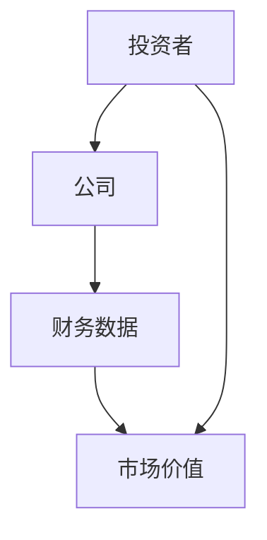
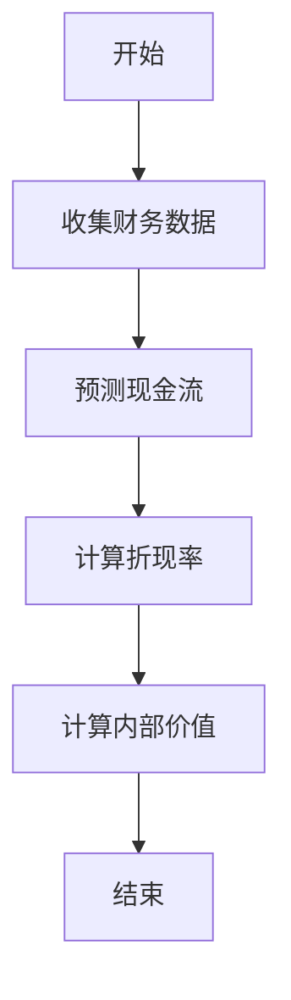
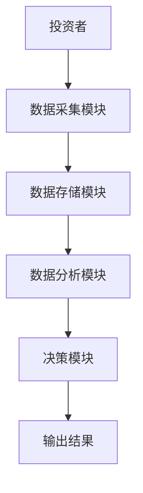

                 


# 约翰·内夫的低估值投资：简单而有效的价值策略

> 关键词：约翰·内夫，低估值投资，价值策略，投资分析，内在价值

> 摘要：约翰·内夫是成长型投资的倡导者，其低估值投资策略强调通过计算内在价值来识别被低估的股票。本文将详细分析这一策略的背景、核心概念、算法原理、系统架构及项目实战，帮助读者理解并掌握这一简单而有效的投资方法。

---

## 第一部分: 约翰·内夫的低估值投资概述

### 第1章: 低估值投资的起源与背景

#### 1.1 低估值投资的起源

低估值投资是一种基于价值投资的策略，起源于20世纪30年代，由本杰明·格雷厄姆提出。该策略的核心是寻找市场价格低于其内在价值的股票。约翰·内夫作为成长型投资的代表人物，将这一理念进一步发展，结合成长性和低估值的特征，形成了一套独特的投资策略。

#### 1.2 约翰·内夫的投资哲学

约翰·内夫的投资哲学强调长期投资和耐心资本。他认为，市场波动性和短期情绪往往会导致股票价格偏离其真实价值。通过深入分析公司的基本面，识别那些具有持续增长潜力但市场价格被低估的企业，是实现长期超额收益的关键。

#### 1.3 低估值投资的核心理念

低估值投资的核心理念是通过计算股票的内在价值，识别市场价格低于其真实价值的企业。这种方法不仅考虑了企业的当前状况，还预测了其未来的成长潜力。内夫认为，这种策略能够在市场低迷时发现被低估的机会，在市场繁荣时避免过度支付。

---

### 第2章: 低估值投资的核心概念与联系

#### 2.1 核心概念原理

低估值投资的核心概念包括内在价值、市场价值和安全边际。内在价值是股票基于其财务状况和未来现金流的理论价值，而市场价值是股票在公开市场上的价格。安全边际则是内在价值与市场价值之间的差额，用于降低投资风险。

#### 2.2 核心概念对比表格

| 比较维度 | 内在价值 | 市场价值 |
|----------|----------|----------|
| 计算方式 | 现金流折现法 | 市场供需决定 | 
| 稳定性   | 稳定     | 波动     |
| 影响因素 | 公司基本面 | 市场情绪 | 

#### 2.3 ER实体关系图



---

### 第3章: 内部价值计算的算法原理

#### 3.1 内部价值计算的流程图



#### 3.2 现金流折现模型的数学公式

$$ 内部价值 = \sum_{t=1}^{n} \frac{CF_t}{(1 + r)^t} $$

其中：
- \( CF_t \) 表示第 \( t \) 年的现金流
- \( r \) 表示折现率
- \( n \) 表示预测的年数

#### 3.3 算法实现的Python代码

```python
def calculate_intrinsic_value(cash_flows, discount_rate):
    intrinsic_value = 0
    for t in range(len(cash_flows)):
        intrinsic_value += cash_flows[t] / (1 + discount_rate) ** t
    return intrinsic_value

# 示例
cash_flows = [100, 150, 200, 250]
discount_rate = 0.1
iv = calculate_intrinsic_value(cash_flows, discount_rate)
print(f"内部价值：{iv}")
```

---

## 第四部分: 系统分析与架构设计方案

### 第4章: 投资决策系统的架构设计

#### 4.1 项目介绍

投资决策系统旨在帮助投资者通过计算内在价值，识别低估值股票。系统包括数据收集、分析和决策模块。

#### 4.2 系统架构设计



#### 4.3 系统接口设计

系统接口包括：
- 数据输入接口：接收财务数据和市场数据。
- 数据处理接口：计算内在价值和市场价值。
- 结果输出接口：显示低估值股票列表。

---

## 第五部分: 项目实战

### 第5章: 实战案例分析

#### 5.1 环境安装

安装Python和必要的库，如pandas和numpy。

#### 5.2 核心实现代码

```python
import pandas as pd

def calculate_intrinsic_value(df, discount_rate):
    df['折现因子'] = 1 / (1 + discount_rate) ** df.index
    df['折现现金流'] = df['现金流'] * df['折现因子']
    return df['折现现金流'].sum()

# 示例数据
data = {
    '现金流': [100, 150, 200, 250],
    '年份': [1, 2, 3, 4]
}
df = pd.DataFrame(data)
discount_rate = 0.1
iv = calculate_intrinsic_value(df, discount_rate)
print(f"内部价值：{iv}")
```

---

## 第六部分: 最佳实践

### 第6章: 小结与注意事项

低估值投资是一种简单而有效的策略，但需要投资者具备扎实的财务分析能力和长期投资的耐心。实践中，应结合市场环境和公司基本面，灵活调整策略。

### 6.1 注意事项

- 确保数据的准确性和及时性。
- 评估公司的财务健康状况。
- 考虑宏观经济和行业趋势的影响。

### 6.2 拓展阅读

建议阅读《约翰·内夫的投资哲学》和《价值投资经典案例》。

---

## 作者信息

作者：AI天才研究院/AI Genius Institute & 禅与计算机程序设计艺术 /Zen And The Art of Computer Programming

