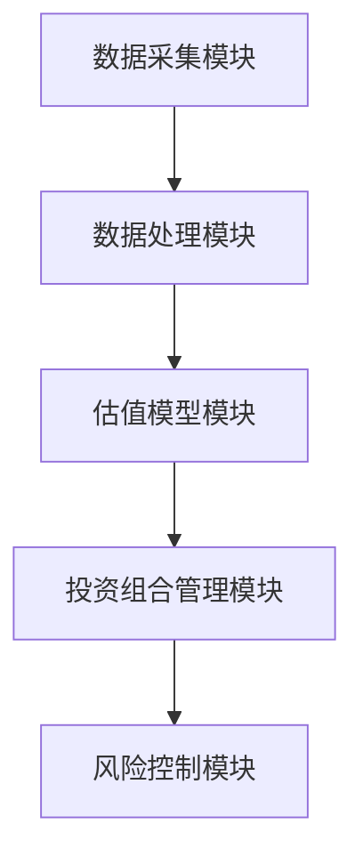

                 


# 约翰·内夫的低市销率投资：另一种价值投资视角

> 关键词：低市销率投资、市销率（P/S ratio）、价值投资策略、约翰·内夫、企业内在价值

> 摘要：本文深入探讨了约翰·内夫的低市销率投资策略，分析其核心原理、投资哲学、风险管理及长期绩效。通过对比其他价值投资策略，揭示低市销率投资的独特性与优势。结合实际案例，展示了如何在投资实践中应用低市销率策略，并提供系统化的投资流程和架构设计，帮助读者理解这一创新的价值投资视角。

---

## 第1章: 低市销率投资的背景与发展

### 1.1 低市销率投资的定义与背景

#### 1.1.1 投资学中的价值投资概述
价值投资是一种基于对企业内在价值评估的投资策略，旨在通过识别市场价格低于内在价值的证券实现长期收益。传统价值投资主要关注市盈率（P/E ratio）和市净率（P/B ratio）等指标。然而，这些指标在某些行业或市场环境下可能无法准确反映企业的真实价值。

#### 1.1.2 低市销率投资的起源
低市销率投资是一种新兴的价值投资策略，起源于对传统估值指标的反思。市销率（P/S ratio）通过将市场价格与销售收入相除，提供了一个衡量企业价值的替代指标。与市盈率和市净率相比，市销率在某些情况下更能反映企业的实际价值，尤其是在收入驱动型企业中。

#### 1.1.3 约翰·内夫与低市销率投资的关联
约翰·内夫是低市销率投资的倡导者之一。他强调通过市销率评估企业的内在价值，并结合行业周期和竞争优势，筛选出具有长期增长潜力的优质企业。内夫的投资哲学体现了对市场波动的长期免疫和对价值的执着追求。

#### 1.1.4 低市销率投资与其他价值投资策略的对比
| 指标 | 市盈率（P/E） | 市净率（P/B） | 市销率（P/S） |
|------|----------------|----------------|----------------|
| 计算方式 | 市场价 / 净利润 | 市场价 / 净资产 | 市场价 / 销售收入 |
| 适用场景 | 利润稳定的企业 | 资产密集型企业 | 收入驱动型企业 |
| 优点 | 反映盈利能力 | 反映资产质量 | 反映收入转化能力 |
| 缺点 | 利润波动影响较大 | 资产评估复杂 | 销售波动影响较大 |

---

### 1.2 低市销率投资的核心概念

#### 1.2.1 市销率的定义与计算公式
市销率（P/S ratio）定义为企业的市场价格与销售收入之比，公式如下：
$$ P/S = \frac{\text{Market Price}}{\text{Sales}} $$

市销率反映了单位销售收入对应的市场价格，低于行业平均水平的企业可能具有较高的投资价值。

#### 1.2.2 低市销率投资的逻辑与优势
低市销率投资的核心逻辑在于通过低估市销率识别出具有潜在增长能力的企业。其优势包括：
- 简化了复杂的企业评估过程
- 更适用于收入驱动型企业
- 降低了市场波动对估值的影响

#### 1.2.3 低市销率投资的适用场景与限制
- **适用场景**：收入稳定、销售驱动型企业；市场波动较大时
- **限制**：不适用于亏损企业或销售波动较大的企业

---

## 第2章: 低市销率投资的核心原理

### 2.1 市销率的数学模型与公式
市销率公式：
$$ P/S = \frac{\text{Market Price}}{\text{Sales}} $$

企业价值公式：
$$ EV = \text{Market Price} \times S $$

其中，EV代表企业价值，S代表市销率。

### 2.2 低市销率投资的筛选标准

#### 2.2.1 市销率低于行业平均水平的判断
通过比较目标企业与行业平均市销率，筛选出市销率低于行业平均水平的企业。

#### 2.2.2 企业盈利能力和成长性的评估
结合净利润增长率和销售收入增长率，评估企业的盈利能力和成长潜力。

#### 2.2.3 行业周期与企业竞争优势的分析
分析行业周期，选择处于上升周期的行业，并评估企业的竞争优势。

---

### 2.3 低市销率投资的决策流程

#### 2.3.1 确定投资目标行业
选择具有增长潜力的行业，如科技、消费品等。

#### 2.3.2 筛选低市销率企业
使用市销率低于行业平均水平的标准筛选企业。

#### 2.3.3 综合评估企业价值
结合财务指标、行业地位和竞争优势，评估企业的长期价值。

---

### 2.4 低市销率投资的风险与收益分析

#### 2.4.1 低市销率投资的潜在收益
- 长期资本增值
- 稳定的股息回报

#### 2.4.2 低市销率投资的主要风险
- 销售收入波动
- 行业周期性风险
- 企业竞争优势丧失

#### 2.4.3 风险控制与投资组合管理
- 分散投资以降低风险
- 定期评估投资组合
- 设置止损点

---

## 第3章: 约翰·内夫的投资策略与实践

### 3.1 内夫的低市销率投资策略

#### 3.1.1 内夫对低市销率投资的贡献
内夫将市销率作为核心估值指标，结合行业周期和竞争优势，构建了独特的投资策略。

#### 3.1.2 内夫的投资组合管理方法
- 长期持有优质企业
- 定期调整投资组合
- 逆市买入低估股票

#### 3.1.3 内夫的经典投资案例分析
以某科技公司为例，分析内夫如何通过低市销率策略实现投资收益。

---

### 3.2 内夫的投资哲学与风险管理

#### 3.2.1 内夫的价值投资理念
- 买入低估企业
- 长期持有优质资产
- 逆市投资

#### 3.2.2 内夫的风险控制策略
- 分散投资以降低风险
- 定期评估投资组合
- 设置止损点

#### 3.2.3 内夫的投资决策框架
1. 确定投资目标行业
2. 筛选低市销率企业
3. 综合评估企业价值
4. 构建投资组合

---

### 3.3 内夫的投资组合构建与调整

#### 3.3.1 投资组合的构建原则
- 选择市销率低于行业平均水平的企业
- 结合企业盈利能力和成长性
- 考虑行业周期和竞争优势

#### 3.3.2 投资组合的动态调整
- 定期评估企业价值
- 根据市场变化调整持仓
- 优化投资组合结构

#### 3.3.3 内夫投资组合的历史表现
分析内夫投资组合的历史收益，验证低市销率策略的有效性。

---

### 3.4 内夫与低市销率投资的长期绩效

#### 3.4.1 内夫投资组合的长期收益
- 长期资本增值显著
- 股息回报稳定

#### 3.4.2 内夫投资策略的有效性分析
- 低市销率策略在特定行业和市场环境下表现优异
- 长期持有策略有效降低市场波动影响

#### 3.4.3

---

## 第4章: 系统分析与架构设计方案

### 4.1 低市销率投资的系统化流程

#### 4.1.1 问题场景介绍
通过低市销率投资策略，帮助投资者在复杂市场中实现稳健收益。

#### 4.1.2 系统功能设计
- 数据采集与处理
- 估值模型构建
- 投资组合管理
- 风险控制

#### 4.1.3 系统架构设计
使用mermaid架构图展示系统架构。



#### 4.1.4 系统接口设计
定义系统接口，如数据输入接口、估值计算接口等。

#### 4.1.5 系统交互设计
使用mermaid序列图展示系统交互流程。

---

## 第5章: 项目实战

### 5.1 环境安装与配置

#### 5.1.1 环境要求
- 操作系统：Windows/Mac/Linux
- 开发工具：Python、Jupyter Notebook
- 数据源：公开市场数据

#### 5.1.2 安装依赖库
```bash
pip install pandas numpy matplotlib
```

### 5.2 核心实现源代码

#### 5.2.1 数据采集与处理
```python
import pandas as pd
import numpy as np

# 数据采集
data = pd.read_csv('market_data.csv')

# 数据处理
data['P/S'] = data['Market Price'] / data['Sales']
data['行业平均P/S'] = data.groupby('行业')['P/S'].transform('mean')
```

#### 5.2.2 估值模型构建
```python
def 筛选低市销率企业(data, threshold=0.8):
    return data[data['P/S'] < threshold]
```

#### 5.2.3 投资组合管理
```python
def 构建投资组合(data, threshold=0.8):
    低市销率企业 = 筛选低市销率企业(data, threshold)
    return 低市销率企业.head(10)
```

### 5.3 案例分析与解读

#### 5.3.1 案例环境
以某科技公司为例，分析其市销率和投资价值。

#### 5.3.2 投资组合构建
```python
投资组合 = 构建投资组合(data, threshold=0.8)
print(投资组合)
```

#### 5.3.3 投资组合表现
分析投资组合的历史表现，验证低市销率策略的有效性。

---

## 第6章: 最佳实践与小结

### 6.1 投资策略总结
- 低市销率投资是一种有效的价值投资策略
- 内夫的投资哲学和风险管理方法值得借鉴
- 系统化投资流程能够提高投资效率

### 6.2 小结
通过本文的分析，读者可以深入了解低市销率投资的核心原理和实践方法，掌握内夫的投资哲学和风险管理策略，为实际投资提供参考。

### 6.3 注意事项
- 投资需谨慎，建议在专业指导下进行
- 定期评估投资组合，及时调整
- 风险控制是投资成功的关键

### 6.4 拓展阅读
推荐相关书籍和文章，帮助读者进一步深入学习低市销率投资策略。

---

## 结语
约翰·内夫的低市销率投资为价值投资领域提供了新的视角，通过系统的分析和实践，投资者可以更好地理解和应用这一策略，实现长期稳健的收益。

---

作者：AI天才研究院/AI Genius Institute & 禅与计算机程序设计艺术 /Zen And The Art of Computer Programming

