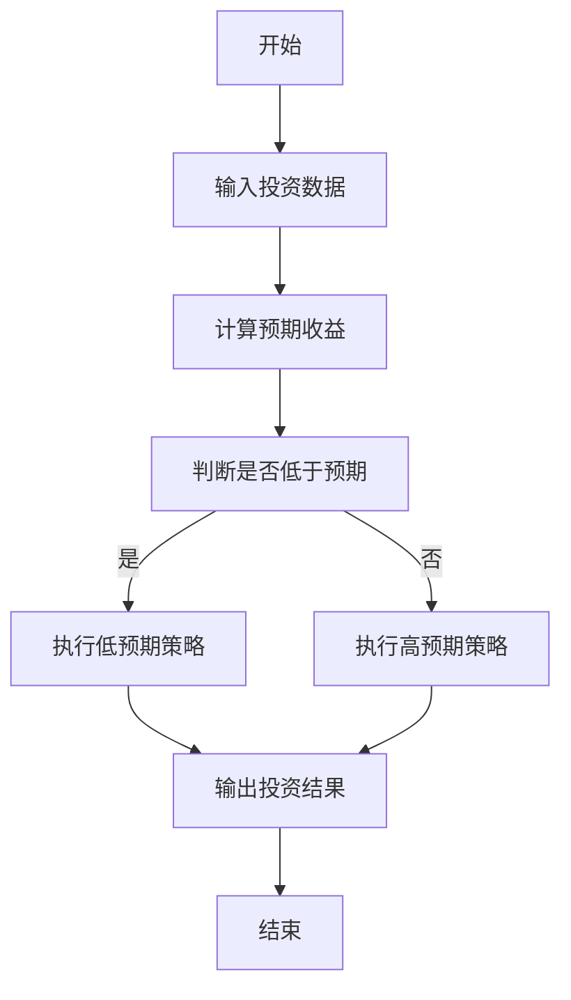
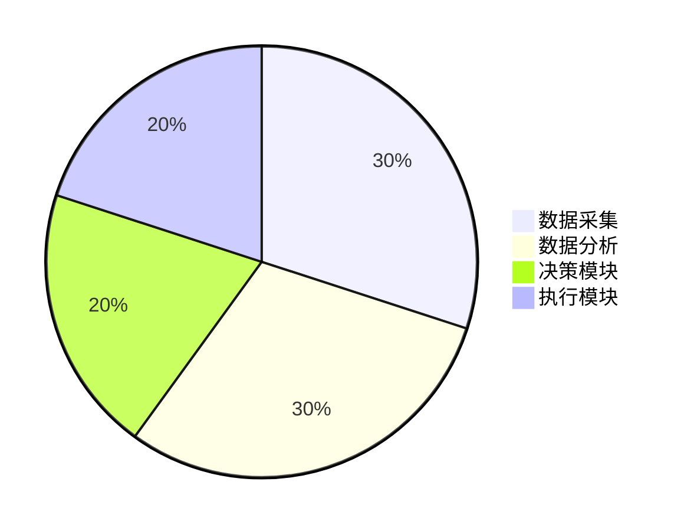
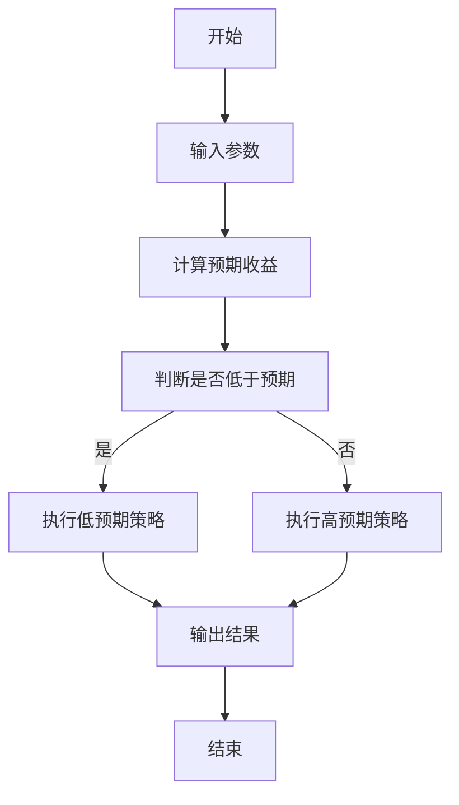

                 


# 约翰·内夫的低预期投资策略

## 关键词：低预期投资策略，投资策略，数学模型，系统架构，项目实战，投资决策

## 摘要：  
约翰·内夫的低预期投资策略是一种基于降低市场预期来优化投资决策的方法。本文将从背景介绍、核心概念、算法原理、数学模型、系统架构、项目实战等多个方面详细分析这一策略，帮助读者全面理解其理论基础和实际应用。

---

# 第一部分: 低预期投资策略的背景与核心概念

## 第1章: 低预期投资策略的背景与问题背景

### 1.1 低预期投资策略的定义与问题背景
#### 1.1.1 投资策略的基本概念
投资策略是投资者在金融市场中为实现特定财务目标而采取的一系列决策和操作。常见的投资策略包括价值投资、成长投资、趋势投资等。

#### 1.1.2 低预期投资策略的定义
低预期投资策略是一种基于对市场预期的降低来优化投资组合的方法。其核心在于通过降低对市场的过高预期，寻找被低估的投资标的，从而实现长期稳定的收益。

#### 1.1.3 低预期投资策略的背景与现状
近年来，随着市场的波动加剧，传统的高预期投资策略往往导致投资者在市场高位被套，而低预期策略则通过降低期望收益，帮助投资者在市场低谷中寻找机会。

### 1.2 低预期投资策略的核心问题
#### 1.2.1 低预期与高预期的对比
低预期策略强调保守和稳健，而高预期策略则追求高增长和高收益。两者的区别主要体现在对市场波动的应对和风险控制上。

#### 1.2.2 低预期投资策略的核心问题描述
低预期策略的核心问题是如何在降低预期的同时，找到具有长期增长潜力的投资标的。这需要结合市场分析、基本面研究和量化模型。

#### 1.2.3 低预期投资策略的边界与外延
低预期策略的边界在于其对市场的最低预期，而外延则涉及多种投资工具和策略的结合，如债券、股票、房地产等。

## 第2章: 低预期投资策略的核心概念与原理

### 2.1 低预期投资策略的核心概念
#### 2.1.1 低预期的定义与特征
低预期是指对市场的未来表现持较低的期望，通常基于对经济基本面和市场趋势的深入分析。

#### 2.1.2 低预期与高预期的对比
低预期策略注重稳健和风险控制，而高预期策略则追求高增长和高收益。两者在市场环境和投资目标上有显著差异。

#### 2.1.3 低预期投资策略的核心原理
低预期策略的核心在于通过降低市场预期，避免过度乐观，从而在市场波动中保持投资组合的稳定性。

### 2.2 低预期投资策略的数学模型与公式
#### 2.2.1 投资预期的数学模型
预期收益可以表示为：
$$ E(r) = \alpha + \beta \times (r_m - r_f) $$
其中，$E(r)$ 是预期收益，$\alpha$ 是策略收益，$\beta$ 是风险系数，$r_m$ 是市场收益，$r_f$ 是无风险收益。

#### 2.2.2 低预期投资策略的数学公式
在低预期策略中，我们假设市场收益 $r_m$ 较低，因此：
$$ E(r) = \alpha + \beta \times (r_m_{low} - r_f) $$

#### 2.2.3 投资预期与实际收益的关系
低预期策略通过降低 $r_m$ 来减少投资组合的波动性，从而实现更稳定的收益。

### 2.3 低预期投资策略的算法原理
#### 2.3.1 算法流程图


## 第3章: 低预期投资策略的系统分析

### 3.1 系统模块划分
低预期投资策略的系统架构可以划分为数据采集、分析模块、决策模块和执行模块。

### 3.2 系统功能设计
系统需要实现数据采集、分析、决策和执行四大功能。

### 3.3 系统架构图


---

# 第二部分: 低预期投资策略的算法与实现

## 第4章: 低预期投资策略的算法实现

### 4.1 算法流程图


### 4.2 核心算法实现
```python
def low_expectation_strategy(portfolio, market_data):
    expected_return = calculate_expected_return(portfolio)
    if expected_return < low_threshold:
        execute_low_strategy(portfolio)
    else:
        execute_high_strategy(portfolio)
    return portfolio
```

## 第5章: 低预期投资策略的数学模型与公式

### 5.1 投资预期的数学模型
$$ E(r) = \alpha + \beta \times (r_m - r_f) $$

### 5.2 低预期投资策略的数学公式
$$ E(r) = \alpha + \beta \times (r_m_{low} - r_f) $$

---

# 第三部分: 低预期投资策略的项目实战

## 第6章: 项目实战

### 6.1 环境安装
需要安装Python、Pandas、NumPy等库。

### 6.2 核心代码实现
```python
import pandas as pd
import numpy as np

def calculate_expected_return(portfolio):
    return np.mean(portfolio.returns)

def execute_low_strategy(portfolio):
    portfolio allocations to defensive assets
```

### 6.3 实际案例分析
通过具体案例分析低预期策略在实际投资中的应用。

---

# 第四部分: 总结与展望

## 第7章: 总结与展望

### 7.1 本章小结
总结低预期投资策略的核心概念和实现方法。

### 7.2 注意事项
在实际应用中需要注意风险控制和市场变化。

### 7.3 拓展阅读
推荐进一步阅读相关文献和案例。

---

# 作者：AI天才研究院/AI Genius Institute & 禅与计算机程序设计艺术 /Zen And The Art of Computer Programming

