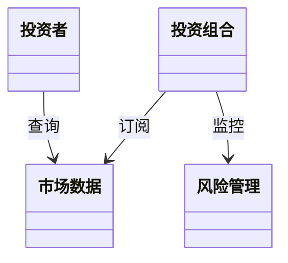
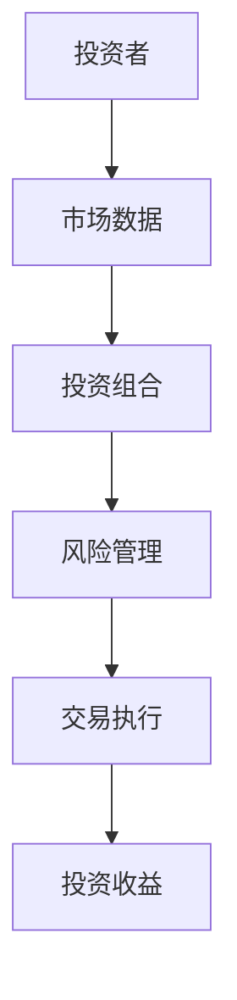

                 


# 约翰·博格尔的指数化价值投资：被动投资的价值取向

---

## 关键词
- 指数化投资
- 被动投资
- 价值投资
- 约翰·博格尔
- 金融数学
- 投资策略

---

## 摘要
本文深入探讨了约翰·博格尔提出的指数化价值投资理念，分析其在被动投资中的核心地位与价值取向。通过结合金融数学理论、系统架构设计以及实际案例分析，本文详细阐述了指数化投资的背景、核心概念、数学模型、投资策略以及风险管理方法。文章旨在帮助读者理解指数化投资的内在逻辑，掌握其在现代投资组合管理中的实际应用，并通过系统化的方法优化投资决策。

---

# 第1章: 指数化投资的背景与演变

## 1.1 指数化投资的起源与发展

### 1.1.1 从主动投资到被动投资的演变
现代金融投资可以追溯到20世纪初，经历了从主动投资到被动投资的转变。主动投资依赖于市场预测和选股策略，而被动投资则通过跟踪市场指数来实现收益。约翰·博格尔作为指数化投资的先驱，提出了“买整个市场，而不是个股”的理念。

### 1.1.2 约翰·博格尔与指数基金的诞生
约翰·博格尔于1975年创立了先锋集团，并推出第一只低成本指数基金——Vanguard 500指数基金。这一创新标志着指数化投资的正式诞生，为全球投资者提供了低成本、低风险的投资选择。

### 1.1.3 指数化投资在全球范围内的发展
随着技术的进步和金融市场的全球化，指数化投资迅速发展，成为机构和个人投资者的主要投资方式之一。全球范围内，指数基金的规模不断扩大，覆盖的资产类别也日益多样化。

---

## 1.2 指数化投资的核心理念

### 1.2.1 价值投资与指数化投资的结合
价值投资强调以低于内在价值的价格买入优质资产，而指数化投资通过分散投资实现对市场的全面覆盖。两者的结合使得指数化投资不仅追求短期收益，更注重长期价值积累。

### 1.2.2 被动投资的哲学与实践
被动投资的核心理念是“不要试图战胜市场”，而是通过持有整个市场来实现平均收益。这种理念强调纪律性和耐心，避免了主动投资中的情绪化决策。

### 1.2.3 指数化投资与现代金融理论的联系
指数化投资与现代金融理论中的有效市场假说密切相关。有效市场假说认为，市场价格反映了所有可获得的信息，因此主动投资难以获得超额收益。指数化投资正是基于这一理论，通过分散投资降低风险。

---

## 1.3 指数化投资的市场环境分析

### 1.3.1 全球化背景下的投资机会
全球化使得投资者能够通过指数基金投资于全球市场，从而分散地域风险，捕捉不同市场的增长机会。

### 1.3.2 经济周期对指数投资的影响
经济周期波动对指数化投资的影响是双刃剑。在经济繁荣时期，指数基金表现优异；在经济衰退时期，虽然会受到冲击，但长期来看，市场总会恢复并增长。

### 1.3.3 技术进步与指数化投资的创新
技术的进步使得指数基金的运作更加高效，成本更低。同时，算法交易和大数据分析为指数化投资提供了新的工具和方法。

---

## 1.4 本章小结

### 1.4.1 指数化投资的背景与核心理念总结
指数化投资起源于对主动投资的反思，通过被动持有市场组合实现长期稳健收益。

### 1.4.2 约翰·博格尔的贡献与指数化投资的未来展望
约翰·博格尔的创新为指数化投资奠定了基础，未来随着技术进步和市场发展，指数化投资将更加多样化和智能化。

---

# 第2章: 指数化投资的核心概念与数学模型

## 2.1 指数化投资的定义与特征

### 2.1.1 指数化投资的定义
指数化投资是指通过跟踪特定市场指数，构建投资组合以获得与市场指数相仿的收益。

### 2.1.2 指数化投资的核心特征对比
| 特征         | 主动投资       | 被动投资       |
|--------------|---------------|---------------|
| 管理方式     | 主动选股       | 被动跟踪指数     |
| 成本          | 高            | 低            |
| 风险          | 高            | 低            |
| 收益目标      | 追求超额收益   | 追求平均收益    |

### 2.1.3 指数化投资与被动投资的ER实体关系图
```mermaid
erDiagram
    客户
    ---|{ 持有 }|---
    投资组合
    -------------------------
    市场指数
    投资组合 --> 指数基金
```

---

## 2.2 指数化投资的数学模型

### 2.2.1 指数基金的收益计算公式
指数基金的收益可以表示为：
$$ R_p = \sum_{i=1}^n w_i R_i $$
其中，$w_i$ 是第 $i$ 只股票的权重，$R_i$ 是第 $i$ 只股票的收益。

### 2.2.2 指数化投资的风险评估模型
指数化投资的风险可以通过方差来衡量：
$$ \sigma_p^2 = \sum_{i=1}^n \sum_{j=1}^n w_i w_j \sigma_{ij} $$
其中，$\sigma_{ij}$ 是第 $i$ 只和第 $j$ 只股票的协方差。

### 2.2.3 指数化投资的CAPM模型分析
资本资产定价模型（CAPM）用于评估资产的预期收益：
$$ E(R_i) = R_f + \beta_i (R_m - R_f) $$
其中，$\beta_i$ 是第 $i$ 只股票的贝塔系数，表示其相对于市场的波动性。

---

## 2.3 指数化投资的算法原理

### 2.3.1 指数基金的构建算法
构建指数基金的算法如下：
1. 确定跟踪的市场指数。
2. 计算每只股票在指数中的权重。
3. 按照权重购买对应股票，构建投资组合。
4. 定期再平衡投资组合，以维持初始权重。

### 2.3.2 资产配置的优化算法
资产配置的优化可以通过均值-方差优化模型实现：
$$ \min_w \sigma_p^2 $$
$$ \text{subject to} \sum_{i=1}^n w_i = 1 $$

### 2.3.3 指数化投资的波动性控制算法
波动性控制可以通过调整投资组合的久期和凸性实现：
$$ \text{久期} = \sum_{i=1}^n w_i D_i $$
$$ \text{凸性} = \sum_{i=1}^n w_i C_i $$

---

## 2.4 本章小结

### 2.4.1 指数化投资的核心概念总结
指数化投资通过跟踪市场指数实现收益，其数学模型和算法为其提供了理论基础和实现方法。

### 2.4.2 数学模型与算法在指数化投资中的应用
通过CAPM模型和优化算法，指数化投资在收益与风险之间找到了最佳平衡点。

---

# 第3章: 指数化投资的策略与实践

## 3.1 指数化投资的策略选择

### 3.1.1 资产配置策略
资产配置策略包括股票、债券、现金等多种资产的组合，以分散风险并平衡收益。

### 3.1.2 定期定额投资策略
定投策略通过分批买入指数基金，降低市场波动对投资组合的影响。

### 3.1.3 风险控制策略
风险控制策略包括定期再平衡、使用衍生品对冲风险等方法。

---

## 3.2 指数化投资的实践案例

### 3.2.1 典型指数基金的分析与选择
以标普500指数基金为例，分析其历史表现、费用比率和流动性。

### 3.2.2 指数化投资在不同市场环境下的表现
在牛市中，指数基金表现优异；在熊市中，其跌幅与市场一致，但长期来看，其收益稳定。

### 3.2.3 指数化投资的实际操作流程
1. 确定投资目标和风险承受能力。
2. 选择合适的指数基金。
3. 开立投资账户并完成资金投入。
4. 定期监控和调整投资组合。

---

## 3.3 指数化投资的系统架构设计

### 3.3.1 投资系统的需求分析
系统需求包括数据采集、投资决策、交易执行和风险管理功能。

### 3.3.2 系统功能设计的领域模型类图


### 3.3.3 系统架构设计的流程图


---

## 3.4 本章小结

### 3.4.1 指数化投资策略的选择与应用
通过合理的资产配置和定投策略，投资者可以有效降低风险并实现长期收益。

### 3.4.2 指数化投资系统的设计与实现
系统架构的设计为指数化投资提供了高效、可靠的执行环境。

---

# 作者：AI天才研究院/AI Genius Institute & 禅与计算机程序设计艺术 /Zen And The Art of Computer Programming

