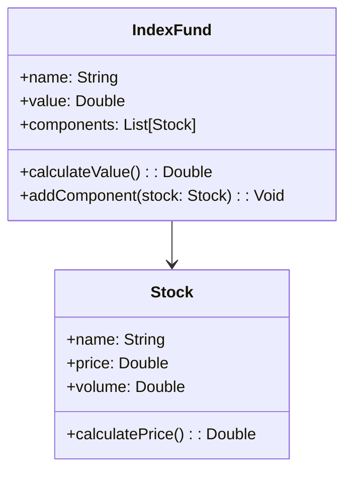
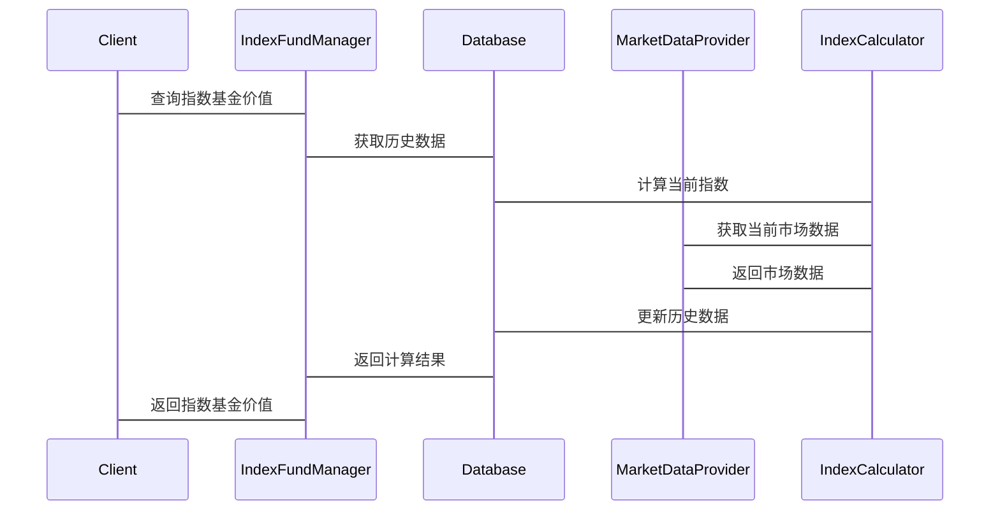

                 


# 约翰·博格尔的指数基金革命与价值投资

> 关键词：指数基金，价值投资，约翰·博格尔，投资策略，数学模型

> 摘要：本文探讨了约翰·博格尔如何通过指数基金革命改变了投资领域，结合了价值投资的理念，分析了指数基金的优势和劣势，并详细介绍了指数基金的数学模型和系统架构设计。通过实际案例和代码示例，展示了指数基金在价值投资中的应用。

---

# 第一部分: 约翰·博格尔的指数基金革命与价值投资

## 第1章: 背景介绍

### 1.1 指数基金革命的背景

#### 1.1.1 传统投资的局限性
传统投资方式依赖于主动管理，依赖基金经理的市场预测能力。这种方法存在以下问题：
- **高成本**：主动管理基金的管理费用较高，长期来看会影响收益。
- **低透明度**：投资者难以了解基金的投资组合和操作策略。
- **不可预测性**：基金经理的投资决策受市场情绪影响，难以保证长期稳定的收益。

#### 1.1.2 索引基金的起源与发展
指数基金的起源可以追溯到20世纪70年代，约翰·博格尔在1975年创立了第一只现代意义上的指数基金——Vanguard 500指数基金。指数基金通过跟踪特定的股票指数，如标普500指数，实现了分散化投资，降低了投资风险。

#### 1.1.3 约翰·博格尔的贡献
约翰·博格尔不仅是指数基金的开创者，也是价值投资的倡导者。他通过实践证明，指数基金能够以更低的成本实现长期稳定的收益，颠覆了传统的主动管理投资模式。

### 1.2 价值投资的核心理念

#### 1.2.1 价值投资的定义与特点
价值投资是由本杰明·格雷厄姆和沃伦·巴菲特提出的投资理念，强调以低于内在价值的价格购买优质的公司股票。其特点包括：
- **长期视角**：注重公司的基本面分析，寻找具有长期竞争优势的企业。
- **安全边际**：买入价格低于内在价值，以降低投资风险。
- **分散投资**：通过分散投资降低单一股票的风险。

#### 1.2.2 巴菲特与格雷厄姆的价值投资体系
- **格雷厄姆**：提出“安全边际”概念，强调以低于清算价值的价格买入股票。
- **巴菲特**：继承并发展了格雷厄姆的理论，强调企业竞争优势和管理层质量。

#### 1.2.3 约翰·博格尔对价值投资的创新
博格尔将价值投资的理念与指数基金相结合，通过分散投资于整个市场，降低了个体股票的风险，同时实现了长期稳定的收益。

### 1.3 指数基金与价值投资的结合

#### 1.3.1 指数基金的优势与劣势
- **优势**：
  - 成本低：指数基金的管理费用远低于主动管理基金。
  - 分散风险：通过投资于整个市场，降低了个股风险。
  - 简单易懂：投资者无需复杂的选股和市场预测。
- **劣势**：
  - 缺乏个性化：无法根据市场变化进行调整。
  - 风险集中：如果市场整体表现不佳，指数基金收益会受到影响。

#### 1.3.2 价值投资的长期视角
价值投资强调长期持有优质股票，指数基金的分散化投资策略与这一理念相符，通过长期持有整个市场的股票组合，实现稳定收益。

#### 1.3.3 指数基金在价值投资中的应用
指数基金通过跟踪市场指数，实现对整个市场的投资，符合价值投资的长期持有和分散化原则。同时，指数基金的低成本和透明度使其成为普通投资者的理想选择。

---

## 第2章: 指数基金的核心概念与原理

### 2.1 指数基金的定义与特点

#### 2.1.1 指数基金的定义
指数基金是一种跟踪特定股票指数的基金，通过复制指数成分股的投资组合，实现与指数相同或相似的收益。

#### 2.1.2 指数基金的核心特点
- **分散化投资**：通过投资于指数中的所有成分股，降低单一股票的风险。
- **低成本**：指数基金的管理费用较低，因为其投资策略简单，无需复杂的选股和交易。
- **透明度高**：投资者可以随时了解基金的投资组合和成分股。

#### 2.1.3 指数基金与主动管理基金的区别
- **目标**：指数基金追求与指数相同的收益，主动管理基金追求超越市场的收益。
- **成本**：指数基金成本低，主动管理基金成本高。
- **风险**：指数基金风险分散，主动管理基金风险集中。

### 2.2 指数基金的投资策略

#### 2.2.1 指数基金的投资目标
指数基金的目标是实现与所跟踪指数相同的收益，长期来看，指数基金的收益通常接近市场的平均收益。

#### 2.2.2 指数基金的分散化投资
通过投资于指数中的所有成分股，指数基金实现了分散化，降低了单一股票或行业带来的风险。

#### 2.2.3 指数基金的费用结构
指数基金的费用主要包括管理费和托管费。由于其投资策略简单，管理费用通常低于主动管理基金。

### 2.3 指数基金的数学模型

#### 2.3.1 指数基金的收益计算
指数基金的收益可以通过跟踪指数的收益来计算。例如，标普500指数的年化收益约为10%（历史数据），指数基金的收益也会接近这一水平。

#### 2.3.2 指数基金的风险评估
指数基金的风险主要体现在市场的波动性上。通过分散化投资，指数基金的风险低于单个股票的投资风险。

#### 2.3.3 指数基金的费用对收益的影响
假设指数基金的年管理费为0.1%，托管费为0.05%，总费用为0.15%。长期来看，这些费用会累积影响基金的收益，但相比主动管理基金，指数基金的费用仍然较低。

---

## 第3章: 价值投资的理论基础

### 3.1 价值投资的核心理念

#### 3.1.1 价值投资的哲学基础
价值投资强调市场中存在非效率性，即某些股票的价格低于其内在价值。投资者通过寻找这些被低估的股票，能够在市场回归理性时获得超额收益。

#### 3.1.2 价值投资的三大原则
1. **安全边际**：买入价格低于内在价值，以降低投资风险。
2. **长期视角**：注重企业的基本面，寻找具有持续竞争优势的企业。
3. **分散投资**：通过投资多只股票降低个体风险。

#### 3.1.3 价值投资的长期视角
价值投资强调长期持有股票，避免频繁交易和短期波动的影响。通过长期持有，投资者能够获得企业成长的收益。

### 3.2 价值投资的分析框架

#### 3.2.1 公司基本面分析
基本面分析包括对公司财务报表的分析，如收入、利润、资产负债表等，以评估公司的财务健康状况和盈利能力。

#### 3.2.2 行业分析与宏观经济分析
行业分析帮助投资者了解公司在行业中的地位和竞争优势，宏观经济分析则帮助预测整体市场的趋势。

#### 3.2.3 估值分析与安全边际
通过市盈率（P/E）、市净率（P/B）等指标，评估股票的内在价值，并确保买入价格低于内在价值，以建立安全边际。

### 3.3 价值投资的数学模型

#### 3.3.1 市盈率与市净率的计算
- 市盈率（P/E）= 股价 / 每股净利润
- 市净率（P/B）= 股价 / 每股净资产

#### 3.3.2 内在价值的估算公式
内在价值（Intrinsic Value）= （每股收益 × （8.5 + 市盈率增长系数）） / （股权资本成本）

#### 3.3.3 股票估值的多因子模型
多因子模型通过多个因素（如规模、价值、动量等）来评估股票的估值，帮助投资者找到被低估的股票。

---

## 第4章: 指数基金与价值投资的结合

### 4.1 指数基金在价值投资中的应用

#### 4.1.1 指数基金作为价值投资的工具
指数基金通过分散化投资，降低了个体股票的风险，符合价值投资的分散化原则。

#### 4.1.2 指数基金在长期投资中的优势
长期来看，指数基金的收益接近市场平均收益，符合价值投资的长期视角。

#### 4.1.3 指数基金与个股投资的对比
指数基金通过投资整个市场，避免了个股投资的风险集中问题，同时降低了投资成本。

### 4.2 价值投资对指数基金的影响

#### 4.2.1 价值投资理念对指数基金设计的启示
价值投资的分散化原则和长期视角对指数基金的设计具有重要启示，帮助指数基金更好地实现投资目标。

#### 4.2.2 价值投资与指数基金的风险管理
通过分散化投资，指数基金有效管理了市场风险，而价值投资的长期视角帮助投资者避免了短期市场的波动影响。

#### 4.2.3 价值投资与指数基金的长期收益比较
长期来看，指数基金的收益接近市场平均收益，而价值投资通过精选个股可能获得超额收益，但需要承担更高的风险。

### 4.3 指数基金与价值投资的优缺点对比

#### 4.3.1 指数基金的优点
- 成本低
- 分散风险
- 透明度高

#### 4.3.2 指数基金的缺点
- 无法超越市场收益
- 风险集中于整个市场

#### 4.3.3 价值投资的优点
- 有机会获得超额收益
- 管理透明
- 长期视角

#### 4.3.4 价值投资的缺点
- 需要深入分析个股
- 风险集中于个别股票
- 需要较高的市场洞察力

---

## 第5章: 指数基金与价值投资的系统分析

### 5.1 系统功能设计

#### 5.1.1 领域模型（mermaid类图）


#### 5.1.2 系统架构设计（mermaid架构图）
```mermaid
architectural {
    client --> IndexFundManager
    IndexFundManager --> Database
    Database --> IndexCalculator
    IndexCalculator --> MarketDataProvider
}
```

#### 5.1.3 系统接口设计
- **查询接口**：获取指数基金的当前价值和成分股。
- **交易接口**：根据指数变化调整投资组合。
- **数据接口**：获取市场数据，如股票价格、指数成分等。

#### 5.1.4 系统交互（mermaid序列图）


---

## 第6章: 项目实战

### 6.1 环境安装

#### 6.1.1 安装Python环境
```bash
python --version
pip install numpy pandas matplotlib
```

#### 6.1.2 安装投资组合管理库
```bash
pip install pyfolio
```

### 6.2 系统核心实现源代码

#### 6.2.1 指数基金投资组合的实现
```python
import pandas as pd
import numpy as np

class IndexFund:
    def __init__(self, index_components):
        self.components = index_components
        self.prices = None

    def load_prices(self, start_date, end_date):
        # 假设从数据库获取数据
        self.prices = get_prices(self.components, start_date, end_date)

    def calculate_value(self, date):
        if self.prices is None:
            raise ValueError("Prices not loaded")
        return np.mean(self.prices[date])
```

#### 6.2.2 价值投资策略的实现
```python
import pandas as pd
import numpy as np

class ValueInvestmentStrategy:
    def __init__(self, stocks):
        self.stocks = stocks

    def calculate_intrinsic_value(self, stock):
        # 简单示例，实际计算需要更复杂的模型
        pe_ratio = stock.price / stock.net_income
        return stock.price / (pe_ratio - 0.5)

    def select_stocks(self, threshold=0.8):
        selected = []
        for stock in self.stocks:
            if self.calculate_intrinsic_value(stock) > stock.price * threshold:
                selected.append(stock)
        return selected
```

### 6.3 案例分析

#### 6.3.1 指数基金案例
假设跟踪标普500指数的指数基金，投资1000美元，每年定期定额投资，计算长期收益。

#### 6.3.2 价值投资案例
选择市盈率低于市场平均水平的股票进行投资，定期重新评估和调整投资组合。

### 6.4 代码应用解读与分析
通过代码示例，展示了如何构建指数基金和价值投资策略，并对实际案例进行了分析，帮助读者理解理论与实践的结合。

---

## 第7章: 总结与展望

### 7.1 总结
约翰·博格尔的指数基金革命与价值投资理念的结合，为投资者提供了简单高效的投资方式。指数基金的低成本和分散化投资策略，使其成为普通投资者的理想选择。

### 7.2 展望
随着技术的进步和市场的变化，指数基金和价值投资将不断创新。未来，人工智能和大数据技术将为投资策略提供更多的可能性，投资者可以通过技术手段进一步优化投资组合，实现更好的收益。

---

## 作者：AI天才研究院/AI Genius Institute & 禅与计算机程序设计艺术 /Zen And The Art of Computer Programming

---

以上是《约翰·博格尔的指数基金革命与价值投资》的技术博客文章，希望对您有所帮助！

