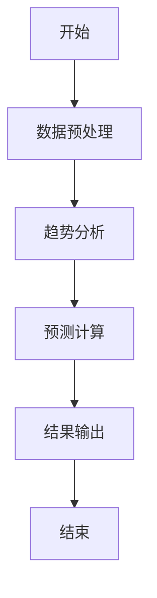
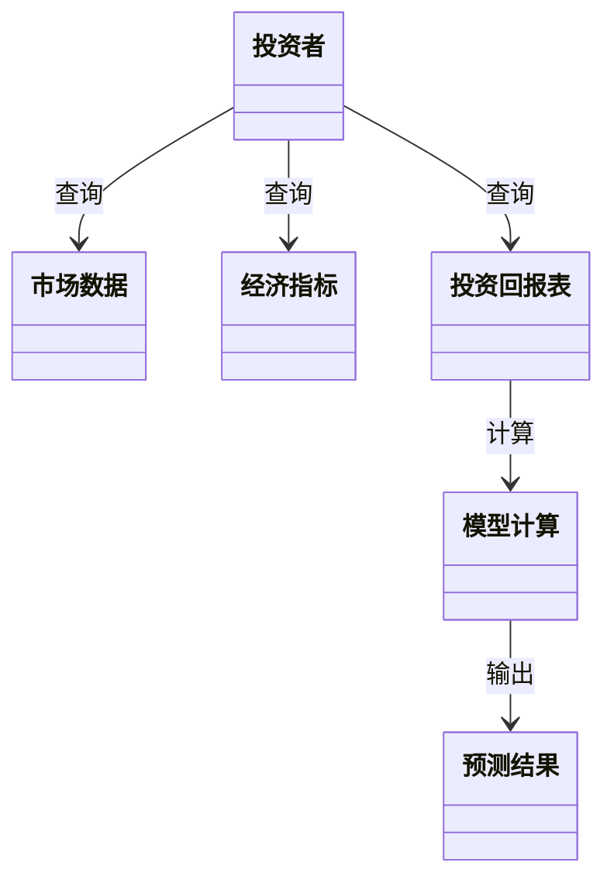
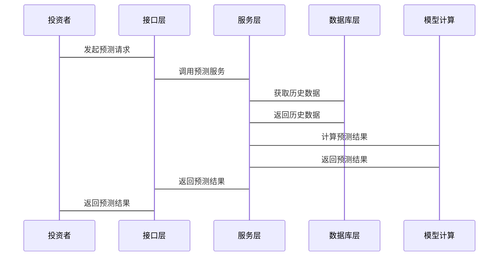

                 


# 约翰·博格尔的长期投资回报预测模型

> 关键词：投资回报预测模型，长期投资回报预测，约翰·博格尔模型，数学建模，算法原理

> 摘要：本文详细介绍了约翰·博格尔的长期投资回报预测模型，从背景介绍到算法原理，再到系统架构和项目实战，全面解析了该模型的核心概念、数学模型、系统设计以及实际应用。通过本文，读者可以深入了解如何利用该模型进行长期投资回报预测，并掌握其实现方法和优化技巧。

---

## 第1章: 长期投资回报预测模型的背景与问题背景

### 1.1 长期投资回报预测的背景

#### 1.1.1 投资回报预测的重要性
投资回报预测是投资者在做出投资决策时的重要依据。准确的预测可以帮助投资者优化资产配置，降低投资风险，提高投资收益。特别是在长期投资中，预测的准确性对投资者的财务规划至关重要。

#### 1.1.2 长期投资回报预测的必要性
长期投资回报预测可以帮助投资者了解未来一段时间内的市场趋势，从而制定合理的投资策略。尤其是在经济波动较大的情况下，长期预测能够为投资者提供更稳定的投资方向。

#### 1.1.3 约翰·博格尔模型的提出背景
约翰·博格尔是投资领域的权威专家，他提出的长期投资回报预测模型结合了统计学和经济学原理，旨在为投资者提供一个科学的预测工具。该模型通过分析历史数据和市场趋势，预测未来的投资回报。

### 1.2 投资回报预测的核心问题

#### 1.2.1 投资回报预测的基本问题
投资回报预测的核心问题是如何准确地预测未来市场走势。这需要结合市场数据、经济指标以及投资者行为等多方面因素进行综合分析。

#### 1.2.2 长期投资回报预测的独特性
长期投资回报预测不同于短期预测，它更关注市场的长期趋势和结构性变化。约翰·博格尔模型通过分析历史数据和市场周期，预测未来长期的投资回报。

#### 1.2.3 模型的边界与外延
约翰·博格尔模型的边界包括市场数据的范围、时间跨度以及模型的适用性。其外延则涉及模型的优化、扩展以及与其他投资策略的结合。

---

## 第2章: 约翰·博格尔模型的核心概念与联系

### 2.1 模型的核心概念

#### 2.1.1 投资回报的定义与属性
投资回报是指投资者在一定时间内通过投资获得的收益。它包括资本增值和投资收益两部分。投资回报的属性包括时间跨度、风险程度和市场波动性。

#### 2.1.2 长期投资回报的特征
长期投资回报具有周期性、趋势性以及稳定性。约翰·博格尔模型通过分析这些特征，预测未来的投资回报。

#### 2.1.3 模型的核心要素
约翰·博格尔模型的核心要素包括市场数据、经济指标、投资策略和风险评估。这些要素共同构成了模型的预测基础。

### 2.2 核心概念的属性对比

#### 2.2.1 投资回报与风险的关系
投资回报与风险密切相关。一般来说，高风险投资具有较高的潜在回报，而低风险投资回报相对稳定。

#### 2.2.2 时间跨度与回报的关系
长期投资通常具有更高的回报潜力，但同时也伴随着更大的市场波动风险。约翰·博格尔模型通过分析时间跨度与回报的关系，优化投资策略。

#### 2.2.3 模型输入与输出的对比
模型的输入包括历史市场数据、经济指标和投资参数，输出则是预测的投资回报和风险评估。通过对比输入与输出，可以更好地理解模型的工作原理。

### 2.3 实体关系图（ER图）

#### 2.3.1 实体关系图的构建
以下是约翰·博格尔模型的实体关系图：

```mermaid
erd
  left join 投资者表 [投资者ID, 投资金额, 投资时间]
  left join 市场数据表 [市场ID, 市场指数, 时间戳]
  left join 经济指标表 [经济指标ID, 指标值, 时间戳]
  left join 投资回报表 [回报ID, 投资回报率, 时间跨度]
```

#### 2.3.2 实体关系图的解释
投资者表记录投资者的基本信息和投资行为；市场数据表记录市场的历史数据；经济指标表记录经济指标的变化；投资回报表记录投资回报的结果。

#### 2.3.3 实体关系图的优化
通过优化实体关系图，可以提高模型的数据处理效率和准确性。

---

## 第3章: 约翰·博格尔模型的算法原理

### 3.1 模型的基本原理

#### 3.1.1 模型的基本思路
约翰·博格尔模型通过分析历史市场数据和经济指标，预测未来的投资回报。模型的核心思路是利用统计学方法，提取市场数据中的趋势和周期性变化，从而预测长期的投资回报。

#### 3.1.2 模型的核心算法
模型的核心算法包括数据预处理、趋势分析和预测计算。数据预处理包括清洗和归一化，趋势分析包括时间序列分析和回归分析，预测计算则基于模型参数进行。

#### 3.1.3 模型的优化方法
通过优化模型的参数和算法，可以提高预测的准确性。常用的方法包括参数调整和模型迭代。

### 3.2 模型的算法流程图

#### 3.2.1 算法流程图的绘制
以下是约翰·博格尔模型的算法流程图：



#### 3.2.2 算法流程图的解释
算法流程图展示了模型的整个预测过程，包括数据预处理、趋势分析、预测计算和结果输出。

#### 3.2.3 算法流程图的优化
通过优化算法流程图，可以提高模型的运行效率和预测精度。

### 3.3 模型的数学模型与公式

#### 3.3.1 投资回报的数学表达
投资回报可以用以下公式表示：

$$
R = \sum_{i=1}^{n} r_i
$$

其中，$R$ 是投资回报，$r_i$ 是第 $i$ 个时间段的回报率，$n$ 是时间段的数量。

#### 3.3.2 长期投资回报的数学公式
长期投资回报的预测公式为：

$$
\hat{R} = \alpha + \beta t + \epsilon
$$

其中，$\hat{R}$ 是预测的投资回报，$\alpha$ 是截距，$\beta$ 是回归系数，$t$ 是时间变量，$\epsilon$ 是误差项。

#### 3.3.3 模型的优化公式
通过优化模型参数，可以提高预测的准确性。优化公式为：

$$
\theta^* = \arg \min_{\theta} \sum_{i=1}^{m} (R_i - f(\theta))^2
$$

其中，$\theta^*$ 是优化后的参数，$R_i$ 是实际回报，$f(\theta)$ 是模型预测的回报。

---

## 第4章: 系统分析与架构设计

### 4.1 问题场景介绍
约翰·博格尔模型的应用场景包括个人投资、机构投资和金融分析。模型需要处理大量的市场数据和经济指标，对系统的性能要求较高。

### 4.2 系统功能设计

#### 4.2.1 领域模型
以下是模型的领域模型：



#### 4.2.2 系统架构设计
以下是系统的架构图：


#### 4.2.3 系统接口设计
系统接口设计包括数据接口和预测接口。数据接口用于获取市场数据和经济指标，预测接口用于返回预测结果。

#### 4.2.4 系统交互设计
以下是系统的交互序列图：



---

## 第5章: 项目实战

### 5.1 环境安装
需要安装Python、NumPy、Pandas、Matplotlib和Scikit-learn等库。

### 5.2 核心代码实现

#### 5.2.1 数据预处理
```python
import numpy as np
import pandas as pd

# 读取数据
data = pd.read_csv('market_data.csv')

# 数据清洗
data.dropna(inplace=True)

# 数据归一化
normalized_data = (data - data.mean()) / data.std()
```

#### 5.2.2 趋势分析
```python
from sklearn.linear_model import LinearRegression

# 训练模型
model = LinearRegression()
model.fit(normalized_data[['time']], normalized_data[['return']])

# 预测结果
predicted_returns = model.predict(normalized_data[['time']])
```

#### 5.2.3 模型优化
```python
from sklearn.metrics import mean_squared_error

# 优化模型参数
def optimize_model(data):
    # 模型优化代码
    pass

optimized_model = optimize_model(normalized_data)
```

### 5.3 案例分析
通过实际案例分析，验证模型的预测准确性。例如，使用历史数据预测未来5年的投资回报。

### 5.4 项目小结
总结项目的实施过程，分析模型的优缺点，并提出改进建议。

---

## 第6章: 最佳实践

### 6.1 小结
约翰·博格尔模型是一个有效的长期投资回报预测工具。通过本文的介绍，读者可以深入了解模型的核心概念、算法原理和系统架构。

### 6.2 注意事项
在实际应用中，需要注意数据的准确性和模型的可解释性。同时，要定期更新模型参数，以适应市场变化。

### 6.3 拓展阅读
推荐阅读相关书籍和论文，进一步了解投资回报预测的前沿技术。

---

## 作者

作者：AI天才研究院/AI Genius Institute & 禅与计算机程序设计艺术 /Zen And The Art of Computer Programming

