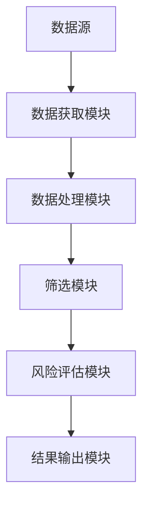

                 


# 约翰·奈夫的低市净率投资策略

## 关键词：低市净率、投资策略、约翰·奈夫、股票筛选、风险控制

## 摘要：本文深入探讨约翰·奈夫的低市净率投资策略，分析其核心概念、算法原理、系统架构及实际应用。通过详细讲解市净率的计算、低市净率股票的筛选方法，以及投资系统的构建，为读者提供一套基于低市净率的投资策略。本文还将通过实际案例展示如何利用Python进行低市净率股票的筛选，并讨论投资中的风险控制和最佳实践。

---

## 第1章：低市净率投资概述

### 1.1 低市净率投资的基本概念

#### 1.1.1 市净率的定义与计算公式
市净率（Price-to-Book Ratio，简称PB）是衡量股票价值的重要指标之一，计算公式为：

$$
\text{PB} = \frac{\text{市场价}}{\text{每股净资产}}
$$

其中，每股净资产是公司资产净值除以总股本。市净率反映了股票价格相对于其资产价值的高低。

#### 1.1.2 低市净率股票的特征
低市净率股票通常具有以下特征：
- 股票价格低于其资产价值。
- 公司可能处于低估状态，具有较大的上涨潜力。
- 抗跌性较强，适合风险厌恶型投资者。

#### 1.1.3 约翰·奈夫的投资理念
约翰·奈夫提出，低市净率股票往往被市场低估，长期来看具有较高的投资回报。他强调通过筛选市净率低于行业平均水平的股票，构建投资组合。

### 1.2 低市净率投资的背景与现状

#### 1.2.1 低市净率投资的历史发展
低市净率投资策略起源于对价值投资的追求，早期投资者如格雷厄姆和多德等人就关注低市净率股票。约翰·奈夫进一步完善了这一策略，尤其是在科技和金融领域。

#### 1.2.2 当前市场中的低市净率股票分布
在当前市场中，低市净率股票主要分布在金融、地产、能源等行业。这些行业受经济周期影响较大，但在低市净率时往往具有较高的安全边际。

#### 1.2.3 低市净率投资的市场环境分析
低市净率投资的有效性取决于市场环境。在熊市或经济低迷时期，低市净率股票可能更具吸引力；而在牛市中，低市净率股票可能表现平平。

### 1.3 低市净率投资的核心优势

#### 1.3.1 低估值的潜在回报
低市净率股票通常被低估，长期来看可能具有较高的资本增值潜力。

#### 1.3.2 抗跌性与防御性分析
低市净率股票在市场下跌时往往表现较为稳定，具有较强的防御性。

#### 1.3.3 投资风险与收益平衡
低市净率股票的投资风险主要集中在公司基本面变化和市场波动。通过严格的筛选和分散投资，可以有效控制风险。

---

## 第2章：低市净率投资的核心概念与原理

### 2.1 市净率与市盈率的对比分析

#### 2.1.1 市净率与市盈率的定义
- 市净率（PB）：市场价 / 每股净资产。
- 市盈率（PE）：市场价 / 每股收益。

#### 2.1.2 两者的区别与适用场景
- 市净率适用于资产密集型行业，如金融、房地产。
- 市盈率适用于成长型企业，如科技公司。

#### 2.1.3 市净率在不同行业中的适用性
在金融和能源等行业，市净率是重要的估值指标；而在科技行业，市盈率更为常用。

### 2.2 低市净率股票筛选模型

#### 2.2.1 市净率低于行业平均水平的筛选标准
筛选标准：
$$
\text{PB} < \text{行业平均PB}
$$

#### 2.2.2 结合其他财务指标的多维度筛选
综合考虑市净率、市盈率、ROE（净资产收益率）等指标，构建多维度筛选模型。

#### 2.2.3 筛选模型的优缺点分析
优点：
- 筛选出具有估值优势的股票。
缺点：
- 可能忽略成长性较好的股票。

### 2.3 低市净率投资的数学模型

#### 2.3.1 市净率计算公式
$$
\text{PB} = \frac{\text{市场价}}{\text{每股净资产}}
$$

#### 2.3.2 筛选标准
$$
\text{PB} < 1
$$

#### 2.3.3 模型的适用性与局限性
适用性：
- 适用于资产密集型行业。
局限性：
- 忽略了公司的成长性和创新能力。

---

## 第3章：低市净率投资的算法与实现

### 3.1 算法原理

#### 3.1.1 算法流程
1. 数据获取：收集目标行业的股票数据。
2. 计算市净率：计算每只股票的PB值。
3. 筛选低市净率股票：筛选PB低于行业平均值的股票。
4. 风险评估：评估筛选股票的风险。

#### 3.1.2 算法实现
使用Python编写代码，实现低市净率股票的筛选。

### 3.2 算法实现代码

```python
import pandas as pd

# 数据获取
data = pd.read_csv('stock_data.csv')

# 计算市净率
data['PB'] = data['Market Price'] / data['Book Value Per Share']

# 筛选低市净率股票
low_pb_stocks = data[data['PB'] < data['PB'].mean()]

print(low_pb_stocks)
```

### 3.3 算法优化

#### 3.3.1 数据预处理
- 填补缺失值。
- 处理异常值。

#### 3.3.2 筛选策略优化
- 结合市盈率和ROE进行多维度筛选。

---

## 第4章：低市净率投资的系统架构与实现

### 4.1 系统架构设计

#### 4.1.1 系统功能模块
- 数据获取模块。
- 筛选模块。
- 风险评估模块。

#### 4.1.2 系统架构图


### 4.2 系统实现

#### 4.2.1 数据获取
从数据库中获取股票数据。

#### 4.2.2 数据处理
计算市净率，处理缺失值和异常值。

#### 4.2.3 筛选
根据筛选标准，筛选出低市净率股票。

#### 4.2.4 风险评估
评估筛选股票的风险。

---

## 第5章：低市净率投资的项目实战

### 5.1 环境安装

#### 5.1.1 安装Python
安装Python 3.x。

#### 5.1.2 安装依赖库
安装pandas、numpy、matplotlib等库。

### 5.2 核心实现

#### 5.2.1 数据获取
使用pandas读取CSV文件中的股票数据。

#### 5.2.2 数据处理
计算市净率，处理缺失值和异常值。

#### 5.2.3 筛选
筛选出市净率低于行业平均值的股票。

#### 5.2.4 风险评估
评估筛选股票的风险。

### 5.3 案例分析

#### 5.3.1 数据分析
分析筛选出的低市净率股票的分布情况。

#### 5.3.2 结果展示
使用图表展示筛选结果。

---

## 第6章：低市净率投资的最佳实践

### 6.1 投资策略总结

#### 6.1.1 低市净率投资的核心要点
- 筛选出市净率低于行业平均水平的股票。
- 结合其他财务指标进行综合评估。

#### 6.1.2 风险控制
- 分散投资，降低风险。
- 定期评估投资组合，调整持仓。

### 6.2 小结

#### 6.2.1 低市净率投资的优势
- 估值优势明显。
- 抗跌性强。

#### 6.2.2 投资中的注意事项
- 注意公司基本面的变化。
- 关注行业周期性影响。

### 6.3 拓展阅读

#### 6.3.1 推荐书籍
- 《价值投资》。
- 《低市净率投资策略》。

#### 6.3.2 其他资源
- 投资博客。
- 专业论坛。

---

## 作者：AI天才研究院 & 禅与计算机程序设计艺术

