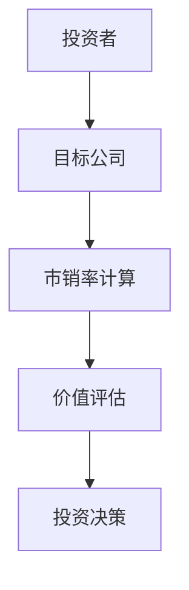
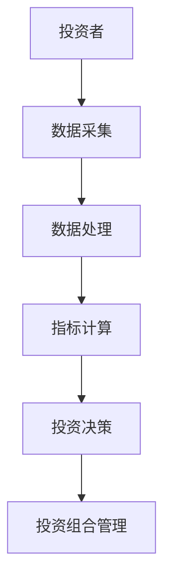

                 


# 约翰·奈夫的低市销率价值投资：另一种选股视角

## 关键词：
低市销率，价值投资，约翰·奈夫，投资策略，市销率计算

## 摘要：
本文深入探讨了约翰·奈夫的低市销率价值投资理念，从概念、原理、模型到实际应用，全面分析了低市销率投资的策略和方法。通过详细的案例分析和系统设计，为投资者提供了另一种选股视角，帮助他们在复杂多变的市场中找到被低估的投资机会。

---

# 第一部分: 低市销率价值投资概述

## 第1章: 低市销率价值投资的背景与核心概念

### 1.1 低市销率价值投资的背景

#### 1.1.1 投资学中的价值投资理念
价值投资是一种长期投资策略，强调以低于公平市场价值的价格买入优质资产。它起源于本杰明·格雷厄姆和戴维·多德的价值投资理论，核心在于寻找市场低估的公司。约翰·奈夫（John Neff）是这一理念的现代诠释者，他提出了一种基于低市销率的投资策略。

#### 1.1.2 市销率（Price-to-Sales Ratio, PSR）的定义与特点
市销率（PSR）是衡量公司价值的重要指标，计算公式为：
$$ \text{PSR} = \frac{\text{公司市值}}{\text{年销售收入}} $$
PSR的优势在于它适用于各种行业，尤其是销售驱动型的公司。低PSR意味着公司市值相对于其销售收入较低，可能被市场低估。

#### 1.1.3 约翰·奈夫的投资理念与方法
约翰·奈夫是美国著名投资经理，曾管理富达投资的“普尔特”基金（Puritan Fund），并创造了长期稳定的超额收益。他提出了一种以低市销率为核心的投资策略，强调通过量化分析寻找被市场忽视的优质公司。

---

### 1.2 低市销率投资的核心概念

#### 1.2.1 市销率的计算公式与应用场景
市销率的计算公式为：
$$ \text{PSR} = \frac{\text{公司市值}}{\text{年销售收入}} $$
PSR的应用场景包括：
1. 适用于销售收入波动较大的公司。
2. 适合成长型企业或周期性行业。
3. 在市场低迷或行业衰退时，低PSR公司更具吸引力。

#### 1.2.2 低市销率公司的特征与优势
低市销率公司的特征包括：
- 销售收入稳定或增长。
- 市场低估，PSR低于行业平均水平。
- 具备竞争优势，如成本优势或品牌优势。

低市销率公司的优势在于：
- 抗跌性强，市场波动时表现稳定。
- 具备较高的安全边际，风险较低。

#### 1.2.3 低市销率投资的适用场景与边界条件
低市销率投资适用于：
- 市场整体估值较低时。
- 行业低迷或周期性低谷时。
- 公司基本面良好，但市场关注度较低时。

边界条件：
- 避免投资于财务状况不佳的公司。
- 避免行业周期性风险。
- 避免高杠杆或高负债的公司。

---

## 第2章: 低市销率投资的核心概念与联系

### 2.1 核心概念原理

#### 2.1.1 市销率与市盈率的对比分析
市盈率（P/E）和市销率（PSR）是衡量公司估值的两个重要指标。市盈率适用于盈利稳定的公司，而市销率适用于销售驱动型的公司。以下是两者的对比：

| 指标 | 市盈率（P/E） | 市销率（PSR） |
|------|----------------|---------------|
| 计算公式 | $\frac{\text{股价}}{\text{每股收益}}$ | $\frac{\text{公司市值}}{\text{年销售收入}}$ |
| 适用场景 | 盈利稳定的公司 | 销售驱动型的公司 |
| 优缺点 | 适用于成熟企业，但不适用于亏损企业 | 适用于成长型企业，但可能低估盈利公司 |

#### 2.1.2 低市销率公司的财务特征与竞争优势
低市销率公司的财务特征包括：
- 销售收入稳定增长。
- 净利润与销售收入匹配。
- 负债水平较低，财务风险可控。

竞争优势包括：
- 成本优势：低市销率公司通常具备成本优势。
- 市场地位：在特定市场中占据领先地位。
- 经营效率：资产周转率高，盈利能力强。

---

### 2.2 概念属性特征对比表格

#### 2.2.1 市销率与市盈率对比表
| 指标 | 市盈率（P/E） | 市销率（PSR） |
|------|----------------|---------------|
| 计算公式 | $\frac{\text{股价}}{\text{每股收益}}$ | $\frac{\text{公司市值}}{\text{年销售收入}}$ |
| 适用场景 | 盈利稳定的公司 | 销售驱动型的公司 |
| 优缺点 | 适用于成熟企业，但不适用于亏损企业 | 适用于成长型企业，但可能低估盈利公司 |

#### 2.2.2 低市销率与高市销率公司的特征对比

| 特征 | 低市销率公司 | 高市销率公司 |
|------|----------------|---------------|
| 市销率 | 低于行业平均水平 | 高于行业平均水平 |
| 投资价值 | 可能被低估，具有投资潜力 | 可能被高估，风险较大 |
| 行业分布 | 常见于成长型行业或周期性行业 | 常见于成熟行业或周期性高点 |

---

### 2.3 ER实体关系图（Mermaid流程图）



---

## 第3章: 低市销率价值评估模型

### 3.1 模型原理

#### 3.1.1 市销率与内在价值的关系
市销率与内在价值的关系可以通过以下公式表示：
$$ \text{内在价值} = \text{销售收入} \times \text{目标市销率} $$
其中，目标市销率是基于行业平均水平或历史平均水平确定的。

#### 3.1.2 格雷厄姆价值评估模型的改进
格雷厄姆的模型主要基于市盈率和市净率，而低市销率模型是对这些模型的改进，引入了市销率指标，更加适用于销售驱动型的公司。

---

### 3.2 数学模型与公式

#### 3.2.1 市销率计算公式
$$ \text{PSR} = \frac{\text{公司市值}}{\text{年销售收入}} $$

#### 3.2.2 内在价值计算公式
$$ \text{内在价值} = \text{销售收入} \times \text{目标市销率} $$

---

### 3.3 案例分析

#### 3.3.1 某公司PSR计算与分析
假设某公司市值为10亿元，年销售收入为50亿元，则其PSR为：
$$ \text{PSR} = \frac{10}{50} = 0.2 $$

---

## 第4章: 低市销率投资策略与实践

### 4.1 投资策略

#### 4.1.1 低市销率选股标准
低市销率选股标准包括：
1. PSR低于行业平均水平。
2. 公司销售收入稳定增长。
3. 公司具备竞争优势。

#### 4.1.2 投资组合构建与优化
投资组合构建应考虑：
- 行业分散：避免集中投资于单一行业。
- 风险控制：设置止损点和止盈点。
- 定期调整：根据市场变化和公司基本面调整持仓。

#### 4.1.3 风险管理与仓位控制
风险管理措施包括：
- 风险分散：通过投资不同行业和不同公司的股票降低风险。
- 风险评估：定期评估持仓公司风险，及时调整仓位。
- 风险预警：设置风险预警指标，及时发现潜在风险。

---

### 4.2 实战案例

#### 4.2.1 某行业低市销率公司筛选
以某行业为例，筛选PSR低于行业平均水平的公司，并分析其财务状况和竞争优势。

#### 4.2.2 投资组合的实际操作与调整
根据筛选结果，构建投资组合，并根据市场变化进行动态调整。

---

## 第5章: 低市销率投资的系统分析与架构设计

### 5.1 系统分析

#### 5.1.1 低市销率投资的系统目标
- 实现低市销率投资策略的自动化筛选。
- 提供实时市场数据和公司基本面分析。
- 优化投资组合并进行风险控制。

#### 5.1.2 系统功能需求分析
- 数据采集：采集公司市值、销售收入等数据。
- 指标计算：计算PSR并进行筛选。
- 投资组合管理：优化投资组合并进行风险控制。

---

### 5.2 系统架构设计

#### 5.2.1 系统架构图（Mermaid架构图）



---

## 第6章: 低市销率投资的系统实现与案例分析

### 6.1 系统实现

#### 6.1.1 环境安装
- 数据源：使用公开的市场数据和公司基本面数据。
- 工具：使用Python和相关数据处理库（如Pandas、NumPy）。

#### 6.1.2 核心实现代码
```python
import pandas as pd

# 示例数据
data = {
    '公司名称': ['公司A', '公司B', '公司C'],
    '市值': [100, 200, 150],
    '销售收入': [50, 100, 75]
}

df = pd.DataFrame(data)
df['PSR'] = df['市值'] / df['销售收入']

print(df)
```

#### 6.1.3 代码应用解读与分析
- 数据采集：从数据库或API获取公司数据。
- 指标计算：计算PSR并筛选低市销率公司。
- 投资组合管理：根据筛选结果构建投资组合。

---

### 6.2 案例分析

#### 6.2.1 某行业低市销率公司筛选
以科技行业为例，筛选PSR低于行业平均水平的公司，并分析其财务状况和竞争优势。

#### 6.2.2 投资组合的实际操作与调整
根据筛选结果，构建投资组合，并根据市场变化进行动态调整。

---

## 第7章: 总结与展望

### 7.1 总结
本文深入探讨了约翰·奈夫的低市销率价值投资理念，从概念、原理、模型到实际应用，全面分析了低市销率投资的策略和方法。通过详细的案例分析和系统设计，为投资者提供了另一种选股视角。

### 7.2 展望
未来，随着市场环境的变化和数据分析技术的进步，低市销率投资将更加智能化和个性化。投资者可以通过技术手段优化投资组合，降低风险，实现长期稳定收益。

---

## 作者：AI天才研究院/AI Genius Institute & 禅与计算机程序设计艺术 /Zen And The Art of Computer Programming

---

感谢您的阅读！如需进一步探讨或获取更多内容，请随时联系。

