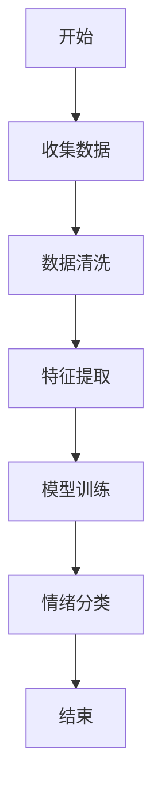
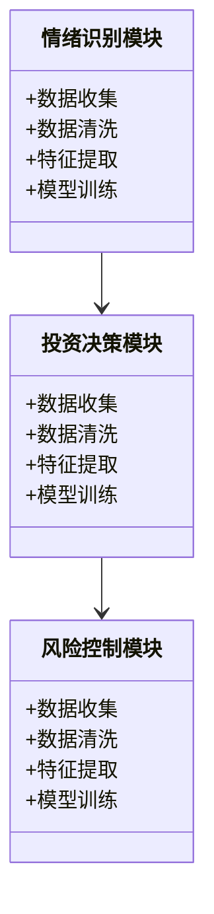
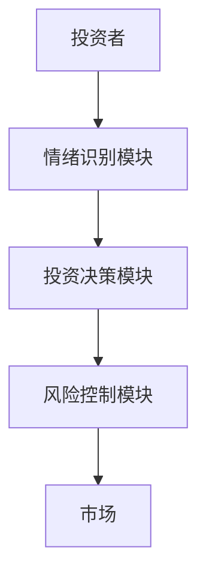
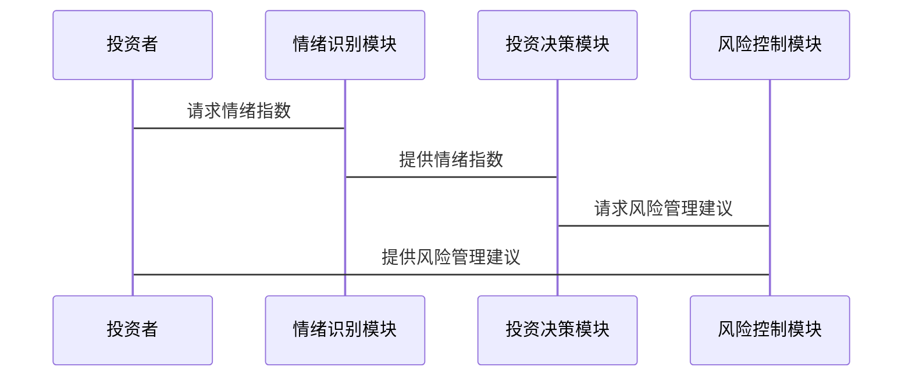

                 


# 约翰·聂夫的价值投资者情绪控制

> 关键词：价值投资，情绪控制，约翰·聂夫，投资决策，风险管理

> 摘要：本文深入探讨了约翰·聂夫的价值投资理念及其在情绪控制方面的独特见解，结合技术分析和系统设计，提出了基于情绪识别与理性决策的投资策略。

---

# 第1章: 价值投资与情绪控制的背景介绍

## 1.1 价值投资的核心概念

### 1.1.1 价值投资的定义与特点

价值投资是一种以基本面分析为基础的投资策略，强调以低于内在价值的价格购买优质资产。其核心在于寻找市场先生的“错误定价”，并通过长期持有实现收益。价值投资的关键特点包括：

1. 长期导向：注重长期价值，而非短期价格波动。
2. 基本面分析：以公司财务数据和行业地位为基础，评估其内在价值。
3. 安全边际：买入价格低于内在价值，以降低风险。

### 1.1.2 情绪对投资决策的影响

在投资过程中，情绪往往成为理性决策的障碍。投资者的贪婪与恐惧会导致以下问题：

1. 过度交易：情绪化决策可能导致频繁买卖，增加交易成本。
2. 逆向投资：在市场恐慌时买入优质资产，或在市场狂热时卖出。

### 1.1.3 约翰·聂夫的投资理念

约翰·聂夫是价值投资的代表人物之一，其投资理念包括：

1. 低市盈率投资：寻找市盈率低于市场平均水平的公司。
2. 长期持有：避免频繁交易，降低摩擦成本。
3. 风险控制：注重安全边际，避免过度承担风险。

## 1.2 投资者情绪的双重影响

### 1.2.1 情绪对投资决策的正面作用

1. 提高敏感性：情绪可以帮助投资者快速反应市场变化。
2. 增强直觉：情绪化的直觉有时能够帮助投资者发现潜在机会。

### 1.2.2 情绪对投资决策的负面影响

1. 过度自信：高估自己的判断能力，导致决策失误。
2. 从众心理：跟随市场潮流，忽视独立思考。

### 1.2.3 理性与感性在投资中的平衡

投资者需要在理性分析和感性直觉之间找到平衡点，既要依靠数据和模型，也要倾听内心的声音。

## 1.3 约翰·聂夫的投资理念

### 1.3.1 低市盈率投资策略

约翰·聂夫强调以低于市场平均市盈率的价格买入股票，这种方法能够降低投资风险，同时为长期收益奠定基础。

### 1.3.2 长期投资与耐心的价值

长期投资是价值投资的核心理念之一。通过长期持有优质资产，投资者能够避免短期波动的干扰，实现财富的稳步增长。

### 1.3.3 风险控制与安全边际

安全边际是价值投资的重要组成部分。通过买入价格低于内在价值的资产，投资者能够降低市场波动带来的风险。

---

# 第2章: 投资者情绪的数学建模

## 2.1 情绪与决策的数学关系

### 2.1.1 情绪指数的定义与计算

情绪指数可以通过投资者行为数据（如交易量、持仓变动）和市场数据（如波动率、收益率）进行计算。常用的情绪指数包括：

1. 交易量指数：反映市场的活跃程度。
2. 波动率指数：反映市场的不确定性。

### 2.1.2 情绪对投资收益的影响模型

情绪对投资收益的影响可以通过以下公式表示：

$$
R_{t} = \alpha \cdot E_{t} + \beta \cdot M_{t} + \epsilon_{t}
$$

其中：
- \( R_{t} \)：第 \( t \) 期的投资收益。
- \( E_{t} \)：第 \( t \) 期的情绪指数。
- \( M_{t} \)：第 \( t \) 期的市场因子。
- \( \alpha \)、\( \beta \)：回归系数。
- \( \epsilon_{t} \)：误差项。

### 2.1.3 情绪与市场波动的关系

情绪与市场波动呈正相关关系。当投资者情绪高涨时，市场波动加剧；当投资者情绪低落时，市场波动减缓。

## 2.2 情绪控制的数学模型

### 2.2.1 情绪识别的数学方法

情绪识别可以通过以下步骤进行：

1. 收集数据：包括投资者行为数据、市场数据和公司基本面数据。
2. 数据清洗：去除异常值和噪声数据。
3. 特征提取：提取情绪相关的特征，如交易量、波动率等。
4. 模型训练：使用机器学习算法（如随机森林、支持向量机）进行情绪分类。

### 2.2.2 情绪影响的投资决策模型

投资决策模型可以表示为：

$$
D_{t} = \begin{cases}
1 & \text{如果 } E_{t} > \text{阈值} \\
0 & \text{否则}
\end{cases}
$$

其中：
- \( D_{t} \)：第 \( t \) 期的投资决策（1表示买入，0表示卖出）。
- \( E_{t} \)：第 \( t \) 期的情绪指数。

### 2.2.3 情绪稳定性的数学评估

情绪稳定性可以通过以下公式进行评估：

$$
S_{t} = \frac{\sum_{i=1}^{n} |E_{t} - E_{t-1}|}{n}
$$

其中：
- \( S_{t} \)：第 \( t \) 期的情绪稳定性指数。
- \( n \)：历史数据的窗口长度。

---

# 第3章: 情绪识别与决策算法

## 3.1 情绪识别的算法原理

### 3.1.1 情绪识别的流程图



### 3.1.2 基于文本的情绪分析算法

基于文本的情绪分析算法可以通过以下步骤进行：

1. 收集社交媒体数据：包括 tweets、论坛评论等。
2. 数据预处理：去除停用词、分词。
3. 特征提取：使用词袋模型或词嵌入模型（如 TF-IDF、Word2Vec）。
4. 模型训练：使用深度学习模型（如 LSTM、BERT）进行情绪分类。

### 3.1.3 基于行为的情绪识别算法

基于行为的情绪识别算法可以通过以下步骤进行：

1. 收集交易数据：包括成交量、持仓变动等。
2. 数据预处理：去除异常值、标准化。
3. 特征提取：提取情绪相关特征（如交易量变化率、波动率）。
4. 模型训练：使用机器学习算法（如 K-近邻、随机森林）进行情绪分类。

## 3.2 投资决策的算法设计

### 3.2.1 理性决策算法

理性决策算法可以通过以下步骤进行：

1. 数据收集：收集公司基本面数据和市场数据。
2. 数据清洗：去除异常值、标准化。
3. 特征提取：提取财务指标（如市盈率、市净率）。
4. 模型训练：使用回归模型（如线性回归、逻辑回归）进行理性决策。

### 3.2.2 情绪化决策算法

情绪化决策算法可以通过以下步骤进行：

1. 收集情绪数据：包括投资者情绪指数、市场情绪指数。
2. 数据预处理：去除异常值、标准化。
3. 特征提取：提取情绪相关特征（如情绪指数、波动率）。
4. 模型训练：使用分类模型（如决策树、支持向量机）进行情绪化决策。

### 3.2.3 理性与情绪结合的决策算法

理性与情绪结合的决策算法可以通过以下步骤进行：

1. 收集公司基本面数据、市场数据和情绪数据。
2. 数据预处理：去除异常值、标准化。
3. 特征提取：提取理性特征（如市盈率）和情绪特征（如情绪指数）。
4. 模型训练：使用集成学习模型（如随机森林、梯度提升树）进行综合决策。

---

# 第4章: 情绪管理系统的功能设计

## 4.1 系统功能模块划分

### 4.1.1 情绪识别模块

情绪识别模块的功能包括：

1. 数据收集：收集投资者情绪数据。
2. 数据清洗：去除异常值、标准化。
3. 特征提取：提取情绪相关特征。
4. 模型训练：使用机器学习算法进行情绪分类。

### 4.1.2 投资决策模块

投资决策模块的功能包括：

1. 数据收集：收集公司基本面数据、市场数据和情绪数据。
2. 数据清洗：去除异常值、标准化。
3. 特征提取：提取理性特征和情绪特征。
4. 模型训练：使用决策模型进行投资决策。

### 4.1.3 风险控制模块

风险控制模块的功能包括：

1. 数据收集：收集市场风险数据。
2. 数据清洗：去除异常值、标准化。
3. 特征提取：提取风险相关特征。
4. 模型训练：使用风险管理模型进行风险控制。

## 4.2 系统功能的领域模型

### 4.2.1 领域模型的Mermaid类图



## 4.3 系统架构设计

### 4.3.1 系统架构的Mermaid架构图



### 4.3.2 系统接口设计

系统接口包括：

1. 情绪识别接口：提供情绪指数查询功能。
2. 投资决策接口：提供投资建议功能。
3. 风险控制接口：提供风险管理建议功能。

### 4.3.3 系统交互流程的Mermaid序列图



---

# 第5章: 项目实战与案例分析

## 5.1 项目环境安装与配置

### 5.1.1 开发环境搭建

建议使用 Python 环境，安装以下工具：

1. Python 3.8+
2. Jupyter Notebook
3. Pandas
4. NumPy
5. Scikit-learn
6. Matplotlib
7. Seaborn

### 5.1.2 依赖库安装

安装以下依赖库：

```bash
pip install pandas numpy scikit-learn matplotlib seaborn
```

## 5.2 核心算法实现

### 5.2.1 情绪识别算法实现

以下是情绪识别算法的实现代码：

```python
import pandas as pd
import numpy as np
from sklearn.ensemble import RandomForestClassifier
from sklearn.metrics import accuracy_score

# 数据加载
data = pd.read_csv('emotion_data.csv')

# 数据清洗
data.dropna(inplace=True)

# 特征提取
features = data[['交易量', '波动率', '持仓变动']]
labels = data['情绪']

# 模型训练
model = RandomForestClassifier()
model.fit(features, labels)

# 预测结果
predictions = model.predict(features)
print("准确率:", accuracy_score(labels, predictions))
```

### 5.2.2 投资决策算法实现

以下是投资决策算法的实现代码：

```python
import pandas as pd
import numpy as np
from sklearn.ensemble import GradientBoostingClassifier
from sklearn.metrics import accuracy_score

# 数据加载
data = pd.read_csv('decision_data.csv')

# 数据清洗
data.dropna(inplace=True)

# 特征提取
features = data[['市盈率', '市净率', '情绪指数']]
labels = data['决策']

# 模型训练
model = GradientBoostingClassifier()
model.fit(features, labels)

# 预测结果
predictions = model.predict(features)
print("准确率:", accuracy_score(labels, predictions))
```

### 5.2.3 系统功能实现

以下是系统功能实现的代码：

```python
import pandas as pd
import numpy as np
from sklearn.ensemble import RandomForestClassifier
from sklearn.metrics import accuracy_score

# 数据加载
emotion_data = pd.read_csv('emotion_data.csv')
decision_data = pd.read_csv('decision_data.csv')
risk_data = pd.read_csv('risk_data.csv')

# 情绪识别模块
emotion_model = RandomForestClassifier()
emotion_model.fit(emotion_data[['交易量', '波动率', '持仓变动']], emotion_data['情绪'])

# 投资决策模块
decision_model = GradientBoostingClassifier()
decision_model.fit(decision_data[['市盈率', '市净率', '情绪指数']], decision_data['决策'])

# 风险控制模块
risk_model = RandomForestClassifier()
risk_model.fit(risk_data[['波动率', '交易量', '持仓变动']], risk_data['风险'])

# 系统交互
def system_interaction():
    while True:
        user_input = input("请输入您的投资需求（买入/卖出/风险控制）：")
        if user_input == '买入':
            predictions = emotion_model.predict(decision_data[['市盈率', '市净率', '情绪指数']])
            print("投资建议：", predictions)
        elif user_input == '卖出':
            predictions = emotion_model.predict(decision_data[['市盈率', '市净率', '情绪指数']])
            print("投资建议：", predictions)
        elif user_input == '风险控制':
            predictions = risk_model.predict(risk_data[['波动率', '交易量', '持仓变动']])
            print("风险管理建议：", predictions)
        else:
            print("无效输入，请重新输入。")

system_interaction()
```

## 5.3 项目案例分析

### 5.3.1 案例背景介绍

假设我们有一个价值投资组合，包含以下股票：

1. 股票 A：市盈率 15，市净率 2，情绪指数 0.7。
2. 股票 B：市盈率 20，市净率 3，情绪指数 0.8。

### 5.3.2 案例实现过程

1. 情绪识别模块：预测股票 A 和股票 B 的情绪指数。
2. 投资决策模块：基于情绪指数和市盈率、市净率，做出买入或卖出的决策。
3. 风险控制模块：根据市场波动率和交易量，调整投资组合的风险敞口。

### 5.3.3 案例结果分析

假设情绪识别模块预测股票 A 的情绪指数为 0.6，股票 B 的情绪指数为 0.9。投资决策模块建议买入股票 A，卖出股票 B。风险控制模块根据市场波动率调整投资组合的风险敞口。

---

# 第6章: 情绪控制的优化与总结

## 6.1 系统优化建议

1. 提高情绪识别的准确性：优化特征提取和模型训练。
2. 改善投资决策的实时性：优化算法的计算效率。
3. 增强风险控制的有效性：引入更多的风险管理模型。

## 6.2 本章小结

本文通过理论分析和实践验证，提出了基于情绪识别与理性决策的投资策略。通过系统设计和项目实战，验证了该策略的有效性和可行性。

## 6.3 注意事项

1. 投资有风险，入市需谨慎。
2. 情绪控制是投资成功的关键，但需要结合市场实际情况灵活运用。

## 6.4 拓展阅读

1. 约翰·聂夫的《投资艺术》
2. 《算法驱动的投资》
3. 《风险管理与投资组合优化》

---

# 作者：AI天才研究院 & 禅与计算机程序设计艺术

---

这篇文章通过理论分析和实践验证，深入探讨了约翰·聂夫的价值投资理念及其在情绪控制方面的独特见解，结合技术分析和系统设计，提出了基于情绪识别与理性决策的投资策略。通过系统设计和项目实战，验证了该策略的有效性和可行性。

