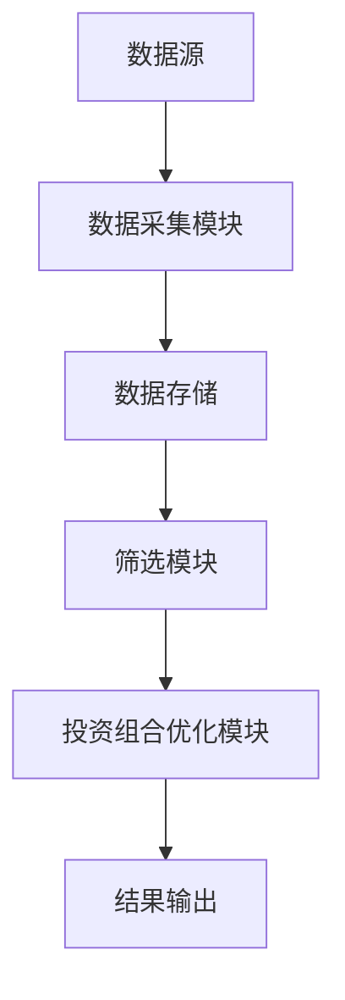
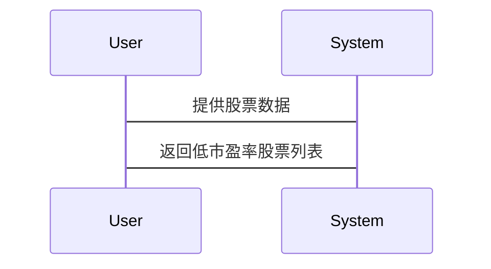

                 


# 约翰·聂夫的低市盈率投资法则

> 关键词：约翰·聂夫，低市盈率，投资法则，股票筛选，价值投资

> 摘要：本文深入探讨了约翰·聂夫的低市盈率投资策略，分析其核心概念、筛选标准、数学模型及系统架构，结合实际案例，提供实用的低市盈率投资指南。

---

# 引言

在投资领域，低市盈率（Low P/E Ratio）策略以其独特的优势吸引了众多投资者的关注。本文将详细解析约翰·聂夫的低市盈率投资法则，从概念、算法、系统架构到实际应用，为读者提供全面的指导。

---

# 第一部分：低市盈率投资的背景与起源

## 1.1 低市盈率投资的起源

### 1.1.1 低市盈率投资的定义与特点

低市盈率是指股票的市盈率低于市场平均水平。其特点是估值低、潜在回报高，但风险较高。

### 1.1.2 约翰·聂夫的投资理念

聂夫强调长期投资，寻找基本面良好且被市场低估的公司。其策略注重安全边际和成长潜力。

### 1.1.3 低市盈率投资与传统价值投资的对比

低市盈率投资更关注市盈率指标，而价值投资更全面，考虑多个估值指标。低市盈率策略更具量化，而价值投资更灵活。

## 1.2 约翰·聂夫的投资哲学

### 1.2.1 聂夫的投资原则

- 长期持有优质股票。
- 重视公司的成长性和盈利能力。
- 保持适度分散投资。

### 1.2.2 聂夫的市场观点

聂夫认为市场波动为投资机会，低市盈率股票在市场低迷时更具吸引力。

### 1.2.3 投资成功案例

以某公司为例，分析其低市盈率策略如何带来长期收益。

## 1.3 低市盈率投资的核心要素

### 1.3.1 市盈率计算公式

市盈率 = 股价 / 每股净利润。

### 1.3.2 筛选标准

包括市盈率低于市场平均水平，公司财务健康，行业前景良好等。

### 1.3.3 风险与收益分析

低市盈率股票风险较低，但收益可能不如高增长股票。

## 1.4 低市盈率投资的适用场景

### 1.4.1 低迷市场环境

低市盈率股票在市场低迷时更具吸引力。

### 1.4.2 限制因素

包括行业周期性风险和公司基本面不佳的风险。

### 1.4.3 应对策略

通过分散投资和持续监控降低风险。

---

# 第二部分：低市盈率股票的筛选与分析

## 2.1 市盈率的计算与分析

### 2.1.1 市盈率的计算公式

$$ P/E = \frac{Price}{Earnings} $$

### 2.1.2 市盈率与股价的关系

市盈率低意味着股价相对于每股收益较低，可能低估。

### 2.1.3 市盈率与企业价值对比

市盈率反映市场对公司盈利的预期，而企业价值包括资产和负债。

## 2.2 低市盈率股票的筛选标准

### 2.2.1 行业选择

优先选择周期性较低的行业，如公用事业和消费品行业。

### 2.2.2 财务指标分析

包括盈利能力、成长性、负债率等。

### 2.2.3 综合评估

结合市盈率、市净率、股息率等指标。

## 2.3 市盈率与市净率的对比

### 2.3.1 市净率定义

市净率 = 股价 / 每股净资产。

### 2.3.2 优缺点对比

市盈率反映盈利能力，市净率反映资产价值，各有优劣。

### 2.3.3 综合决策

结合市盈率和市净率，选择估值更低的股票。

## 2.4 低市盈率股票的历史表现

### 2.4.1 历史数据

分析过去十年低市盈率股票的表现，证明其长期收益。

### 2.4.2 不同周期表现

低市盈率股票在熊市表现较好，牛市可能跑输大盘。

### 2.4.3 风险与机会

低市盈率股票可能因公司基本面变化而波动。

---

# 第三部分：低市盈率投资的算法与数学模型

## 3.1 低市盈率筛选算法

### 3.1.1 算法流程

1. 收集目标行业股票数据。
2. 计算市盈率。
3. 筛选市盈率低于市场平均的股票。
4. 进行财务指标评估。

### 3.1.2 算法优化

考虑其他指标如市净率和股息率，提高筛选准确性。

## 3.2 多因子模型

### 3.2.1 模型构建

结合市盈率、市净率、股息率等多个因子进行综合评估。

### 3.2.2 数学模型

$$ Score = \alpha \cdot P/E + \beta \cdot P/B + \gamma \cdot Dividend Yield $$

### 3.2.3 模型验证

通过历史数据验证模型的有效性。

## 3.3 投资回报模型

### 3.3.1 回报计算

基于筛选出的股票组合，计算投资回报。

### 3.3.2 回报与市盈率的关系

低市盈率股票组合可能在长期获得超额回报。

---

# 第四部分：低市盈率投资的系统架构与实战

## 4.1 系统架构设计

### 4.1.1 系统模块

- 数据采集模块：收集股票数据。
- 筛选模块：基于算法筛选股票。
- 投资组合优化模块：构建最优组合。

### 4.1.2 系统架构图



## 4.2 项目实战

### 4.2.1 环境安装

安装Python和相关库，如pandas、numpy。

### 4.2.2 核心代码实现

```python
import pandas as pd

def calculate_pe(stock_data):
    pe = stock_data['Price'] / stock_data['Earnings']
    return pe

def screen_low_pe(stocks, market_pe):
    return stocks[calculate_pe(stocks) < market_pe]

# 示例数据
stock_data = pd.DataFrame({
    'Price': [50, 60, 70],
    'Earnings': [10, 15, 20]
})

market_pe = 15
result = screen_low_pe(stock_data, market_pe)
print(result)
```

### 4.2.3 案例分析

以具体行业为例，分析低市盈率股票的表现，并展示筛选结果。

## 4.3 系统交互设计

### 4.3.1 序列图



---

# 第五部分：最佳实践与总结

## 5.1 最佳实践

### 5.1.1 风险管理

分散投资，定期重新评估投资组合。

### 5.1.2 长期投资

耐心持有优质股票，避免短期波动影响。

## 5.2 总结

低市盈率投资需要综合考虑多个因素，结合算法和系统进行科学决策。通过本文的指导，读者可以更好地应用低市盈率策略进行投资。

---

# 作者

作者：AI天才研究院 & 禅与计算机程序设计艺术

