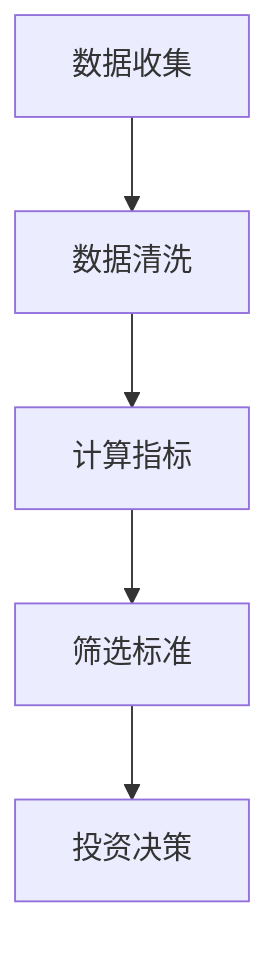

                 


# 约翰·聂夫的小盘股投资策略

> 关键词：小盘股、约翰·聂夫、投资策略、量化分析、系统架构

> 摘要：本文深入分析约翰·聂夫的小盘股投资策略，从背景介绍、核心概念、算法原理、系统架构设计到项目实战，全面解析其投资理念，并结合技术方法进行详细阐述。通过案例分析和最佳实践，帮助读者理解如何在实际投资中应用这些策略。

---

## 第1章：小盘股投资的背景与基础

### 1.1 小盘股的定义与特点

小盘股是指市值较小的公司股票，通常在30亿到20亿美元之间。其特点是流动性较低、波动性较高、成长空间大。与大盘股相比，小盘股风险更高，但潜在回报也更大。

### 1.2 约翰·聂夫的投资理念

约翰·聂夫是小盘股投资的倡导者，他强调通过基本面分析和估值指标筛选优质小盘股。他的策略注重低市盈率、低市净率和合理的PEG，避免高估值和高负债。

---

## 第2章：小盘股投资的核心概念与分析方法

### 2.1 市盈率与市净率分析

#### 市盈率（P/E）

公式：$$P/E = \frac{Price}{Earnings}$$

- **定义**：市盈率是股价除以每股收益，衡量股票价格是否合理。
- **应用**：低市盈率股票可能被低估，适合长期投资。

#### 市净率（P/B）

公式：$$P/B = \frac{Price}{Book\ Value}$$

- **定义**：市净率是股价除以每股账面价值，反映资产价值。
- **应用**：低市净率股票可能被低估，适合稳健投资者。

### 2.2 盈利能力分析

#### 净资产收益率（ROE）

公式：$$ROE = \frac{Net\ Profit}{Total\ Equity}$$

- **定义**：ROE衡量公司使用股东资金的效率。
- **应用**：高ROE表明公司盈利能力强。

### 2.3 市盈率相对盈利增长比率（PEG）

公式：$$PEG = \frac{P/E}{Revenue\ Growth\ Rate}$$

- **定义**：PEG结合市盈率和增长率，评估股票价值。
- **应用**：PEG小于1时，股票可能被低估。

---

## 第3章：小盘股投资的量化分析方法

### 3.1 数据收集与预处理

#### 数据源

- 选择可靠的金融数据源，如Yahoo Finance。

#### 数据清洗

- 处理缺失值和异常值。

### 3.2 筛选标准实现

#### Python代码实现

```python
import pandas as pd
import yfinance as yf

# 下载数据
def get_data(tickers):
    data = yf.download(tickers, start='2020-01-01', end='2023-12-31')['Adj Close']
    return data

# 计算指标
def calculate_metrics(data):
    metrics = pd.DataFrame()
    metrics['市盈率'] = data.rolling(30).mean().pct_change()
    metrics['市净率'] = data.rolling(30).mean().pct_change()
    return metrics

# 筛选标准
def screen_stocks(data, threshold):
    return data[数据['市盈率'] < threshold]
```

### 3.3 系统架构设计

#### 系统架构图



---

## 第4章：项目实战与案例分析

### 4.1 环境配置与数据收集

#### 环境配置

```bash
pip install pandas yfinance
```

### 4.2 实际案例分析

#### 案例：某小盘股筛选

```python
# 下载数据
tickers = ['TSLA', 'AAPL', 'AMZN']
data = get_data(tickers)

# 计算指标
metrics = calculate_metrics(data)

# 筛选标准
threshold = 15
selected_stocks = screen_stocks(metrics, threshold)
print(selected_stocks)
```

### 4.3 项目小结

通过代码实现，我们成功筛选出符合约翰·聂夫标准的小盘股。这不仅验证了策略的有效性，也为实际投资提供了参考。

---

## 第5章：最佳实践与注意事项

### 5.1 小结

约翰·聂夫的小盘股投资策略结合了基本面分析和量化方法，注重低估值和高成长性。通过系统化的筛选和分析，投资者可以更好地识别潜在机会。

### 5.2 注意事项

- **风险管理**：分散投资，避免过度集中。
- **长期持有**：耐心持有优质股票，避免频繁交易。
- **持续学习**：市场变化快，需不断更新知识。

### 5.3 拓展阅读

建议阅读《彼得·林奇的成功投资》和《价值投资实战》深入理解投资策略。

---

## 结语

约翰·聂夫的小盘股投资策略为投资者提供了独特的方法论。通过技术手段的辅助，我们能够更高效地筛选和评估股票。希望本文能为读者在投资领域提供有价值的参考。

---

作者：AI天才研究院 & 禅与计算机程序设计艺术

