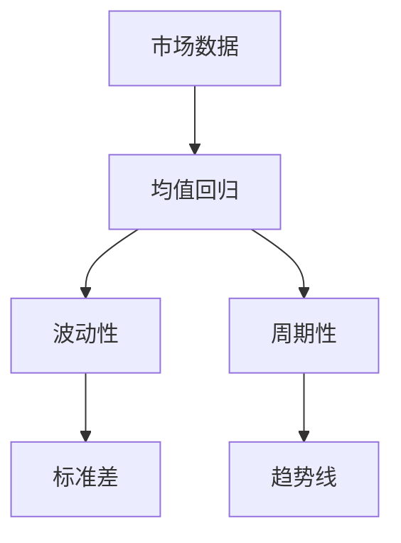
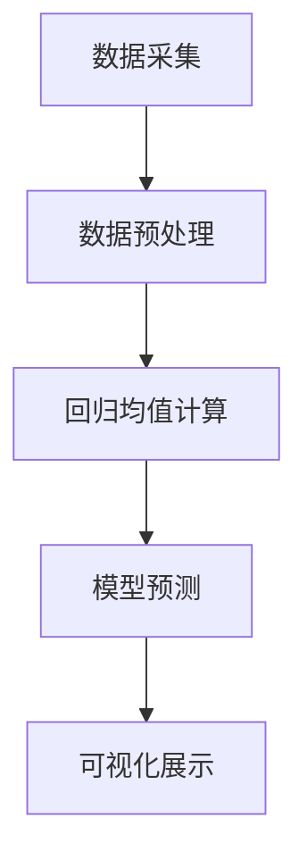
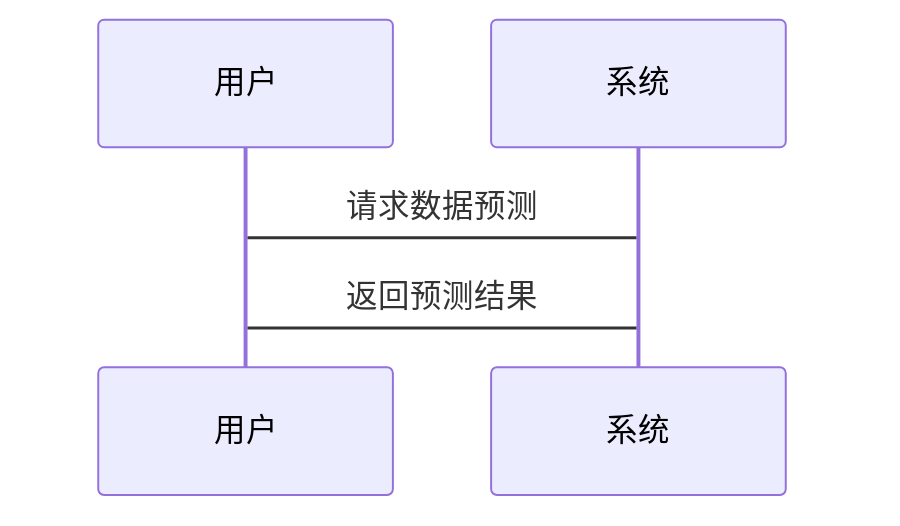

                 


```markdown
# 约翰伯格的回归均值理论：市场长期的自我修正

> 关键词：回归均值理论，市场自我修正，统计套利，时间序列分析，金融市场，均值回归

> 摘要：本文深入探讨了约翰伯格提出的回归均值理论，分析其在金融市场中的应用及其对市场长期自我修正机制的影响。通过结合统计学、时间序列分析和系统设计，本文详细阐述了回归均值理论的核心原理、算法实现、系统架构及实际案例，为读者提供全面而深入的理解。

---

## 第一部分: 回归均值理论的背景与概念

### 第1章: 回归均值理论的背景与概念

#### 1.1 回归均值理论的定义
- **1.1.1 什么是回归均值**
  回归均值是一种统计学概念，指变量在偏离其长期均值后，会逐渐回归到该均值。在金融市场中，这表现为价格波动后趋向于长期平均值。
  
- **1.1.2 约翰伯格的理论贡献**
  约翰伯格提出，市场存在自我修正机制，价格波动会趋向于长期均值，这种理论为统计套利和投资策略提供了基础。

- **1.1.3 市场自我修正机制的定义**
  市场自我修正机制指市场通过波动和调整，逐步回归到长期均衡状态，反映在价格上即为回归均值现象。

#### 1.2 回归均值理论的数学基础
- **1.2.1 均值回归的数学表达式**
  回归均值的数学模型通常表示为：
  $$ y_t = \beta y_{t-1} + \epsilon_t $$
  其中，$\beta$ 是回归系数，$\epsilon_t$ 是误差项。

- **1.2.2 随机游走与均值回归的区别**
  随机游走假设价格变化无记忆，而均值回归则认为价格趋向于长期均值，两者在模型假设和预测准确性上有显著差异。

- **1.2.3 回归均值理论的核心假设**
  理论假设市场存在长期均值，并且价格波动围绕该均值对称分布。

#### 1.3 回归均值理论的应用领域
- **1.3.1 金融市场中的应用**
  用于股票价格、汇率等预测，指导投资策略制定。
  
- **1.3.2 统计学中的应用**
  用于数据分析，识别数据的回归趋势和异常值。
  
- **1.3.3 经济学中的应用**
  分析经济指标波动，如GDP、失业率等，预测经济周期。

---

## 第二部分: 回归均值理论的核心概念与联系

### 第2章: 回归均值理论的核心概念与联系

#### 2.1 回归均值理论的核心原理
- **2.1.1 随机变量的均值回归**
  随机变量在多次观测后，其平均值会趋向于理论均值。
  
- **2.1.2 时间序列分析中的回归均值**
  在时间序列数据中，回归均值用于分析数据的长期趋势和短期波动。

- **2.1.3 回归均值与市场波动的关系**
  市场波动是价格偏离均值的结果，回归均值理论预测波动会逐渐减弱，回归长期均值。

#### 2.2 回归均值理论的核心属性对比
- **2.2.1 回归均值与标准差的对比**
  回归均值关注位置，标准差关注分布的离散程度，两者共同描述数据特征。

- **2.2.2 回归均值与趋势线的对比**
  回归均值是静态的长期平均值，趋势线是动态的短期方向，两者结合分析长期和短期趋势。

- **2.2.3 回归均值与市场周期的对比**
  回归均值关注长期平均值，市场周期关注波动周期，两者结合分析市场周期性波动。

#### 2.3 回归均值理论的ER实体关系图


---

## 第三部分: 回归均值理论的算法原理

### 第3章: 回归均值理论的算法原理

#### 3.1 回归均值算法的实现步骤
- **3.1.1 数据预处理**
  清洗数据，处理缺失值，标准化数据，确保数据适合建模。

- **3.1.2 模型构建**
  使用线性回归模型，拟合数据，计算回归系数和截距。

- **3.1.3 模型评估**
  通过R平方值、残差分析等方法评估模型拟合效果。

- **3.1.4 模型优化**
  调整模型参数，优化回归系数，提高预测精度。

#### 3.2 回归均值算法的数学模型
- **3.2.1 均值回归的数学公式**
  $$ y_t = \beta y_{t-1} + \epsilon_t $$
  其中，$\beta$ 是回归系数，$\epsilon_t$ 是误差项。

- **3.2.2 回归系数的估计**
  $$ \hat{\beta} = \frac{\sum (y_t - \bar{y})(y_{t-1} - \bar{y})}{\sum (y_{t-1} - \bar{y})^2} $$

#### 3.3 回归均值算法的Python实现
```python
import numpy as np
from statsmodels.tsa.ar_model import AR

# 生成模拟数据
np.random.seed(42)
data = np.random.normal(0, 1, 100)

# 训练模型
model = AR(data)
model_fit = model.fit(maxlags=40)

# 预测下一个值
print(model_fit.predict(nsteps=1))
```

---

## 第四部分: 回归均值理论的系统架构设计

### 第4章: 回归均值理论的系统架构设计

#### 4.1 问题场景介绍
- 系统目标：利用回归均值理论，构建市场自我修正机制的预测模型。
- 项目背景：金融市场中，价格波动趋向于长期均值，回归均值理论为投资决策提供支持。

#### 4.2 系统功能设计
- 数据采集模块：实时采集市场数据。
- 数据预处理模块：清洗和标准化数据。
- 回归均值计算模块：计算数据的长期均值。
- 模型预测模块：预测价格趋向于均值的过程。
- 可视化模块：展示数据和预测结果。

#### 4.3 系统架构图


#### 4.4 系统接口设计
- 数据接口：提供API接口，接收市场数据。
- 预测接口：返回预测结果，供其他系统调用。

#### 4.5 系统交互流程图


---

## 第五部分: 回归均值理论的项目实战

### 第5章: 回归均值理论的项目实战

#### 5.1 项目环境搭建
- 安装Python和相关库（如numpy, pandas, statsmodels）。

#### 5.2 系统核心实现源代码
```python
import numpy as np
import pandas as pd
from statsmodels.tsa.ar_model import AR

# 数据加载
data = pd.read_csv('market_data.csv')

# 数据预处理
data = data['price'].values

# 训练模型
model = AR(data)
model_fit = model.fit(maxlags=40)

# 预测未来10天的价格
predictions = model_fit.predict(nsteps=10)
print(predictions)
```

#### 5.3 代码应用解读与分析
- 数据加载：从CSV文件中读取市场数据。
- 数据预处理：提取价格数据，准备模型训练。
- 模型训练：使用AR模型拟合数据，计算回归系数。
- 模型预测：预测未来的价格，输出结果。

#### 5.4 实际案例分析
- 案例背景：分析某股票的历史价格数据，预测未来价格。
- 数据分析：计算回归均值，观察价格趋向于均值的趋势。
- 结果展示：绘制价格走势和预测结果，验证理论的准确性。

#### 5.5 项目小结
- 项目目标：利用回归均值理论，构建市场预测模型。
- 项目成果：实现了一个基于回归均值的市场预测系统，验证了理论的有效性。

---

## 第六部分: 总结与展望

### 第6章: 总结与展望

#### 6.1 核心内容回顾
- 回归均值理论的定义、背景和应用。
- 理论在金融市场中的实际应用，如统计套利和投资决策。

#### 6.2 最佳实践 tips
- 数据预处理是关键，确保数据质量。
- 模型选择和优化影响预测精度，需谨慎处理。
- 结合实际市场情况，调整模型参数，提高预测准确性。

#### 6.3 未来研究方向
- 结合机器学习，提高回归均值模型的预测能力。
- 研究多变量回归均值模型，分析复杂市场环境。
- 探索回归均值理论在其他领域的应用，如经济预测和社会学分析。

---

## 作者：AI天才研究院/AI Genius Institute & 禅与计算机程序设计艺术 /Zen And The Art of Computer Programming

---

### 附录：回归均值理论的数学推导

回归均值理论的数学推导基于时间序列分析，假设价格服从一阶自回归模型：
$$ y_t = \beta y_{t-1} + \epsilon_t $$
其中，$\epsilon_t$ 是白噪声。通过估计回归系数 $\hat{\beta}$，我们可以预测未来的价格：
$$ \hat{y}_{t+1} = \hat{\beta} y_t $$

---

### 参考文献
1. 约翰伯格的原著《市场波动》。
2. 时间序列分析相关文献。
3. 统计套利的经典教材。

---

通过本文的详细阐述，读者可以全面理解约翰伯格的回归均值理论，并将其应用于实际的市场分析和投资决策中。
```

