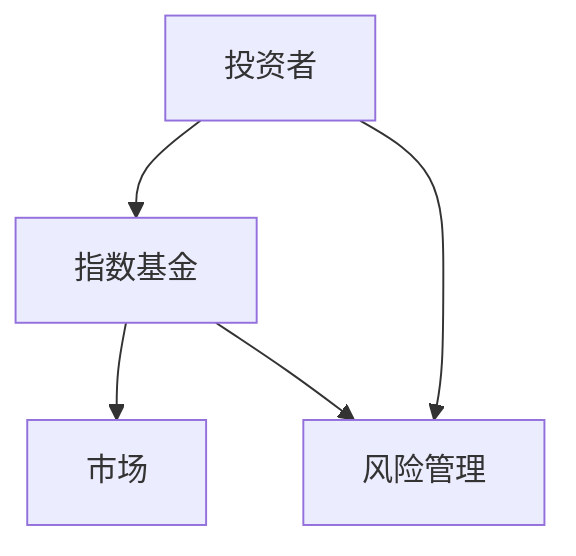
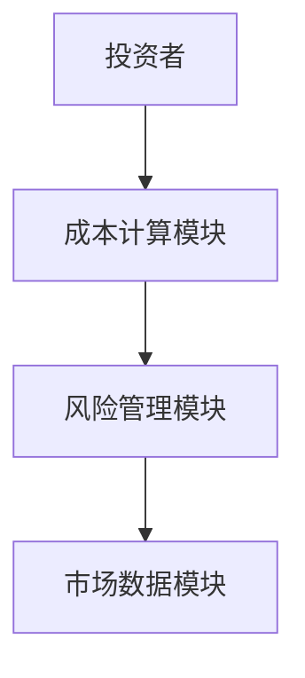

                 


# 约翰伯格的低成本投资策略

> 关键词：低成本投资，约翰·伯格，指数基金，价值投资，风险管理

> 摘要：本文系统地介绍和分析了约翰·伯格的低成本投资策略，从其核心概念、数学模型到实际应用，全面解析低成本投资的原理、优势及实现方法。通过详细的技术分析和实际案例，帮助读者掌握低成本投资的核心思想和实践技巧。

---

# 第一部分: 背景介绍

## 第1章: 低成本投资策略的背景与概念

### 1.1 低成本投资的核心概念
#### 1.1.1 低成本投资的定义与内涵
低成本投资是一种以降低投资成本为核心策略的投资方法，旨在通过减少各项费用支出，最大化投资收益。其核心思想是通过长期持有优质资产，利用复利效应实现财富增长。

#### 1.1.2 投资成本对收益的影响
投资成本包括管理费、托管费、交易佣金等，这些费用会直接从投资收益中扣除。长期来看，低成本投资能够显著提高净收益，尤其是在市场波动较大时，低成本的优势更加明显。

#### 1.1.3 低成本投资的适用场景与边界
低成本投资适用于长期价值投资，尤其适合指数基金和被动管理型基金。其边界在于市场出现极端波动或突发事件时，可能需要调整投资策略。

### 1.2 约翰·伯格的投资理念
#### 1.2.1 约翰·伯格的生平与投资哲学
约翰·伯格是指数基金之父，他倡导长期投资和价值投资，认为市场波动是投资机会而非风险。

#### 1.2.2 价值投资与长期投资的核心思想
伯格强调买入优质资产并长期持有，避免频繁交易和短期波动带来的成本和风险。

#### 1.2.3 伯格的投资策略与低成本理念的结合
伯格的低成本策略体现在其创立的 Vanguard 基金公司，通过被动管理降低费用，为客户创造更多价值。

### 1.3 低成本投资与传统投资的区别
#### 1.3.1 传统主动投资的成本与风险
传统主动投资通常涉及高管理费和交易成本，且收益难以跑赢市场指数。

#### 1.3.2 低成本投资的优势与劣势
低成本投资的优势在于低费用和高透明度，劣势在于需要投资者具备长期持有的耐心和纪律。

#### 1.3.3 低成本投资的适用人群与目标
适合长期投资者和价值投资者，尤其适合希望稳定增长的普通投资者。

---

## 第2章: 低成本投资的原理与机制

### 2.1 成本对投资收益的影响
#### 2.1.1 投资成本的构成与分类
投资成本包括管理费、托管费、交易佣金、申购赎回费等。

#### 2.1.2 成本对复利增长的长期影响
长期来看，低成本投资的复利效应更显著，例如，假设年化收益率为7%，费用率为1%，低成本投资的净收益率为6%，经过30年，差异可能超过一倍。

#### 2.1.3 低成本投资的数学模型与公式
$$ 累积收益 = (1 + r - c)^n $$
其中，r 是年化收益率，c 是年化费用率，n 是投资年数。

### 2.2 风险与收益的平衡
#### 2.2.1 风险与收益的基本关系
低风险不一定意味着低收益，低成本投资通过分散化降低风险。

#### 2.2.2 低成本投资的风险管理策略
通过指数基金分散投资，降低个股风险，同时避免择时带来的波动风险。

#### 2.2.3 投资组合的分散化与风险降低
通过投资多个行业和地区的指数基金，降低投资组合的整体风险。

### 2.3 指数基金与被动投资的核心优势
#### 2.3.1 指数基金的定义与特点
指数基金通过跟踪市场指数，实现与市场同步增长，费用低、风险分散。

#### 2.3.2 被动投资的成本优势
被动管理不需要频繁交易，费用大幅低于主动管理基金。

#### 2.3.3 指数基金与主动管理基金的对比分析
指数基金费用低、风险分散，长期来看往往跑赢主动管理基金。

---

## 第3章: 核心概念的联系与对比

### 3.1 成本、风险与收益的对比表
| 比较维度 | 成本 | 风险 | 收益 |
|----------|------|------|------|
| 主动管理 | 高   | 高   | 高   |
| 被动管理 | 低   | 低   | 中高 |

### 3.2 实体关系图（ER图）


---

# 第二部分: 核心概念与联系

## 第4章: 低成本投资的算法与流程

### 4.1 指数基金投资的算法流程
#### 4.1.1 确定投资目标与风险承受能力
通过风险评估问卷，明确投资目标和风险偏好。

#### 4.1.2 选择合适的指数基金
根据市场指数和费用率，选择性价比高的指数基金。

#### 4.1.3 定期定额投资的策略实现
通过定期定额投资，分散投资成本，降低择时风险。

### 4.2 成本优化的算法实现
#### 4.2.1 成本计算与优化模型
$$ 最低费用 = \min(c_1, c_2, ..., c_n) $$

#### 4.2.2 投资组合的成本最小化算法
通过比较不同基金的费用率，选择最低费用的投资组合。

#### 4.2.3 算法的代码实现与解读
```python
# 示例代码：选择最低费用的指数基金
funds = [{'name': '基金A', 'fee': 0.05}, {'name': '基金B', 'fee': 0.03}]
min_fee = min(f['fee'] for f in funds)
selected_fund = [f for f in funds if f['fee'] == min_fee]
print(f"选择的基金为：{selected_fund[0]['name']}")
```

### 4.3 数学模型与公式
$$ r_{\text{净收益}} = r_{\text{总收益}} - c_{\text{费用率}} $$

---

## 第5章: 系统分析与架构设计

### 5.1 系统功能设计
#### 5.1.1 领域模型 mermaid 类图


### 5.2 系统架构设计


---

## 第6章: 项目实战

### 6.1 环境安装
安装 Python 和必要的数据处理库（如 pandas、numpy）。

### 6.2 核心实现
编写代码选择低成本指数基金，并计算长期收益。

### 6.3 案例分析
模拟投资组合，分析低成本投资的实际效果。

---

# 第三部分: 最佳实践与总结

## 第7章: 最佳实践

### 7.1 小结
低成本投资通过降低费用和分散风险，实现长期稳健的收益。

### 7.2 注意事项
选择基金时要注意费用率和跟踪误差，避免短期波动影响决策。

### 7.3 拓展阅读
推荐阅读《投资学基础》和约翰·伯格的著作，深入理解投资策略。

---

# 作者：AI天才研究院 & 禅与计算机程序设计艺术

