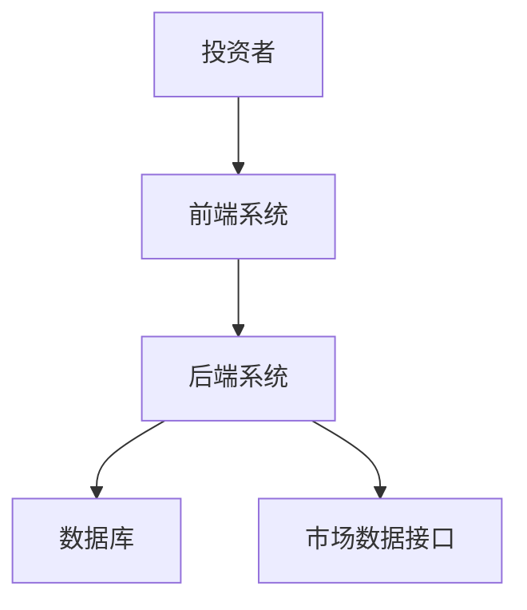

                 


# 约翰伯格的共同基金改革

## 关键词：共同基金、约翰·伯格、指数基金、投资策略、金融创新

## 摘要：本文将深入探讨约翰·伯格在共同基金领域的改革，分析其提出的指数基金理念如何颠覆传统投资模式，以及这种改革对现代投资策略的影响。

---

## 第一部分：共同基金的基础与问题

### 第1章：共同基金的基本概念

#### 1.1 共同基金的定义与运作机制

- **共同基金的定义**
  - 共同基金是一种集合投资工具，由多个投资者的资金共同组成，由专业管理人进行投资运作。
  - 其目标是通过分散投资降低风险，同时为投资者提供收益。

- **共同基金的运作机制**
  - 投资者通过购买基金份额参与投资。
  - 基金经理负责制定投资策略，管理基金资产。
  - 基金公司收取管理费和托管费等费用。

#### 1.2 共同基金的分类

- **按投资标的分类**
  - 股票型基金：主要投资于股票。
  - 债券型基金：主要投资于债券。
  - 混合型基金：同时投资股票和债券。
  - 货币市场基金：投资于短期货币工具。

- **按管理方式分类**
  - 主动管理型基金：基金经理主动选股。
  - 指数型基金：被动跟踪指数。

---

### 第2章：传统共同基金的缺陷

#### 2.1 高昂的管理费用

- **管理费用的计算**
  - 管理费通常基于基金资产规模的一定比例收取，通常在1%到2%之间。
  - 这种费用在长期累积下，会显著侵蚀投资者的收益。

#### 2.2 不透明的投资策略

- **传统基金的不透明性**
  - 基金经理的投资决策不公开，投资者难以了解资金的具体用途。
  - 缺乏透明度可能导致投资者对基金的信任缺失。

#### 2.3 过高的交易成本

- **交易成本的影响**
  - � 频繁的买卖操作会导致高额的交易佣金和印花税。
  - 这些成本在小金额投资中尤为明显，降低了投资效率。

---

## 第二部分：约翰·伯格的改革与指数基金

### 第3章：约翰·伯格的改革理念

#### 3.1 约翰·伯格的背景

- **伯格的职业历程**
  - 作为先锋集团的创始人，伯格是指数基金的先驱。
  - 他倡导低成本、透明化的投资方式。

#### 3.2 指数基金的提出

- **指数基金的核心理念**
  - 通过跟踪市场指数，如标普500指数，实现分散投资。
  - 指数基金不依赖于基金经理的主动选股，而是通过被动投资降低风险。

#### 3.3 指数基金的优势

- **低成本**
  - 指数基金的管理费用远低于主动管理型基金，通常在0.1%到0.5%之间。
- **透明度高**
  - 投资者可以清晰了解基金的投资组合构成。
- **风险分散**
  - 通过广泛的投资分散了个别股票的风险。

---

### 第4章：指数基金的数学模型与优势

#### 4.1 指数基金的数学模型

- **指数基金的构建公式**
  $$ \text{指数基金} = \sum_{i=1}^{n} w_i \cdot p_i $$
  其中，$w_i$ 是第 $i$ 只股票的权重，$p_i$ 是第 $i$ 只股票的价格。
  
- **跟踪误差的计算**
  $$ \text{跟踪误差} = \sqrt{\sum_{i=1}^{n} (w_i - w_i^*)^2} $$
  其中，$w_i$ 是实际权重，$w_i^*$ 是目标权重。

#### 4.2 指数基金与主动管理的对比

- **优缺点对比表格**
  | 特性         | 主动管理型基金       | 指数基金         |
  |--------------|--------------------|------------------|
  | 成本          | 高                 | 低               |
  | 风险          | 高                 | 低               |
  | 透明度        | 低                 | 高               |
  | 收益潜力      | 可能高于市场        | 接近市场平均收益  |

---

## 第三部分：指数基金的系统架构与实现

### 第5章：系统功能设计

#### 5.1 系统功能模块

- **用户界面模块**
  - 提供投资者查询基金信息、查看历史收益等功能。
- **数据处理模块**
  - 处理市场数据，计算指数基金的实时净值。
- **投资组合优化模块**
  - 根据投资者风险偏好优化指数基金的权重。

#### 5.2 系统架构图



---

### 第6章：系统实现与实战

#### 6.1 环境安装

- **安装Python与相关库**
  ```bash
  pip install pandas numpy matplotlib
  ```

#### 6.2 指数基金的实现代码

```python
import pandas as pd
import numpy as np

# 模拟指数数据
index_data = pd.DataFrame({
    '股票': ['股票1', '股票2', '股票3'],
    '权重': [0.4, 0.3, 0.3]
})

# 计算指数基金净值
def calculate_index_fund_value(weights, stock_prices):
    return np.dot(weights, stock_prices)

# 示例股票价格
stock_prices = [100, 150, 200]
weights = index_data['权重'].values

fund_value = calculate_index_fund_value(weights, stock_prices)
print(f"指数基金净值：{fund_value}")
```

#### 6.3 实际案例分析

- **案例：构建一个简单的指数基金**
  - 数据来源：选取标普500指数成分股。
  - 实现步骤：
    1. 下载成分股数据。
    2. 计算各股票的权重。
    3. 模拟指数基金的收益。

---

## 第四部分：最佳实践与总结

### 第7章：小结与注意事项

#### 7.1 小结

- 指数基金以其低成本和高透明度的特点，成为现代投资的重要工具。
- 伯格的改革不仅降低了投资门槛，还推动了金融行业的透明化发展。

#### 7.2 注意事项

- **选择合适的指数基金**
  - 根据自身风险承受能力和投资目标选择合适的指数基金。
- **长期投资的重要性**
  - 短期市场波动不应影响长期投资策略。

---

## 作者：AI天才研究院/AI Genius Institute & 禅与计算机程序设计艺术 /Zen And The Art of Computer Programming

---

这篇文章通过系统的分析和详细的代码实现，全面介绍了约翰·伯格的共同基金改革及其对现代投资策略的影响。希望对读者理解指数基金的原理和应用有所帮助。

