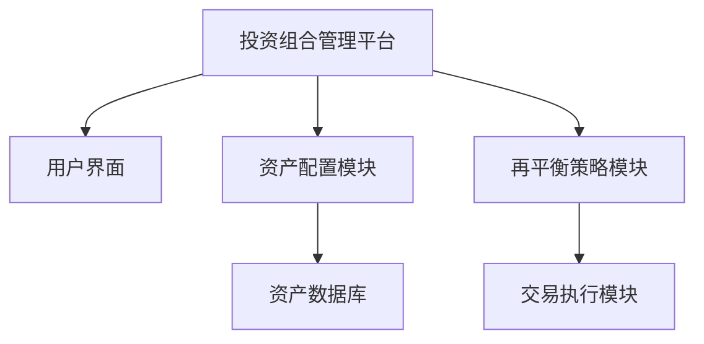

                 


# 约翰伯格的再平衡策略：维持投资组合的健康

> 关键词：投资组合，再平衡策略，约翰伯格，资产配置，风险管理

> 摘要：本文深入探讨了约翰伯格提出的再平衡策略，分析其在投资组合管理中的核心作用。通过详细讲解再平衡策略的背景、原理、算法实现以及系统架构设计，本文为读者提供了从理论到实践的全面指导。文章还结合实际案例，展示了如何通过再平衡策略优化投资组合，降低风险，实现长期稳健的投资回报。

---

## 第1章: 投资组合再平衡策略的背景与意义

### 1.1 投资组合的定义与特点

投资组合是指将资金分配到多种资产（如股票、债券、房地产等）上的策略，以分散风险并实现收益最大化。其特点是：

- **分散性**：通过配置不同资产降低单一资产的风险。
- **流动性**：资产易于买卖，确保资金的灵活性。
- **收益性**：通过优化资产配置提高整体收益。
- **风险管理**：通过再平衡策略控制投资组合的波动性。

### 1.2 约翰伯格与再平衡策略

约翰伯格是投资界的传奇人物，他提出的指数基金理念深刻影响了现代投资理论。再平衡策略是其投资哲学的重要组成部分，核心思想是：

> “通过定期调整投资组合的资产配置，确保投资组合的风险和收益与设定的目标一致。”

再平衡策略的应用场景包括：

- **市场波动**：当市场波动导致资产比例偏离目标时，进行再平衡。
- **资金流入流出**：新增资金或赎回资金时，调整资产配置。
- **长期投资**：定期再平衡以适应市场变化和投资者风险偏好。

### 1.3 再平衡策略的必要性

市场波动可能导致投资组合的资产比例偏离预期，引发以下问题：

- **超额风险**：某类资产占比过高，增加投资组合的波动性。
- **收益损失**：某类资产表现不佳，导致整体收益下降。
- **流动性风险**：部分资产占比过低，难以快速调整。

---

## 第2章: 再平衡策略的核心概念与原理

### 2.1 资产配置与投资组合管理

资产配置是投资组合管理的核心，通常分为以下几个步骤：

1. **目标设定**：根据投资者的风险承受能力、投资期限和收益目标，确定资产配置比例。
2. **初始配置**：将资金分配到各类资产中。
3. **定期再平衡**：根据市场变化和投资者需求，调整资产比例。

### 2.2 再平衡策略的数学模型

再平衡的核心是调整资产权重，使其回归目标配置。数学公式如下：

$$ w_i^{new} = \frac{w_i^{old} \times A_i^{current}}{\sum_j w_j^{old} \times A_j^{current}} $$

其中：
- $w_i^{new}$：调整后的资产权重
- $w_i^{old}$：调整前的资产权重
- $A_i^{current}$：当前资产的市场价值

### 2.3 再平衡策略的类型与选择

常见的再平衡策略包括：

- **定期再平衡**：每隔一定时间（如季度、半年）进行一次。
- **事件驱动再平衡**：当资产比例偏离目标时触发。
- **动态再平衡**：根据市场变化实时调整。

---

## 第3章: 再平衡策略的算法实现

### 3.1 再平衡策略的算法框架

再平衡算法的步骤如下：

1. 计算当前投资组合的资产权重。
2. 对比当前权重与目标权重，确定需要调整的资产。
3. 计算调整金额，确保调整后权重回归目标。
4. 执行交易，完成再平衡。

### 3.2 再平衡策略的数学推导

假设目标资产配置为 $w_1, w_2, \dots, w_n$，当前资产价值为 $A_1, A_2, \dots, A_n$。调整后资产价值应满足：

$$ \frac{A_i}{\sum_{j} A_j} = w_i $$

### 3.3 再平衡策略的Python实现

以下是一个简单的再平衡策略实现代码：

```python
def rebalance_portfolio(weights, current_assets):
    total_value = sum(current_assets)
    target_assets = [weight * total_value for weight in weights]
    return target_assets

# 示例
weights = [0.6, 0.3, 0.1]
current_assets = [60, 30, 10]
target_assets = rebalance_portfolio(weights, current_assets)
print("调整后的资产配置:", target_assets)
```

---

## 第4章: 系统架构与投资组合管理平台设计

### 4.1 投资组合管理系统的功能设计

系统功能模块包括：

- **用户界面**：显示投资组合状态和调整建议。
- **资产配置模块**：计算目标资产配置。
- **再平衡策略模块**：执行再平衡操作。
- **交易执行模块**：根据调整结果执行交易。

### 4.2 系统架构的Mermaid图



### 4.3 系统接口设计与交互流程

- **接口定义**：
  - 输入：目标资产权重、当前资产价值。
  - 输出：调整后的资产配置。

- **交互流程**：
  1. 用户输入调整需求。
  2. 系统计算调整方案。
  3. 用户确认后执行交易。

---

## 第5章: 项目实战与案例分析

### 5.1 环境安装与依赖管理

安装Python和相关库：

```bash
pip install numpy pandas matplotlib
```

### 5.2 核心算法实现

实现再平衡策略的核心代码：

```python
import numpy as np

def calculate_rebalanced_assets(weights, current_assets):
    total_current = np.sum(current_assets)
    rebalanced_assets = [weight * total_current for weight in weights]
    return rebalanced_assets

weights = np.array([0.6, 0.3, 0.1])
current_assets = np.array([60, 30, 10])
rebalanced_assets = calculate_rebalanced_assets(weights, current_assets)
print("调整后的资产配置:", rebalanced_assets)
```

### 5.3 实际案例分析

假设投资者初始投资组合为 $100,000，目标资产配置为股票60%、债券30%、现金10%。经过一段时间后，股票上涨20%，债券下跌5%，现金不变。当前资产价值为：

- 股票：$120,000
- 债券：$27,500
- 现金：$10,000

总价值为 $157,500。再平衡后：

- 股票：$157,500 * 60% = $94,500
- 债券：$157,500 * 30% = $47,250
- 现金：$157,500 * 10% = $15,750

需卖出股票 $120,000 - $94,500 = $25,500，买入债券 $47,250 - $27,500 = $19,750，买入现金 $15,750 - $10,000 = $5,750。

---

## 第6章: 最佳实践与小结

### 6.1 最佳实践

- **定期检查**：至少每季度检查一次资产配置。
- **动态调整**：根据市场变化和投资目标灵活调整。
- **分散投资**：避免过度集中某类资产。

### 6.2 小结

再平衡策略是维持投资组合健康的核心工具，通过定期调整资产配置，投资者可以降低风险，实现长期稳健的投资回报。约翰伯格的再平衡策略为投资者提供了科学的指导，值得深入学习和实践。

---

## 作者：AI天才研究院/AI Genius Institute & 禅与计算机程序设计艺术 /Zen And The Art of Computer Programming

