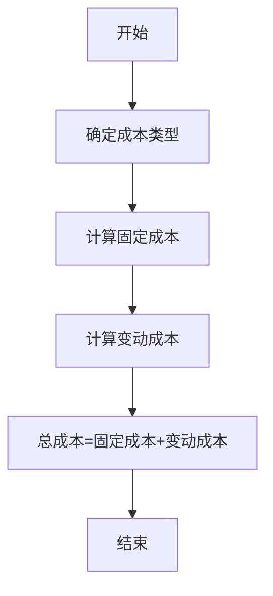
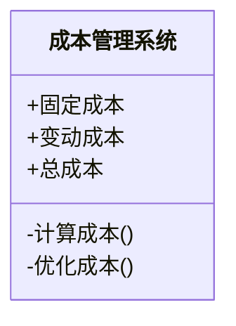
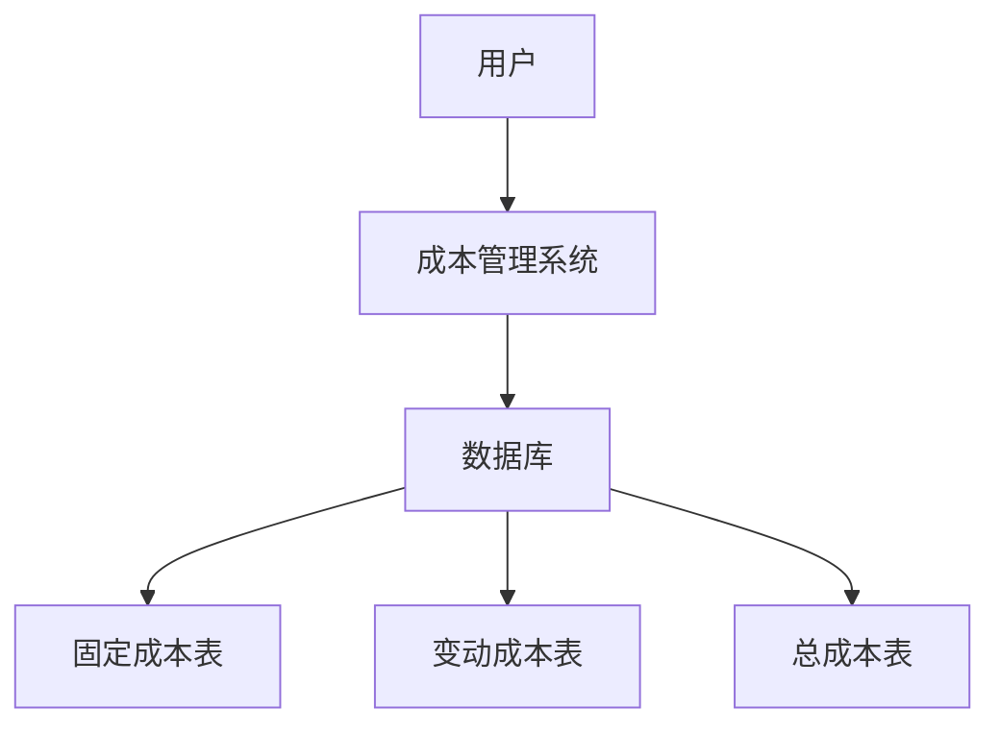
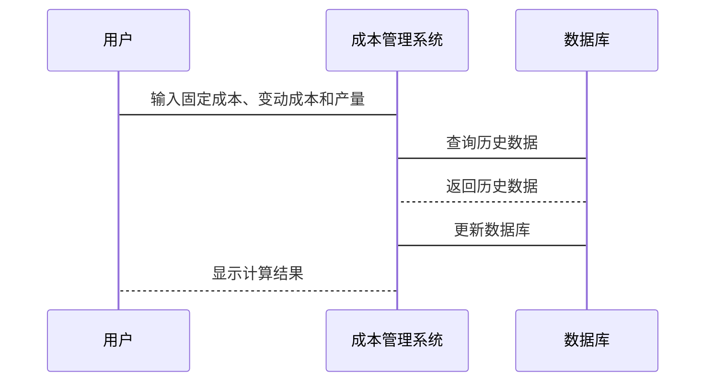

                 


# 约翰伯格的成本意识：为什么每一分钱都很重要

> 关键词：成本意识、成本结构、成本控制、约翰伯格理论、企业利润最大化

> 摘要：本文探讨了约翰伯格的成本意识理论及其在现代企业中的应用。通过分析成本结构、控制方法和优化策略，结合实际案例和系统设计，详细阐述了如何通过成本意识提升企业竞争力和实现利润最大化。

---

## 第一部分：引言

### 第1章：成本意识的重要性

#### 1.1 成本意识的定义与背景

##### 1.1.1 成本意识的定义

成本意识是指企业在经营活动中对成本的敏感性和控制能力，强调在每一分钱的支出和收入中做出明智决策。成本意识不仅仅是对成本的简单计算，而是通过深入分析成本结构和成本行为，优化资源配置，提高效率，最终实现企业利润最大化。

##### 1.1.2 成本意识的重要性

在现代企业中，成本意识是企业生存和发展的关键因素。企业通过成本意识可以优化生产流程、降低浪费、提高产品质量，从而增强市场竞争力。此外，成本意识还能帮助企业在经济不景气的时期维持运营，甚至通过成本优化实现盈利增长。

##### 1.1.3 约翰伯格的成本意识理论

约翰伯格是成本意识领域的权威，他提出的理论强调成本控制的重要性，并将其与企业利润最大化紧密联系。他认为，成本意识不仅是财务部门的职责，而是企业每个员工的责任。通过全员参与的成本管理，企业能够实现更高效的资源利用和更优的利润表现。

#### 1.2 成本意识的核心要素

##### 1.2.1 成本构成的三要素

成本通常由固定成本、变动成本和间接成本三部分构成。固定成本是指企业在一定时期内无论生产量如何都必须支付的成本，如租金、 salaries。变动成本则随着产量的增加而增加，如原材料和直接人工成本。间接成本则是难以直接归因于特定产品或部门的成本，如工厂的维护费用。

##### 1.2.2 成本与利润的关系

利润 = 收入 - 成本。通过降低成本或提高收入，企业可以增加利润。成本意识的核心在于找到成本与利润之间的平衡点，既不过度降低成本影响产品质量，也不忽视成本控制导致利润流失。

##### 1.2.3 成本控制的关键点

成本控制的关键点包括预算制定、成本分析、成本节约和成本考核。预算制定是成本控制的基础，成本分析是发现问题的关键，成本节约是目标，而成本考核则是确保控制措施落实的重要手段。

---

### 第2章：成本意识的核心概念

#### 2.1 成本结构解析

##### 2.1.1 固定成本与变动成本

固定成本：企业在一定时期内必须支付的成本，如租金、 salaries。变动成本：随着产量变化而变化的成本，如原材料和直接人工成本。

##### 2.1.2 直接成本与间接成本

直接成本：可以直接追溯到特定产品或服务的成本，如原材料和直接人工成本。间接成本：无法直接追溯到特定产品或服务，需通过合理分摊到各个产品或服务的成本，如工厂的维护费用和行政人员的 salaries。

##### 2.1.3 边际成本与机会成本

边际成本：增加一单位产量所增加的总成本。机会成本：放弃某项选择所失去的最大净收益。

#### 2.2 成本控制方法

##### 2.2.1 定额法

定额法是通过设定成本标准，比较实际成本与标准成本，找出差异并进行分析的一种方法。这种方法适用于生产流程相对稳定的企业。

##### 2.2.2 标准成本法

标准成本法是通过设定每个产品的标准成本，将实际成本与标准成本进行比较，找出差异并采取措施降低成本。这种方法适用于大量生产的企业。

##### 2.2.3 变动成本法

变动成本法是将固定成本和变动成本分开核算，只将变动成本计入产品成本，固定成本作为期间费用处理。这种方法有助于企业更好地理解成本结构，优化生产决策。

---

### 第3章：约翰伯格的成本意识理论

#### 3.1 约翰伯格的背景与贡献

##### 3.1.1 约翰伯格的生平简介

约翰伯格是成本意识领域的权威，他的理论和实践对企业财务管理产生了深远影响。

##### 3.1.2 约翰伯格的成本意识理论

约翰伯格提出，成本意识不仅仅是财务部门的职责，而是企业每个员工的责任。他强调通过全员参与的成本管理，优化资源配置，提高效率，实现利润最大化。

#### 3.2 成本意识在企业管理中的应用

##### 3.2.1 成本意识与企业利润最大化

通过优化成本结构，降低不必要的开支，企业可以实现利润最大化。成本意识是企业实现可持续发展的关键因素。

##### 3.2.2 成本意识与企业竞争力

在竞争激烈的市场环境中，成本意识是企业保持竞争力的重要手段。通过降低成本，企业可以提高产品价格竞争力，扩大市场份额。

##### 3.2.3 成本意识与可持续发展

约翰伯格的成本意识理论强调资源的高效利用，这与可持续发展理念高度契合。通过降低资源消耗，企业可以减少对环境的影响，实现绿色生产。

---

### 第4章：成本结构与控制方法

#### 4.1 成本构成的详细分析

##### 4.1.1 固定成本的分类与管理

固定成本包括租金、 salaries 等。通过合理规划固定成本的使用，企业可以降低整体成本。

##### 4.1.2 变动成本的分类与管理

变动成本包括原材料和直接人工成本。通过优化采购和生产流程，企业可以降低变动成本。

##### 4.1.3 边际成本与机会成本

边际成本是指增加一单位产量所增加的总成本。机会成本是指放弃某项选择所失去的最大净收益。

#### 4.2 成本控制方法

##### 4.2.1 定额法

定额法是通过设定成本标准，比较实际成本与标准成本，找出差异并进行分析的一种方法。这种方法适用于生产流程相对稳定的企业。

##### 4.2.2 标准成本法

标准成本法是通过设定每个产品的标准成本，将实际成本与标准成本进行比较，找出差异并采取措施降低成本。这种方法适用于大量生产的企业。

##### 4.2.3 变动成本法

变动成本法是将固定成本和变动成本分开核算，只将变动成本计入产品成本，固定成本作为期间费用处理。这种方法有助于企业更好地理解成本结构，优化生产决策。

---

### 第5章：算法原理

#### 5.1 成本计算的算法原理

##### 5.1.1 边际成本法的数学模型

边际成本法的数学模型为：  
$$ MC = \frac{\Delta C}{\Delta Q} $$  
其中，MC表示边际成本，ΔC表示成本的变化量，ΔQ表示产量的变化量。

##### 5.1.2 活动成本法的数学模型

活动成本法的数学模型为：  
$$ 成本 = \text{固定成本} + (\text{变动成本} \times 产量) $$

##### 5.1.3 成本计算的流程图



#### 5.2 算法实现

##### 5.2.1 Python代码实现

```python
def calculate_total_cost(fixed_cost, variable_cost_per_unit, quantity):
    total_cost = fixed_cost + (variable_cost_per_unit * quantity)
    return total_cost

# 示例
fixed_cost = 1000
variable_cost_per_unit = 50
quantity = 10

total_cost = calculate_total_cost(fixed_cost, variable_cost_per_unit, quantity)
print("总成本为：", total_cost)
```

##### 5.2.2 代码解释

上述代码定义了一个计算总成本的函数，输入固定成本、单位变动成本和产量，返回总成本。示例中计算了固定成本为1000，单位变动成本为50，产量为10的总成本为1500。

---

### 第6章：系统分析与架构设计

#### 6.1 系统功能设计

##### 6.1.1 领域模型



##### 6.1.2 系统架构图



##### 6.1.3 系统接口设计

系统接口包括用户输入界面、数据接口和输出接口。用户输入界面用于输入固定成本、变动成本和产量，数据接口用于连接数据库，输出接口用于显示计算结果。

##### 6.1.4 系统交互序列图



---

### 第7章：项目实战

#### 7.1 成本控制项目案例

##### 7.1.1 环境安装

需要安装Python和相关库，如numpy和pandas。

##### 7.1.2 核心代码实现

```python
import numpy as np
import pandas as pd

# 示例数据
data = {
    '产品': ['A', 'B', 'C'],
    '固定成本': [1000, 1500, 2000],
    '变动成本': [50, 60, 70],
    '产量': [10, 15, 20]
}

df = pd.DataFrame(data)
df['总成本'] = df['固定成本'] + (df['变动成本'] * df['产量'])
print(df)
```

##### 7.1.3 案例分析

通过上述代码，计算每个产品的总成本，找出成本最高的产品，并提出优化建议。

##### 7.1.4 项目总结

通过该项目，企业可以更好地理解成本结构，优化资源配置，提高利润。

---

### 第8章：最佳实践

#### 8.1 小结

成本意识是企业生存和发展的关键因素。通过优化成本结构，降低浪费，企业可以实现利润最大化和可持续发展。

#### 8.2 注意事项

企业在实施成本控制时，需要注意全员参与、持续改进和数据驱动。

#### 8.3 拓展阅读

推荐阅读《成本管理：理论与实践》和《约翰伯格的成本意识》等书籍。

---

### 作者：AI天才研究院/AI Genius Institute & 禅与计算机程序设计艺术 /Zen And The Art of Computer Programming

---

**本文通过详细分析约翰伯格的成本意识理论，结合实际案例和系统设计，为企业提供了优化成本结构和提高利润的实用方法。希望本文能为企业在成本管理方面提供有价值的参考和指导。**

