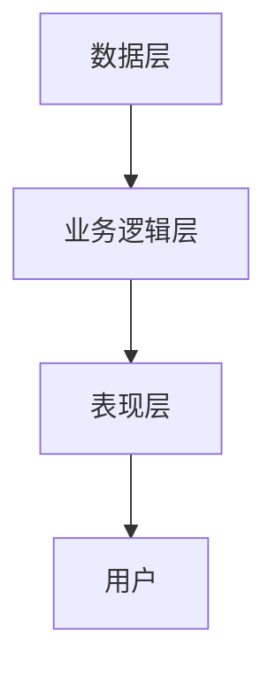

                 


# 约翰伯格的成本控制理念

> 关键词：成本控制、约翰伯格理念、企业成本管理、数学模型、系统架构

> 摘要：本文详细探讨了约翰伯格的成本控制理念，从基本概念、核心理论到实际应用，结合数学模型和系统架构，深入分析了成本控制的各个方面。通过具体案例和代码实现，展示了如何将理论应用于实际的企业管理中。

---

## 第一部分：成本控制的基本概念

### 第1章：成本控制的定义与背景

#### 1.1 成本控制的基本定义
成本控制是企业管理中的一个重要环节，旨在通过有效的方法和策略，降低不必要的开支，优化资源配置，从而提高企业的利润和竞争力。成本控制不仅涉及财务方面，还包括生产、运营、采购等多个环节。

#### 1.2 约翰伯格的成本控制理念
约翰伯格（John R. Buhler）提出了一套系统的成本控制理论，强调通过系统化的方法来优化成本管理。其核心思想是将成本控制与企业整体战略相结合，注重成本动因分析和资源优化配置。

---

## 第二部分：成本控制的核心概念与联系

### 第2章：成本构成要素分析

#### 2.1 成本构成要素
成本构成要素主要包括直接成本和间接成本。直接成本是指可以直接追溯到产品或服务的成本，如原材料和直接人工成本；间接成本则无法直接追溯，如工厂租金和管理费用。

#### 2.2 成本动因与成本对象
成本动因是导致成本发生的原因，例如生产数量、时间等。成本对象是指成本所针对的对象，如产品、项目或部门。理解成本动因与成本对象的关系，有助于更准确地进行成本核算和控制。

#### 2.3 成本动因与成本对象的关联
通过分析成本动因，可以确定哪些因素是影响成本的关键。例如，生产时间越长，间接成本可能越高。因此，在制定成本控制策略时，需要重点关注这些关键成本动因。

---

## 第三部分：约翰伯格成本控制的数学模型与算法原理

### 第3章：成本控制的数学模型

#### 3.1 成本函数的建立
成本函数通常表示为：
$$ C(x) = a + b x $$
其中，\( x \) 是成本动因，\( a \) 是固定成本，\( b \) 是单位变动成本。

#### 3.2 成本优化的数学表达式
通过优化模型，可以找到最小化成本的生产量：
$$ \min C = a + b x $$
约束条件：生产量 \( x \) 满足市场需求 \( D \)。

#### 3.3 约束条件
$$ x \geq D $$
$$ x \leq \text{生产能力} $$

### 第3章：算法实现

#### 3.1 线性规划模型的构建
使用线性规划求解成本最小化问题，目标函数和约束条件如上所示。

#### 3.2 算法实现步骤
1. 确定目标函数和约束条件。
2. 使用线性规划算法（如单纯形法）求解。
3. 输出最优解。

#### 3.3 代码实现
```python
import numpy as np
from scipy.optimize import linprog

# 目标函数系数：c = [b, 0]（假设固定成本a为常数）
# 约束矩阵：A = [[1, 1]], b = [D]
# 非负约束：x >= 0

c = [b, a]
A = [[1, 1]]
b = [D]
result = linprog(c, A, b, method='simplex')

print("最优生产量：", result.x[0])
print("最小成本：", result.fun)
```

---

## 第四部分：系统分析与架构设计方案

### 第4章：系统分析

#### 4.1 系统功能需求
系统需要实现成本数据采集、成本计算、成本分析和优化建议等功能。

#### 4.2 系统架构设计
使用分层架构，包括数据层、业务逻辑层和表现层。数据层负责数据存储，业务逻辑层处理计算，表现层提供用户界面。

#### 4.3 系统交互流程
用户输入数据，系统计算并返回优化结果。

### 第4章：系统架构图



---

## 第五部分：项目实战

### 第5章：制造企业成本控制项目

#### 5.1 环境安装
安装Python和相关库（如numpy、scipy）。

#### 5.2 核心代码实现
```python
from scipy.optimize import linprog

# 参数设置
a = 1000  # 固定成本
b = 50    # 单位变动成本
D = 100   # 最小生产量

# 目标函数系数
c = [b, a]

# 约束条件
A = [[1, 1]]
b = [D]

# 求解
result = linprog(c, A, b, method='simplex')

print("最优生产量：", result.x[0])
print("最小成本：", result.fun)
```

#### 5.3 运行结果与分析
输出结果为最优生产量和最小成本，帮助企业降低生产成本。

---

## 第六部分：最佳实践与小结

### 第6章：最佳实践

#### 6.1 成本控制的关键点
- 确定关键成本动因。
- 使用数学模型优化资源配置。
- 定期监控和调整成本控制策略。

#### 6.2 注意事项
- 确保数据的准确性和完整性。
- 选择合适的算法和工具。
- 定期回顾和优化成本控制方案。

#### 6.3 拓展阅读
- 《成本管理：理论与实践》
- 《约翰伯格的成本控制方法》

---

## 作者

作者：AI天才研究院/AI Genius Institute & 禅与计算机程序设计艺术 /Zen And The Art of Computer Programming

---

通过本文的详细讲解，读者可以全面了解约翰伯格的成本控制理念，并将其应用于实际的企业管理中，从而实现更高效的资源管理和成本优化。

