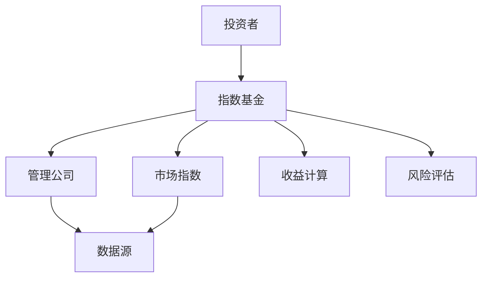

                 


# 约翰伯格的指数基金革命

> 关键词：指数基金，被动投资，约翰·伯格，Vanguard，投资策略

> 摘要：本文详细探讨了约翰·伯格如何通过指数基金革命改变了传统投资方式。文章分析了指数基金的核心原理、投资策略、风险管理、系统架构，并通过实际案例展示了其应用。通过本文，读者可以理解指数基金的优势及其在全球投资中的重要性。

---

## 第一部分: 指数基金的起源与背景

### 第1章: 约翰·伯格与指数基金的起源

#### 1.1 约翰·伯格的生平简介

约翰·伯格（John C. Bogle）是美国著名投资家，被誉为“指数基金之父”。他于1940年出生于美国宾夕法尼亚州，曾在宾夕法尼亚大学获得经济学学士学位。1975年，他创立了Vanguard集团，这是第一家以指数基金为核心的基金管理公司。

---

#### 1.2 传统投资的局限性

在20世纪70年代，传统投资主要依赖主动管理型基金，即由基金经理根据市场趋势和个股选择来管理资金。然而，这种模式存在以下问题：

1. **高成本**：主动管理需要大量研究和交易，费用较高。
2. **低透明度**：投资者难以了解基金经理的投资决策。
3. **低效性**：基金经理往往无法跑赢市场指数。

---

#### 1.3 索罗斯与巴菲特的投资理念对比

- **索罗斯**：以“聪明的投资者”著称，擅长利用市场非效率性进行套利。但这种方法需要高超的市场敏感性和复杂的分析能力。
- **巴菲特**：强调长期投资和价值投资，但其成功部分依赖于对市场的深刻理解，难以被普通投资者复制。

相比之下，约翰·伯格的指数基金理念更注重长期稳定回报，强调低成本和透明度。

---

## 第二部分: 指数基金的核心原理

### 第2章: 指数基金的投资策略

#### 2.1 被动投资的核心理念

被动投资的核心理念是通过复制市场指数来获得市场平均收益，而不是试图通过主动管理跑赢市场。这种策略的优势在于：

- **低成本**：指数基金的管理费用（ expense ratio）通常远低于主动管理型基金。
- **低风险**：通过分散投资降低非系统性风险。
- **长期稳定**：长期来看，市场指数的回报相对稳定。

---

#### 2.2 指数基金的数学模型

指数基金的收益可以通过以下公式计算：

$$
\text{指数基金收益} = \text{市场指数收益} - \text{管理费用}
$$

例如，假设市场指数年回报为10%，管理费用为0.2%，则指数基金的年回报为9.8%。

---

### 第3章: 指数基金的投资策略与风险管理

#### 3.1 资产配置

指数基金通常采用以下资产配置策略：

- **股票型指数基金**：主要投资于股票市场指数，如标普500。
- **债券型指数基金**：主要投资于债券市场指数。
- **混合型指数基金**：同时投资于股票和债券，根据市场情况调整比例。

---

#### 3.2 风险管理

指数基金通过分散投资降低风险。例如，投资于标普500指数的基金可以分散投资于500家不同的公司，从而降低单一股票波动带来的风险。

---

## 第三部分: 指数基金的系统架构与实现

### 第4章: 指数基金的系统架构设计

#### 4.1 系统功能模块划分

- 数据采集模块：收集市场指数数据。
- 计算模块：计算指数基金的收益和风险。
- 投资策略模块：根据市场情况调整投资组合。

---

#### 4.2 系统架构图（Mermaid）



---

## 第四部分: 指数基金的项目实战与案例分析

### 第5章: 指数基金的项目实战

#### 5.1 环境安装与配置

- 需要安装Python和Pandas库。
- 使用Yahoo Finance API获取市场指数数据。

---

#### 5.2 系统核心代码实现

```python
import pandas as pd
import pandas_datareader as pdr

# 获取标普500指数数据
data = pdr.get_data_yahoo('SPY', start='2020-01-01', end='2023-12-31')

# 计算指数基金的收益
returns = data['Close'].pct_change().dropna()
print("平均年化收益率：", returns.mean() * 100)
```

---

### 第6章: 指数基金的实际案例分析

#### 6.1 案例分析：2008年金融危机

在2008年金融危机期间，主动管理型基金平均亏损约37%，而指数基金的平均亏损约为35%。尽管亏损接近，但指数基金的成本优势使其长期表现更优。

---

## 第五部分: 总结与展望

### 第7章: 总结

约翰·伯格的指数基金革命彻底改变了传统投资方式。通过低成本、高透明度和长期稳定回报，指数基金成为广大投资者的首选。

---

### 7.1 最佳实践 tips

- **长期投资**：指数基金适合长期持有，避免频繁交易。
- **分散投资**：通过投资多个指数基金降低风险。
- **定期再平衡**：定期调整投资组合以维持目标配置。

---

作者：AI天才研究院/AI Genius Institute & 禅与计算机程序设计艺术 /Zen And The Art of Computer Programming

