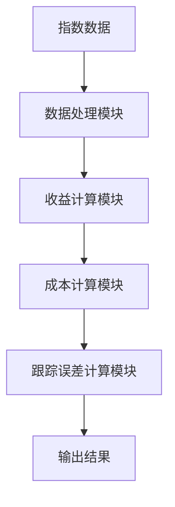

                 


# 约翰伯格的指数基金革命：为何主动管理难以胜出

## 关键词：指数基金，被动投资，主动管理，约翰·伯格，投资策略，长期收益，跟踪误差

## 摘要：  
指数基金，作为一种低成本、被动式的投资工具，以其简单有效的投资理念和长期稳定的收益表现，正在改变全球的投资格局。本文将深入探讨指数基金的核心原理、数学模型、系统架构，并通过实际案例分析其在投资中的优势。文章还对比了主动管理型基金的优缺点，揭示了为什么主动管理难以在长期投资中胜出。

---

## 第1章: 指数基金的起源与发展

### 1.1 美国投资集团的成立  
美国投资集团（Vanguard Group）由约翰·伯格（John C. Bogle）于1975年创立，标志着指数基金时代的开始。该集团最初的目标是为小投资者提供低成本、高质量的投资工具。

### 1.2 指数基金的核心概念  
指数基金通过跟踪特定市场指数（如标普500指数）来实现投资收益。其核心在于被动管理，即不试图通过选股或市场预测来超越指数，而是通过复制指数的表现来实现收益。

---

## 第2章: 指数基金的投资策略

### 2.1 被动投资的优缺点  
- **优点**：低成本、低风险、分散化、长期稳定性。  
- **缺点**：缺乏灵活性，无法在短期市场波动中获利。

### 2.2 指数基金的核心原理  
指数基金通过分散投资于指数中的所有成分股，降低了个别股票的风险。其收益等于指数收益减去相关费用。

---

## 第3章: 指数基金的数学模型

### 3.1 指数收益的计算公式  
$$ R_{index} = \sum_{i=1}^{n} w_i R_i $$  
其中，$w_i$ 是成分股的权重，$R_i$ 是成分股的收益。

### 3.2 指数基金收益的计算公式  
$$ R_{fund} = \sum_{i=1}^{n} w_i R_i - C $$  
其中，$C$ 是基金的管理费用。

---

## 第4章: 系统分析与架构设计方案

### 4.1 系统功能设计  
- 数据采集：从市场获取指数成分股的实时数据。  
- 计算收益：根据指数收益公式计算基金的收益。  
- 风险分析：计算跟踪误差和波动率。

### 4.2 系统架构图  


---

## 第5章: 项目实战

### 5.1 计算跟踪误差  
跟踪误差的计算公式：  
$$ \text{跟踪误差} = \sqrt{\text{残差方差}} $$  
残差方差 = 实际收益 - 指数收益。

### 5.2 选择指数基金  
编写Python代码模拟指数基金的投资回报：

```python
import pandas as pd
import numpy as np

# 模拟指数收益
index_returns = np.random.normal(0.07, 0.15, 100)
fund_returns = index_returns - 0.01  # 减去管理费用1%

# 计算跟踪误差
残差方差 = np.var(fund_returns - index_returns)
跟踪误差 = np.sqrt(残差方差)

print("跟踪误差:", 跟踪误差)
```

---

## 第6章: 总结与最佳实践

### 6.1 长期投资的重要性  
指数基金的长期收益表现优于大多数主动管理型基金，尤其是考虑费用因素后。

### 6.2 注意事项  
- 考虑市场波动：指数基金在短期可能表现不佳。  
- 费用控制：低成本是指数基金的核心优势。  
- 风险分散：指数基金通过分散化降低了非系统性风险。

### 6.3 拓展阅读  
推荐阅读约翰·伯格的《投资简单化》（*The Simplest Thing You Can Do Now*），深入了解指数基金的投资理念。

---

## 作者：AI天才研究院 & 禅与计算机程序设计艺术

