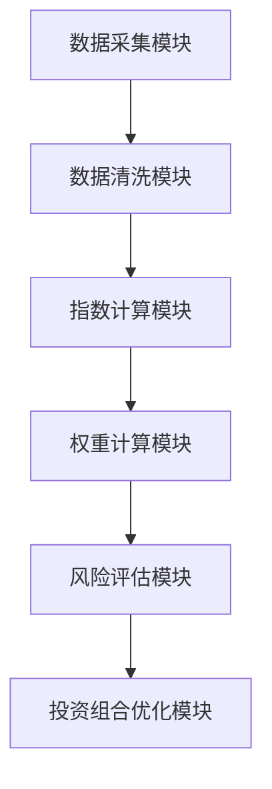

                 


# 约翰伯格的指数投资：挑战主动管理的传统智慧

> 关键词：指数投资、约翰·伯格、主动管理、投资策略、风险管理、投资回报、投资理论

> 摘要：本文详细探讨了约翰·伯格提出的指数投资理念及其对传统主动管理的挑战。通过分析指数投资的核心概念、数学模型、系统架构以及实际项目案例，本文揭示了指数投资在风险控制、成本效率和长期收益上的优势。同时，结合约翰·伯格的经典理论，本文还探讨了指数投资在现代金融中的应用前景和潜在问题，为投资者提供了全新的视角和实践指导。

---

## 第1章: 指数投资的起源与发展

### 1.1 指数投资的定义与特点

#### 1.1.1 指数投资的定义
指数投资是一种通过模拟特定市场指数的表现来构建投资组合的投资策略。其核心理念是“买入并持有”市场中的一部分，以获得与市场持平或超越市场的回报。指数投资的最大特点是分散化和低成本。

#### 1.1.2 指数投资的核心特点
- **分散化**：通过投资多个资产或股票，降低单一资产的风险。
- **低成本**：指数基金的管理费用通常低于主动管理型基金。
- **长期稳健**：指数投资通过长期持有市场中的一部分，能够获得市场的平均回报。

#### 1.1.3 指数投资与主动管理的区别
- **目标**：主动管理追求超越市场的超额回报，指数投资追求与市场持平的回报。
- **风险**：主动管理风险较高，指数投资风险较低且可控。
- **成本**：主动管理成本较高，指数投资成本较低。

### 1.2 约翰·伯格与指数投资的贡献

#### 1.2.1 约翰·伯格的生平简介
约翰·伯格（John C. Bogle）是指数基金之父，他于1975年创立了先锋集团（Vanguard Group），并推出了第一只指数基金——Vanguard 500 Index Fund。他的理念是通过降低费用和简化投资流程，为普通投资者提供更高效的投资工具。

#### 1.2.2 约翰·伯格对指数投资的贡献
- **低成本投资**：伯格倡导通过降低管理费用，使投资者能够以更低的成本获得市场平均回报。
- **分散化投资**：他强调通过广泛分散投资来降低风险。
- **长期投资**：伯格主张长期持有投资组合，避免频繁交易带来的额外成本和风险。

#### 1.2.3 约翰·伯格的指数投资理念
伯格认为，大多数主动管理型基金无法长期跑赢市场，而指数投资则能够以更低的成本为投资者提供市场平均回报。他的理念颠覆了传统的主动管理思维，为投资者提供了更简单、更高效的投资方式。

---

## 第2章: 指数投资的核心概念与数学模型

### 2.1 指数投资的数学模型

#### 2.1.1 指数构建的数学公式
指数投资的核心是通过模拟市场指数的表现来构建投资组合。假设我们选择一个市场指数，例如标普500指数，我们需要计算每个成分股的权重。权重通常是根据市值比例计算的。

公式：
$$
w_i = \frac{M_i}{\sum_{j=1}^{n} M_j}
$$
其中，\(w_i\) 是第 \(i\) 只股票的权重，\(M_i\) 是第 \(i\) 只股票的市值，\(n\) 是指数中的股票总数。

#### 2.1.2 指数权重的计算方法
指数权重的计算需要考虑市场的整体市值分布。通过计算每只股票的市值占市场总市值的比例，我们可以确定每只股票在指数中的权重。

#### 2.1.3 指数表现的评估指标
指数的表现可以通过以下指标进行评估：
- **跟踪误差（Tracking Error）**：指数基金与基准指数之间的收益差异。
- **夏普比率（Sharpe Ratio）**：衡量投资组合的风险调整后收益。

### 2.2 指数投资与CAPM模型的关系

#### 2.2.1 CAPM模型的简介
CAPM（资本资产定价模型）是一种用于计算资产期望收益的模型。公式为：
$$
E(R_i) = R_f + \beta_i (R_m - R_f)
$$
其中，\(E(R_i)\) 是资产 \(i\) 的期望收益，\(R_f\) 是无风险利率，\(\beta_i\) 是资产 \(i\) 的贝塔系数，\(R_m\) 是市场期望收益。

#### 2.2.2 CAPM模型在指数投资中的应用
指数投资的目标是获得市场的平均收益，而CAPM模型可以帮助我们理解市场的整体风险和收益关系。通过指数投资，我们可以以更低的成本获得与市场一致的收益。

#### 2.2.3 指数投资与CAPM模型的对比
- **目标**：CAPM用于计算资产的期望收益，指数投资用于模拟市场表现。
- **风险**：CAPM考虑了系统性风险和非系统性风险，指数投资通过分散化降低了非系统性风险。
- **成本**：CAPM是一种理论模型，指数投资是一种实际的投资策略。

---

## 第3章: 指数投资与主动管理的对比分析

### 3.1 主动管理的定义与特点

#### 3.1.1 主动管理的核心理念
主动管理是一种通过精选个股、行业或地区，以实现超额收益的投资策略。其核心理念是通过研究和分析，找到被市场低估的投资机会。

#### 3.1.2 主动管理的投资策略
- **选股策略**：通过基本面分析或技术分析选择优质资产。
- **行业配置**：根据市场趋势调整投资比例。
- **时机选择**：通过市场预测进行买卖时机的选择。

#### 3.1.3 主动管理的优缺点
- **优点**：有可能获得超额收益，灵活性高。
- **缺点**：成本高、风险高、难以长期稳定。

### 3.2 指数投资与主动管理的对比

#### 3.2.1 投资目标的对比
- **指数投资**：追求市场平均收益。
- **主动管理**：追求超额收益。

#### 3.2.2 风险与收益的对比
- **指数投资**：风险较低，收益稳定。
- **主动管理**：风险较高，收益不稳定。

#### 3.2.3 成本与效率的对比
- **指数投资**：成本低，效率高。
- **主动管理**：成本高，效率低。

---

## 第4章: 指数投资的算法原理与系统架构

### 4.1 指数投资的算法原理

#### 4.1.1 数据收集与清洗
指数投资需要收集市场指数的成分股数据，包括股票代码、市值、价格等。数据清洗包括去除缺失值、异常值和重复值。

#### 4.1.2 股票筛选与权重计算
根据指数构建规则，筛选符合条件的股票，并计算每只股票的权重。

#### 4.1.3 指数跟踪误差的优化
通过优化算法，最小化指数基金与基准指数之间的跟踪误差。

### 4.2 指数投资的数学模型实现

#### 4.2.1 股票权重计算的公式推导
通过市值加权法计算每只股票的权重：
$$
w_i = \frac{M_i}{\sum_{j=1}^{n} M_j}
$$

#### 4.2.2 指数跟踪误差的计算方法
跟踪误差的计算公式为：
$$
TE = \sqrt{\sum_{i=1}^{n} (w_i - w_i^{\text{index}})^2}
$$
其中，\(w_i\) 是投资组合的权重，\(w_i^{\text{index}}\) 是指数的权重。

---

## 第5章: 指数投资的系统架构设计

### 5.1 指数投资系统的功能模块

#### 5.1.1 数据采集模块
负责收集市场数据，包括股票价格、市值等。

#### 5.1.2 指数计算模块
根据指数构建规则，计算每只股票的权重。

#### 5.1.3 风险评估模块
评估投资组合的风险，包括跟踪误差和夏普比率。

### 5.2 系统架构的流程图



---

## 第6章: 指数投资的项目实战与最佳实践

### 6.1 环境安装与配置

#### 6.1.1 Python环境的安装
安装Python和必要的库，例如Pandas、NumPy、Matplotlib。

#### 6.1.2 数据库的安装与配置
选择合适的数据源，例如Yahoo Finance API。

#### 6.1.3 开发工具的安装
安装Jupyter Notebook或其他代码编辑器。

### 6.2 指数投资系统的核心实现

#### 6.2.1 数据采集与处理代码
```python
import pandas as pd
import numpy as np

# 数据采集
df = pd.read_csv('market_data.csv')

# 数据清洗
df.dropna(inplace=True)
df = df[~df['price'].isin([np.nan, np.inf])]
```

#### 6.2.2 指数计算与优化代码
```python
# 计算权重
df['market_cap'] = df['price'] * df['volume']
total_cap = df['market_cap'].sum()
df['weight'] = df['market_cap'] / total_cap

# 优化跟踪误差
# 假设index_weights是指数的权重
weights = df['weight'].values
index_weights = df['index_weight'].values
te = np.sqrt(np.sum((weights - index_weights) ** 2))
```

#### 6.2.3 系统交互界面的实现
```python
import tkinter as tk

root = tk.Tk()
root.title("指数投资系统")
# 创建组件并布局
root.mainloop()
```

---

## 第7章: 总结与拓展阅读

### 7.1 本书的总结

#### 7.1.1 指数投资的核心理念
指数投资通过分散化和低成本，为投资者提供了稳健的投资回报。其核心理念是“买入并持有”市场中的一部分，避免频繁交易和高昂的管理费用。

#### 7.1.2 约翰·伯格的贡献
伯格通过创建指数基金，颠覆了传统的主动管理思维，为投资者提供了更简单、更高效的投资方式。

#### 7.1.3 指数投资的未来展望
随着技术的进步和市场的成熟，指数投资将继续发展，为投资者提供更多的选择和更好的服务。

### 7.2 拓展阅读

#### 7.2.1 经典书籍
- 《The Intelligent Investor》 by Benjamin Graham
- 《Common Stocks and Uncommon Profits》 by Philip A. Fisher

#### 7.2.2 现代研究
- "The Performance of Practically All U.S. Mutual Funds" by David F. Swensen

---

作者：AI天才研究院/AI Genius Institute & 禅与计算机程序设计艺术 /Zen And The Art of Computer Programming

