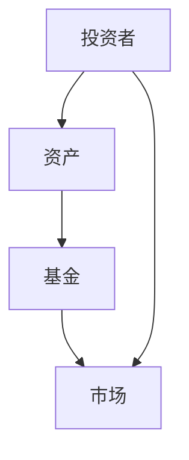
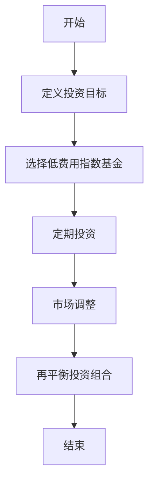
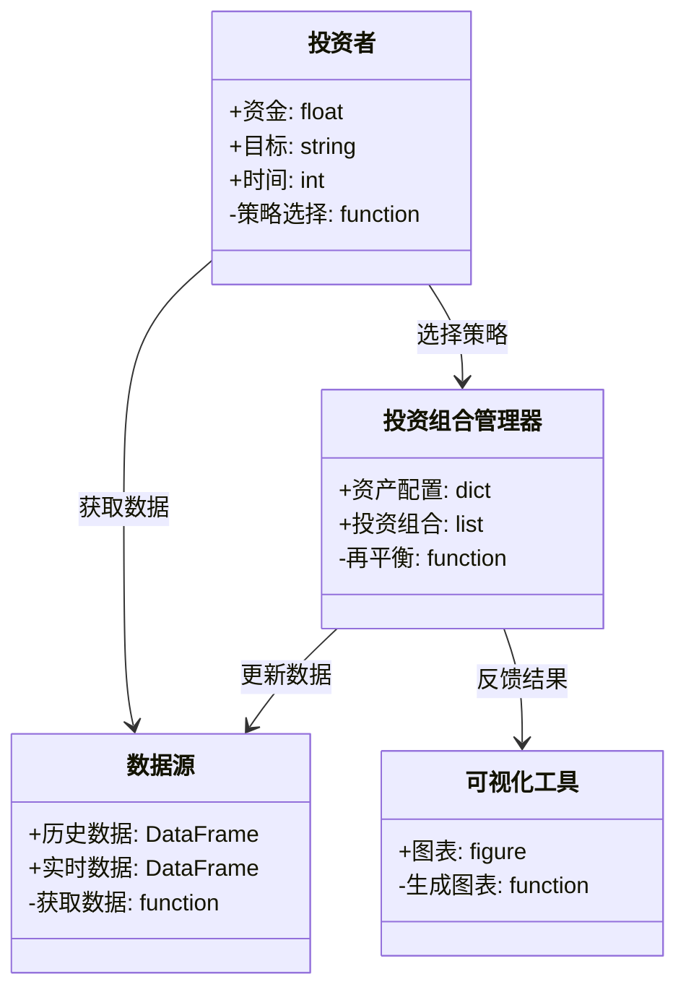
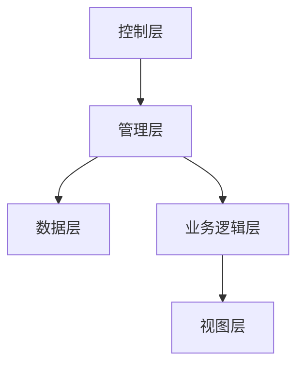

                 


# 约翰伯格的普通投资者观：为什么简单胜于复杂

> **关键词**：约翰·伯格，简单投资，复杂性，投资策略，算法原理，系统架构，项目实战，最佳实践

> **摘要**：本文深入探讨了约翰·伯格的简单投资理念，分析了为什么在投资中，简单胜于复杂。文章从背景介绍、核心概念、算法原理、系统架构、项目实战等多个维度展开，结合实际案例和最佳实践，为读者提供了全面的视角和实用的指导。

---

## 第一部分: 投资背景与简单投资理念

### 第1章: 投资背景与复杂性问题

#### 1.1 投资背景介绍

投资是人类经济活动中最重要的活动之一。随着金融市场的不断复杂化，投资者面临越来越多的选择和决策。从个人投资者到机构投资者，市场的复杂性不断提高，投资者需要面对的信息量和决策难度也在增加。在这样的背景下，简单投资作为一种反复杂化的策略，逐渐被广泛接受。

#### 1.2 约翰·伯格的投资者观

约翰·伯格是美国著名投资家、作家和教育家，他以其简洁明了的投资理念闻名。伯格的投资哲学强调长期投资、分散投资和低成本策略。他认为，复杂的投资策略往往会导致投资者陷入过度交易和过度关注市场波动的陷阱中。伯格的投资理念不仅适用于专业投资者，也适合普通投资者。

#### 1.3 简单投资的核心理念

简单投资的核心理念是通过简化投资决策和策略来降低风险和提高收益。简单投资并不意味着忽略市场的复杂性，而是通过选择少量、易于理解和管理的投资标的，降低投资组合的风险。简单投资强调长期性、分散性和低成本，避免了复杂投资策略中的过度交易和高费用问题。

---

## 第二部分: 简单投资的核心概念与联系

### 第2章: 简单投资的核心概念

#### 2.1 简单投资的原理与机制

简单投资的原理是基于现代投资组合理论（MPT）和行为金融学。简单投资通过分散投资来降低风险，同时避免频繁交易带来的费用和心理压力。其机制包括选择低费用的指数基金、长期持有优质资产以及定期再平衡投资组合。

#### 2.2 简单投资与复杂投资的对比

以下是简单投资与复杂投资的主要对比：

| **属性**         | **简单投资**          | **复杂投资**           |
|------------------|----------------------|-----------------------|
| **策略复杂性**    | 简单、易于执行       | 复杂、需要专业知识     |
| **风险管理**      | 通过分散投资降低风险 | 依赖复杂的对冲策略     |
| **交易成本**      | 低费用               | 高交易费用             |
| **心理压力**      | 低                   | 高                   |
| **适用场景**      | 初级和普通投资者     | 机构投资者或专业投资者 |

#### 2.3 简单投资的ER实体关系图



---

## 第三部分: 简单投资的算法原理与数学模型

### 第3章: 简单投资的算法原理

#### 3.1 简单投资算法的流程图



#### 3.2 简单投资算法的Python实现

```python
import numpy as np
import pandas as pd
import matplotlib.pyplot as plt

# 示例：简单投资策略——指数基金投资
def simple_investing_strategy(initial_amount, annual_return, years):
    # 初始投资金额
    amount = initial_amount
    # 年度回报率
    return_rate = annual_return
    # 投资年数
    periods = years
    
    # 计算投资组合的年回报
    def compound_return(n, p):
        return amount * (1 + return_rate) ** n
    
    # 计算每年的回报
    returns = [compound_return(i, return_rate) for i in range(periods + 1)]
    
    # 可视化
    plt.figure(figsize=(10, 6))
    plt.plot(range(periods + 1), returns)
    plt.title('Simple Investing Strategy')
    plt.xlabel('Years')
    plt.ylabel('Amount')
    plt.grid(True)
    plt.show()

# 示例调用
simple_investing_strategy(1000, 0.07, 30)
```

#### 3.3 简单投资的数学模型与公式

简单投资的核心数学模型是复利计算公式：

$$
\text{最终金额} = \text{初始金额} \times (1 + \text{年化收益率})^{\text{投资年数}}
$$

---

## 第四部分: 系统分析与架构设计方案

### 第4章: 系统分析与架构设计

#### 4.1 投资决策系统的场景介绍

投资决策系统是一个帮助投资者制定和执行投资策略的工具。简单投资策略可以通过一个自动化系统实现，该系统包括数据获取、策略执行和可视化反馈三个主要部分。

#### 4.2 系统功能设计



#### 4.3 系统架构设计



---

## 第五部分: 项目实战

### 第5章: 项目实战

#### 5.1 环境安装与配置

- 安装Python和必要的库：`pip install numpy pandas matplotlib`

#### 5.2 核心代码实现

```python
import numpy as np
import pandas as pd
import matplotlib.pyplot as plt

def simple_investing_strategy(initial_amount, annual_return, years):
    amounts = [initial_amount * (1 + annual_return) ** i for i in range(years + 1)]
    plt.plot(amounts)
    plt.title('Simple Investing Strategy')
    plt.xlabel('Years')
    plt.ylabel('Amount')
    plt.show()

simple_investing_strategy(1000, 0.07, 10)
```

#### 5.3 代码解读与分析

上述代码实现了简单投资策略的可视化，展示了初始金额在指定年数内的复利增长情况。通过调整参数，投资者可以直观地看到不同回报率和投资期限对最终金额的影响。

#### 5.4 案例分析

假设投资者初始投资1000美元，年化回报率为7%，投资期限为10年。根据复利计算，最终金额为：

$$
\text{最终金额} = 1000 \times (1 + 0.07)^{10} \approx 1967.15 \text{美元}
$$

---

## 第六部分: 最佳实践

### 第6章: 最佳实践

#### 6.1 小结

简单投资的核心在于通过降低复杂性来提高投资效果。通过选择低费用的指数基金和长期持有策略，投资者可以有效降低风险和成本，实现长期稳健的回报。

#### 6.2 注意事项

- 避免频繁交易和过度关注市场波动。
- 定期再平衡投资组合，确保资产配置与投资目标一致。
- 选择可靠的低成本投资工具。

#### 6.3 拓展阅读

- 《简单 investing》——约翰·伯格
- 《投资的智慧》——彼得·林奇

---

## 作者：AI天才研究院/AI Genius Institute & 禅与计算机程序设计艺术 /Zen And The Art of Computer Programming

