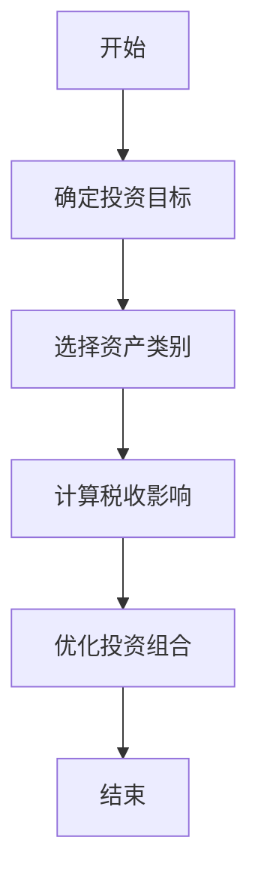
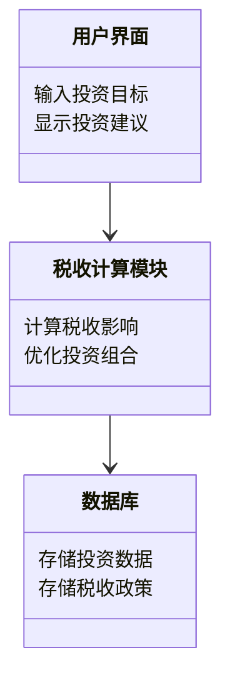
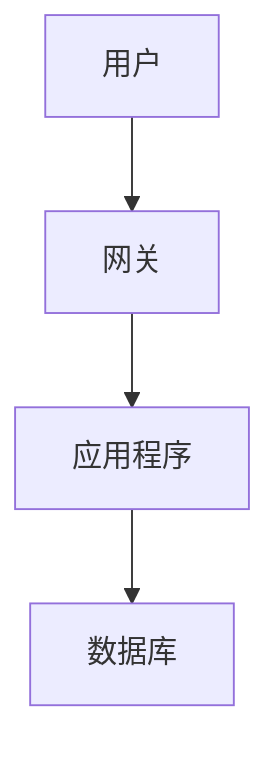

                 


# 约翰伯格的税收效率投资

## 关键词
- 税收效率投资
- 税务规划
- 投资策略
- 数学模型
- 系统架构
- 项目实战

## 摘要
《约翰伯格的税收效率投资》一书深入探讨了如何通过优化税收策略来提高投资效率。书中结合了理论与实践，详细讲解了税收效率投资的核心概念、算法原理、系统架构及项目实战，帮助读者理解如何在实际投资中应用这些策略。通过丰富的案例分析和数学模型，本书为投资者提供了实用的指导，帮助他们在复杂的投资环境中做出更明智的决策。

---

# 第一部分: 税收效率投资的背景与核心概念

## 第1章: 税收效率投资的定义与背景

### 1.1 税收效率投资的定义

#### 1.1.1 投资与税收的基本概念
投资是指将资金投入到某种资产或项目中，以期获得未来的收益。税收则是政府对个人或企业所得征收的税费。在投资过程中，税收是不可忽视的成本因素，它直接影响投资的回报率。

#### 1.1.2 税收效率投资的核心定义
税收效率投资是指在投资决策中，通过优化税务策略，最大化投资回报的过程。它强调在合法合规的前提下，合理利用税收优惠政策，降低税收负担，从而提高投资收益。

#### 1.1.3 税收效率投资的边界与外延
税收效率投资的边界在于合法合规的范围内进行税务优化，而外延则包括各种投资工具和策略，如股票、债券、房地产等。

### 1.2 税收效率投资的重要性

#### 1.2.1 税收对投资回报的影响
税收是投资成本的重要组成部分。通过优化税收策略，可以显著降低投资成本，从而提高净收益。

#### 1.2.2 税收效率在投资决策中的地位
在投资决策中，税收效率是影响资产配置和投资策略选择的关键因素之一。合理的税收规划可以帮助投资者在不同资产类别中做出更优的选择。

#### 1.2.3 税收效率投资的现实意义
在全球化和金融创新的背景下，税收效率投资已成为提升投资收益的重要手段。它不仅帮助个人实现财富增值，也为机构投资者提供了优化资本结构的工具。

## 第2章: 税收效率投资的核心概念与联系

### 2.1 核心概念原理

#### 2.1.1 税收效率投资的基本原理
税收效率投资的核心在于通过优化税务结构，降低投资成本，从而提高净收益。这包括选择税收优惠的资产类别、合理避税的策略以及税务递延的工具。

#### 2.1.2 税收与投资的相互作用机制
税收与投资是相互影响的。税收政策影响投资行为，而投资行为反过来也会影响税收收入。理解这种相互作用机制是制定税收效率投资策略的关键。

#### 2.1.3 税收效率投资的关键要素
- **资产配置**：选择税收优惠的资产类别，如房地产、股票等。
- **税务规划**：合理利用税收优惠政策，如延迟纳税、亏损抵扣等。
- **风险管理**：在税收优化的同时，控制投资风险。

### 2.2 核心概念属性对比表

| 属性           | 税收效率投资                  | 传统投资                  |
|----------------|-------------------------------|---------------------------|
| 税收影响        | 高                           | 低                        |
| 投资策略        | 税收优化导向                 | 非税收导向               |
| 风险管理        | 税后收益最大化               | 税前收益最大化           |

---

# 第二部分: 税收效率投资的算法原理

## 第3章: 税收效率投资的算法原理

### 3.1 算法原理讲解

#### 3.1.1 税收效率投资的动态规划模型



#### 3.1.2 税收效率投资的概率论模型

税收效率投资的概率论模型基于CAPM（资本资产定价模型）进行优化。以下是CAPM模型的数学公式：

$$
E(r_i) = r_f + \beta_i (E(r_m) - r_f)
$$

其中：
- \( E(r_i) \) 是资产i的预期回报率。
- \( r_f \) 是无风险利率。
- \( \beta_i \) 是资产i的贝塔系数。
- \( E(r_m) \) 是市场预期回报率。

通过调整贝塔系数，可以优化投资组合的税收效率。

---

## 第4章: 税收效率投资的数学模型

### 4.1 数学模型的构建与应用

#### 4.1.1 税收效率投资的线性回归模型

线性回归模型用于分析税收与投资回报之间的关系。以下是线性回归的数学公式：

$$
y = a + bx + \epsilon
$$

其中：
- \( y \) 是投资回报。
- \( x \) 是税收因素。
- \( a \) 是截距。
- \( b \) 是斜率。
- \( \epsilon \) 是误差项。

---

# 第三部分: 税收效率投资的系统架构

## 第5章: 税收效率投资系统的架构设计

### 5.1 系统功能设计

#### 5.1.1 系统功能模块



### 5.2 系统架构设计

#### 5.2.1 系统架构图



---

## 第6章: 税收效率投资系统的项目实战

### 6.1 环境安装

安装Python和必要的库，如NumPy、Pandas、Matplotlib。

### 6.2 核心代码实现

#### 6.2.1 税收效率投资算法的Python实现

```python
import numpy as np
import pandas as pd

# 示例数据
data = {'资产': ['股票', '债券', '房地产'], '预期回报': [0.1, 0.05, 0.07]}
df = pd.DataFrame(data)

# 计算税收影响
tax_rate = 0.15
df['税后回报'] = df['预期回报'] * (1 - tax_rate)

print(df)
```

#### 6.2.2 税收效率投资系统的实现

```python
class TaxEfficientInvestor:
    def __init__(self, assets, tax_rates):
        self.assets = assets
        self.tax_rates = tax_rates

    def calculate_tax_impact(self):
        for asset in self.assets:
            tax_impact = asset.return * self.tax_rates[asset.type]
            return tax_impact

    def optimize_portfolio(self):
        # 示例优化逻辑
        pass

# 使用示例
assets = [{'type': '股票', 'return': 0.1}, {'type': '债券', 'return': 0.05}]
tax_rates = {'股票': 0.15, '债券': 0.1}
investor = TaxEfficientInvestor(assets, tax_rates)
investor.calculate_tax_impact()
```

---

## 第7章: 总结与展望

### 7.1 总结

税收效率投资是一种通过优化税务策略来提高投资回报的方法。它结合了税收规划、资产配置和风险管理，帮助投资者在合法合规的前提下实现财富增值。

### 7.2 展望

随着金融市场的不断发展，税收效率投资将变得更加重要。未来的研究可以进一步探索人工智能和大数据在税收效率投资中的应用，为投资者提供更精准的决策支持。

---

## 作者

作者：AI天才研究院/AI Genius Institute & 禅与计算机程序设计艺术/Zen And The Art of Computer Programming

---

通过以上详细目录和内容框架，您可以开始撰写《约翰伯格的税收效率投资》的技术博客文章了。希望这篇博客能为您提供清晰的思路和丰富的素材！

