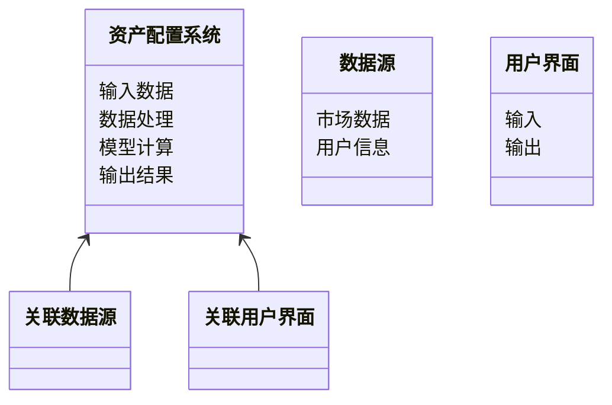
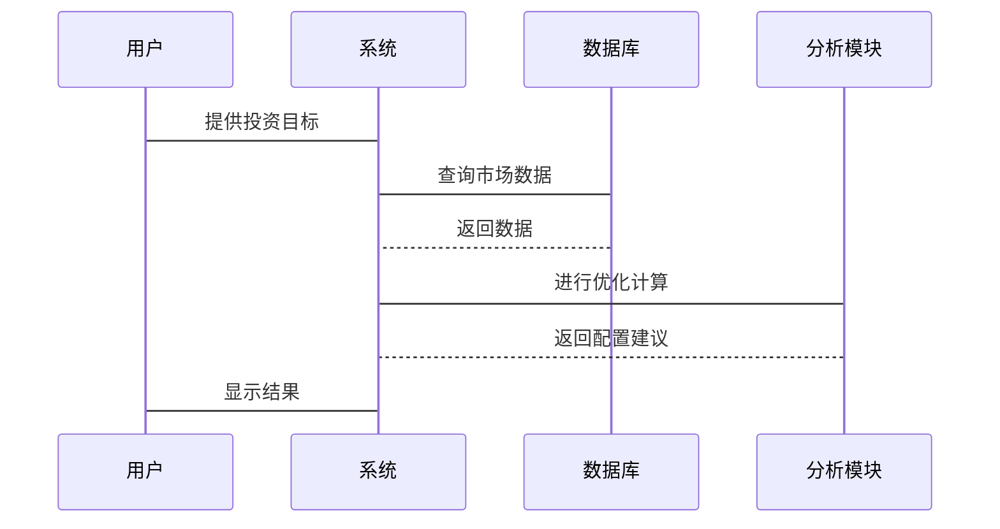

                 


# 约翰伯格的资产配置建议

## 关键词
- 资产配置
- 投资组合管理
- 现代投资组合理论（MPT）
- 数字化与智能化
- 可持续投资

## 摘要
本文深入探讨约翰伯格的资产配置建议，结合现代投资组合理论（MPT）和数学模型，分析其在不同经济周期下的应用。文章从资产配置的基本概念到系统架构设计，再到项目实战，详细讲解其原理和实现。通过实际案例和代码示例，展示如何构建有效的资产配置系统，并总结最佳实践和未来趋势。

---

## 第一部分：资产配置概述

### 第1章：资产配置的基本概念

#### 1.1 什么是资产配置
- **定义**：资产配置是指将资金分配到不同资产类别（如股票、债券、房地产等）以实现投资目标的过程。
- **重要性**：通过分散投资降低风险，平衡收益与风险，帮助投资者实现长期财务目标。
- **边界与外延**：资产配置涉及多个资产类别，但需考虑市场波动、经济周期和政策变化等外部因素。

#### 1.2 资产配置的核心要素
- **投资目标与风险承受能力**：明确投资目标和风险承受能力是资产配置的基础。
- **资产类别特性**：不同资产类别具有不同的风险和收益特征，需根据投资者需求选择。
- **配置结构与比例**：根据市场环境和投资者偏好，调整各类别资产的比例。

### 第2章：资产配置的历史与发展

#### 2.1 资产配置的起源
- **传统投资理论**：早期投资理论侧重于个股选择，忽视组合效应。
- **现代资产组合理论（MPT）**：由Harry Markowitz提出，强调通过分散投资降低风险。

#### 2.2 不同经济周期下的资产配置策略
- **经济周期对资产配置的影响**：经济周期不同阶段，不同资产表现各异。
- **历史案例分析**：2008年金融危机后的配置调整，2020年疫情时期的资产分配。

#### 2.3 资产配置的未来趋势
- **数字化与智能化**：AI技术的应用提升配置效率，实时数据处理优化决策。
- **可持续投资**：ESG因素的融入，推动社会责任投资发展。

---

## 第二部分：资产配置的核心原理

### 第3章：资产配置的原理与模型

#### 3.1 现代投资组合理论（MPT）
- **基本假设**：投资者风险偏好一致，市场有效，资产收益符合正态分布。
- **均值-方差优化模型**：构建有效前沿，寻找最优组合。
- **有效前沿**：代表所有有效投资组合的集合，提供最高收益或最低风险。

#### 3.2 均值-方差优化模型的数学推导
- **目标函数**：$\min_w \sigma^2 = w^T \Sigma w$
- **约束条件**：
  - $\sum w_i = 1$
  - $w_i \geq 0$

#### 3.3 风险调整后的收益评估
- **Sharpe比率**：衡量单位风险超额收益，计算公式：$Sharpe = \frac{E[r_p] - r_f}{\sigma_p}$

---

## 第三部分：系统分析与架构设计

### 第4章：系统分析与架构设计

#### 4.1 问题场景与项目介绍
- **问题场景**：投资者需要根据市场变化动态调整资产配置。
- **项目介绍**：构建一个实时资产配置系统，提供个性化建议。

#### 4.2 系统功能设计
- **数据输入模块**：收集市场数据和用户信息。
- **模型计算模块**：应用MPT进行组合优化。
- **结果展示模块**：输出配置建议和风险评估。

#### 4.3 领域模型设计（Mermaid类图）


#### 4.4 系统架构设计（Mermaid架构图）


#### 4.5 系统接口设计与交互流程（Mermaid序列图）


---

## 第四部分：项目实战

### 第5章：项目实战与实现

#### 5.1 环境安装
- **Python环境**：Python 3.8及以上
- **库安装**：numpy、pandas、scipy、matplotlib

#### 5.2 数据输入模块实现
```python
import numpy as np
import pandas as pd

# 读取数据
data = pd.read_csv('market_data.csv')

# 数据预处理
data['date'] = pd.to_datetime(data['date'])
data.set_index('date', inplace=True)
```

#### 5.3 资产配置算法实现
```python
from scipy.optimize import minimize

def portfolio_optimization(returns):
    n = returns.shape[1]
    # 定义目标函数
    def objective(weights):
        return -np.sum(weights * returns.mean(axis=0)) + 0.5 * np.sum(weights * returns.std(axis=0) * weights.T * returns.std(axis=0).T)
    # 约束条件
    constraints = [{'type': 'eq', 'fun': lambda w: np.sum(w) - 1}, {'type': 'ineq', 'fun': lambda w: w >= 0}]
    # 解优化问题
    result = minimize(objective, np.array([1/n]*n), constraints=constraints)
    return result.x

weights = portfolio_optimization(returns)
```

#### 5.4 实际案例分析
```python
# 案例分析
returns = pd.read_csv('example_returns.csv')
weights = portfolio_optimization(returns)
print(weights)
```

#### 5.5 实现细节与优化
- **数据处理**：确保数据清洗和标准化。
- **模型优化**：引入更多约束条件，如行业集中度限制。
- **结果可视化**：绘制资产配置比例的饼图。

---

## 第五部分：最佳实践与总结

### 第6章：最佳实践与小结

#### 6.1 项目成果总结
- 成功构建资产配置系统，实现动态调整。
- 验证了MPT的有效性，优化了投资组合。

#### 6.2 投资建议
- 根据市场变化和自身风险偏好，定期调整配置。
- 考虑可持续投资，关注ESG因素。

#### 6.3 注意事项
- 数据质量影响结果，需谨慎处理。
- 模型假设简化现实，需结合实际调整。

#### 6.4 拓展阅读与工具推荐
- **书籍**：《投资学》、《Python金融计算》
- **工具**：Pyfolio、Backtrader

---

## 第六部分：拓展阅读与参考资料

### 第7章：拓展阅读与参考资料

#### 7.1 相关书籍
- 《投资学》：详细讲解资产定价与组合管理。
- 《Python金融计算》：介绍量化投资技术。

#### 7.2 实用工具与平台
- **工具**：Zipline、QuantLib
- **平台**：Morningstar、Fintech

#### 7.3 其他资源
- 在线课程：Coursera、edX
- 技术博客：QuantInst Int'l Blog

---

## 作者信息

作者：AI天才研究院/AI Genius Institute & 禅与计算机程序设计艺术/Zen And The Art of Computer Programming

---

通过以上结构，文章详细阐述了约翰伯格的资产配置建议，结合理论与实践，帮助读者理解并应用这一投资策略。

