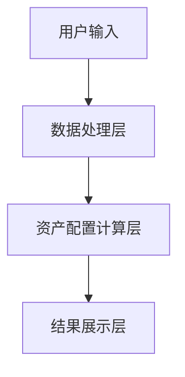

                 

<think>
好，我需要按照用户的要求，以《约翰伯格的资产配置理论：平衡风险与收益》为标题，撰写一篇结构清晰、内容详实的技术博客文章。首先，我会从概述、核心概念、数学模型、系统设计和项目实战几个方面展开。

**1. 资产配置的定义与作用**

资产配置是指将投资资金按照不同的资产类别（如股票、债券、现金等）进行分配，以实现风险与收益的最优平衡。约翰·伯格作为投资领域的权威，提出了许多关于资产配置的理论和方法。

**2. 资产配置的核心概念**

- **资产类别划分**：不同的资产类别具有不同的风险和收益特征，合理划分资产类别是资产配置的第一步。
- **风险与收益的权衡**：通过调整各类资产的配置比例，投资者可以在追求收益的同时控制风险。
- **时间跨度与流动性**：投资期限的长短会影响资产配置的策略，长期投资可以承担更多风险，而短期投资则需要保持较高的流动性。

**3. 约翰·伯格的资产配置模型**

- **现代投资组合理论（MPT）**：由哈里·马科维茨提出，强调通过分散投资来降低风险。
- **均值-方差模型**：计算投资组合的期望收益和方差，找出最优配置。
- **资本资产定价模型（CAPM）**：用于确定资产的期望收益，帮助投资者做出决策。

**4. 数学模型与优化算法**

在均值-方差模型中，目标是最小化投资组合的方差，即：
$$ \min_w \left( w^T \Sigma w \right) $$
在约束条件下：
$$ \sum_{i=1}^n w_i = 1, \quad w_i \geq 0 $$

通过求解上述优化问题，可以得到最优权重：
$$ w^* = \frac{\Sigma^{-1} \mu}{1^T \Sigma^{-1} \mu} $$

**5. 系统分析与架构设计**

- **系统架构**：
  - **用户输入层**：接收用户的资产配置需求。
  - **数据处理层**：对输入数据进行清洗和转换。
  - **资产配置计算层**：应用优化算法计算最优配置。
  - **结果展示层**：以可视化方式呈现配置结果。

- **系统架构图**：


**6. 项目实战**

- **环境安装**：
  - 需要安装Python和相关库（如NumPy、Pandas、SciPy）。
  
- **核心实现代码**：
  ```python
  import numpy as np
  import scipy.optimize as optimize

  def portfolio_optimization(mu, Sigma):
      n = Sigma.shape[0]
      Sigma_inv = np.linalg.inv(Sigma)
      numerator = Sigma_inv.dot(mu)
      denominator = np.dot(numerator.T, mu)
      w_opt = Sigma_inv.dot(mu) / denominator
      return w_opt

  mu = np.array([0.1, 0.08, 0.04])
  Sigma = np.array([[0.16, 0.05, 0.03],
                    [0.05, 0.20, 0.02],
                    [0.03, 0.02, 0.12]])

  w_opt = portfolio_optimization(mu, Sigma)
  print("最优权重：", w_opt)
  ```

- **案例分析**：
  以三个资产为例，计算得到的最优权重展示了如何在不同资产之间分配资源以达到风险与收益的最佳平衡。

**7. 最佳实践与小结**

- **最佳实践**：
  - 定期重新评估和调整资产配置。
  - 结合市场变化及时优化投资组合。
  - 使用专业工具辅助决策，提高效率和准确性。

- **小结**：
  约翰·伯格的资产配置理论为投资者提供了科学的指导，通过合理配置资产，可以在风险可控的前提下实现收益最大化。在实际操作中，结合理论与技术手段，能够更好地应对复杂的金融市场环境。

**作者**：AI天才研究院 & 禅与计算机程序设计艺术

