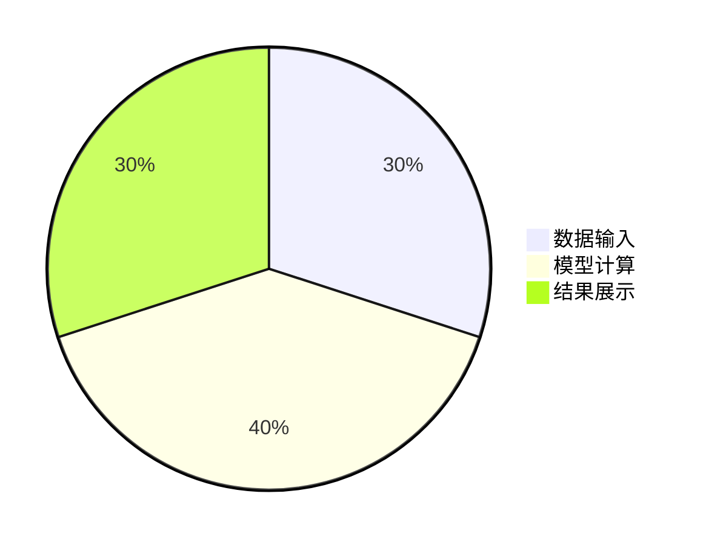
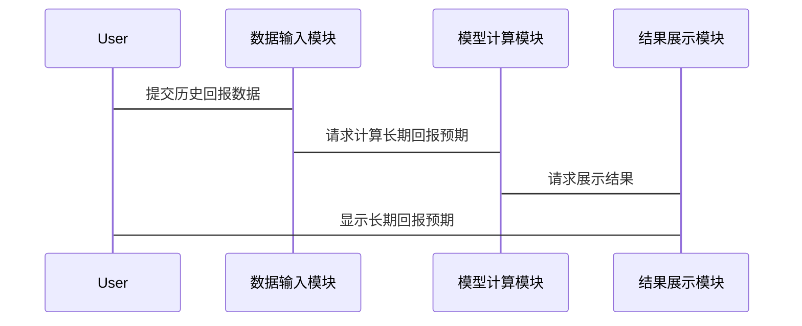

                 


# 约翰伯格的长期回报预期

## 关键词
- 长期回报预期
- 投资决策
- 风险管理
- 时间价值
- 数学模型
- 系统架构
- 项目实战

## 摘要
《约翰伯格的长期回报预期》这篇文章深入探讨了长期回报预期在投资决策中的重要性及其计算方法。文章从背景介绍、核心概念、算法原理、系统分析、项目实战到最佳实践，全面解析了长期回报预期的理论与实践应用。通过详细的数学模型和实际案例分析，文章为读者提供了如何在实际投资中应用长期回报预期的指导。

---

# 第一部分：长期回报预期的背景与核心概念

## 第1章：长期回报预期的背景与定义

### 1.1 长期回报预期的背景
在投资领域，长期回报预期是投资者制定策略的重要依据。随着金融市场的发展，投资者越来越关注长期回报，而非仅仅依赖短期收益。约翰伯格的长期回报预期理论强调了在不同经济周期下，投资者应如何调整其回报预期。

#### 1.1.1 投资者对长期回报的需求
投资者在制定投资策略时，往往需要预测未来数年甚至数十年的回报。这种预测不仅依赖于当前的市场状况，还需要考虑未来的经济趋势。例如，在低利率环境下，投资者可能需要调整其长期回报预期，以寻找更高收益的投资机会。

#### 1.1.2 经济周期与长期回报的关系
经济周期对长期回报预期有着重要影响。在经济增长期，资产回报通常较高；而在衰退期，回报可能较低。因此，投资者需要根据经济周期调整其长期回报预期。

#### 1.1.3 约翰伯格的长期回报预期理论
约翰伯格提出的长期回报预期理论认为，长期回报预期应基于资产的内在价值和市场趋势。该理论强调了资产配置和风险管理在长期回报预期中的重要性。

### 1.2 长期回报预期的定义与重要性
长期回报预期是指投资者对未来一段时间内资产回报的预测。它不仅是投资决策的基础，也是评估投资组合绩效的重要指标。

#### 1.2.1 长期回报预期的定义
长期回报预期是投资者对未来一定时期内资产回报的预测，通常基于历史数据、市场趋势和经济指标。

#### 1.2.2 长期回报预期在投资决策中的重要性
- **投资目标设定**：投资者可以根据长期回报预期设定合理的投资目标。
- **风险控制**：长期回报预期帮助投资者评估潜在风险，并制定相应的风险管理策略。
- **资产配置**：长期回报预期是资产配置的重要依据。

#### 1.2.3 长期回报预期与短期回报的关系
虽然长期回报预期关注未来较长时期，但短期回报仍然会影响投资者的决策。例如，短期市场波动可能会影响长期回报预期的实现。

### 1.3 长期回报预期的核心要素
长期回报预期的实现依赖于多个核心要素，包括投资目标、风险承受能力、市场环境等。

#### 1.3.1 投资目标与风险承受能力
- **投资目标**：明确的投资目标是制定长期回报预期的基础。
- **风险承受能力**：投资者的风险承受能力直接影响其长期回报预期。

#### 1.3.2 市场环境与经济指标
- **市场环境**：包括市场流动性、利率水平等。
- **经济指标**：如GDP增长率、通胀率等。

#### 1.3.3 时间跨度与复利效应
时间跨度是影响长期回报预期的重要因素。复利效应在长期投资中尤为显著。

---

## 第二部分：长期回报预期的核心概念与联系

## 第2章：长期回报预期的核心概念

### 2.1 长期回报预期的构成要素
长期回报预期的构成要素包括资产配置、风险管理、绩效评估等。

#### 2.1.1 资产配置
资产配置是实现长期回报预期的关键。合理的资产配置可以降低风险，同时提高回报。

#### 2.1.2 风险管理
风险管理是确保长期回报预期实现的重要手段。通过分散投资和对冲策略，可以有效降低风险。

#### 2.1.3 绩效评估
绩效评估是衡量长期回报预期实现程度的重要工具。通过定期评估投资组合的绩效，可以调整投资策略。

### 2.2 长期回报预期与风险的关系
长期回报预期与风险密切相关。投资者需要在风险与回报之间找到平衡点。

#### 2.2.1 风险-回报权衡
- 高风险资产通常具有较高的回报潜力，但同时也伴随着更大的风险。

#### 2.2.2 风险调整后的回报
- 风险调整后的回报是扣除风险溢价后的回报。

#### 2.2.3 风险分散与长期回报
- 通过分散投资，可以降低特定资产的风险，从而提高长期回报的稳定性。

### 2.3 长期回报预期与时间价值的关系
时间价值是影响长期回报预期的重要因素。复利效应在长期投资中尤为显著。

#### 2.3.1 时间价值的基本原理
- 时间价值是指资金在时间推移中的增值。

#### 2.3.2 复利计算与长期回报
- 复利计算是长期回报预期的重要组成部分。

#### 2.3.3 不同时间跨度下的回报预期
- 不同时间跨度下的回报预期不同，长期回报预期通常更为稳定。

---

## 第三部分：长期回报预期的算法原理

## 第3章：长期回报预期的算法与数学模型

### 3.1 长期回报预期的常用算法
长期回报预期的计算方法多种多样，包括简单平均法、加权平均法、时间序列分析法等。

#### 3.1.1 简单平均法
- 简单平均法是将历史回报数据直接取平均值，作为长期回报预期。

#### 3.1.2 加权平均法
- 加权平均法是根据历史数据的重要性赋予不同的权重，计算加权平均回报。

#### 3.1.3 时间序列分析法
- 时间序列分析法是基于历史数据的序列特征，预测未来回报。

### 3.2 长期回报预期的数学模型
数学模型是长期回报预期的核心工具。常用的数学模型包括简单平均模型、加权平均模型和时间序列模型。

#### 3.2.1 简单平均模型
- 简单平均模型的公式为：
  $$ E(r) = \frac{1}{n}\sum_{i=1}^{n} r_i $$
  其中，\( E(r) \) 是长期回报预期，\( r_i \) 是第 \( i \) 期的回报，\( n \) 是总期数。

#### 3.2.2 加权平均模型
- 加权平均模型的公式为：
  $$ E(r) = \sum_{i=1}^{n} w_i r_i $$
  其中，\( w_i \) 是第 \( i \) 期的权重。

#### 3.2.3 时间序列模型
- 时间序列模型通常采用自回归积分滑动平均（ARIMA）模型。

### 3.3 算法实现与代码示例
以下是基于简单平均法的Python代码示例：

```python
import numpy as np

# 历史回报数据
returns = [0.05, 0.03, 0.07, 0.02, 0.04]

# 计算简单平均回报
expected_return = np.mean(returns)
print("Expected Return:", expected_return)
```

### 3.4 算法流程图
以下是简单平均法的Mermaid流程图：

```mermaid
graph TD
    A[开始] -> B[输入历史回报数据]
    B -> C[计算平均回报]
    C -> D[输出长期回报预期]
    D -> E[结束]
```

---

## 第四部分：长期回报预期的系统分析与架构设计

## 第4章：长期回报预期的系统分析与架构设计

### 4.1 问题场景介绍
长期回报预期系统需要解决的问题包括数据获取、模型计算、结果展示等。

### 4.2 系统功能设计
系统功能设计包括数据输入、模型计算、结果展示等模块。

#### 4.2.1 数据输入模块
- 数据输入模块负责接收历史回报数据和相关参数。

#### 4.2.2 模型计算模块
- 模型计算模块基于输入数据，计算长期回报预期。

#### 4.2.3 结果展示模块
- 结果展示模块将计算结果以可视化形式呈现。

### 4.3 系统架构设计
以下是系统架构的Mermaid图：



### 4.4 接口设计
- 数据输入接口：接收历史回报数据和相关参数。
- 结果展示接口：显示长期回报预期结果。

### 4.5 交互流程
以下是交互流程的Mermaid序列图：



---

## 第五部分：长期回报预期的项目实战

## 第5章：长期回报预期的项目实战

### 5.1 环境安装
- 安装Python和相关库（如numpy、pandas）。

### 5.2 核心代码实现
以下是基于CAPM模型的Python代码示例：

```python
import numpy as np

# 输入参数
risk_free_rate = 0.02
market_return = 0.08
beta = 1.2

# 计算CAPM回报
expected_return = risk_free_rate + beta * (market_return - risk_free_rate)
print("Expected Return:", expected_return)
```

### 5.3 代码解读与分析
- 代码通过CAPM模型计算资产的预期回报，考虑了无风险利率、市场回报和贝塔系数。

### 5.4 案例分析
假设市场回报为8%，无风险利率为2%，贝塔系数为1.2，计算得到的预期回报为8%。

### 5.5 项目小结
通过项目实战，读者可以掌握长期回报预期的计算方法，并将其应用于实际投资决策中。

---

## 第六部分：长期回报预期的最佳实践

## 第6章：最佳实践、小结、注意事项和拓展阅读

### 6.1 最佳实践
- **定期评估**：定期评估投资组合的绩效，调整长期回报预期。
- **风险管理**：通过分散投资和对冲策略，降低风险。

### 6.2 小结
本文从背景、概念、算法、系统设计到项目实战，全面解析了长期回报预期的理论与实践。

### 6.3 注意事项
- **数据质量**：确保输入数据的准确性和完整性。
- **模型选择**：根据具体情况选择合适的模型。

### 6.4 拓展阅读
- 建议读者进一步阅读《投资学》（作者：约翰·C·弗伦奇）等书籍，深入理解长期回报预期的理论与实践。

---

## 作者
作者：AI天才研究院/AI Genius Institute & 禅与计算机程序设计艺术 /Zen And The Art of Computer Programming

