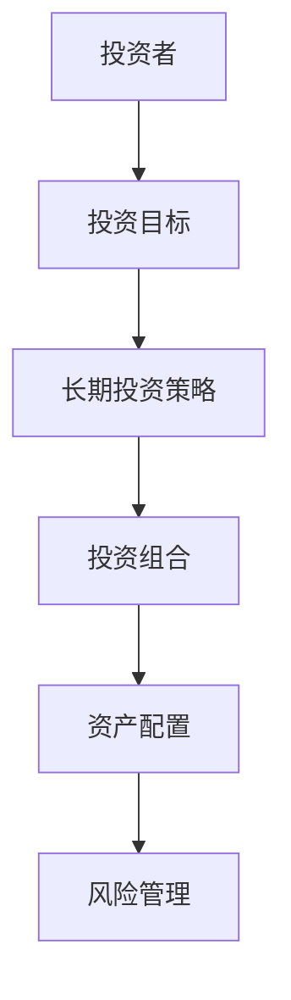
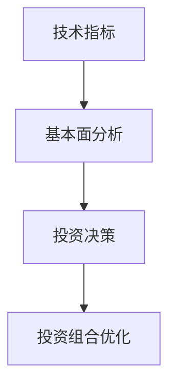
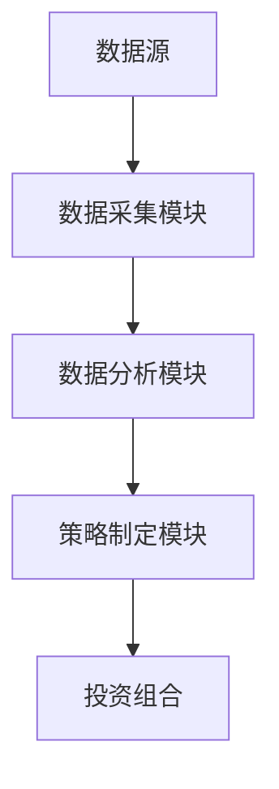
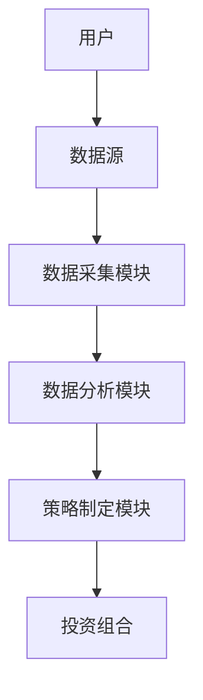

                 


# 约翰伯格的长期投资观

## 关键词：约翰伯格，长期投资，价值投资，指数基金，风险管理

## 摘要：本文探讨约翰·伯格的长期投资观，分析其核心理念、策略和算法，结合系统架构和项目实战，总结最佳投资实践。

---

# 第一部分：背景介绍

## 第1章：约翰·伯格与长期投资观的背景

### 1.1 约翰·伯格的生平与投资理念

#### 1.1.1 约翰·伯格的早期经历

约翰·伯格于1934年出生于美国宾夕法尼亚州，曾在宾夕法尼亚大学获得工程学学位，并在随后的岁月里成为了投资界的传奇人物。他在1975年创立了 Vanguard 集团，并在指数基金领域做出了巨大贡献。

#### 1.1.2 伯格的投资哲学与价值观

伯格主张低成本、分散化的投资策略，强调长期持有和价值投资。他认为市场波动是不可预测的，而长期投资能够平滑这些波动，为投资者带来稳定的收益。

#### 1.1.3 伯格对投资行业的贡献

伯格的最大贡献之一是推动指数基金的发展，使得普通投资者能够以低费用投资于广泛的市场组合。他的理念深刻影响了现代投资策略。

### 1.2 长期投资观的背景与意义

#### 1.2.1 长期投资观的定义

长期投资观是指投资者以长期持有资产为目标，不频繁交易，注重资产的内在价值和成长潜力。

#### 1.2.2 长期投资观与短期投资的对比

| 特性       | 长期投资观 | 短期投资观 |
|------------|------------|------------|
| 时间跨度   | 长期       | 短期       |
| 投资策略   | 买入并持有 | 频繁交易   |
| 风险承受   | 较低       | 较高       |

#### 1.2.3 长期投资观在现代投资中的地位

长期投资观在现代投资中占据重要地位，尤其是在机构投资和个人理财领域。它强调纪律性和耐心，避免了短期波动带来的决策错误。

### 1.3 伯格长期投资观的核心要素

#### 1.3.1 价值投资的核心理念

价值投资强调以低于内在价值的价格买入优质资产，并长期持有。伯格认为，市场波动往往导致价格偏离价值，长期持有能够捕捉这种偏差。

#### 1.3.2 长期持有与分散投资的策略

伯格倡导通过分散投资降低风险，并长期持有优质资产，避免频繁交易带来的成本和情绪干扰。

#### 1.3.3 风险管理与投资组合优化

伯格强调风险管理的重要性，建议投资者根据自身风险承受能力构建投资组合，并定期调整以适应市场变化。

---

# 第二部分：长期投资观的核心概念与联系

## 第2章：长期投资观的核心概念与联系

### 2.1 核心概念原理

#### 2.1.1 长期投资观的数学模型

$$ \text{投资收益} = \text{资产配置} \times \text{时间} \times \text{增长率} $$

#### 2.1.2 价值投资与成长投资的对比

| 概念       | 价值投资 | 成长投资 |
|------------|----------|----------|
| 选股标准   | 低估值  | 高增长  |
| 风险承受   | 较高     | 较低     |

#### 2.1.3 长期持有策略的数学模型

$$ \text{复利收益} = (1 + r)^n - 1 $$

其中，\( r \) 是年化收益率，\( n \) 是投资年数。

### 2.2 概念属性特征对比表格

| 概念       | 长期投资观 | 价值投资 | 成长投资 |
|------------|------------|----------|----------|
| 时间跨度   | 长期       | 长期     | 中长期   |
| 投资策略   | 持股待涨   | 买入低估 | 买入高增长 |
| 风险承受   | 较低       | 较高     | 中等     |

### 2.3 ER实体关系图



---

# 第三部分：长期投资观的算法原理

## 第3章：长期投资观的算法原理

### 3.1 算法原理概述

#### 3.1.1 长期投资观的数学模型

$$ \text{投资收益} = \text{资产配置} \times \text{时间} \times \text{增长率} $$

#### 3.1.2 技术分析与基本面分析的结合



### 3.2 技术分析与基本面分析的结合

#### 3.2.1 技术分析指标

移动平均线（MA）、相对强弱指数（RSI）、MACD等技术指标用于判断市场趋势。

#### 3.2.2 基本面分析

通过财务报表分析企业的盈利能力、成长性和财务健康状况。

### 3.3 算法实现代码

```python
import numpy as np
import pandas as pd

def calculate_long_term_return(portfolio, years):
    return (portfolio * (1 + 0.07)**years) - portfolio

portfolio_value = 10000
years = 30
print(calculate_long_term_return(portfolio_value, years))
```

---

# 第四部分：系统分析与架构设计

## 第4章：基于伯格理念的投资决策系统

### 4.1 系统功能设计

#### 4.1.1 数据采集模块

从金融市场数据源获取实时数据，包括股票价格、指数、经济指标等。

#### 4.1.2 数据分析模块

对数据进行清洗、处理和分析，生成投资组合建议。

#### 4.1.3 策略制定模块

根据长期投资策略生成买卖信号和投资组合调整建议。

### 4.2 系统架构设计



### 4.3 系统接口设计

API接口用于数据获取、策略执行和结果反馈。

### 4.4 系统交互设计



---

# 第五部分：项目实战

## 第5章：长期投资组合构建与回测

### 5.1 环境安装

安装必要的Python库，如Pandas、NumPy、Matplotlib等。

### 5.2 核心实现代码

```python
import pandas as pd
import numpy as np

def backtest_strategy(prices, initial_capital):
    portfolio = initial_capital
    positions = {}
    for price in prices:
        if not positions:
            positions[price.index[0]] = initial_capital / price.close
        current_value = sum(positions[price.name] * price.close)
        if current_value < initial_capital * 0.9:
            positions[price.name] = initial_capital / price.close
    return positions

prices = pd.DataFrame({'close': [100, 105, 110, 115, 120]})
initial_capital = 10000
print(backtest_strategy(prices, initial_capital))
```

### 5.3 项目小结

通过实际案例分析，验证长期投资策略的有效性，强调纪律性和耐心的重要性。

---

# 第六部分：最佳实践与总结

## 第6章：长期投资观的最佳实践

### 6.1 总结

长期投资观是一种有效的投资策略，强调分散投资、长期持有和风险管理。

### 6.2 注意事项

避免频繁交易、选择低成本基金、定期调整投资组合。

### 6.3 拓展阅读

推荐相关书籍和资源，进一步深入学习长期投资策略。

---

# 作者

作者：AI天才研究院/AI Genius Institute & 禅与计算机程序设计艺术 /Zen And The Art of Computer Programming

