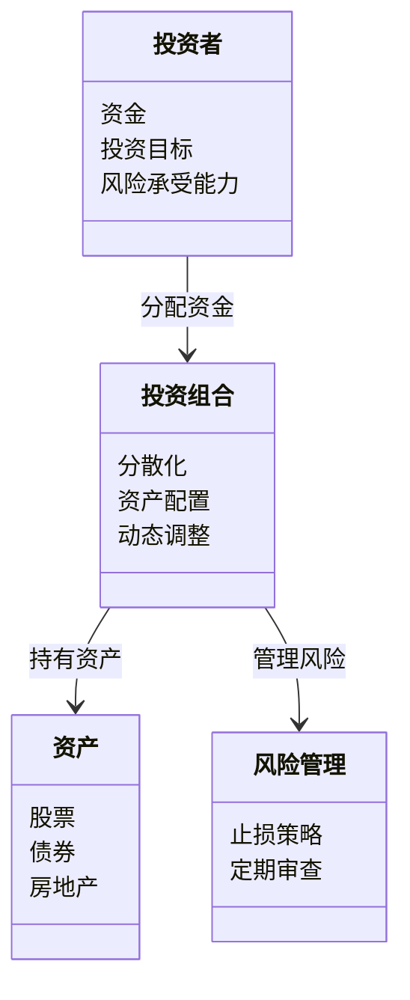
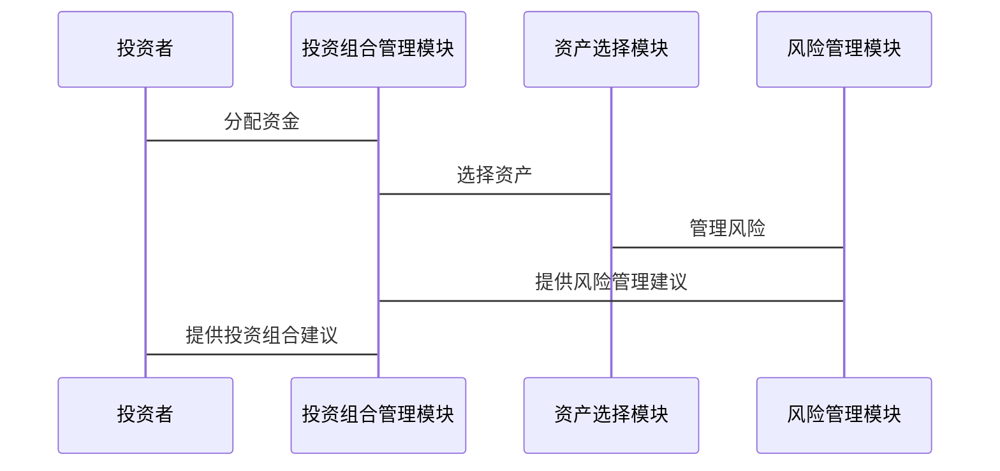

                 


# 约翰伯格的长期投资观：为什么时间是你的朋友

## 关键词：
- 长期投资
- 时间价值
- 约翰·伯格
- 投资组合
- 风险管理
- 复利效应
- 价值投资

## 摘要：
本文深入探讨了约翰·伯格的长期投资理念，分析了时间在投资中的重要性，以及如何通过长期投资实现财富的可持续增长。文章从长期投资的核心原理、投资组合构建、风险管理、投资心理与行为分析、系统架构设计等多个角度，结合数学模型、实际案例和系统架构图，详细阐述了长期投资的理论与实践。通过本文，读者将全面理解为什么时间是长期投资的朋友，并掌握如何在实际投资中应用这些理念。

---

# 第一部分: 长期投资观的背景与核心理念

## 第1章: 长期投资观的背景介绍

### 1.1 长期投资观的核心概念

#### 1.1.1 什么是长期投资
长期投资是指投资者将资金投入到某种资产中，并期望在未来较长的时间内获得稳定的收益或资本增值。与短期投资相比，长期投资更注重资产的内在价值和长期增长潜力，而非短期市场波动。

#### 1.1.2 时间在投资中的重要性
时间是投资的“加速器”。通过复利效应，资金在长期投资中能够实现指数级增长。时间越长，复利效应越显著，投资回报也越大。

#### 1.1.3 长期投资与短期投资的对比
- **短期投资**：关注市场短期波动，注重快速获利，风险较高，收益不稳定。
- **长期投资**：关注资产的长期增长潜力，注重稳定性和可持续性，风险较低，收益更可预测。

### 1.2 约翰·伯格的长期投资理念

#### 1.2.1 约翰·伯格的生平简介
约翰·伯格（John Bogle）是美国著名投资专家，被誉为“指数基金之父”。他是 Vanguard 集团的创始人，以其倡导的低成本、被动投资策略闻名。

#### 1.2.2 伯格的投资哲学
伯格认为，长期投资的核心是通过分散化投资降低风险，同时关注资产的长期增值潜力。他强调低成本、低波动的投资策略，反对频繁交易和市场投机。

#### 1.2.3 伯格对投资市场的独特见解
伯格指出，市场短期波动难以预测，但长期趋势是可预测的。通过长期投资，投资者可以规避短期波动的风险，实现财富的稳步增长。

---

## 第2章: 长期投资的核心原理

### 2.1 复利效应的数学模型

#### 2.1.1 复利公式与计算
复利公式为：
$$
A = P \times (1 + r)^n
$$
其中：
- \( A \) 为最终金额
- \( P \) 为本金
- \( r \) 为年利率
- \( n \) 为年数

#### 2.1.2 复利效应的实际应用
假设你投资100元，年利率为10%，投资30年，最终金额为：
$$
A = 100 \times (1 + 0.1)^{30} \approx 1748.02 \text{元}
$$
这意味着，通过复利效应，资金在30年后增长了约17.48倍。

#### 2.1.3 复利与投资回报的关系
复利效应是长期投资回报的核心驱动力。通过长期持有优质资产，投资者可以最大化复利效应，实现财富的指数级增长。

### 2.2 价值投资与成长投资

#### 2.2.1 价值投资的定义与特点
价值投资是寻找被市场低估的资产，通过长期持有实现价值回归。其特点是注重资产的内在价值，而非市场波动。

#### 2.2.2 成长投资的定义与特点
成长投资是投资于具有持续增长潜力的资产，如高科技公司或新兴行业。其特点是注重资产的长期增长潜力，而非当前的估值。

#### 2.2.3 价值投资与成长投资的对比
| 对比维度 | 价值投资 | 成长投资 |
|----------|-----------|----------|
| 投资目标 | 价值回归 | 长期增长 |
| 风险水平 | 中等偏高 | 较高 |
| 适用场景 | 经济周期波动 | 高增长行业 |

---

## 第3章: 投资组合构建与风险管理

### 3.1 投资组合的构建原则

#### 3.1.1 投资组合的分散化
分散化是降低投资风险的重要策略。通过将资金分配到不同资产类别（如股票、债券、房地产等），投资者可以降低单一资产波动对整体投资组合的影响。

#### 3.1.2 资产配置的重要性
资产配置是根据投资者的风险承受能力和收益目标，将资金分配到不同的资产类别中。合理的资产配置能够平衡风险与收益，实现长期稳定的回报。

#### 3.1.3 投资组合的动态调整
根据市场变化和个人目标，定期审视和调整投资组合。例如，当某类资产表现不佳时，可以适当减少其权重，增加表现较好的资产。

### 3.2 风险管理的核心策略

#### 3.2.1 风险的定义与分类
风险是指投资损失的可能性。根据来源，风险可以分为市场风险、流动性风险、信用风险等。

#### 3.2.2 风险与收益的平衡
高风险意味着高收益，但通过分散化和风险管理，投资者可以在承受可接受风险的前提下，获得较高的收益。

#### 3.2.3 风险管理的工具与方法
- **分散化**：通过投资不同资产降低风险。
- **止损策略**：设定止损点，避免重大损失。
- **定期审查**：定期评估投资组合的风险敞口。

---

# 第二部分: 投资心理与行为分析

## 第4章: 投资者心理与行为偏差

### 4.1 常见的投资心理偏差

#### 4.1.1 过度自信偏差
投资者往往过高估计自己的能力，认为自己能够准确预测市场走势。

#### 4.1.2 沉没成本偏差
投资者在已经亏损的情况下，继续追加投资以试图挽回损失，忽视了理性止损的重要性。

#### 4.1.3 羊群效应
投资者盲目跟随市场潮流，忽视独立思考和理性分析。

### 4.2 行为经济学在投资中的应用

#### 4.2.1 行为经济学的基本原理
行为经济学研究人类决策的非理性行为，揭示心理偏差对投资决策的影响。

#### 4.2.2 投资者决策中的非理性行为
- 过度交易
- 从众心理
- 惧行为（贪婪与恐惧）

#### 4.2.3 如何克服心理偏差
- 培养理性思维
- 制定明确的投资计划
- 定期审视投资决策

---

## 第5章: 长期投资中的心理挑战

### 5.1 短期波动对投资者心理的影响

#### 5.1.1 市场波动的常见原因
市场波动由经济周期、政策变化、公司业绩等多种因素引起。

#### 5.1.2 短期亏损对心理的冲击
投资者在面对短期亏损时，容易产生恐慌情绪，做出错误的决策。

#### 5.1.3 如何应对短期波动
- 保持冷静
- 避免频繁交易
- 专注于长期目标

### 5.2 长期投资中的耐心与纪律

#### 5.2.1 长期投资需要耐心
投资者需要耐心等待资产价值的实现，避免因短期波动而放弃投资。

#### 5.2.2 长期投资需要纪律
坚持投资计划，避免被市场情绪左右，保持纪律性的投资行为。

---

# 第三部分: 系统分析与架构设计方案

## 第6章: 投资决策系统的架构设计

### 6.1 系统功能设计

#### 6.1.1 领域模型（Mermaid 类图）


### 6.2 系统架构设计（Mermaid 架构图）


### 6.3 系统接口设计

#### 6.3.1 输入接口
- 投资者资金
- 投资目标
- 风险承受能力

#### 6.3.2 输出接口
- 投资组合建议
- 风险管理策略
- 投资回报预测

### 6.4 系统交互（Mermaid 序列图）


---

## 第7章: 项目实战

### 7.1 环境安装

#### 7.1.1 Python 环境安装
- 安装 Python
- 安装相关库（如 NumPy、Pandas、Matplotlib）

### 7.2 系统核心实现源代码

#### 7.2.1 计算夏普比率的 Python 代码
```python
import numpy as np

def calculate_sharpe_ratio(returns, risk_free_rate):
    excess_returns = returns - risk_free_rate
    sharpe_ratio = np.mean(excess_returns) / np.std(excess_returns)
    return sharpe_ratio

# 示例数据
returns = np.array([0.05, 0.03, 0.07, 0.02, 0.04])
risk_free_rate = 0.01

print(f"夏普比率: {calculate_sharpe_ratio(returns, risk_free_rate)}")
```

#### 7.2.2 构建投资组合的 Python 代码
```python
import pandas as pd
from matplotlib import pyplot as plt

# 示例数据
assets = ['股票', '债券', '房地产']
weights = [0.4, 0.3, 0.3]
returns = [0.08, 0.04, 0.06]

# 绘制饼图
plt.pie(weights, labels=assets, autopct='%1.1f%%')
plt.title('投资组合分配')
plt.show()
```

### 7.3 实际案例分析与详细解读

#### 7.3.1 案例分析
假设投资者有100万元资金，投资目标为5年，风险承受能力为中等。投资组合分配为：股票60%，债券30%，房地产10%。

#### 7.3.2 投资组合监控
定期审查投资组合的表现，根据市场变化进行调整。

---

## 第8章: 最佳实践与小结

### 8.1 投资注意事项

#### 8.1.1 避免短期波动的影响
长期投资的核心是时间，投资者需要耐心等待复利效应的实现。

#### 8.1.2 定期审视投资组合
根据市场变化和个人目标，定期审视和调整投资组合。

#### 8.1.3 保持耐心和纪律
避免被市场情绪左右，坚持长期投资的理念。

### 8.2 小结

通过本文的分析，读者可以全面理解约翰·伯格的长期投资理念，并掌握如何在实际投资中应用这些理念。时间是长期投资的朋友，通过科学的投资组合构建、有效的风险管理以及合理的投资心理调整，投资者可以实现财富的可持续增长。

---

## 作者
作者：AI天才研究院/AI Genius Institute  
联系方式：[联系方式]  
邮箱：[邮箱地址]  
GitHub：[GitHub链接]  
博客：[博客链接]  

---

以上是《约翰伯格的长期投资观：为什么时间是你的朋友》的技术博客文章的完整目录和内容框架，涵盖从理论到实践的各个方面，结合技术语言和实际案例，帮助读者深入理解长期投资的奥秘。

