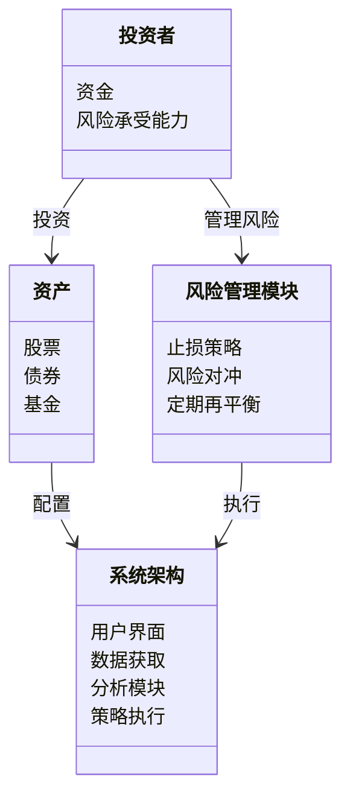

                 


# 约翰博格尔的普通投资者保护

> 关键词：约翰博格尔，投资保护，风险管理，指数基金，长期投资

> 摘要：本文深入探讨了约翰博格尔的投资理念，重点分析了普通投资者如何通过风险管理、长期投资和资产配置来保护自己的投资组合。结合实际案例和系统设计，本文为普通投资者提供了切实可行的投资策略和保护措施。

---

## 第一部分：背景介绍

### 第1章：投资的基本概念

#### 1.1 投资的基本定义
- **1.1.1 什么是投资**
  投资是指将资金投入某种资产或项目，以期在未来获得收益或资本增值的行为。投资的核心目标是通过合理配置资产，最大化收益并降低风险。

- **1.1.2 投资的基本原则**
  - 长期性：投资不是短期的投机行为，而是通过时间的积累实现财富增长。
  - 分散性：通过多样化配置资产降低风险。
  - 理性化：避免情绪化决策，坚持基本面分析。

- **1.1.3 投资的分类与外延**
  投资可以分为股票、债券、基金、房地产等多种形式，每种形式都有其独特的风险和收益特征。

#### 1.2 普通投资者的挑战
- **1.2.1 投资市场的复杂性**
  金融市场信息繁杂，普通投资者往往难以准确判断市场趋势。

- **1.2.2 信息不对称的问题**
  专业投资者和普通投资者在信息获取和分析能力上存在显著差距。

- **1.2.3 投资者的决策误区**
  情绪化决策、过度自信、追涨杀跌等行为容易导致投资损失。

---

## 第二部分：核心概念与联系

### 第2章：投资风险的分析与管理

#### 2.1 投资风险的来源
- **2.1.1 市场风险**
  市场波动导致资产价格下跌的风险，是投资中最主要的风险来源。

- **2.1.2 通货膨胀风险**
  货币贬值导致投资实际收益下降的风险。

- **2.1.3 流动性风险**
  投资资产难以快速变现的风险。

#### 2.2 投资风险的分类
- **2.2.1 系统性风险与非系统性风险**
  - 系统性风险：影响整个市场的风险，如经济衰退、战争等。
  - 非系统性风险：特定资产或行业面临的风险。

- **2.2.2 货币风险与信用风险**
  - 货币风险：汇率波动对投资的影响。
  - 信用风险：债务人违约的风险。

- **2.2.3 操作风险与法律风险**
  - 操作风险：交易过程中的失误或欺诈行为。
  - 法律风险：政策变化或法律纠纷对投资的影响。

### 第3章：投资组合管理

#### 3.1 投资组合的基本原理
- **3.1.1 资产配置的核心要素**
  资产配置是根据投资者的风险承受能力和收益目标，将资金分配到不同资产类别中。

- **3.1.2 分散投资的原理与实践**
  通过投资不同类型的资产降低风险。

- **3.1.3 投资组合的优化方法**
  使用现代投资组合理论（MPT）优化资产配置。

#### 3.2 投资组合的构建与调整
- **3.2.1 资产配置的动态调整**
  根据市场变化和个人情况调整资产配置。

- **3.2.2 个股与基金的选择标准**
  选择具有长期增长潜力的优质资产。

- **3.2.3 定期再平衡的重要性**
  定期调整投资组合以维持目标配置。

---

## 第三部分：风险管理策略

### 第4章：风险管理的核心策略

#### 4.1 止损策略的设计与实施
- **4.1.1 什么是止损**
  止损是指在投资亏损达到预设比例时立即卖出，以避免更大的损失。

- **4.1.2 止损点的设置方法**
  - 固定比例止损：根据初始投资金额设置止损比例。
  - 技术指标止损：利用均线、RSI等技术指标设置止损点。

- **4.1.3 止损策略的优缺点**
  - 优点：有效控制亏损，保护本金。
  - 缺点：可能错过后续反弹机会。

#### 4.2 风险对冲的实现方式
- **4.2.1 使用保险产品的对冲**
  投保相关保险产品，转移部分投资风险。

- **4.2.2 利用衍生工具对冲风险**
  使用期货、期权等衍生工具对冲市场波动风险。

- **4.2.3 风险对冲的局限性**
  对冲成本较高，且并不能完全消除风险。

### 第5章：长期投资与复利效应

#### 5.1 长期投资的哲学
- **5.1.1 时间在投资中的重要性**
  长期投资能够充分挖掘复利效应，实现财富的指数级增长。

- **5.1.2 复利效应的数学模型**
  复利公式：$$ A = P(1 + r)^n $$
  其中，A为终值，P为本金，r为年收益率，n为投资年数。

- **5.1.3 长期投资的纪律性要求**
  长期投资需要坚持投资策略，避免频繁交易。

#### 5.2 约翰博格尔的投资理念
- **5.2.1 价值投资的核心思想**
  买入优质的资产并长期持有，避免频繁交易。

- **5.2.2 指数基金的优势**
  指数基金分散投资，费用低，适合普通投资者。

- **5.2.3 普通投资者的误区**
  追求短期收益，频繁交易，忽略长期价值。

---

## 第四部分：系统分析与架构设计

### 第6章：投资保护系统的构建

#### 6.1 系统功能设计
- **6.1.1 领域模型（Mermaid类图）**



---

## 第五部分：项目实战

### 第7章：基于指数基金的长期投资策略

#### 7.1 项目介绍
- 选择指数基金作为投资标的，利用其分散性和低成本优势。

#### 7.2 环境安装
- 使用 Python 和 Pandas 进行数据分析，使用 Matplotlib 绘制图表。

#### 7.3 核心实现代码
```python
import pandas as pd
import matplotlib.pyplot as plt

# 获取指数基金数据
data = pd.read_csv('index_fund.csv')

# 计算累计收益
data['cumulative_return'] = (1 + data['return']).cumprod()

# 绘制收益曲线
plt.figure(figsize=(10, 6))
plt.plot(data['date'], data['cumulative_return'])
plt.title('Index Fund Cumulative Return Over Time')
plt.xlabel('Date')
plt.ylabel('Cumulative Return')
plt.show()
```

#### 7.4 实际案例分析
- 通过历史数据分析，证明指数基金的长期收益表现优于大部分主动管理基金。

---

## 第六部分：最佳实践与总结

### 第8章：投资保护的注意事项

#### 8.1 最佳实践
- 定期审视和调整投资组合。
- 保持长期投资的纪律性。
- 避免情绪化决策。

#### 8.2 小结
普通投资者通过科学的资产配置、有效的风险管理以及长期投资策略，完全可以实现财富的保值与增值。

---

## 作者

作者：AI天才研究院/AI Genius Institute & 禅与计算机程序设计艺术 /Zen And The Art of Computer Programming

---

本文通过详细分析约翰博格尔的投资理念，结合实际案例和系统设计，为普通投资者提供了切实可行的投资策略和保护措施。希望本文能够帮助读者更好地理解投资的本质，并在实际操作中规避风险，实现财富的长期增长。

