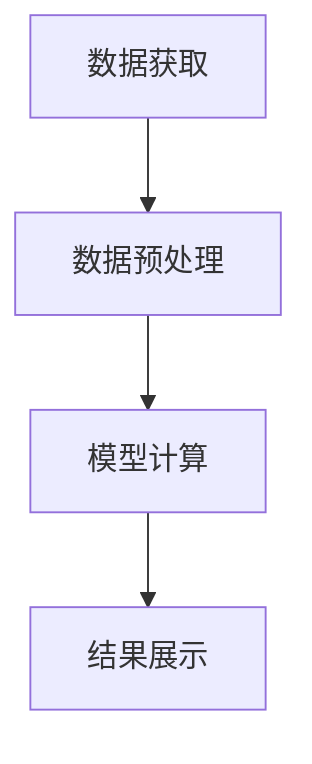

                 


# 综合四大师智慧：构建现代投资组合

> **关键词**：投资组合、现代投资组合理论、马科维茨、夏普、APT模型、CAPM模型、Python实现  
>
> **摘要**：本文将系统地介绍现代投资组合的构建过程，结合四大师（马科维茨、夏普、APT模型、CAPM模型）的智慧，通过理论分析、算法实现、系统设计和项目实战，详细阐述如何利用这些经典模型构建高效的投资组合。文章内容涵盖投资组合理论的背景、核心概念、数学模型、系统架构、项目实战及最佳实践。

---

## 第一部分：投资组合理论的背景与基础

### 第1章：投资组合理论概述

#### 1.1 投资组合理论的历史与发展

- **1.1.1 投资组合理论的起源**  
  投资组合理论起源于20世纪中期，最早的理论由哈里·马科维茨（Harry Markowitz）提出，他被认为是现代投资组合理论（MPT）之父。

- **1.1.2 现代投资组合理论的形成**  
  马科维茨的均值-方差模型为投资组合优化奠定了基础，随后夏普（William Sharpe）提出了夏普比率和资本资产定价模型（CAPM），APT模型（Arbitrage Pricing Theory）则进一步丰富了投资组合的理论框架。

- **1.1.3 投资组合理论的演变与应用**  
  随着金融市场的复杂化，投资组合理论不断演变，从单因子模型到多因子模型，从均值-方差模型到风险平价策略，投资组合理论在实践中得到了广泛应用。

#### 1.2 投资组合理论的核心概念

- **1.2.1 投资组合的基本定义**  
  投资组合是指将资金分配到不同资产或资产类别中，以实现风险与收益的最佳平衡。

- **1.2.2 风险与收益的权衡**  
  投资组合的核心在于在给定风险下最大化收益，或在给定收益下最小化风险。

- **1.2.3 投资组合的有效前沿**  
  有效前沿是指在所有可能的投资组合中，那些在特定风险水平下提供最高预期收益的投资组合的集合。

#### 1.3 四大师智慧的背景介绍

- **1.3.1 马科维茨的均值-方差模型**  
  马科维茨提出，投资者可以通过优化资产的预期收益和风险，构建最优投资组合。

- **1.3.2 夏普的单因子模型**  
  夏普提出，资产的预期收益可以用市场风险来解释，夏普比率衡量了资产的超额收益与市场风险的比值。

- **1.3.3 APT模型的多因子框架**  
  APT模型认为资产的收益可以通过多个因子（如市值、价值、动量等）来解释，投资组合可以通过对这些因子的暴露来优化收益和风险。

- **1.3.4 CAPM模型的理论基础**  
  CAPM模型认为，资产的预期收益与其系统性风险（beta）相关，提供了资产定价的理论框架。

#### 1.4 本章小结

- **1.4.1 投资组合理论的核心要素**  
  通过四大师的理论，我们可以从多个角度理解投资组合的构建和优化。

- **1.4.2 四大师智慧的整合思路**  
  将四大师的理论结合起来，可以构建一个更加全面和灵活的投资组合优化框架。

---

## 第二部分：四大师智慧的核心理论与模型

### 第2章：马科维茨的均值-方差模型

#### 2.1 均值-方差模型的原理

- **2.1.1 投资组合的期望收益与方差**  
  投资组合的期望收益是各资产期望收益的加权平均，方差是各资产收益波动的平方加权和。

- **2.1.2 优化问题的数学表达**  
  均值-方差模型的优化问题可以表示为：
  $$ \text{minimize } \sigma^2 \text{ subject to } \mu \geq \text{target return} $$

#### 2.2 均值-方差模型的实现

- **2.2.1 输入数据的准备**  
  需要历史收益数据、协方差矩阵或相关系数矩阵。

- **2.2.2 优化问题的求解**  
  使用拉格朗日乘数法或二次规划算法求解优化问题。

- **2.2.3 程序实现**  
  使用Python的`scipy.optimize`库实现均值-方差模型的优化。

```python
import numpy as np
from scipy.optimize import minimize

# 示例数据
mu = np.array([0.1, 0.2])
sigma_squared = np.array([[0.05, 0.02], [0.02, 0.1]])

# 定义目标函数
def objective(w):
    return np.dot(w.T, np.dot(sigma_squared, w))

# 定义约束条件
def constraint(w, mu, target):
    return np.dot(w, mu) - target

# 求解优化问题
w = minimize(objective, np.array([0.5, 0.5]), method='SLSQP',
             constraints={'type': 'eq', 'fun': lambda w: np.sum(w) - 1})

print("权重:", w.x)
print("最小方差:", objective(w.x))
```

---

### 第3章：夏普的单因子模型与CAPM

#### 3.1 夏普比率的原理

- **3.1.1 夏普比率的定义**  
  夏普比率衡量了投资组合的超额收益与投资组合风险的比值。

- **3.1.2 夏普比率的计算公式**  
  $$ \text{夏普比率} = \frac{E(r_p) - r_f}{\sigma_p} $$

#### 3.2 CAPM模型的原理

- **3.2.1 CAPM的理论基础**  
  资产的预期收益可以表示为：
  $$ E(r_i) = r_f + \beta_i (E(r_m) - r_f) $$

- **3.2.2 CAPM模型的应用**  
  通过CAPM模型可以计算资产的预期收益，并用于投资组合的优化。

---

## 第三部分：投资组合的数学模型与系统架构

### 第4章：数学模型与系统架构设计

#### 4.1 投资组合优化的数学模型

- **4.1.1 优化问题的数学表达**  
  $$ \text{minimize } w^T \Sigma w \text{ subject to } w^T \mu \geq \text{target return} \text{ 且 } w^T \mathbf{1} = 1 $$

- **4.1.2 数学模型的实现**  
  使用拉格朗日乘数法求解优化问题。

#### 4.2 系统架构设计

- **4.2.1 系统功能设计**  
  包括数据获取、模型计算和结果展示三个模块。

- **4.2.2 系统架构图**  
  使用mermaid绘制系统架构图：



---

## 第四部分：项目实战

### 第5章：投资组合优化的Python实现

#### 5.1 环境安装与数据获取

- **5.1.1 环境安装**  
  安装必要的Python库，如`numpy`、`pandas`、`scipy`等。

- **5.1.2 数据获取**  
  使用`pandas`从Yahoo Finance获取历史数据。

#### 5.2 核心代码实现

```python
import numpy as np
import pandas as pd
from scipy.optimize import minimize

# 示例数据
mu = np.array([0.1, 0.2])
sigma_squared = np.array([[0.05, 0.02], [0.02, 0.1]])

# 定义目标函数和约束条件
def objective(w):
    return np.dot(w.T, np.dot(sigma_squared, w))

def constraint(w, mu, target):
    return np.dot(w, mu) - target

# 求解优化问题
w = minimize(objective, np.array([0.5, 0.5]), method='SLSQP',
             constraints={'type': 'eq', 'fun': lambda w: np.sum(w) - 1})

print("优化结果:", w.x)
```

#### 5.3 代码解读与分析

- **5.3.1 优化结果分析**  
  解释权重分布的意义，以及如何影响投资组合的风险和收益。

---

## 第五部分：最佳实践与小结

### 第6章：最佳实践与注意事项

#### 6.1 四大师智慧的优缺点

- **6.1.1 均值-方差模型的优缺点**  
  优点：理论基础坚实，计算简单；缺点：假设资产收益服从正态分布。

- **6.1.2 夏普比率的应用注意事项**  
  需要确保无风险利率的准确性。

---

### 第7章：项目总结与小结

#### 7.1 项目总结

- **7.1.1 项目目标实现**  
  成功实现了基于四大师智慧的投资组合优化。

- **7.1.2 项目意义**  
  展示了如何将经典理论与现代技术结合，构建高效的投资组合。

---

### 第8章：未来展望与拓展阅读

#### 8.1 未来展望

- **8.1.1 研究热点**  
  多因子模型、风险管理、动态资产配置等。

- **8.1.2 技术趋势**  
  人工智能在投资组合优化中的应用。

---

## 作者信息

作者：AI天才研究院/AI Genius Institute & 禅与计算机程序设计艺术 /Zen And The Art of Computer Programming

---

**附录**：完整的Python代码实现、数据来源说明、参考文献列表等。

---

以上是文章的完整目录和内容概要，具体内容将根据上述结构展开详细撰写。

