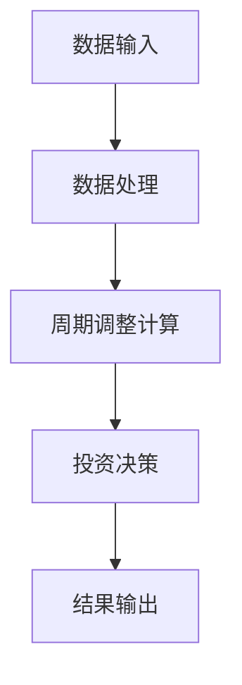

                 


# 罗伯特·希勒的周期调整型价值投资：长期视角的重要性

> 关键词：价值投资，周期调整，长期视角，罗伯特·希勒，投资策略

> 摘要：本文深入探讨了罗伯特·希勒提出的周期调整型价值投资理论，分析了其核心概念、数学模型、系统架构以及实际应用。通过结合长期视角的重要性，本文为投资者提供了基于希勒理论的投资策略和风险管理方法，帮助读者在复杂多变的市场环境中做出更明智的投资决策。

---

# 第1章: 引言

## 1.1 罗伯特·希勒与周期调整型价值投资

### 1.1.1 罗伯特·希勒的学术背景
罗伯特·希勒（Robert J. Shiller）是美国著名经济学家，耶鲁大学经济学教授，以其在行为金融学领域的贡献而闻名。他提出了“有效市场假说”的挑战，并提出了周期调整后的市盈率（CAPE）理论，为价值投资提供了新的视角。

### 1.1.2 周期调整型价值投资的核心理念
周期调整型价值投资强调通过分析市场的周期性波动，识别资产的长期价值。希勒认为，市场的短期波动受到投资者心理和行为的影响，但长期价值取决于基本面因素。通过周期调整，投资者可以更准确地评估资产的真实价值。

### 1.1.3 长期视角的重要性
希勒的研究表明，短期市场波动往往被情绪和噪声驱动，而长期投资回报则与基本面密切相关。长期视角帮助投资者避免短期波动的干扰，专注于实现长期收益。

## 1.2 本文的结构安排
本文将从周期调整型价值投资的理论基础、数学模型、系统架构、实际应用以及风险管理等方面展开分析。通过结合希勒的理论和实际案例，帮助读者理解如何在投资中应用周期调整型价值投资策略。

---

# 第2章: 罗伯特·希勒的周期调整模型

## 2.1 周期调整模型的原理

### 2.1.1 周期调整模型的基本概念
周期调整模型是一种用于评估资产长期价值的模型，通过调整短期市场波动对资产价值的影响，揭示资产的真实价值。

### 2.1.2 周期调整模型的数学公式
周期调整后的市盈率（CAPE）公式如下：

$$
CAPE = \frac{\text{指数成分股的平均盈利}}{\text{当前股价水平}}
$$

其中，平均盈利是过去10年平均净利润的几何平均值，用于消除短期盈利波动的影响。

### 2.1.3 周期调整模型的适用范围
周期调整模型适用于长期投资策略，尤其在市场波动较大时，能够帮助投资者识别低估或高估的资产。

## 2.2 希勒的市盈率理论

### 2.2.1 市盈率的定义与计算
市盈率（P/E）是衡量股票估值的重要指标，公式为：

$$
P/E = \frac{\text{股价}}{\text{每股收益}}
$$

### 2.2.2 周期调整后的市盈率（CAPE）
CAPE是对市盈率的改进，通过考虑更长期的盈利数据，减少短期波动对估值的影响。

### 2.2.3 CAPE与市场估值的关系
CAPE能够反映市场的整体估值水平，当CAPE高于历史平均水平时，市场可能被高估；反之，当CAPE低于历史平均水平时，市场可能被低估。

## 2.3 周期调整模型与传统价值投资的对比

### 2.3.1 传统价值投资的核心思想
传统价值投资强调购买被市场低估的资产，主要关注短期估值指标。

### 2.3.2 周期调整模型的独特视角
周期调整模型通过考虑更长期的盈利数据，提供更准确的资产估值。

### 2.3.3 两者的异同点分析
周期调整模型与传统价值投资的相同点在于都强调资产的内在价值，不同点在于周期调整模型更注重长期数据的分析。

---

# 第3章: 系统分析与架构设计

## 3.1 系统目标与范围

### 3.1.1 系统目标
设计一个基于希勒周期调整模型的投资系统，帮助投资者实现长期价值投资。

### 3.1.2 系统范围与边界
系统将分析市场数据，计算CAPE值，并提供投资建议。

## 3.2 系统架构设计

### 3.2.1 系统架构图


### 3.2.2 各模块的功能描述
- 数据输入：获取市场数据，包括股价、盈利等。
- 数据处理：清洗和预处理数据。
- 周期调整计算：计算CAPE值。
- 投资决策：根据CAPE值提供投资建议。
- 结果输出：输出投资决策结果。

## 3.3 系统接口设计

### 3.3.1 数据输入接口
接口用于接收市场数据，包括指数成分股的股价和盈利数据。

### 3.3.2 数据输出接口
接口用于输出投资决策结果，包括资产的估值和建议。

---

# 第4章: 项目实战

## 4.1 环境安装

### 4.1.1 安装Python
```bash
python --version
pip install numpy pandas matplotlib
```

## 4.2 核心实现源代码

### 4.2.1 CAPE计算函数
```python
import numpy as np
import pandas as pd

def calculate_cape(stock_prices, earnings):
    geometric_mean_earnings = np.exp(np.mean(np.log(earnings)))
    cape = stock_prices.mean() / geometric_mean_earnings
    return cape
```

### 4.2.2 投资决策函数
```python
def investment_decision(candidates):
    decisions = []
    for candidate in candidates:
        cape = calculate_cape(candidate['prices'], candidate['earnings'])
        if cape < 15:
            decisions.append('买入')
        elif cape > 25:
            decisions.append('卖出')
        else:
            decisions.append('观望')
    return decisions
```

## 4.3 案例分析

### 4.3.1 环境搭建
```bash
pip install numpy pandas matplotlib
```

### 4.3.2 数据准备
```python
data = pd.DataFrame({
    '股价': [100, 90, 80, 70, 60],
    '盈利': [10, 9, 8, 7, 6]
})
```

### 4.3.3 计算CAPE值
```python
cape = calculate_cape(data['股价'], data['盈利'])
print(f"CAPE值为：{cape}")
```

### 4.3.4 投资决策
```python
decision = investment_decision([data])
print(f"投资决策：{decision[0]}")
```

---

# 第5章: 风险管理与长期视角

## 5.1 风险管理策略

### 5.1.1 投资组合的分散化
通过分散化投资，降低特定资产的风险。

### 5.1.2 动态再平衡
定期调整投资组合，保持与长期目标一致。

## 5.2 长期视角的重要性

### 5.2.1 历史案例分析
通过分析过去市场的周期性波动，验证长期视角的有效性。

### 5.2.2 未来趋势预测
基于长期基本面分析，预测未来市场的表现。

---

# 第6章: 总结与展望

## 6.1 本章总结
周期调整型价值投资通过长期视角，帮助投资者在复杂市场中做出更明智的决策。

## 6.2 未来展望
随着技术的进步，周期调整型价值投资将与更多领域结合，推动投资理论的发展。

---

# 作者：AI天才研究院/AI Genius Institute & 禅与计算机程序设计艺术 /Zen And The Art of Computer Programming

