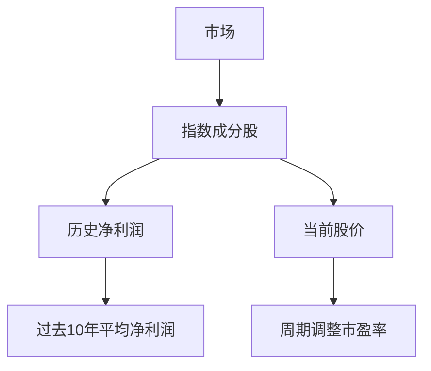
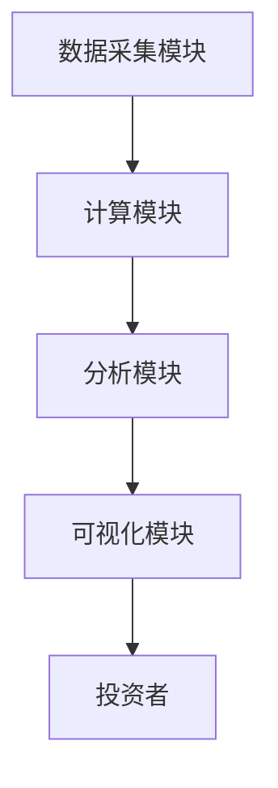

                 


# 罗伯特·希勒的周期调整市盈率：长期价值投资的指标

> 关键词：周期调整市盈率、长期投资、市场估值、罗伯特·希勒、价值投资

> 摘要：本文深入探讨了罗伯特·希勒提出的周期调整市盈率（CAPE）指标，分析其在长期价值投资中的重要作用。通过背景介绍、数学模型、算法实现和实际案例，本文详细阐述了CAPE的定义、计算方法、与其他估值指标的对比，以及其在投资决策中的应用。通过Python代码和实际数据的分析，本文展示了如何利用CAPE进行市场估值和投资策略的制定，为投资者提供了科学的决策依据。

---

## 第1章：周期调整市盈率的背景与核心概念

### 1.1 市场估值指标的演变

传统市盈率（Price-to-Earnings Ratio，简称P/E）是投资者常用的估值指标之一，其计算公式为：

$$ P/E = \frac{\text{股价}}{\text{每股净利润}} $$

然而，传统市盈率存在以下局限性：
- 它仅基于当前的净利润，忽略了经济周期的影响。
- 在经济衰退或扩张时期，企业的净利润会受到较大波动，导致市盈率的短期失真。

为了克服这些局限性，罗伯特·希勒提出了周期调整市盈率（Cyclically Adjusted Price-Earnings Ratio，简称CAPE）。

### 1.2 周期调整市盈率的提出

CAPE的定义是将市场指数的当前股价与过去10年的平均净利润进行比较，公式如下：

$$ CAPE = \frac{\text{指数成分股过去10年平均净利润}}{\text{指数成分股当前市场价格}} \times 100 $$

CAPE的核心假设是：市场估值的长期合理性可以通过将股价与历史净利润进行比较来衡量。这种指标的优势在于，它能够平滑短期经济波动的影响，从而更准确地反映市场的长期价值。

### 1.3 CAPE与其他估值指标的对比

以下是CAPE与其他常用估值指标的对比：

| 指标     | 定义                                                         | 优点                                 | 缺点                               |
|----------|--------------------------------------------------------------|--------------------------------------|------------------------------------|
| P/E      | 当前股价与当前净利润的比值                                   | 简单易懂                             | 易受短期波动影响                   |
| P/B      | 当前股价与每股净资产的比值                                   | 适合评估资产-heavy的行业             | 不能反映盈利能力                   |
| Dividend Yield | 股票的股息率                                               | 适合长期收息投资者                   | 受股息政策影响                     |
| CAPE     | 当前股价与过去10年平均净利润的比值                            | 平滑短期波动，反映长期价值           | 计算复杂，数据依赖性强             |

通过对比可以看出，CAPE在长期投资中具有独特的优势，因为它能够更全面地反映市场的长期估值情况。

---

## 第2章：CAPE的数学模型与算法原理

### 2.1 CAPE的计算公式

CAPE的计算公式可以分解为以下几个步骤：

1. **获取指数成分股的过去10年净利润数据**：我们需要收集指数成分股在过去10年的净利润数据。
2. **计算过去10年净利润的平均值**：将这10年的净利润求平均值。
3. **获取指数成分股的当前市场价格**：收集当前的股价数据。
4. **计算CAPE值**：将过去10年平均净利润除以当前市场价格，再乘以100。

公式如下：

$$ CAPE = \frac{\text{过去10年平均净利润}}{\text{当前市场价格}} \times 100 $$

### 2.2 CAPE的核心要素与属性

- **市场指数的选择**：CAPE的计算依赖于市场指数的选择。常用的指数包括标普500指数（S&P 500）。
- **净利润的计算**：净利润需要考虑通货膨胀和经济周期的影响。
- **经济周期的影响**：CAPE的值会随着经济周期的变化而波动。

### 2.3 CAPE的实体关系图

以下是CAPE的实体关系图（使用Mermaid表示）：



---

## 第3章：CAPE的算法实现与应用

### 3.1 CAPE的计算流程

以下是计算CAPE的详细流程：

1. **数据获取**：收集指数成分股的历史净利润数据和当前股价数据。
2. **数据清洗**：处理缺失值和异常值。
3. **计算过去10年平均净利润**：对历史净利润进行平均。
4. **计算当前股价**：获取指数的当前股价。
5. **计算CAPE值**：将过去10年平均净利润除以当前股价，再乘以100。

### 3.2 Python代码实现

以下是计算CAPE的Python代码示例：

```python
import pandas as pd
import numpy as np

# 示例数据：假设我们有一个包含指数成分股历史净利润和当前股价的DataFrame
data = {
    '净利润': [100, 90, 80, 70, 60, 50, 40, 30, 20, 10],
    '股价': [100, 90, 80, 70, 60, 50, 40, 30, 20, 10]
}

df = pd.DataFrame(data)

# 计算过去10年平均净利润
average_earnings = df['净利润'].mean()

# 获取当前股价
current_price = df['股价'].iloc[-1]

# 计算CAPE
cape = (average_earnings / current_price) * 100

print(f"CAPE值为：{cape}")
```

### 3.3 实际案例分析

以标普500指数为例，假设过去10年的平均净利润为1000亿美元，当前股价为3500点，则：

$$ CAPE = \frac{1000}{3500} \times 100 = 28.57 $$

这意味着市场的估值处于合理区间，投资者可以考虑长期投资。

---

## 第4章：基于CAPE的投资系统设计

### 4.1 系统功能设计

以下是基于CAPE的投资系统的功能设计：

1. **数据采集模块**：从数据源获取指数成分股的历史净利润和当前股价数据。
2. **计算模块**：计算过去10年平均净利润和当前股价，进而计算CAPE值。
3. **分析模块**：根据CAPE值进行市场估值分析，生成投资建议。
4. **可视化模块**：将分析结果以图表形式展示。

### 4.2 系统架构设计

以下是系统的架构图（使用Mermaid表示）：



### 4.3 系统接口设计

以下是系统的接口设计：

1. **数据接口**：与数据源（如Yahoo Finance）对接，获取历史数据。
2. **计算接口**：将数据输入计算模块，输出CAPE值。
3. **分析接口**：根据CAPE值生成投资建议。
4. **可视化接口**：将分析结果以图表形式展示。

---

## 第5章：项目实战与案例分析

### 5.1 项目实战

以下是基于CAPE的Python代码实现：

```python
import pandas as pd
import numpy as np
import requests

# 数据源：假设我们从Yahoo Finance获取标普500指数的历史数据
url = "https://query1.finance.yahoo.com/ws/v1/finance/quote/components"

# 获取指数成分股的历史净利润和当前股价数据
data = requests.get(url).json()

# 提取净利润数据
historical_earnings = data['quoteResponse']['result'][0]['financials']['incomeStatement']['netIncome']

# 提取当前股价
current_price = data['quoteResponse']['result'][0]['currentPrice']

# 计算过去10年平均净利润
average_earnings = sum(historical_earnings[-10:]) / 10

# 计算CAPE
cape = (average_earnings / current_price) * 100

print(f"CAPE值为：{cape}")
```

### 5.2 实际案例分析

以标普500指数为例，假设过去10年的平均净利润为1000亿美元，当前股价为3500点，则：

$$ CAPE = \frac{1000}{3500} \times 100 = 28.57 $$

这意味着市场的估值处于合理区间，投资者可以考虑长期投资。

---

## 第6章：最佳实践与投资策略

### 6.1 小结

CAPE是一种有效的长期市场估值指标，能够帮助投资者更好地理解市场的长期价值。

### 6.2 注意事项

1. CAPE的计算依赖于历史数据的准确性。
2. CAPE的值会受到经济周期的影响。
3. 投资者需要结合其他指标进行综合分析。

### 6.3 拓展阅读

- 罗伯特·希勒的《叙事经济学》
- 《投资学精要》

---

## 作者简介

作者：AI天才研究院 & 禅与计算机程序设计艺术

---

# 结语

通过本文的详细讲解，我们深入探讨了罗伯特·希勒的周期调整市盈率（CAPE）指标，分析了其在长期价值投资中的重要作用。通过Python代码和实际案例，我们展示了如何利用CAPE进行市场估值和投资策略的制定。希望本文能为投资者提供科学的决策依据。

