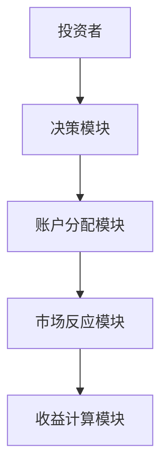
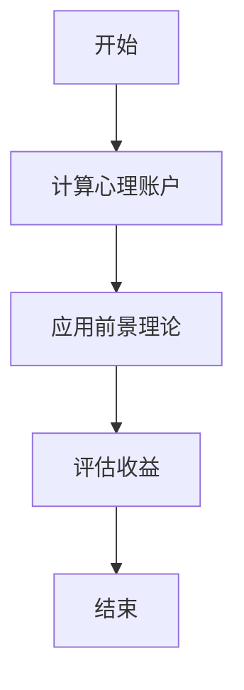

                 


# 罗伯特·希勒的行为经济学在投资中的应用

## 关键词：行为经济学，投资决策，罗伯特·希勒，心理账户，前景理论

## 摘要：  
本文探讨了罗伯特·希勒的行为经济学理论在投资中的应用，重点分析了心理账户、前景理论等核心概念，结合数学模型和实际案例，详细阐述了行为偏差对投资决策的影响，并提出了基于行为经济学的投资策略。

---

# 第1章：行为经济学与投资概述

## 1.1 行为经济学的基本概念  
行为经济学研究人类在经济决策中的心理偏差，挑战了传统经济学的理性人假设。  

## 1.2 行为经济学在投资中的应用  
行为偏差影响投资者决策，导致市场波动。  

## 1.3 罗伯特·希勒的学术贡献  
希勒的研究揭示了市场参与者的心理因素对资产定价的影响。

---

# 第2章：行为经济学的核心概念与联系

## 2.1 心理账户  
投资者将资金划分为多个心理账户，影响决策。  

## 2.2 前景理论  
决策者在损失和收益面前表现出非对称风险偏好。  

## 2.3 行为偏差与市场波动  
行为偏差引发非理性投资行为，影响市场价格。

---

# 第3章：行为经济学在投资中的数学模型与算法

## 3.1 前景理论的效用函数  
$$ U = \lambda \cdot \text{max}( \alpha \cdot w^{k}, -\beta \cdot (-w)^k ) $$  

## 3.2 心理账户模型  
$$ A = \sum_{i=1}^{n} w_i \cdot x_i $$  

---

# 第4章：投资中的系统分析与架构设计

## 4.1 系统架构图  


## 4.2 算法流程图  


---

# 第5章：项目实战

## 5.1 环境安装  
安装必要的Python库，如`numpy`和`pandas`。

## 5.2 核心代码实现  
```python
import numpy as np

def前景理论(w, α, β, λ):
    return λ * np.max([α * w**2, -β * (-w)**2])

# 示例数据
w = np.array([1, 2, -1])
结果 = 前景理论(w, 0.5, 0.5, 1)
print(结果)
```

## 5.3 实际案例分析  
分析投资者在市场下跌时的行为偏差。

---

# 第6章：最佳实践与小结

## 6.1 投资策略建议  
结合行为经济学理论，制定更合理的投资策略。

## 6.2 注意事项  
避免过度依赖行为经济学，结合传统理论。

---

作者：AI天才研究院 & 禅与计算机程序设计艺术

