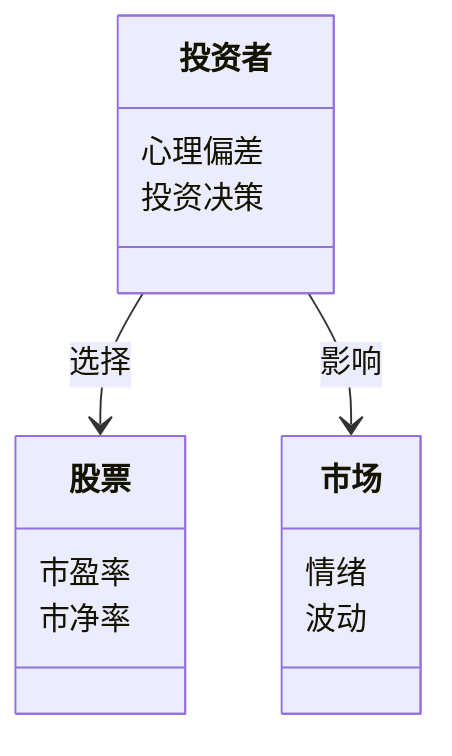

                 


# 罗伯特·希勒的行为金融学与价值投资：心理因素的影响

> 关键词：行为金融学、价值投资、心理因素、市场情绪、认知偏差、投资决策

> 摘要：本文深入探讨了罗伯特·希勒在行为金融学领域的贡献及其对价值投资的影响，重点分析了心理因素如何影响投资者的决策过程。通过结合行为金融学的核心理论与价值投资的实践方法，本文揭示了投资者心理偏差对市场行为和投资策略的具体影响，为投资者提供了基于心理学视角的投资决策框架。

---

# 第一部分: 行为金融学与价值投资的背景与基础

## 第1章: 行为金融学与价值投资概述

### 1.1 行为金融学的核心概念

#### 1.1.1 传统金融学的局限性
传统金融学假设市场是完全理性的，价格反映了所有可用信息（有效市场假说）。然而，实际市场中存在大量非理性行为，如价格波动和市场泡沫，这表明传统金融学的局限性。

#### 1.1.2 行为金融学的定义与研究范围
行为金融学研究投资者心理、情绪和认知偏差对市场行为的影响。其研究范围包括情绪、认知偏差、社会心理因素等。

#### 1.1.3 价值投资的基本原理
价值投资强调寻找市场价格低于内在价值的股票。核心理念包括安全边际、长期投资和复利效应。

### 1.2 罗伯特·希勒的学术贡献

#### 1.2.1 希勒的主要研究领域
希勒研究了房地产市场周期、投资者情绪与市场波动、资产定价模型等。

#### 1.2.2 希勒对行为金融学的贡献
希勒提出了市场情绪理论，认为情绪是市场波动的重要驱动因素。

#### 1.2.3 价值投资的基本原理
希勒强调长期投资和内在价值的重要性，认为市场短期波动不应影响长期投资决策。

---

## 第2章: 投资者心理与市场行为

### 2.1 投资者心理偏差

#### 2.1.1 过度自信
投资者倾向于过度自信，认为自己能准确预测市场走势，导致过度交易和风险误判。

#### 2.1.2 损失厌恶
投资者对损失的厌恶程度高于对收益的追求，导致卖出亏损股票的倾向较低。

#### 2.1.3 羊群效应
投资者跟随市场趋势，导致市场泡沫和崩盘。

### 2.2 心理因素对投资决策的影响

#### 2.2.1 情绪与市场波动
情绪波动影响投资者决策，进而引发市场波动。

#### 2.2.2 信息处理偏差
投资者倾向于选择性处理信息，忽略不利信息，导致误判。

#### 2.2.3 从众心理与市场泡沫
从众心理导致市场泡沫的形成和破裂。

---

## 第3章: 市场参与者的认知与决策

### 3.1 投资者认知偏差的分类

#### 3.1.1 确认偏差
投资者倾向于寻找支持自己观点的信息，忽略相反证据。

#### 3.1.2 锚定效应
投资者过度依赖初始信息，导致决策偏差。

#### 3.1.3 过度简化
投资者简化复杂信息，导致决策失误。

### 3.2 投资者决策的框架

#### 3.2.1 理性决策框架
基于逻辑和数据分析的决策框架。

#### 3.2.2 行为决策框架
考虑心理因素的决策框架。

#### 3.2.3 情感与认知的互动
情感和认知相互影响，共同驱动投资决策。

---

# 第二部分: 价值投资与心理因素的结合

## 第4章: 价值投资的基本原理

### 4.1 价值投资的核心理念

#### 4.1.1 安全边际的概念
安全边际是市场价格与内在价值的差距，确保投资的安全性。

#### 4.1.2 内在价值的计算
内在价值是未来现金流的现值，需考虑成长性和风险。

#### 4.1.3 长期投资与复利效应
长期投资利用复利效应，实现财富增值。

### 4.2 价值投资的策略与实践

#### 4.2.1 股票筛选标准
选择低市盈率、低市净率、高股息率的股票。

#### 4.2.2 财务指标分析
分析盈利能力、偿债能力、运营效率等财务指标。

#### 4.2.3 行业分析与竞争优势
选择具有竞争优势和良好行业前景的公司。

---

## 第5章: 心理因素对价值投资的影响

### 5.1 投资者心理与价值评估

#### 5.1.1 情绪波动与市场估值偏差
情绪波动导致市场估值偏离内在价值。

#### 5.1.2 过度乐观与市场泡沫
过度乐观导致市场泡沫，低估风险。

#### 5.1.3 过度悲观与市场低估
过度悲观导致市场低估，忽视潜在机会。

### 5.2 行为偏差对投资决策的具体影响

#### 5.2.1 过度交易与交易成本
频繁交易增加成本，影响收益。

#### 5.2.2 持股偏见与投资组合调整
投资者倾向于过度持有熟悉股票，忽视分散投资。

#### 5.2.3 信息过载与决策疲劳
信息过载导致决策疲劳，影响判断。

---

## 第6章: 罗伯特·希勒的投资者心理研究

### 6.1 希勒的市场情绪理论

#### 6.1.1 市场情绪的波动性
市场情绪波动影响资产价格。

#### 6.1.2 市场情绪与资产定价
情绪波动影响资产定价模型的准确性。

#### 6.1.3 市场情绪的周期性
市场情绪呈现周期性波动。

### 6.2 希勒对长期市场趋势的分析

#### 6.2.1 房地产市场的行为分析
房地产市场的周期性波动与投资者情绪密切相关。

#### 6.2.2 股票市场的长期估值
长期估值需考虑市场情绪和经济基本面。

#### 6.2.3 行为因素对市场周期的影响
行为因素是市场周期的重要驱动力。

---

# 第三部分: 价值投资的数学模型与系统分析

## 第7章: 价值投资的数学模型

### 7.1 内在价值的计算模型

#### 7.1.1 股息贴现模型（DDM）
$$ V = \frac{D}{k - g} $$
其中，$D$为股息，$k$为折现率，$g$为股息增长率。

#### 7.1.2 自由现金流模型
$$ V = \frac{FCF}{k - g} $$
其中，$FCF$为自由现金流。

#### 7.1.3 市盈率与市净率分析
市盈率=$\frac{P}{E}$，市净率=$\frac{P}{B}$，用于评估股票估值。

### 7.2 系统分析与架构设计

#### 7.2.1 领域模型的类图


#### 7.2.2 系统架构设计


---

## 第8章: 项目实战

### 8.1 环境安装

#### 8.1.1 安装Python
```bash
python --version
pip install numpy pandas matplotlib
```

#### 8.1.2 数据获取
使用Yahoo Finance获取股票数据。

### 8.2 核心实现

#### 8.2.1 计算内在价值
```python
import numpy as np

def calculate_intrinsic_value(eps, growth_rate, required_rate):
    return eps / (required_rate - growth_rate)
```

#### 8.2.2 绘制市场情绪图
```python
import matplotlib.pyplot as plt

plt.plot(mood_data)
plt.title('Market Sentiment Over Time')
plt.show()
```

### 8.3 案例分析

#### 8.3.1 公司分析
分析某公司财务数据，计算内在价值。

#### 8.3.2 市场情绪分析
绘制市场情绪图表，观察波动性。

---

## 第9章: 总结与展望

### 9.1 总结

#### 9.1.1 核心观点回顾
心理因素对投资决策的影响不可忽视。

#### 9.1.2 研究局限
行为金融学的定量分析仍需深入。

### 9.2 未来展望

#### 9.2.1 研究方向
结合大数据和人工智能，深入分析投资者心理。

#### 9.2.2 投资策略
优化投资策略，结合心理因素和量化分析。

---

# 附录

## 附录A: 术语表

- 内在价值：股票的理论价值。
- 市盈率：股价与每股收益的比率。

## 附录B: 数据来源
- 股票数据：Yahoo Finance。
- 市场情绪数据：Sentix。

---

作者：AI天才研究院/AI Genius Institute & 禅与计算机程序设计艺术 /Zen And The Art of Computer Programming

