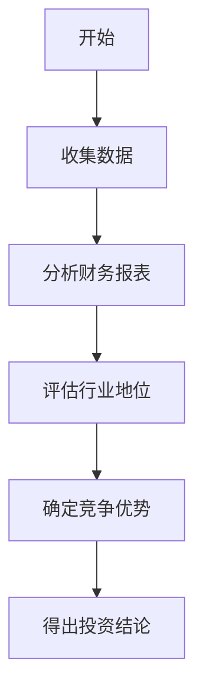
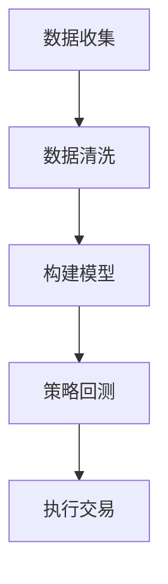
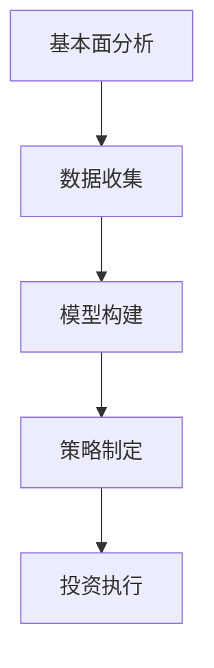
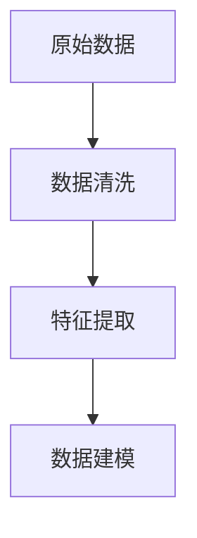
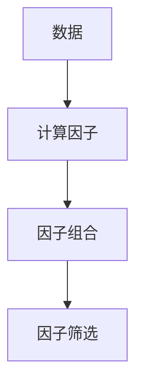
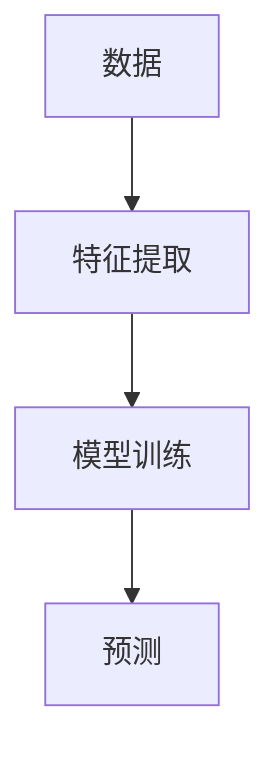

                 


# 罗伯特·阿诺特的基本面量化价值投资：数据驱动的方法

> **关键词**：基本面投资，量化投资，数据驱动，价值投资，罗伯特·阿诺特，机器学习，投资策略

> **摘要**：本文探讨了罗伯特·阿诺特的基本面量化价值投资方法，结合数据驱动的策略，详细介绍了基本面分析与量化投资的结合，数据处理与模型构建，风险管理，以及实际案例分析。通过系统的方法和数学模型，揭示了如何利用数据驱动的方法进行有效的价值投资。

---

## 第一部分: 基本面量化价值投资概述

### 第1章: 基本面投资与量化投资的结合

#### 1.1 基本面投资的核心概念

##### 1.1.1 基本面分析的定义与核心要素

基本面分析是通过研究公司的财务报表、行业地位、竞争优势、管理团队等因素，评估其内在价值的一种方法。核心要素包括：

- **财务报表分析**：收入、利润、负债、现金流等。
- **行业分析**：行业地位、竞争格局、发展趋势。
- **公司治理**：管理层稳定性、股权结构等。
- **宏观经济因素**：经济周期、利率、通货膨胀等。

**Mermaid流程图：基本面分析的主要步骤**



##### 1.1.2 基本面分析与量化分析的联系与区别

- **联系**：基本面分析提供数据来源，量化分析提供处理和分析工具。
- **区别**：基本面分析侧重于定性因素，量化分析侧重于数据和模型。

**比较表格：基本面分析与量化分析的对比**

| **方面**       | **基本面分析**               | **量化分析**                 |
|----------------|------------------------------|------------------------------|
| 数据来源       | 财务报表、行业报告等         | 市场数据、历史价格等         |
| 分析方法       | 定性分析                     | 定量分析                     |
| 优缺点         | 优点：深度理解企业；缺点：主观性高 | 优点：客观性高；缺点：可能忽略定性因素 |

##### 1.1.3 价值投资的基本原则与策略

价值投资的核心是寻找市场价格低于内在价值的公司。基本原则包括：

- **长期投资**：关注长期收益，而非短期波动。
- **安全边际**：买入价格低于内在价值。
- **分散投资**：降低风险。

---

#### 1.2 量化投资的基本原理

##### 1.2.1 量化投资的定义与特点

量化投资是通过数学模型和算法进行投资决策的方法。特点包括：

- **系统性**：基于规则，减少人为干扰。
- **数据驱动**：依赖大量数据进行分析。
- **高频交易**：利用算法快速执行交易。

**Mermaid流程图：量化投资的基本流程**



##### 1.2.2 数据驱动在量化投资中的作用

数据是量化投资的核心。通过分析历史数据，可以发现价格规律和市场趋势。

**数学公式：简单线性回归模型**

$$ y = \beta_0 + \beta_1 x + \epsilon $$

其中，\( y \) 是目标变量，\( x \) 是自变量，\( \beta_0 \) 是截距，\( \beta_1 \) 是回归系数，\( \epsilon \) 是误差项。

##### 1.2.3 量化投资与传统投资的对比分析

| **方面**       | **量化投资**               | **传统投资**                 |
|----------------|----------------------------|------------------------------|
| 数据依赖       | 高                         | 低                         |
| 系统性         | 高                         | 中                         |
| 交易频率       | 高（高频交易）             | 低                         |

---

#### 1.3 基本面量化投资的结合

##### 1.3.1 基本面量化投资的定义与特点

基本面量化投资是将基本面分析与量化方法结合，利用数据和模型进行投资决策。

**Mermaid流程图：基本面量化投资的结合**



##### 1.3.2 结合的优势

- **优势1**：结合定性与定量分析，提高准确性。
- **优势2**：利用数据驱动的方法，减少主观性。

##### 1.3.3 罗伯特·阿诺特的方法概述

罗伯特·阿诺特提出的基本面量化投资方法，强调通过数据驱动的方式，寻找具有长期竞争优势的公司。

---

## 第2章: 数据驱动的基本面分析

### 2.1 数据收集与处理

#### 2.1.1 数据来源与分类

数据来源包括：

- **市场数据**：股票价格、成交量等。
- **财务数据**：收入、利润等。
- **行业数据**：行业趋势、政策变化等。

**Mermaid流程图：数据处理流程**



#### 2.1.2 数据清洗与预处理

数据清洗包括：

- **处理缺失值**：使用均值、中位数等填充。
- **去除异常值**：利用标准差或箱线图识别。
- **数据标准化**：归一化处理。

**Python代码示例：数据清洗**

```python
import pandas as pd

# 假设df是原始数据
df['price'] = df['price'].fillna(df['price'].mean())
df = df.dropna()
df['price'] = (df['price'] - df['price'].min()) / (df['price'].max() - df['price'].min())
```

#### 2.1.3 数据特征提取

特征提取包括：

- **统计特征**：均值、方差等。
- **趋势特征**：线性回归系数。
- **时间序列特征**：移动平均、指数平滑等。

---

### 2.2 基本面因子的构建

#### 2.2.1 常见基本面因子

常见基本面因子包括：

- **市盈率（P/E）**：$ PE = \frac{Price}{Earnings} $
- **市净率（P/B）**：$ PB = \frac{Price}{Book\ Value} $
- **股息率**：$ Dividend\ Yield = \frac{Dividend}{Price} $

**Mermaid流程图：因子构建流程**



#### 2.2.2 多因子模型

多因子模型通过多个因子的组合，提高预测准确性。

**数学公式：多因子模型**

$$ Return = \alpha + \beta_1 Factor_1 + \beta_2 Factor_2 + \epsilon $$

---

### 2.3 数据驱动的行业分析

#### 2.3.1 行业分析

行业分析包括：

- **行业趋势**：经济增长、政策变化等。
- **行业比较**：行业内公司对比。

**Python代码示例：行业比较**

```python
import pandas as pd

# 假设df是行业数据
df_grouped = df.groupby('industry').mean()
print(df_grouped)
```

---

## 第3章: 量化模型的构建与应用

### 3.1 多因子模型

#### 3.1.1 模型构建

多因子模型通过多个因子的组合，提高预测准确性。

**数学公式：多因子模型**

$$ Return = \alpha + \beta_1 Factor_1 + \beta_2 Factor_2 + \epsilon $$

#### 3.1.2 回测与优化

回测是通过历史数据验证模型的有效性。

**Python代码示例：回测**

```python
import backtrader as bt

class MyStrategy(bt.Strategy):
    def __init__(self):
        self.data = self.datas[0]
        self.order = None
    
    def next(self):
        if self.order:
            return
        if self.data.close > self.data.close.mean():
            self.order = self.buy()
        elif self.data.close < self.data.close.mean():
            self.order = self.sell()

cerebro = bt.Cerebro()
cerebro.addstrategy(MyStrategy)
cerebro.run()
```

---

## 第4章: 投资策略的优化与未来趋势

### 4.1 投资策略的优化

#### 4.1.1 优化方法

优化方法包括：

- **参数优化**：调整模型参数。
- **组合优化**：优化投资组合。

**数学公式：投资组合优化**

$$ max \mu \cdot w^T - \frac{1}{2} \sigma^2 w^T w $$

其中，\( w \) 是权重向量，\( \mu \) 是收益向量，\( \sigma^2 \) 是协方差矩阵。

### 4.2 未来趋势

#### 4.2.1 人工智能的应用

人工智能在量化投资中的应用包括：

- **机器学习**：用于预测市场趋势。
- **自然语言处理**：分析新闻和社交媒体情绪。

**Mermaid流程图：人工智能在投资中的应用**



---

## 第5章: 实战案例分析

### 5.1 美国市场案例

#### 5.1.1 美国市场的基本面分析

美国市场的基本面分析包括：

- **经济指标**：GDP、失业率等。
- **行业趋势**：科技、金融等。

### 5.2 香港市场案例

#### 5.2.1 香港市场的特点

香港市场的特点包括：

- **开放性**：国际化程度高。
- **波动性**：受外部因素影响大。

---

## 第6章: 最佳实践与注意事项

### 6.1 最佳实践

- **持续学习**：关注市场变化。
- **风险管理**：控制仓位和杠杆。

### 6.2 注意事项

- **数据质量**：确保数据准确。
- **模型更新**：定期优化模型。

---

## 第7章: 项目小结与拓展阅读

### 7.1 项目小结

本文详细介绍了罗伯特·阿诺特的基本面量化投资方法，结合数据驱动的策略，提供了系统的分析和实战案例。

### 7.2 拓展阅读

- **书籍推荐**：《投资学》、《量化交易入门》。
- **工具推荐**：Python、Pandas、NumPy。

---

## 作者信息

作者：AI天才研究院/AI Genius Institute & 禅与计算机程序设计艺术 /Zen And The Art of Computer Programming

---

# 结语

通过本文的分析，读者可以深入了解罗伯特·阿诺特的基本面量化价值投资方法，并结合数据驱动的策略，进行有效的投资决策。

