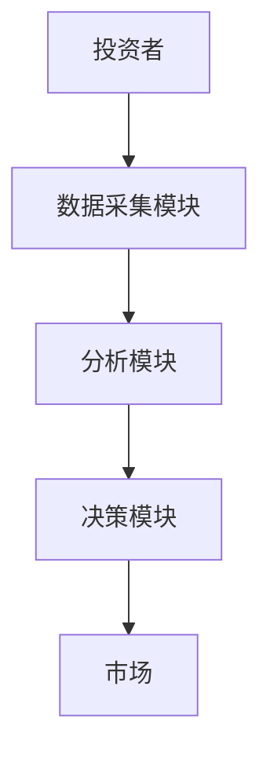

                 


# 罗伯特哈格斯特朗的成长型价值投资

> 关键词：成长型投资，价值投资，投资策略，投资分析，投资模型，投资算法

> 摘要：本文系统地介绍了罗伯特哈格斯特朗的成长型价值投资策略，从其核心概念、算法原理、系统架构到实际项目实战，全面解析了这一投资方法的理论基础和实践应用。通过详细阐述现金流折现模型、投资决策算法、系统功能模块设计以及实际案例分析，本文为读者提供了一个从理论到实践的完整指南，帮助投资者更好地理解和应用这一投资策略。

---

## 第一部分: 成长型价值投资的背景与核心概念

### 第1章: 成长型价值投资的定义与背景

#### 1.1 成长型投资的定义与特点

##### 1.1.1 成长型投资的定义
成长型投资是一种专注于投资于具有持续增长潜力的企业的方法。其核心在于通过分析企业的基本面，识别那些能够在未来较长一段时间内实现收入和利润增长的企业，并以合理的价格买入并长期持有。

##### 1.1.2 成长型投资的核心特点
- **高增长潜力**：成长型企业通常处于高增长行业，具有较高的收入增长率和利润率。
- **长期视角**：成长型投资者注重企业的长期价值创造，而非短期价格波动。
- **估值合理性**：尽管追求高增长，但成长型投资仍注重安全边际，避免过度高估企业的未来价值。

##### 1.1.3 成长型投资与价值投资的区别
| 方面        | 成长型投资                | 价值投资                |
|-------------|--------------------------|--------------------------|
| 核心目标    | 寻找高增长潜力的企业      | 寻找被市场低估的企业      |
| 时间跨度    | 长期，注重未来增长        | 短期，注重当前价值        |
| 风险承受    | 较高，因为依赖于未来的增长| 较低，因为注重安全边际    |

#### 1.2 价值投资的背景与历史

##### 1.2.1 价值投资的起源
价值投资的理念可以追溯到本杰明·格雷厄姆，他在20世纪30年代提出了“安全边际”概念，强调以低于内在价值的价格买入股票。

##### 1.2.2 罗伯特·哈格斯特朗的贡献
罗伯特·哈格斯特朗将价值投资的理念与成长型企业分析相结合，提出了成长型价值投资策略，强调在合理估值的基础上，投资于具有持续增长潜力的企业。

##### 1.2.3 成长型价值投资的演变
随着时间的推移，成长型价值投资不断发展，形成了以现金流折现模型为核心的分析方法，结合市场趋势和行业周期，进一步优化了投资策略。

#### 1.3 成长型价值投资的适用场景

##### 1.3.1 高成长行业的识别
- **技术进步**：如人工智能、大数据等行业的企业具有较高的增长潜力。
- **新兴市场**：新兴市场中的企业可能因市场扩张而实现高增长。

##### 1.3.2 成长型企业筛选标准
- **收入增长率**：通常选择收入增长率超过行业平均水平的企业。
- **利润率**：关注企业的盈利能力是否稳定且有增长趋势。
- **现金流状况**：健康的现金流是企业持续增长的重要保障。

##### 1.3.3 成长型价值投资的风险与收益
- **风险**：成长型企业通常估值较高，市场波动较大，可能导致短期亏损。
- **收益**：长期来看，成长型企业可能带来超额收益，尤其是在技术进步和市场扩张的情况下。

#### 1.4 本章小结
本章介绍了成长型投资的定义、特点及其与价值投资的区别，探讨了成长型价值投资的背景与历史演变，并分析了其适用场景和潜在风险与收益。

---

### 第2章: 成长型价值投资的核心概念与联系

#### 2.1 核心概念原理

##### 2.1.1 内在价值的计算公式
内在价值（Intrinsic Value）是企业未来现金流的现值，计算公式如下：
$$
\text{内在价值} = \sum_{t=1}^{n} \frac{\text{现金流}_t}{(1 + r)^t}
$$
其中，\( r \) 是折现率，\( n \) 是估计的持有期限。

##### 2.1.2 安全边际的定义与作用
安全边际是指股票的市场价格低于其内在价值的程度，用于降低投资风险。公式为：
$$
\text{安全边际} = \text{内在价值} - \text{市场价格}
$$

##### 2.1.3 股东权益增长模型
股东权益增长模型用于评估企业的长期增长潜力，公式为：
$$
\text{股东权益增长率} = \frac{\text{净利润增长额}}{\text{期初股东权益}}
$$

#### 2.2 核心概念属性特征对比表
| 概念       | 特征1         | 特征2         | 特征3         |
|------------|---------------|---------------|---------------|
| 内在价值    | 客观性         | 可计算性       | 时间依赖性     |
| 安全边际    | 防护性         | 心理因素       | 相对性         |
| 股东权益增长 | 复合效应       | 时间价值       | 可持续性       |

#### 2.3 ER实体关系图
```mermaid
er
  rectangle 投资者 {
    投资者ID
    投资策略
  }
  rectangle 企业 {
    企业ID
    股东权益
    内在价值
  }
  rectangle 市场 {
    市场ID
    市场价格
  }
  投资者 --> 企业: 持股
  企业 --> 市场: 上市
```

#### 2.4 本章小结
本章详细阐述了成长型价值投资的核心概念，包括内在价值、安全边际和股东权益增长模型，并通过对比表和实体关系图展示了这些概念之间的联系。

---

### 第3章: 成长型价值投资的算法原理

#### 3.1 投资决策算法流程

##### 3.1.1 算法概述
成长型价值投资算法基于现金流折现模型，通过对企业未来现金流的预测，计算其内在价值，并结合市场价格确定投资决策。

##### 3.1.2 算法步骤
1. **选择行业**：根据市场趋势和行业周期，选择具有高增长潜力的行业。
2. **筛选成长型企业**：通过基本面分析，筛选出具有持续增长潜力的企业。
3. **计算内在价值**：使用现金流折现模型计算企业的内在价值。
4. **评估安全边际**：比较市场价格与内在价值，确定安全边际。
5. **投资决策**：如果市场价格低于内在价值且存在安全边际，进行投资。

##### 3.1.3 算法实现
```python
def calculate_intrinsic_value(revenue_growth_rate, operating_margin, roe, discount_rate):
    # 简化模型，仅考虑未来5年的现金流
    cash_flows = []
    for year in range(1, 6):
        cash_flow = 100 * (1 + revenue_growth_rate) ** year
        cash_flows.append(cash_flow / (1 + discount_rate) ** year)
    return sum(cash_flows)

intrinsic_value = calculate_intrinsic_value(0.2, 0.15, 0.2, 0.08)
print(f"内在价值为：{intrinsic_value}")
```

##### 3.1.4 算法优化
为了提高算法的准确性，可以引入更多的财务指标，如自由现金流（FCF）、资本支出（CapEx）等，进一步优化现金流折现模型。

#### 3.2 算法实现的数学模型

##### 3.2.1 现金流折现模型
$$
\text{内在价值} = \sum_{t=1}^{n} \frac{\text{现金流}_t}{(1 + r)^t} + \frac{\text{终值}}{(1 + r)^n}
$$
其中，终值（TV）可以通过永续增长率 \( g \) 计算：
$$
\text{TV} = \frac{\text{现金流}_n \times (1 + g)}{(1 + r)^n}
$$

##### 3.2.2 示例计算
假设某企业的现金流如下：
- 年1：100
- 年2：120
- 年3：144
- 年4：172.8
- 年5：207.36

折现率 \( r = 8\% \)，永续增长率 \( g = 3\% \)

计算终值：
$$
\text{TV} = \frac{207.36 \times (1 + 0.03)}{(1 + 0.08)^5} = \frac{213.5808}{1.469328} \approx 145.43
$$

计算内在价值：
$$
\text{IV} = \frac{100}{1.08} + \frac{120}{1.08^2} + \frac{144}{1.08^3} + \frac{172.8}{1.08^4} + \frac{207.36}{1.08^5} + 145.43
$$

#### 3.3 本章小结
本章详细讲解了成长型价值投资的算法原理，包括现金流折现模型的数学公式和实现步骤，并通过示例计算展示了算法的应用。

---

## 第二部分: 成长型价值投资的系统分析

### 第4章: 成长型价值投资系统的架构设计

#### 4.1 系统功能设计

##### 4.1.1 领域模型


##### 4.1.2 系统功能模块
- **数据采集模块**：采集企业财务数据和市场数据。
- **分析模块**：计算内在价值和安全边际。
- **决策模块**：根据分析结果生成投资决策。

#### 4.2 系统架构设计

##### 4.2.1 系统架构图


##### 4.2.2 接口设计
- **输入接口**：接收企业财务数据和市场数据。
- **输出接口**：输出投资决策结果。

#### 4.3 本章小结
本章描述了成长型价值投资系统的架构设计，包括功能模块和系统交互流程。

---

## 第三部分: 成长型价值投资的项目实战

### 第5章: 项目实战与分析

#### 5.1 项目环境安装

##### 5.1.1 安装Python环境
```bash
pip install jupyter notebook pandas numpy
```

##### 5.1.2 安装数据分析库
```bash
pip install yfinance pandas
```

#### 5.2 核心代码实现

##### 5.2.1 计算内在价值
```python
import pandas as pd
import numpy as np

def calculate_intrinsic_value(financials, discount_rate, growth_rate):
    # 假设 financials 包含过去5年的现金流数据
    cash_flows = financials['Cash Flow'].values
    terminal_value = cash_flows[-1] * (1 + growth_rate) / (discount_rate)
    intrinsic_value = 0
    for i in range(len(cash_flows)):
        intrinsic_value += cash_flows[i] / (1 + discount_rate) ** (i + 1)
    intrinsic_value += terminal_value / (1 + discount_rate) ** len(cash_flows)
    return intrinsic_value

# 示例数据
financials = pd.DataFrame({
    'Cash Flow': [100, 120, 144, 172.8, 207.36]
})
discount_rate = 0.08
growth_rate = 0.03

iv = calculate_intrinsic_value(financials, discount_rate, growth_rate)
print(f"内在价值为：{iv}")
```

##### 5.2.2 安全边际计算
```python
market_price = 150
intrinsic_value = 200
margin = intrinsic_value - market_price
print(f"安全边际为：{margin}")
```

#### 5.3 项目小结
本章通过实际案例展示了如何使用Python代码计算内在价值和安全边际，并进行投资决策。

---

## 第四部分: 成长型价值投资的最佳实践

### 第6章: 成长型价值投资的最佳实践

#### 6.1 理论与实践结合
- **持续学习**：关注行业动态和市场趋势，及时调整投资策略。
- **风险管理**：设置止损点，控制投资风险。

#### 6.2 实践中的注意事项
- **避免过度杠杆**：合理配置资产，避免因杠杆过高导致的风险。
- **长期持有**：成长型企业需要时间来实现其增长潜力，投资者应保持耐心。

#### 6.3 拓展阅读
- 《股票做空》
- 《投资最重要的事情》
- 《价值投资实战手册》

#### 6.4 本章小结
本章总结了成长型价值投资的最佳实践，强调理论与实践的结合，并提供了风险管理的建议。

---

## 第五部分: 成长型价值投资的总结与展望

### 第7章: 总结与展望

#### 7.1 本章总结
本文系统地介绍了罗伯特哈格斯特朗的成长型价值投资策略，从核心概念、算法原理到系统架构和项目实战，全面解析了这一投资方法的理论基础和实践应用。

#### 7.2 未来展望
随着人工智能和大数据技术的发展，成长型价值投资将更加精准和高效。未来的研究可以进一步优化现金流折现模型，结合机器学习算法，提升投资决策的准确性。

---

## 附录

### 附录A: 术语表

- **内在价值**：企业的未来现金流的现值。
- **安全边际**：内在价值与市场价格的差额。
- **股东权益**：企业净资产的价值。

### 附录B: 参考文献

1. 罗伯特·哈格斯特朗：《投资最重要的事情》
2. 本杰明·格雷厄姆：《股票做空》
3. 《价值投资实战手册》

---

## 作者

作者：AI天才研究院/AI Genius Institute & 禅与计算机程序设计艺术 /Zen And The Art of Computer Programming

