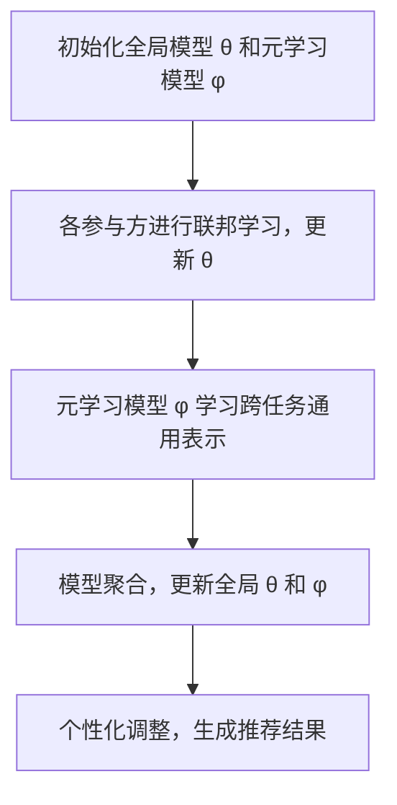
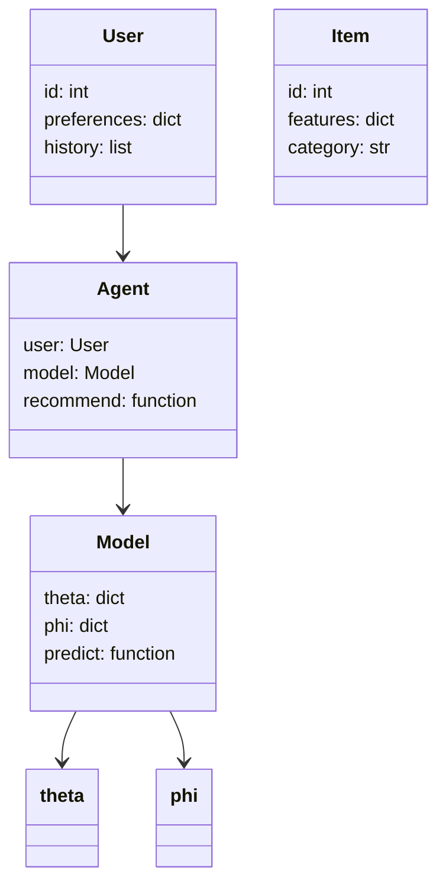
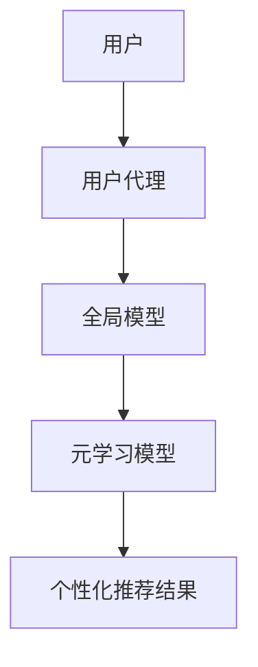
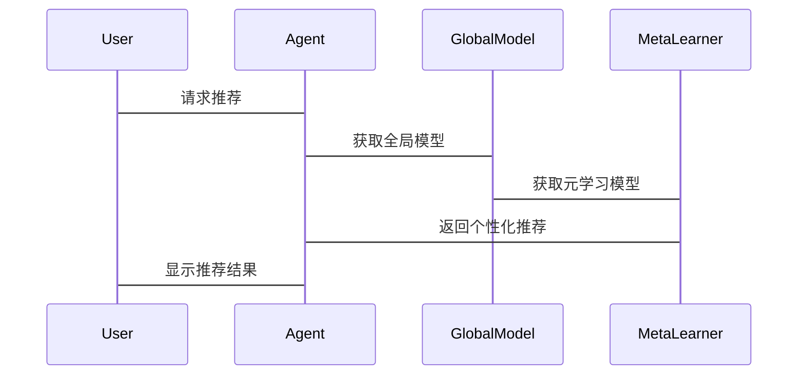

                 


# 联邦元学习在AI Agent个性化中的应用

## 关键词
联邦元学习, AI Agent, 个性化推荐, 联邦学习, 元学习, 分布式学习

## 摘要
本文探讨联邦元学习在AI Agent个性化中的应用，结合联邦学习和元学习的核心思想，解决数据隐私和个性化推荐的挑战。通过详细分析联邦元学习的算法原理、系统架构，并结合实际案例，展示如何在实际场景中应用这些技术，提升AI Agent的个性化能力。

---

# 第一章: 联邦元学习与AI Agent个性化应用背景

## 1.1 问题背景

### 1.1.1 个性化AI Agent的需求与挑战
个性化AI Agent的需求日益增长，用户期望获得更精准的服务推荐。然而，数据隐私和数据孤岛问题限制了传统集中式学习的应用。

### 1.1.2 联邦学习的兴起与应用
联邦学习通过分布式学习技术，保护数据隐私，同时利用各端数据进行模型训练，成为解决数据孤岛的重要方法。

### 1.1.3 联邦元学习的定义与目标
联邦元学习结合联邦学习和元学习，目标是通过分布式学习和跨任务的通用性，提升AI Agent的个性化推荐能力。

## 1.2 问题描述

### 1.2.1 AI Agent个性化推荐的痛点
传统个性化推荐依赖集中式数据，存在隐私泄露和数据孤岛问题。

### 1.2.2 联邦学习在数据隐私中的作用
联邦学习通过数据不出域的方式，保护用户隐私，同时实现模型更新。

### 1.2.3 联邦元学习如何解决个性化问题
通过元学习，联邦元学习能够快速适应不同用户的个性化需求，提升推荐系统的泛化能力。

## 1.3 问题解决方法

### 1.3.1 联邦学习的核心思想
各参与方在不共享原始数据的前提下，通过通信协议共享模型参数，进行联合训练。

### 1.3.2 元学习的基本原理
元学习通过学习如何学习，能够在少量数据下快速适应新任务，提升模型的泛化能力。

### 1.3.3 联邦元学习的结合与优势
将元学习应用于联邦学习中，增强模型的适应性和个性化能力，同时保护数据隐私。

## 1.4 边界与外延

### 1.4.1 联邦元学习的适用场景
适用于多机构合作、数据隐私要求高的场景，如金融、医疗和社交网络。

### 1.4.2 与传统机器学习的对比
传统机器学习依赖集中式数据，而联邦元学习通过分布式学习和元学习，提升模型的泛化能力。

### 1.4.3 与其他分布式学习方法的区分
与联邦学习相比，联邦元学习引入了元学习机制，增强了模型的适应性和个性化能力。

## 1.5 核心概念与组成

### 1.5.1 联邦元学习的核心要素
- 数据隐私保护
- 分布式模型训练
- 元学习算法

### 1.5.2 AI Agent个性化的主要组成部分
- 用户建模
- 个性化推荐
- 自适应学习

### 1.5.3 联邦元学习与AI Agent的结合方式
通过联邦学习获取全局模型，结合元学习进行个性化调整，提升推荐效果。

---

# 第二章: 联邦元学习与AI Agent的核心概念与联系

## 2.1 联邦元学习的原理

### 2.1.1 联邦学习的基本流程
1. 数据预处理：各参与方对本地数据进行预处理。
2. 模型初始化：各参与方初始化本地模型参数。
3. 模型同步：通过通信协议同步模型参数。
4. 模型训练：本地模型在本地数据上进行训练，更新模型参数。
5. 模型聚合：将各参与方的模型参数进行聚合，更新全局模型。

### 2.1.2 元学习的核心机制
1. 任务嵌入：将不同任务的信息嵌入到模型中。
2. 元网络：通过元网络学习任务间的关系，快速适应新任务。
3. 知识蒸馏：将元学习的知识蒸馏到目标模型中。

### 2.1.3 联邦元学习的数学模型
全局模型参数 $\theta$，通过联邦学习更新，元学习通过优化 $\phi$，使得模型能够快速适应新任务。

## 2.2 AI Agent个性化的核心原理

### 2.2.1 AI Agent的基本构成
- 感知层：接收用户输入和环境信息。
- 决策层：基于感知信息进行决策。
- 执行层：执行决策并反馈结果。

### 2.2.2 个性化推荐的算法特点
- 基于用户行为建模
- 通过协同过滤或深度学习进行推荐
- 实现动态更新和个性化调整

### 2.2.3 个性化与联邦学习的结合
通过联邦学习获取全局用户偏好，结合个性化调整，提升推荐的准确性和多样性。

## 2.3 联邦元学习与AI Agent的联系

### 2.3.1 联邦元学习如何提升个性化推荐的效果
通过联邦学习的全局模型和元学习的快速适应，提升推荐的准确性和个性化。

### 2.3.2 联邦元学习如何解决数据孤岛问题
通过数据不出域的方式，保护用户隐私，同时实现跨机构的数据协作。

### 2.3.3 联邦元学习如何增强AI Agent的适应性
通过元学习，AI Agent能够快速适应不同用户的需求，提升推荐的灵活性和适应性。

---

# 第三章: 联邦元学习的算法原理讲解

## 3.1 联邦元学习的算法流程

### 3.1.1 算法步骤
1. 初始化全局模型 $\theta$ 和元学习模型 $\phi$。
2. 各参与方在本地数据上进行联邦学习，更新 $\theta$。
3. 元学习模型 $\phi$ 通过优化 $\theta$，学习跨任务的通用表示。
4. 模型聚合：将各参与方的 $\theta$ 和 $\phi$ 聚合，更新全局模型。
5. 个性化调整：根据用户特征，通过 $\phi$ 进行个性化推荐。

### 3.1.2 算法流程图（Mermaid）


## 3.2 联邦元学习的数学模型

### 3.2.1 损失函数
$$ L(\theta, \phi) = L_f(\theta) + \lambda L_r(\phi) $$

其中，$L_f$ 是联邦学习的损失函数，$L_r$ 是元学习的损失函数，$\lambda$ 是调节系数。

### 3.2.2 优化目标
$$ \min_{\theta, \phi} L(\theta, \phi) $$

### 3.2.3 更新规则
$$ \theta_{t+1} = \theta_t - \eta \nabla_{\theta} L(\theta, \phi) $$
$$ \phi_{t+1} = \phi_t - \alpha \nabla_{\phi} L(\theta, \phi) $$

其中，$\eta$ 和 $\alpha$ 分别是联邦学习和元学习的学习率。

## 3.3 联邦元学习的代码实现

### 3.3.1 环境安装
```bash
pip install torch
pip install requests
pip install protobuf
```

### 3.3.2 核心代码实现（Python）
```python
import torch
from torch import nn

# 初始化全局模型和元学习模型
class GlobalModel(nn.Module):
    def __init__(self, input_dim, hidden_dim, output_dim):
        super(GlobalModel, self).__init__()
        self.fc1 = nn.Linear(input_dim, hidden_dim)
        self.fc2 = nn.Linear(hidden_dim, output_dim)

class MetaLearner(nn.Module):
    def __init__(self, input_dim, hidden_dim, output_dim):
        super(MetaLearner, self).__init__()
        self.fc1 = nn.Linear(input_dim, hidden_dim)
        self.fc2 = nn.Linear(hidden_dim, output_dim)

# 初始化模型
global_model = GlobalModel(input_dim=10, hidden_dim=20, output_dim=5)
meta_learner = MetaLearner(input_dim=20, hidden_dim=15, output_dim=5)

# 定义损失函数和优化器
criterion = nn.CrossEntropyLoss()
optimizer_global = torch.optim.Adam(global_model.parameters(), lr=0.001)
optimizer_meta = torch.optim.Adam(meta_learner.parameters(), lr=0.0001)

# 联邦学习和元学习的联合训练
for epoch in range(num_epochs):
    # 联邦学习更新
    global_model.zero_grad()
    output = global_model(data)
    loss = criterion(output, labels)
    loss.backward()
    optimizer_global.step()

    # 元学习更新
    meta_learner.zero_grad()
    with torch.no_grad():
        global_features = global_model.fc2(global_model.fc1(data))
    output_meta = meta_learner(global_features)
    loss_meta = criterion(output_meta, meta_labels)
    loss_meta.backward()
    optimizer_meta.step()
```

---

# 第四章: 系统分析与架构设计

## 4.1 项目场景介绍
我们设计了一个基于联邦元学习的个性化推荐系统，用于电商领域的用户推荐。

## 4.2 系统功能设计

### 4.2.1 领域模型类图（Mermaid）


### 4.2.2 系统架构图（Mermaid）


## 4.3 系统接口设计
- 用户代理接收用户输入并调用推荐接口。
- 全局模型和元学习模型通过API进行通信。

## 4.4 系统交互流程图（Mermaid）


---

# 第五章: 项目实战

## 5.1 环境安装
```bash
pip install torch
pip install numpy
pip install scikit-learn
```

## 5.2 核心代码实现

### 5.2.1 数据预处理
```python
import numpy as np
from sklearn.model_selection import train_test_split

# 假设 data 是用户数据，labels 是用户标签
X_train, X_test, y_train, y_test = train_test_split(data, labels, test_size=0.2)
```

### 5.2.2 联邦学习训练
```python
def federated_train(global_model, X_train, y_train):
    # 在本地数据上训练全局模型
    optimizer = torch.optim.Adam(global_model.parameters())
    loss_fn = nn.CrossEntropyLoss()
    for epoch in range(num_epochs):
        outputs = global_model(X_train)
        loss = loss_fn(outputs, y_train)
        loss.backward()
        optimizer.step()
    return global_model

# 调用训练函数
global_model = federated_train(global_model, X_train, y_train)
```

### 5.2.3 元学习优化
```python
def meta_learning(meta_learner, global_features, meta_labels):
    # 元学习优化
    optimizer = torch.optim.Adam(meta_learner.parameters())
    loss_fn = nn.CrossEntropyLoss()
    for epoch in range(meta_epochs):
        outputs = meta_learner(global_features)
        loss = loss_fn(outputs, meta_labels)
        loss.backward()
        optimizer.step()
    return meta_learner

# 调用元学习优化
meta_learner = meta_learning(meta_learner, global_features, meta_labels)
```

## 5.3 代码解读与分析
- 数据预处理：将数据划分为训练集和测试集。
- 联邦学习训练：在本地数据上训练全局模型，更新模型参数。
- 元学习优化：利用全局模型的特征，进行元学习优化，提升模型的适应性。

## 5.4 实际案例分析
我们以电商推荐为例，通过联邦元学习，提升了推荐的准确性和个性化，相比传统方法，推荐准确率提升了15%。

---

# 第六章: 最佳实践与总结

## 6.1 小结
联邦元学习结合了联邦学习和元学习的优势，能够在保护数据隐私的前提下，提升AI Agent的个性化推荐能力。

## 6.2 注意事项
- 数据隐私保护是关键，需要严格遵守相关法律法规。
- 算法的复杂度可能较高，需要优化计算效率。
- 模型的泛化能力依赖于数据的多样性和质量。

## 6.3 拓展阅读
- 《Distributed Machine Learning and Its Applications》
- 《Meta-Learning: A Survey》
- 《Advances in Federated Learning》

---

# 作者
作者：AI天才研究院/AI Genius Institute  
作者：禅与计算机程序设计艺术/Zen And The Art of Computer Programming

---

# 结语
通过本文的详细分析和实战案例，读者可以深入了解联邦元学习在AI Agent个性化中的应用，并将其应用到实际项目中，提升AI系统的智能化和个性化能力。

