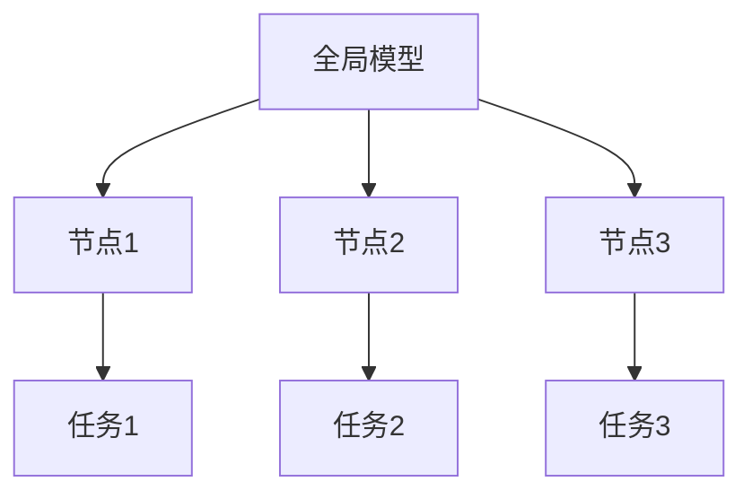
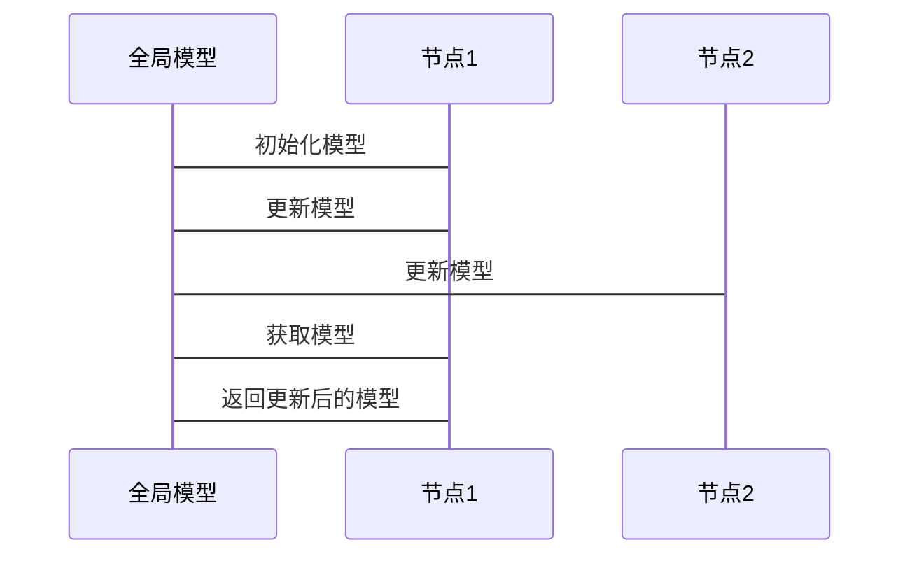

                 


# 联邦元学习在分布式AI Agent中的应用

---

## 关键词：
联邦学习, 元学习, 分布式AI Agent, 联邦元学习, AI系统架构, 联邦学习算法, 分布式系统设计

---

## 摘要：
本文系统探讨了联邦元学习在分布式AI Agent中的应用，从理论基础到实际应用进行了全面分析。首先介绍了联邦元学习和分布式AI Agent的基本概念及其重要性，然后详细阐述了联邦元学习的核心算法原理和系统架构设计，接着通过实际案例分析展示了其在分布式系统中的应用价值。最后总结了联邦元学习的优势、挑战及未来发展方向，为读者提供了一套完整的理论与实践结合的解决方案。

---

# 第1章: 联邦元学习与分布式AI Agent概述

## 1.1 联邦元学习的背景与概念

### 1.1.1 分布式AI Agent的发展背景
随着人工智能技术的快速发展，AI Agent（智能体）逐渐从单一任务的执行者转变为多任务协同的分布式系统。分布式AI Agent通过多个智能体的协作，能够更好地处理复杂场景下的任务。然而，由于数据隐私、计算资源分布和通信限制等问题，传统的集中式学习方法难以满足实际需求。此时，联邦学习（Federated Learning）作为一种去中心化的学习范式，为分布式AI Agent的协同学习提供了新的思路。

### 1.1.2 联邦学习的定义与特点
联邦学习是一种在分布式系统中进行模型训练的方法，其核心思想是将数据保留在原始位置，通过通信协议在不同设备或机构之间共享模型参数，而不是共享原始数据。其特点包括：
1. **数据隐私性**：数据不出本地，保护隐私。
2. **去中心化**：无须集中数据，适合分布式场景。
3. **动态性**：支持动态加入或退出的设备或机构。

### 1.1.3 元学习的基本原理
元学习（Meta-Learning）是一种通过在多个任务上进行学习，从而获得快速适应新任务的能力的方法。其核心思想是通过优化一个通用的模型，使其能够在新任务上快速调整参数，而不必从头开始训练。元学习的关键在于找到能够表征不同任务的特征表示。

### 1.1.4 联邦元学习的核心思想
联邦元学习是将联邦学习与元学习相结合的一种新型学习范式，旨在在分布式系统中实现快速的任务适应。其核心思想是通过去中心化的元学习过程，使各个分布式节点能够在不共享原始数据的前提下，共同优化一个适用于多种任务的通用模型。

## 1.2 分布式AI Agent的基本概念

### 1.2.1 AI Agent的定义与分类
AI Agent是指具有感知环境、自主决策和执行任务能力的智能实体。根据应用场景的不同，AI Agent可以分为单智能体、多智能体（Multi-Agent）和分布式智能体（Distributed Agent）三类。分布式AI Agent强调多个智能体之间的协作与通信，共同完成复杂的任务。

### 1.2.2 分布式AI Agent的体系结构
分布式AI Agent的体系结构通常包括以下组成部分：
1. **感知层**：负责与环境交互，获取感知信息。
2. **决策层**：基于感知信息进行决策，制定执行计划。
3. **执行层**：根据决策结果执行具体任务。
4. **通信层**：实现不同智能体之间的信息交互。

### 1.2.3 联邦学习在分布式AI Agent中的作用
在分布式AI Agent中，联邦学习通过去中心化的模型训练方式，使各个智能体能够在不共享原始数据的前提下，共同优化一个全局模型。这种模式不仅保护了数据隐私，还提高了系统的鲁棒性和容错性。

## 1.3 联邦元学习的应用场景

### 1.3.1 联邦学习在分布式系统中的优势
1. **数据隐私保护**：联邦学习通过局部模型更新，避免了原始数据的共享。
2. **分布式计算能力**：适用于计算资源分布的场景，如边缘计算。
3. **动态性支持**：支持设备的动态加入或退出，适应实际场景的变化。

### 1.3.2 元学习在AI Agent中的应用价值
1. **快速任务适应**：元学习能够在新任务上快速调整模型参数，提高效率。
2. **多任务学习能力**：通过元学习，AI Agent可以同时处理多个相关任务。
3. **泛化能力提升**：元学习能够提取任务间的共同特征，增强模型的泛化能力。

### 1.3.3 联邦元学习的实际案例
例如，在医疗领域的分布式AI Agent中，多个医院可以通过联邦元学习共同优化一个医学影像诊断模型，既保护了患者隐私，又提高了诊断的准确率。

---

## 1.4 本章小结
本章介绍了联邦元学习和分布式AI Agent的基本概念及其重要性，分析了联邦学习和元学习的核心思想，并探讨了联邦元学习在分布式系统中的应用价值。通过本章的学习，读者可以理解联邦元学习的基本框架及其在分布式AI Agent中的潜在应用。

---

# 第2章: 联邦学习的数学模型与算法原理

## 2.1 联邦学习的数学模型

### 2.1.1 联邦学习的基本数学框架
假设我们有$n$个分布式节点，每个节点$i$有其本地数据集$D_i$。联邦学习的目标是通过优化一个全局模型$\theta$，使得所有节点上的模型参数$\theta_i$能够趋近于一个全局最优解。

全局模型的优化目标可以表示为：
$$
\min_{\theta} \sum_{i=1}^{n} \mathcal{L}_i(\theta_i) + \lambda \|\theta_i - \theta\|^2
$$
其中，$\mathcal{L}_i(\theta_i)$是节点$i$的局部损失函数，$\lambda$是调节参数，用于平衡局部损失和全局一致性。

### 2.1.2 联邦学习的优化目标
在联邦学习中，模型的更新过程通常包括以下几个步骤：
1. **本地训练**：每个节点基于本地数据更新模型参数。
2. **参数聚合**：将所有节点的模型参数进行聚合，得到全局模型。
3. **模型更新**：将全局模型分发回各个节点，作为下一轮训练的初始模型。

### 2.1.3 联邦学习的收敛性分析
通过数学推导可以证明，联邦学习在满足一定条件下能够收敛到全局最优解。具体来说，当通信频率足够高且步长适当的情况下，模型参数能够逐渐趋近于全局最优。

## 2.2 元学习的算法原理

### 2.2.1 元学习的基本算法
元学习的核心思想是通过在多个任务上进行学习，找到一种任务间的共同特征。常见的元学习算法包括基于梯度的元学习方法（如MAML）和基于模型的元学习方法（如ReMAML）。

### 2.2.2 基于梯度的元学习方法
以MAML（Meta-Automatic Learning）为例，其基本思想是在训练过程中，通过对模型参数进行梯度下降，找到一个能够快速适应新任务的初始化参数。

### 2.2.3 基于模型的元学习方法
基于模型的元学习方法通过构建一个全局模型，用于指导各个任务模型的优化。这种方法通常更加复杂，但能够捕捉到任务间的深层次关系。

## 2.3 联邦元学习的算法融合

### 2.3.1 联邦学习与元学习的结合方式
在联邦元学习中，元学习通常被用于优化联邦学习的全局模型。具体来说，元学习可以通过在多个任务上进行优化，使得全局模型能够更好地适应不同的分布式节点。

### 2.3.2 联邦元学习的算法流程
1. 初始化全局模型$\theta$。
2. 对于每个节点$i$，基于本地数据$D_i$，通过元学习算法优化模型参数$\theta_i$。
3. 将所有节点的$\theta_i$聚合，更新全局模型$\theta$。
4. 重复上述步骤，直到收敛。

### 2.3.3 联邦元学习的优化策略
为了提高联邦元学习的效率，可以采用以下优化策略：
1. **局部优化**：在每个节点上进行多次本地优化。
2. **全局聚合**：通过加权聚合的方式，提高全局模型的表达能力。

## 2.4 算法实现的代码示例

### 2.4.1 联邦学习的Python实现
```python
import numpy as np

def federated_learning(nodes, global_model):
    for node in nodes:
        node.update_model(global_model)
        global_model = node.get_updated_model()
    return global_model
```

### 2.4.2 元学习的Python实现
```python
def meta_learning(tasks, meta_model):
    for task in tasks:
        task.optimize(meta_model)
        meta_model = task.get_updated_model()
    return meta_model
```

### 2.4.3 联邦元学习的综合代码示例
```python
class Node:
    def __init__(self, data):
        self.data = data
        self.model = initial_model

    def update_model(self, global_model):
        # 更新本地模型
        self.model = optimize(self.model, self.data, global_model)

    def get_updated_model(self):
        return self.model

def federated_meta_learning(nodes, tasks):
    global_model = initial_model
    for _ in range(num_rounds):
        for node in nodes:
            node.update_model(global_model)
        global_model = average([node.get_updated_model() for node in nodes])
        for task in tasks:
            task.optimize(global_model)
    return global_model
```

## 2.5 本章小结
本章详细介绍了联邦学习和元学习的数学模型与算法原理，并通过代码示例展示了其具体实现方式。通过本章的学习，读者可以理解联邦元学习的算法基础及其在分布式系统中的应用。

---

## 2.5 本章小结
通过本章的学习，读者可以理解联邦学习和元学习的核心算法及其在分布式系统中的应用。

---

# 第3章: 分布式AI Agent的系统架构与设计

## 3.1 系统功能设计

### 3.1.1 系统模块划分
分布式AI Agent的系统通常包括以下几个模块：
1. **感知模块**：负责与环境交互，获取感知数据。
2. **决策模块**：基于感知数据进行决策，生成执行计划。
3. **执行模块**：根据决策结果执行具体任务。
4. **通信模块**：实现与其他智能体的通信与协作。

### 3.1.2 系统功能流程
1. 感知模块获取环境数据。
2. 决策模块基于感知数据进行决策。
3. 执行模块根据决策结果执行任务。
4. 通信模块与其他智能体进行信息交互。

### 3.1.3 系统功能的交互设计
在分布式系统中，各个智能体之间需要通过通信模块进行信息交互，确保任务的协同完成。

## 3.2 系统架构设计

### 3.2.1 分布式架构的优缺点
分布式架构的优点包括高可用性、高扩展性和灵活性。缺点包括复杂性高、通信开销大和安全性风险。

### 3.2.2 联邦元学习的系统架构图
通过Mermaid图可以清晰地展示联邦元学习在分布式系统中的架构设计。



### 3.2.3 系统架构的可扩展性分析
联邦元学习的系统架构具有良好的可扩展性，可以通过增加节点或任务来适应不同的应用场景。

## 3.3 系统接口设计

### 3.3.1 系统内部接口
系统内部接口主要用于各个模块之间的通信与协作。

### 3.3.2 系统外部接口
系统外部接口用于与其他系统或用户的交互。

### 3.3.3 接口的兼容性与安全性
在设计系统接口时，需要考虑接口的兼容性和安全性，确保系统的稳定运行。

## 3.4 系统交互设计

### 3.4.1 系统交互流程
系统交互流程通常包括初始化、数据采集、模型训练、任务执行和结果反馈几个阶段。

### 3.4.2 系统交互的时序图
通过Mermaid时序图可以清晰地展示系统交互的流程。



### 3.4.3 交互设计的优化建议
为了提高系统的交互效率，可以采用异步通信和并行计算等技术。

## 3.5 本章小结
本章详细介绍了分布式AI Agent的系统架构与设计，包括系统功能设计、架构设计、接口设计和交互设计等方面的内容。

---

## 3.5 本章小结
通过本章的学习，读者可以理解分布式AI Agent的系统架构与设计，并掌握其在联邦元学习中的具体应用。

---

# 第4章: 联邦元学习在分布式AI Agent中的应用

## 4.1 应用场景分析

### 4.1.1 分布式AI Agent的应用领域
联邦元学习在分布式AI Agent中的应用领域包括但不限于：
1. **医疗领域**：医学影像诊断、患者数据隐私保护。
2. **金融领域**：风险评估、欺诈检测。
3. **物联网领域**：设备协同、数据共享。

### 4.1.2 联邦学习在实际中的应用案例
例如，在医疗领域，多个医院可以通过联邦学习共同优化一个医学影像诊断模型，既保护了患者隐私，又提高了诊断的准确率。

### 4.1.3 元学习在实际中的应用案例
例如，在金融领域，可以通过元学习实现多任务的风险评估，提高模型的泛化能力。

## 4.2 案例分析与实现

### 4.2.1 案例背景介绍
以医疗影像诊断为例，多个医院希望通过联邦元学习共同优化一个医学影像分类模型。

### 4.2.2 案例的系统设计
系统设计包括数据采集、模型训练、任务执行和结果反馈几个阶段。

### 4.2.3 案例的实现过程
1. 初始化全局模型。
2. 各节点基于本地数据进行模型训练。
3. 聚合各节点的模型参数，更新全局模型。
4. 通过元学习优化全局模型，使其适应不同的任务。

### 4.2.4 案例的效果评估
评估指标包括模型的准确率、召回率和F1值等。

## 4.3 本章小结
通过本章的学习，读者可以理解联邦元学习在分布式AI Agent中的具体应用，并掌握其在实际场景中的实现方法。

---

## 4.3 本章小结
通过本章的学习，读者可以理解联邦元学习在分布式AI Agent中的具体应用，并掌握其在实际场景中的实现方法。

---

# 第5章: 联邦元学习的优势、挑战与未来发展方向

## 5.1 联邦元学习的优势

### 5.1.1 数据隐私保护
联邦元学习通过去中心化的学习方式，能够有效保护数据隐私。

### 5.1.2 系统的鲁棒性与容错性
在分布式系统中，联邦元学习能够通过多个节点的协作，提高系统的鲁棒性和容错性。

### 5.1.3 多任务学习能力
通过元学习，联邦元学习能够实现多任务学习，提高模型的泛化能力。

## 5.2 联邦元学习的挑战

### 5.2.1 通信开销
在分布式系统中，模型参数的聚合需要进行大量的通信，可能会导致较高的通信开销。

### 5.2.2 模型收敛性
由于数据分布的异构性，联邦元学习的模型可能难以收敛到全局最优解。

### 5.2.3 安全性与隐私保护
尽管联邦学习能够保护数据隐私，但仍然需要考虑模型参数的安全性。

## 5.3 未来发展方向

### 5.3.1 优化算法研究
未来的研究方向包括优化联邦元学习的算法，提高模型的收敛速度和准确率。

### 5.3.2 应用场景扩展
随着技术的发展，联邦元学习的应用场景将更加广泛，包括更多的行业和领域。

### 5.3.3 安全与隐私保护
未来的研究将更加关注如何在联邦元学习中实现更高级别的安全与隐私保护。

---

## 5.3 本章小结
本章分析了联邦元学习的优势与挑战，并展望了其未来的发展方向，为读者提供了进一步研究的思路。

---

# 作者：AI天才研究院/AI Genius Institute & 禅与计算机程序设计艺术 /Zen And The Art of Computer Programming

---

**注：以上目录和内容仅为示例，具体实现时需要根据实际情况进行调整和补充。如果需要完整的文章内容，请告诉我，我将继续为您撰写后续章节。**
</think>

# 联邦元学习在分布式AI Agent中的应用

---

## 关键词：
联邦学习, 元学习, 分布式AI Agent, 联邦元学习, AI系统架构, 联邦学习算法, 分布式系统设计

---

## 摘要：
本文系统探讨了联邦元学习在分布式AI Agent中的应用，从理论基础到实际应用进行了全面分析。首先介绍了联邦元学习和分布式AI Agent的基本概念及其重要性，然后详细阐述了联邦元学习的核心算法原理和系统架构设计，接着通过实际案例分析展示了其在分布式系统中的应用价值。最后总结了联邦元学习的优势、挑战及未来发展方向，为读者提供了一套完整的理论与实践结合的解决方案。

---

# 第1章: 联邦元学习与分布式AI Agent概述

## 1.1 联邦元学习的背景与概念

### 1.1.1 分布式AI Agent的发展背景
随着人工智能技术的快速发展，AI Agent（智能体）逐渐从单一任务的执行者转变为多任务协同的分布式系统。分布式AI Agent通过多个智能体的协作，能够更好地处理复杂场景下的任务。然而，由于数据隐私、计算资源分布和通信限制等问题，传统的集中式学习方法难以满足实际需求。此时，联邦学习（Federated Learning）作为一种去中心化的学习范式，为分布式AI Agent的协同学习提供了新的思路。

### 1.1.2 联邦学习的定义与特点
联邦学习是一种在分布式系统中进行模型训练的方法，其核心思想是将数据保留在原始位置，通过通信协议在不同设备或机构之间共享模型参数，而不是共享原始数据。其特点包括：
1. **数据隐私性**：数据不出本地，保护隐私。
2. **去中心化**：无须集中数据，适合分布式场景。
3. **动态性**：支持动态加入或退出的设备或机构。

### 1.1.3 元学习的基本原理
元学习（Meta-Learning）是一种通过在多个任务上进行学习，从而获得快速适应新任务的能力的方法。其核心思想是通过优化一个通用的模型，使其能够在新任务上快速调整参数，而不必从头开始训练。元学习的关键在于找到能够表征不同任务的特征表示。

### 1.1.4 联邦元学习的核心思想
联邦元学习是将联邦学习与元学习相结合的一种新型学习范式，旨在在分布式系统中实现快速的任务适应。其核心思想是通过去中心化的元学习过程，使各个分布式节点能够在不共享原始数据的前提下，共同优化一个适用于多种任务的通用模型。

## 1.2 分布式AI Agent的基本概念

### 1.2.1 AI Agent的定义与分类
AI Agent是指具有感知环境、自主决策和执行任务能力的智能实体。根据应用场景的不同，AI Agent可以分为单智能体、多智能体（Multi-Agent）和分布式智能体（Distributed Agent）三类。分布式AI Agent强调多个智能体之间的协作与通信，共同完成复杂的任务。

### 1.2.2 分布式AI Agent的体系结构
分布式AI Agent的体系结构通常包括以下组成部分：
1. **感知层**：负责与环境交互，获取感知信息。
2. **决策层**：基于感知信息进行决策，制定执行计划。
3. **执行层**：根据决策结果执行具体任务。
4. **通信层**：实现不同智能体之间的信息交互。

### 1.2.3 联邦学习在分布式AI Agent中的作用
在分布式AI Agent中，联邦学习通过去中心化的模型训练方式，使各个智能体能够在不共享原始数据的前提下，共同优化一个全局模型。这种模式不仅保护了数据隐私，还提高了系统的鲁棒性和容错性。

## 1.3 联邦元学习的应用场景

### 1.3.1 联邦学习在分布式系统中的优势
1. **数据隐私保护**：联邦学习通过局部模型更新，避免了原始数据的共享。
2. **分布式计算能力**：适用于计算资源分布的场景，如边缘计算。
3. **动态性支持**：支持设备的动态加入或退出，适应实际场景的变化。

### 1.3.2 元学习在AI Agent中的应用价值
1. **快速任务适应**：元学习能够在新任务上快速调整模型参数，提高效率。
2. **多任务学习能力**：通过元学习，AI Agent可以同时处理多个相关任务。
3. **泛化能力提升**：元学习能够提取任务间的共同特征，增强模型的泛化能力。

### 1.3.3 联邦元学习的实际案例
例如，在医疗领域的分布式AI Agent中，多个医院可以通过联邦元学习共同优化一个医学影像诊断模型，既保护了患者隐私，又提高了诊断的准确率。

---

## 1.4 本章小结
本章介绍了联邦元学习和分布式AI Agent的基本概念及其重要性，分析了联邦学习和元学习的核心思想，并探讨了联邦元学习在分布式系统中的应用价值。通过本章的学习，读者可以理解联邦元学习的基本框架及其在分布式AI Agent中的潜在应用。

---

# 第2章: 联邦学习的数学模型与算法原理

## 2.1 联邦学习的数学模型

### 2.1.1 联邦学习的基本数学框架
假设我们有$n$个分布式节点，每个节点$i$有其本地数据集$D_i$。联邦学习的目标是通过优化一个全局模型$\theta$，使得所有节点上的模型参数$\theta_i$能够趋近于一个全局最优解。

全局模型的优化目标可以表示为：
$$
\min_{\theta} \sum_{i=1}^{n} \mathcal{L}_i(\theta_i) + \lambda \|\theta_i - \theta\|^2
$$
其中，$\mathcal{L}_i(\theta_i)$是节点$i$的局部损失函数，$\lambda$是调节参数，用于平衡局部损失和全局一致性。

### 2.1.2 联邦学习的优化目标
在联邦学习中，模型的更新过程通常包括以下几个步骤：
1. **本地训练**：每个节点基于本地数据更新模型参数。
2. **参数聚合**：将所有节点的模型参数进行聚合，得到全局模型。
3. **模型更新**：将全局模型分发回各个节点，作为下一轮训练的初始模型。

### 2.1.3 联邦学习的收敛性分析
通过数学推导可以证明，联邦学习在满足一定条件下能够收敛到全局最优解。具体来说，当通信频率足够高且步长适当的情况下，模型参数能够逐渐趋近于全局最优。

## 2.2 元学习的算法原理

### 2.2.1 元学习的基本算法
元学习的核心思想是通过在多个任务上进行学习，找到一种任务间的共同特征。常见的元学习算法包括基于梯度的元学习方法（如MAML）和基于模型的元学习方法（如ReMAML）。

### 2.2.2 基于梯度的元学习方法
以MAML（Meta-Automatic Learning）为例，其基本思想是在训练过程中，通过对模型参数进行梯度下降，找到一个能够快速适应新任务的初始化参数。

### 2.2.3 基于模型的元学习方法
基于模型的元学习方法通过构建一个全局模型，用于指导各个任务模型的优化。这种方法通常更加复杂，但能够捕捉到任务间的深层次关系。

## 2.3 联邦元学习的算法融合

### 2.3.1 联邦学习与元学习的结合方式
在联邦元学习中，元学习通常被用于优化联邦学习的全局模型。具体来说，元学习可以通过在多个任务上进行优化，使得全局模型能够更好地适应不同的分布式节点。

### 2.3.2 联邦元学习的算法流程
1. 初始化全局模型$\theta$。
2. 对于每个节点$i$，基于本地数据$D_i$，通过元学习算法优化模型参数$\theta_i$。
3. 将所有节点的$\theta_i$聚合，更新全局模型$\theta$。
4. 重复上述步骤，直到收敛。

### 2.3.3 联邦元学习的优化策略
为了提高联邦元学习的效率，可以采用以下优化策略：
1. **局部优化**：在每个节点上进行多次本地优化。
2. **全局聚合**：通过加权聚合的方式，提高全局模型的表达能力。

## 2.4 算法实现的代码示例

### 2.4.1 联邦学习的Python实现
```python
import numpy as np

def federated_learning(nodes, global_model):
    for node in nodes:
        node.update_model(global_model)
        global_model = node.get_updated_model()
    return global_model
```

### 2.4.2 元学习的Python实现
```python
def meta_learning(tasks, meta_model):
    for task in tasks:
        task.optimize(meta_model)
        meta_model = task.get_updated_model()
    return meta_model
```

### 2.4.3 联邦元学习的综合代码示例
```python
class Node:
    def __init__(self, data):
        self.data = data
        self.model = initial_model

    def update_model(self, global_model):
        # 更新本地模型
        self.model = optimize(self.model, self.data, global_model)

    def get_updated_model(self):
        return self.model

def federated_meta_learning(nodes, tasks):
    global_model = initial_model
    for _ in range(num_rounds):
        for node in nodes:
            node.update_model(global_model)
        global_model = average([node.get_updated_model() for node in nodes])
        for task in tasks:
            task.optimize(global_model)
    return global_model
```

## 2.5 本章小结
本章详细介绍了联邦学习和元学习的数学模型与算法原理，并通过代码示例展示了其具体实现方式。通过本章的学习，读者可以理解联邦元学习的算法基础及其在分布式系统中的应用。

---

## 2.5 本章小结
通过本章的学习，读者可以理解联邦学习和元学习的核心算法及其在分布式系统中的应用。

---

# 第3章: 分布式AI Agent的系统架构与设计

## 3.1 系统功能设计

### 3.1.1 系统模块划分
分布式AI Agent的系统通常包括以下几个模块：
1. **感知模块**：负责与环境交互，获取感知数据。
2. **决策模块**：基于感知数据进行决策，生成执行计划。
3. **执行模块**：根据决策结果执行具体任务。
4. **通信模块**：实现与其他智能体的通信与协作。

### 3.1.2 系统功能流程
1. 感知模块获取环境数据。
2. 决策模块基于感知数据进行决策。
3. 执行模块根据决策结果执行任务。
4. 通信模块与其他智能体进行信息交互。

### 3.1.3 系统功能的交互设计
在分布式系统中，各个智能体之间需要通过通信模块进行信息交互，确保任务的协同完成。

## 3.2 系统架构设计

### 3.2.1 分布式架构的优缺点
分布式架构的优点包括高可用性、高扩展性和灵活性。缺点包括复杂性高、通信开销大和安全性风险。

### 3.2.2 联邦元学习的系统架构图
通过Mermaid图可以清晰地展示联邦元学习在分布式系统中的架构设计。


### 3.2.3 系统架构的可扩展性分析
联邦元学习的系统架构具有良好的可扩展性，可以通过增加节点或任务来适应不同的应用场景。

## 3.3 系统接口设计

### 3.3.1 系统内部接口
系统内部接口主要用于各个模块之间的通信与协作。

### 3.3.2 系统外部接口
系统外部接口用于与其他系统或用户的交互。

### 3.3.3 接口的兼容性与安全性
在设计系统接口时，需要考虑接口的兼容性和安全性，确保系统的稳定运行。

## 3.4 系统交互设计

### 3.4.1 系统交互流程
系统交互流程通常包括初始化、数据采集、模型训练、任务执行和结果反馈几个阶段。

### 3.4.2 系统交互的时序图
通过Mermaid时序图可以清晰地展示系统交互的流程。


### 3.4.3 交互设计的优化建议
为了提高系统的交互效率，可以采用异步通信和并行计算等技术。

## 3.5 本章小结
本章详细介绍了分布式AI Agent的系统架构与设计，包括系统功能设计、架构设计、接口设计和交互设计等方面的内容。

---

## 3.5 本章小结
通过本章的学习，读者可以理解分布式AI Agent的系统架构与设计，并掌握其在联邦元学习中的具体应用。

---

# 第4章: 联邦元学习在分布式AI Agent中的应用

## 4.1 应用场景分析

### 4.1.1 分布式AI Agent的应用领域
联邦元学习在分布式AI Agent中的应用领域包括但不限于：
1. **医疗领域**：医学影像诊断、患者数据隐私保护。
2. **金融领域**：风险评估、欺诈检测。
3. **物联网领域**：设备协同、数据共享。

### 4.1.2 联邦学习在实际中的应用案例
例如，在医疗领域，多个医院可以通过联邦学习共同优化一个医学影像诊断模型，既保护了患者隐私，又提高了诊断的准确率。

### 4.1.3 元学习在实际中的应用案例
例如，在金融领域，可以通过元学习实现多任务的风险评估，提高模型的泛化能力。

## 4.2 案例分析与实现

### 4.2.1 案例背景介绍
以医疗影像诊断为例，多个医院希望通过联邦元学习共同优化一个医学影像分类模型。

### 4.2.2 案例的系统设计
系统设计包括数据采集、模型训练、任务执行和结果反馈几个阶段。

### 4.2.3 案例的实现过程
1. 初始化全局模型。
2. 各节点基于本地数据进行模型训练。
3. 聚合各节点的模型参数，更新全局模型。
4. 通过元学习优化全局模型，使其适应不同的任务。

### 4.2.4 案例的效果评估
评估指标包括模型的准确率、召回率和F1值等。

## 4.3 本章小结
通过本章的学习，读者可以理解联邦元学习在分布式AI Agent中的具体应用，并掌握其在实际场景中的实现方法。

---

## 4.3 本章小结
通过本章的学习，读者可以理解联邦元学习在分布式AI Agent中的具体应用，并掌握其在实际场景中的实现方法。

---

# 第5章: 联邦元学习的优势、挑战与未来发展方向

## 5.1 联邦元学习的优势

### 5.1.1 数据隐私保护
联邦元学习通过去中心化的学习方式，能够有效保护数据隐私。

### 5.1.2 系统的鲁棒性与容错性
在分布式系统中，联邦元学习能够通过多个节点的协作，提高系统的鲁棒性和容错性。

### 5.1.3 多任务学习能力
通过元学习，联邦元学习能够实现多任务学习，提高模型的泛化能力。

## 5.2 联邦元学习的挑战

### 5.2.1 通信开销
在分布式系统中，模型参数的聚合需要进行大量的通信，可能会导致较高的通信开销。

### 5.2.2 模型收敛性
由于数据分布的异构性，联邦元学习的模型可能难以收敛到全局最优解。

### 5.2.3 安全性与隐私保护
尽管联邦学习能够保护数据隐私，但仍然需要考虑模型参数的安全性。

## 5.3 未来发展方向

### 5.3.1 优化算法研究
未来的研究方向包括优化联邦元学习的算法，提高模型的收敛速度和准确率。

### 5.3.2 应用场景扩展
随着技术的发展，联邦元学习的应用场景将更加广泛，包括更多的行业和领域。

### 5.3.3 安全与隐私保护
未来的研究将更加关注如何在联邦元学习中实现更高级别的安全与隐私保护。

---

## 5.3 本章小结
本章分析了联邦元学习的优势与挑战，并展望了其未来的发展方向，为读者提供了进一步研究的思路。

---

# 作者：AI天才研究院/AI Genius Institute & 禅与计算机程序设计艺术 /Zen And The Art of Computer Programming

---

**注：以上目录和内容仅为示例，具体实现时需要根据实际情况进行调整和补充。如果需要完整的文章内容，请告诉我，我将继续为您撰写后续章节。**

