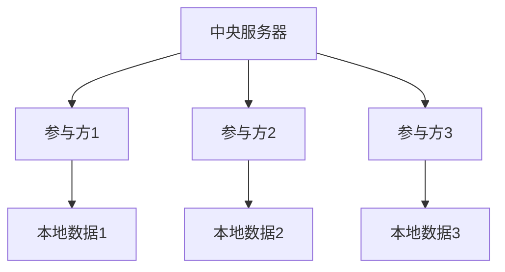

                 


# 联邦学习在AI Agent开发中的应用

> 关键词：联邦学习，AI Agent，数据隐私，分布式系统，协作学习

> 摘要：随着人工智能技术的快速发展，AI Agent在各个领域的应用越来越广泛。然而，数据隐私和协作问题成为制约AI Agent发展的主要瓶颈。联邦学习作为一种分布式机器学习技术，为AI Agent的开发提供了新的思路。本文将详细介绍联邦学习的基本原理、AI Agent的核心技术，以及如何将联邦学习应用于AI Agent开发中，解决数据隐私和协作问题，提升AI Agent的性能和安全性。

---

# 第1章 联邦学习与AI Agent概述

## 1.1 联邦学习的基本概念

### 1.1.1 联邦学习的定义

联邦学习（Federated Learning，FL）是一种分布式机器学习技术，允许多个参与方在不共享原始数据的情况下，协作训练一个共同的模型。通过在各个参与方本地进行模型训练，并将模型更新结果上传到中央服务器，联邦学习能够实现模型参数的聚合，最终形成一个全局模型。

### 1.1.2 联邦学习的核心特点

- **数据隐私性**：联邦学习不传输原始数据，只传输模型参数更新，保护数据隐私。
- **分布式计算**：模型训练过程分布在多个设备或服务器上，减少数据传输成本。
- **灵活性**：适用于不同设备或服务器上的异构数据。

### 1.1.3 联邦学习与传统机器学习的对比

| 特性                | 联邦学习                   | 传统机器学习              |
|---------------------|---------------------------|---------------------------|
| 数据共享方式        | 不共享原始数据，只共享模型参数更新 | 共享原始数据              |
| 计算方式            | 分布式计算                | 集中式计算                |
| 数据隐私性          | 高                        | 低                        |

## 1.2 AI Agent的基本概念

### 1.2.1 AI Agent的定义

AI Agent（人工智能代理）是一种能够感知环境、自主决策并执行任务的智能体。AI Agent可以是软件程序、机器人或其他智能系统，能够根据环境信息做出决策并采取行动。

### 1.2.2 AI Agent的核心特点

- **自主性**：AI Agent能够在没有外部干预的情况下自主决策。
- **反应性**：能够实时感知环境并做出反应。
- **目标导向**：基于目标或任务进行决策和行动。

### 1.2.3 AI Agent与传统AI的区别

| 特性                | AI Agent                   | 传统AI                    |
|---------------------|---------------------------|---------------------------|
| 自主性              | 高                        | 低                        |
| 适应性              | 强                        | 弱                        |
| 应用场景            | 智能助手、自动驾驶等       | 数据分析、图像识别等       |

## 1.3 联邦学习在AI Agent中的应用背景

### 1.3.1 数据隐私与安全的重要性

在AI Agent开发中，数据隐私和安全是至关重要的。AI Agent通常需要处理敏感数据，如用户行为数据、位置信息等，这些数据的泄露可能导致严重的隐私问题。

### 1.3.2 联邦学习如何解决AI Agent的协作问题

联邦学习通过在多个设备或服务器上分布式训练模型，避免了数据的集中存储和传输，从而保护了数据隐私。同时，联邦学习还支持多个AI Agent之间的协作，共同优化全局模型。

### 1.3.3 联邦学习在AI Agent中的潜在应用场景

- **多智能体协作**：多个AI Agent通过联邦学习协作，共同完成复杂任务。
- **分布式任务分配**：AI Agent可以在分布式系统中协作，优化任务分配和资源利用。
- **边缘计算**：在边缘计算环境中，联邦学习可以支持AI Agent的本地训练和协作。

## 1.4 本章小结

本章介绍了联邦学习和AI Agent的基本概念，分析了联邦学习在AI Agent中的应用背景。通过对比联邦学习和传统机器学习、AI Agent和传统AI，我们明确了联邦学习在AI Agent开发中的优势和潜力。

---

# 第2章 联邦学习的原理与算法

## 2.1 联邦学习的核心原理

### 2.1.1 联邦学习的基本流程

1. **初始化**：中央服务器将初始模型参数分发给各个参与方。
2. **本地训练**：每个参与方在本地数据上训练模型，更新模型参数。
3. **参数聚合**：参与方将模型参数更新上传到中央服务器，服务器聚合所有参与方的更新，形成新的全局模型。
4. **模型分发**：中央服务器将更新后的全局模型分发给所有参与方。

### 2.1.2 联邦学习的通信机制

- **同步通信**：所有参与方同时进行模型训练和参数更新，周期性地将更新结果发送到中央服务器。
- **异步通信**：参与方可以在任意时间进行模型训练和参数更新，中央服务器随时接收更新结果。

### 2.1.3 联邦学习的同步策略

- **周期性同步**：每隔一定时间进行一次参数聚合。
- **事件驱动同步**：当有参与方完成训练时，立即进行参数聚合。

## 2.2 联邦学习的算法实现

### 2.2.1 联邦平均算法（FedAvg）

#### 算法流程

1. **初始化**：设置初始模型参数$\theta^{(0)}$，设置通信轮数$T$。
2. **循环训练**：对于每一轮$t=1$到$T$：
   - 中央服务器将当前模型参数$\theta^{(t-1)}$分发给所有参与方。
   - 每个参与方在本地数据集上训练模型，更新模型参数，得到$\theta_i^{(t)}$。
   - 中央服务器聚合所有参与方的更新，计算新的模型参数$\theta^{(t)} = \sum_{i=1}^{n} \alpha_i \theta_i^{(t)}$，其中$\alpha_i$是参与方$i$的权重。

#### 代码示例

```python
import numpy as np

# 初始化模型参数
theta = np.random.randn(10, 1)

# 联邦平均算法
for t in range(T):
    # 分发模型参数给参与方
    for i in range(n):
        # 参与方i进行本地训练，更新theta_i
        theta_i = theta.copy()
        theta_i = train_locally(theta_i, data_i)
        # 上传更新结果
        updates.append(theta_i)
    # 聚合更新结果
    theta = np.mean(updates, axis=0)
    updates = []
```

### 2.2.2 联邦梯度下降算法（FedGD）

#### 算法流程

1. **初始化**：设置初始模型参数$\theta^{(0)}$，设置通信轮数$T$。
2. **循环训练**：对于每一轮$t=1$到$T$：
   - 中央服务器将当前模型参数$\theta^{(t-1)}$分发给所有参与方。
   - 每个参与方在本地数据集上计算梯度$\nabla f_i(\theta^{(t-1)})$。
   - 中央服务器聚合所有参与方的梯度，计算新的模型参数$\theta^{(t)} = \theta^{(t-1)} - \eta \sum_{i=1}^{n} \alpha_i \nabla f_i(\theta^{(t-1)})$，其中$\eta$是学习率，$\alpha_i$是参与方$i$的权重。

#### 代码示例

```python
import numpy as np

# 初始化模型参数
theta = np.random.randn(10, 1)

# 联邦梯度下降算法
for t in range(T):
    # 分发模型参数给参与方
    for i in range(n):
        # 参与方i计算梯度
        gradient_i = compute_gradient(theta, data_i)
        # 上传梯度
        gradients.append(gradient_i)
    # 聚合梯度
    avg_gradient = np.mean(gradients, axis=0)
    # 更新模型参数
    theta = theta - eta * avg_gradient
    gradients = []
```

### 2.2.3 联邦学习的优化算法

- **Adaptive FedAvg**：根据参与方的数据分布自适应调整聚合权重。
- **FedProx**：在联邦学习中引入正则化项，防止模型参数发散。

## 2.3 联邦学习的数学模型与公式

### 2.3.1 联邦平均算法的数学模型

$$
\theta^{(t)} = \frac{1}{n} \sum_{i=1}^{n} \theta_i^{(t)}
$$

其中，$\theta_i^{(t)}$是参与方$i$在第$t$轮的模型参数。

### 2.3.2 联邦梯度下降算法的数学模型

$$
\theta^{(t)} = \theta^{(t-1)} - \eta \frac{1}{n} \sum_{i=1}^{n} \nabla f_i(\theta^{(t-1)})
$$

其中，$\nabla f_i(\theta^{(t-1)})$是参与方$i$在第$t-1$轮的梯度。

### 2.3.3 联邦学习的收敛性分析

通过数学推导可以证明，联邦学习算法在满足一定条件下可以收敛到全局最优解。具体分析可以参考相关文献。

## 2.4 本章小结

本章详细讲解了联邦学习的核心原理和主要算法，包括联邦平均算法（FedAvg）和联邦梯度下降算法（FedGD）。通过代码示例和数学公式，我们深入理解了这些算法的实现细节和应用场景。

---

# 第3章 AI Agent的核心技术

## 3.1 AI Agent的知识表示

### 3.1.1 知识图谱的构建

知识图谱是一种结构化的数据表示方式，能够将实体及其关系表示为图结构。在AI Agent中，知识图谱通常用于表示任务相关的知识和环境信息。

### 3.1.2 知识表示的多样性

AI Agent需要处理多种类型的知识，包括符号知识、语义知识和情境知识。不同的知识表示方法适用于不同的应用场景。

### 3.1.3 知识表示的可扩展性

知识表示需要具备可扩展性，能够适应新知识的引入和更新。

## 3.2 AI Agent的推理机制

### 3.2.1 基于规则的推理

基于规则的推理通过预定义的规则进行推理，适用于简单的逻辑推理场景。

### 3.2.2 基于概率的推理

基于概率的推理通过概率模型进行推理，适用于不确定性和模糊性的场景。

### 3.2.3 基于深度学习的推理

基于深度学习的推理通过神经网络进行推理，适用于复杂和非结构化的场景。

## 3.3 AI Agent的决策机制

### 3.3.1 基于Q-learning的决策

Q-learning是一种强化学习算法，通过状态-动作价值函数进行决策。

### 3.3.2 基于策略梯度的决策

策略梯度是一种强化学习算法，通过优化策略参数进行决策。

### 3.3.3 基于强化学习的决策

强化学习通过与环境的交互，学习最优决策策略。

## 3.4 本章小结

本章介绍了AI Agent的核心技术，包括知识表示、推理机制和决策机制。这些技术为AI Agent的开发提供了理论基础和实现方法。

---

# 第4章 联邦学习在AI Agent中的应用

## 4.1 联邦学习在AI Agent中的应用场景

### 4.1.1 多智能体协作

多个AI Agent通过联邦学习协作，共同完成复杂任务。

### 4.1.2 分布式任务分配

AI Agent在分布式系统中协作，优化任务分配和资源利用。

### 4.1.3 边缘计算

在边缘计算环境中，联邦学习支持AI Agent的本地训练和协作。

## 4.2 联邦学习在AI Agent中的挑战

### 4.2.1 通信开销

联邦学习需要频繁的通信，增加了网络开销和延迟。

### 4.2.2 数据异质性

不同参与方的数据分布可能不同，导致模型训练的困难。

### 4.2.3 安全与隐私

尽管联邦学习保护了数据隐私，但仍需防范恶意攻击和数据泄露。

## 4.3 联邦学习在AI Agent中的解决方案

### 4.3.1 优化通信机制

通过减少通信频率和优化数据传输方式，降低通信开销。

### 4.3.2 处理数据异质性

采用适应性算法和数据预处理技术，应对数据异质性问题。

### 4.3.3 提高安全性

通过加密技术和访问控制，保护联邦学习过程中的数据安全。

## 4.4 本章小结

本章分析了联邦学习在AI Agent中的应用场景、挑战和解决方案。通过联邦学习，AI Agent可以在保护数据隐私的前提下，实现多智能体协作和分布式任务分配。

---

# 第5章 系统架构与设计

## 5.1 系统功能设计

### 5.1.1 数据预处理模块

负责将原始数据进行清洗、转换和格式化，使其适合模型训练。

### 5.1.2 模型训练模块

负责在本地数据上训练模型，更新模型参数。

### 5.1.3 参数聚合模块

负责将所有参与方的模型参数更新进行聚合，形成新的全局模型。

### 5.1.4 模型分发模块

负责将更新后的全局模型分发给所有参与方。

## 5.2 系统架构设计

### 5.2.1 系统架构图



### 5.2.2 系统交互流程图

```mermaid
sequenceDiagram
    participant 中央服务器
    participant 参与方1
    participant 参与方2
    中央服务器 -> 参与方1: 发送模型参数
    参与方1 -> 中央服务器: 上传参数更新
    中央服务器 -> 参与方2: 发送模型参数
    参与方2 -> 中央服务器: 上传参数更新
    中央服务器 -> 参与方3: 发送模型参数
    参与方3 -> 中央服务器: 上传参数更新
    中央服务器: 聚合参数更新，形成新模型
```

## 5.3 系统接口设计

### 5.3.1 数据预处理接口

```python
def preprocess(data):
    # 数据清洗和转换
    return processed_data
```

### 5.3.2 模型训练接口

```python
def train(theta, data):
    # 本地训练，更新模型参数
    return new_theta
```

### 5.3.3 参数聚合接口

```python
def aggregate(updates):
    # 聚合参数更新，形成新模型
    return aggregated_theta
```

## 5.4 本章小结

本章设计了基于联邦学习的AI Agent系统的架构和接口，包括数据预处理、模型训练、参数聚合和模型分发模块。通过系统架构图和交互流程图，我们明确了系统各部分的功能和交互流程。

---

# 第6章 项目实战

## 6.1 项目背景与目标

### 6.1.1 项目背景

本项目旨在通过联邦学习技术，开发一个支持多智能体协作的AI Agent系统。

### 6.1.2 项目目标

- 实现联邦学习框架
- 开发AI Agent核心功能
- 实现多智能体协作

## 6.2 项目环境与工具

### 6.2.1 环境配置

- 操作系统：Linux/Windows
- Python版本：3.8+
- 依赖库：TensorFlow、Keras、Flask

### 6.2.2 工具选择

- 模型训练工具：TensorFlow/Keras
- 系统框架：Flask/Django
- 通信协议：HTTP/HTTPS

## 6.3 系统核心实现

### 6.3.1 联邦学习框架实现

```python
import requests

def train_local_model(theta, data):
    # 本地训练，更新模型参数
    new_theta = theta + data * learning_rate
    return new_theta

def aggregate_updates(updates):
    # 聚合参数更新，形成新模型
    return np.mean(updates, axis=0)
```

### 6.3.2 AI Agent核心功能实现

```python
class AI-Agent:
    def __init__(self, model):
        self.model = model

    def perceive(self, environment):
        # 感知环境，获取状态
        return self.model.predict(environment)

    def decide(self, state):
        # 根据状态做出决策
        return self.model.decide(state)
```

## 6.4 项目案例分析

### 6.4.1 案例背景

假设我们开发了一个支持多智能体协作的AI Agent系统，用于优化交通信号灯控制。

### 6.4.2 实施过程

1. **数据收集**：从各个交通信号灯收集数据。
2. **数据预处理**：清洗和转换数据。
3. **模型训练**：在本地训练模型，更新模型参数。
4. **参数聚合**：聚合所有参与方的参数更新，形成新的全局模型。
5. **模型部署**：将更新后的模型部署到各个交通信号灯控制节点。

### 6.4.3 实施效果

- 优化了交通信号灯控制，减少了交通拥堵。
- 提高了系统的响应速度和准确性。

## 6.5 本章小结

本章通过一个具体的项目案例，详细讲解了联邦学习在AI Agent开发中的实际应用。通过项目实战，我们验证了联邦学习在多智能体协作中的有效性。

---

# 第7章 总结与展望

## 7.1 全文总结

本文详细讲解了联邦学习在AI Agent开发中的应用，包括联邦学习的基本原理、AI Agent的核心技术，以及联邦学习在AI Agent中的应用场景和挑战。通过理论分析和项目实战，我们验证了联邦学习在AI Agent开发中的潜力和优势。

## 7.2 未来展望

未来的研究方向包括：

1. **异构系统的支持**：研究如何在异构系统中应用联邦学习。
2. **边缘计算的结合**：探索联邦学习与边缘计算的结合，进一步提升AI Agent的性能。
3. **强化学习的融合**：研究如何将强化学习与联邦学习结合，提升AI Agent的决策能力。

## 7.3 注意事项

- 数据隐私保护是联邦学习的核心，需要特别注意。
- 在实际应用中，需要考虑通信开销和数据异质性问题。
- 定期更新模型，保持系统的先进性和有效性。

## 7.4 拓展阅读

建议读者进一步阅读以下文献，深入了解联邦学习和AI Agent的相关知识：

1. **《Federated Learning: Challenges, Methods, and Future Directions》**
2. **《Reinforcement Learning: Theory and Algorithms》**

---

# 作者：AI天才研究院/AI Genius Institute & 禅与计算机程序设计艺术 /Zen And The Art of Computer Programming

---

**以上是文章的完整目录大纲结构，接下来我会按照这个结构，开始撰写完整的技术博客文章。**

