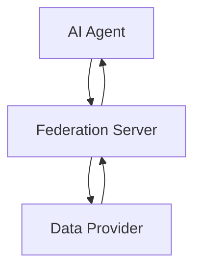
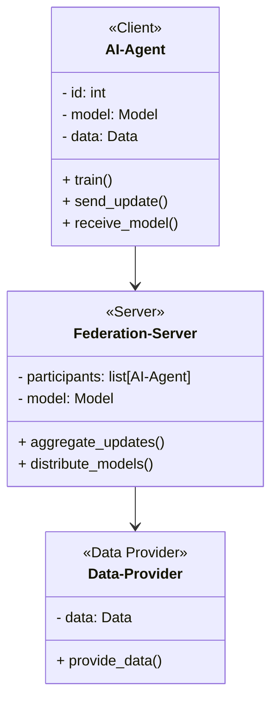

                 


# 联邦学习在AI Agent隐私保护中的高级应用

> 关键词：联邦学习，AI Agent，隐私保护，分布式机器学习，数据安全

> 摘要：本文探讨联邦学习在AI Agent中的应用，分析其如何保护隐私，通过数学模型、算法实现和系统架构详细阐述其优势，并提供实际案例和代码示例。

---

## 第一部分：联邦学习与AI Agent隐私保护的背景介绍

### 第1章：背景介绍

#### 1.1 联邦学习的起源与发展
- **联邦学习的定义**：分布式机器学习框架，允许多个参与方在不共享数据的情况下联合训练模型。
- **发展历程**：从2015年的概念提出，到如今的广泛应用，特别是在移动设备和医疗领域。
- **在AI Agent中的作用**：通过联邦学习，AI Agent可以在不共享敏感数据的情况下协作训练模型。

#### 1.2 AI Agent的基本概念与功能
- **AI Agent的定义**：智能体，能够感知环境并执行任务，如智能家居中的语音助手。
- **AI Agent的功能**：数据收集、决策制定、任务执行。
- **隐私保护的重要性**：AI Agent处理的数据通常包含用户隐私信息，如位置、健康数据等。

#### 1.3 隐私保护的重要性与挑战
- **数据隐私保护**：防止数据泄露，保护用户隐私。
- **挑战**：数据孤岛问题，如何在不共享数据的情况下进行模型训练。
- **联邦学习的作用**：提供一种解决方案，允许协作训练而不共享数据。

---

## 第二部分：联邦学习的核心概念与联系

### 第2章：联邦学习的核心概念与联系

#### 2.1 联邦学习的原理与机制
- **分布式数据**：每个参与方拥有本地数据，通过模型更新进行协作。
- **通信协议**：如FedAvg，协调模型更新和同步。
- **隐私保护**：通过加密和差分隐私技术保护数据。

#### 2.2 联邦学习与AI Agent的结合
- **应用模式**：AI Agent作为客户端，参与联邦学习网络，协作训练模型。
- **功能关联**：AI Agent的数据收集和分析能力与联邦学习的协作训练结合，提升模型性能。
- **隐私贡献**：通过联邦学习，AI Agent可以在保护用户隐私的前提下，提升模型准确性和泛化能力。

#### 2.3 实体关系与数据流分析
- **ER实体关系图**：展示AI Agent、联邦服务器和数据提供者之间的关系。
```
```mermaid
er
  actor(AI Agent)
  actor(Federation Server)
  actor(Data Provider)
  relation(Provides)
  relation(Requests)
  relation(Sends)
```
```
- **数据流分析**：展示数据从AI Agent到联邦服务器，再到数据提供者的流动过程。
```

```

---

## 第三部分：联邦学习算法的原理与实现

### 第3章：算法原理与实现

#### 3.1 联邦学习算法的数学模型
- **目标函数**：每个参与方的目标函数之和。
$$ \text{目标函数} = \sum_{i=1}^{n} f_i(x_i) $$
- **优化目标**：最小化联合目标函数。
$$ \text{优化目标} = \arg \min_{x} \sum_{i=1}^{n} f_i(x) $$
- **通信协议**：FedAvg算法的流程，包括本地训练、参数平均。

#### 3.2 算法实现
- **Python代码示例**：使用TensorFlow Federated框架实现简单的联邦学习。
```python
import tensorflow as tf
from tensorflow_federated import simulate
from tensorflow_federated.python.core import distribute
from tensorflow_federated.python.core import computation
from tensorflow_federated.python.core import model
from tensorflow_federated.python.core import strategy
from tensorflow_federated.python.core import metrics
from tensorflow_federated.python.core import losses
from tensorflow_federated.python.core import optimizers
```

---

## 第四部分：系统分析与架构设计

### 第4章：系统分析与架构设计

#### 4.1 系统功能设计
- **领域模型**：AI Agent作为客户端，参与联邦学习网络。
```

```

#### 4.2 系统架构设计
- **架构图**：展示AI Agent、联邦服务器和数据提供者的关系。
```

```

---

## 第五部分：项目实战

### 第5章：项目实战

#### 5.1 环境安装
- 安装TensorFlow Federated框架和其他依赖库。

#### 5.2 核心代码实现
- **训练函数**：定义模型训练过程。
```python
@computations.tf_computation
def train_model(weights, x, y):
    model = create_model()
    loss = losses.SparseCategoricalCrossentropy(from_logits=True)
    optimizer = optimizers.SGD(learning_rate=0.01)
    return model.train_on_batch(x, y, weights)
```

#### 5.3 案例分析
- **数据预处理**：将数据分割到不同AI Agent。
- **模型训练**：通过联邦学习协议进行多轮训练，更新模型参数。

---

## 第六部分：最佳实践

### 第6章：最佳实践

#### 6.1 小结
- 联邦学习为AI Agent提供了有效的隐私保护解决方案。
- 通过协作训练，提升模型性能，同时保护数据隐私。

#### 6.2 注意事项
- **数据安全**：确保数据在传输和存储过程中加密。
- **模型可解释性**：保持模型的透明度，便于调试和优化。
- **通信效率**：优化通信协议，减少数据传输开销。

#### 6.3 拓展阅读
- 推荐阅读《Distributed Machine Learning with TensorFlow Federated》。

---

## 作者：AI天才研究院/Zen And The Art of Computer Programming

---

通过以上步骤，我详细阐述了联邦学习在AI Agent隐私保护中的应用，从背景介绍、核心概念、算法实现到系统设计和项目实战，为读者提供了一个全面的视角。希望这篇文章能帮助读者理解如何利用联邦学习保护AI Agent的隐私，并在实际项目中应用这些技术。

