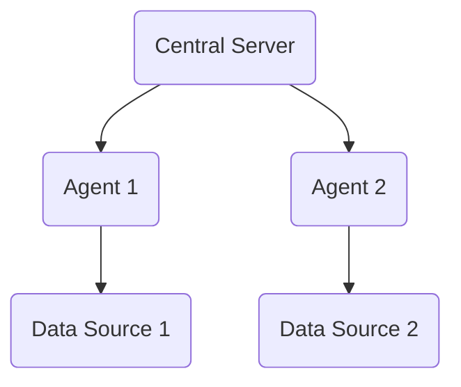
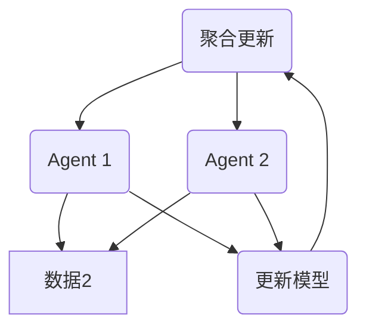
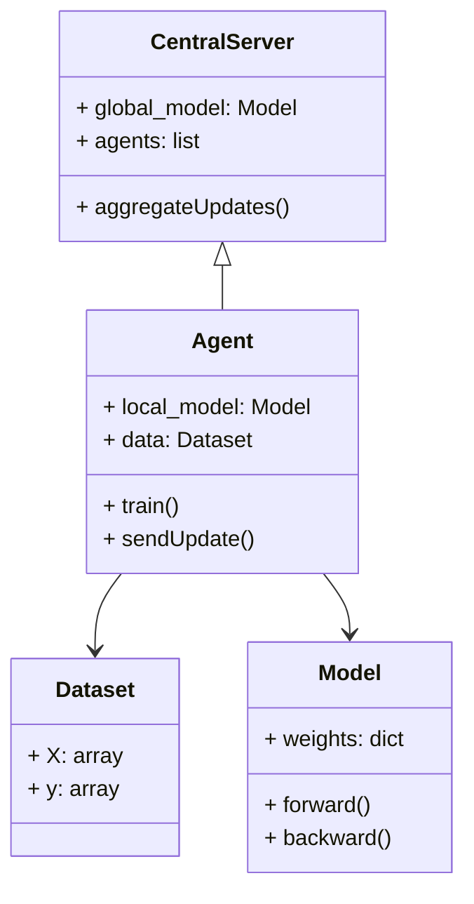
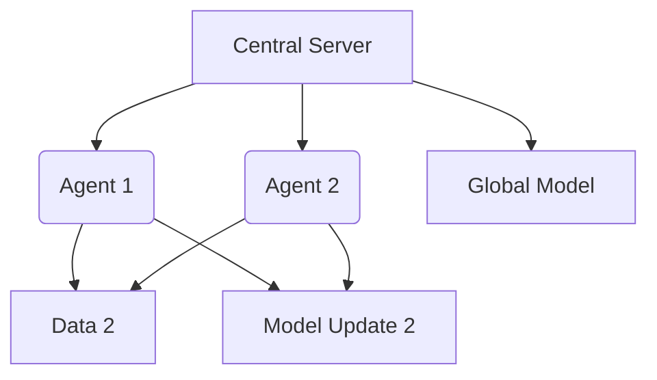
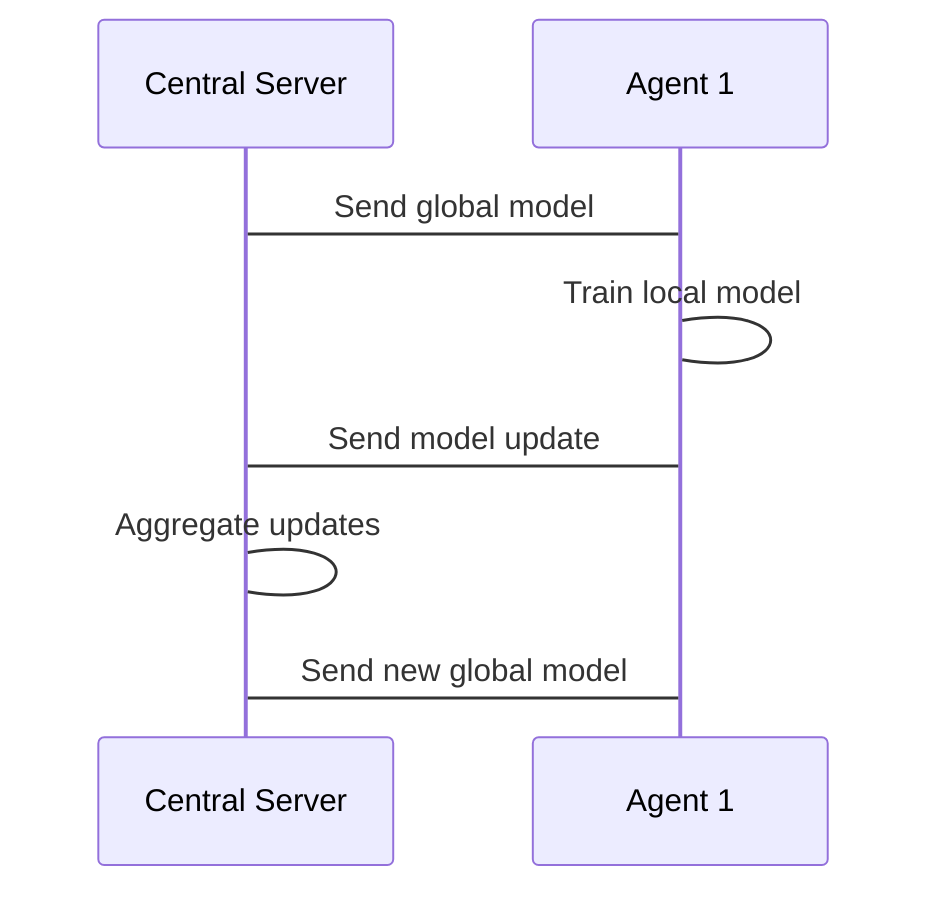

                 


# 联邦学习在分布式AI Agent训练中的应用

---

## 关键词：联邦学习，分布式AI，多智能体协作，数据隐私，机器学习

---

## 摘要：

本文探讨了联邦学习在分布式AI Agent训练中的应用，分析了其核心原理、系统架构及实际案例。通过详细讲解联邦学习算法、AI Agent设计和系统实现，展示了如何在保护数据隐私的前提下，实现高效协作与模型训练。文章还提供了项目实战和最佳实践，帮助读者理解并应用联邦学习技术。

---

## 第一章：背景与概述

### 1.1 联邦学习的定义与特点

联邦学习是一种分布式机器学习技术，允许多个机构在不共享原始数据的情况下联合训练模型。其特点包括数据隐私保护、模型协作更新和去中心化计算。

### 1.2 AI Agent的基本概念

AI Agent是具有感知环境、决策和行动能力的智能体，广泛应用于自动驾驶、机器人等领域。分布式AI Agent通过协作完成复杂任务。

### 1.3 联邦学习在分布式AI Agent中的应用背景

随着数据隐私的重要性增加，联邦学习成为保护隐私的高效选择。分布式AI Agent通过联邦学习实现协作，解决数据孤岛和隐私泄露问题。

### 1.4 分布式AI Agent训练中的挑战

- 数据异构性
- 模型收敛性
- 通信开销
- 安全性问题

### 1.5 联邦学习的应用场景

- 医疗领域：患者数据隐私保护下的疾病诊断模型训练。
- 金融领域：多个金融机构联合训练风险评估模型。
- 智能交通系统：分布式传感器协作优化交通流量。

---

## 第二章：核心概念与联系

### 2.1 联邦学习的核心原理

联邦学习通过局部模型训练和参数聚合，在不共享数据的情况下更新全局模型。其流程包括初始化、局部训练、参数聚合和模型更新。

### 2.2 AI Agent的核心原理

AI Agent通过感知环境、决策和行动实现目标。分布式AI Agent通过通信协作，共同完成复杂任务。

### 2.3 联邦学习与AI Agent的关联

联邦学习为AI Agent提供数据隐私保护的协作框架，AI Agent通过联邦学习实现高效、安全的分布式训练。

### 2.4 联邦学习与传统机器学习的对比

| 特性            | 联邦学习               | 传统机器学习         |
|-----------------|-----------------------|---------------------|
| 数据共享        | 不共享数据            | 共享数据            |
| 中心化程度      | 去中心化              | 高度中心化          |
| 隐私保护        | 强调隐私保护          | 隐私保护较弱        |

### 2.5 实体关系架构图



---

## 第三章：算法原理

### 3.1 联邦平均算法（FedAvg）

FedAvg是联邦学习的核心算法，通过在各个代理（AI Agent）上进行局部训练，然后聚合各代理的模型参数更新全局模型。

#### 3.1.1 算法步骤

1. 初始化全局模型参数。
2. 每个代理下载全局模型并在本地数据上训练。
3. 上传模型参数更新到中央服务器。
4. 中央服务器聚合所有更新，生成新全局模型。

#### 3.1.2 算法流程图



#### 3.1.3 算法实现代码

```python
import numpy as np

def main():
    import torch
    import torch.nn as nn
    import torch.optim as optim

    # 初始化全局模型
    global_model = nn.Linear(2, 1)
    global_params = global_model.state_dict()

    # 代理1训练
    agent1_model = nn.Linear(2, 1)
    optimizer = optim.SGD(agent1_model.parameters(), lr=0.1)
    criterion = nn.MSELoss()

    # 生成代理1数据
    agent1_data = torch.tensor([[2, 0], [1, 1]], dtype=torch.float32)
    agent1_labels = torch.tensor([[1], [0]], dtype=torch.float32)

    # 代理1训练
    agent1_model.train()
    for epoch in range(2):
        optimizer.zero_grad()
        outputs = agent1_model(agent1_data)
        loss = criterion(outputs, agent1_labels)
        loss.backward()
        optimizer.step()

    # 获取代理1更新
    agent1_params = agent1_model.state_dict()

    # 聚合更新
    for key in global_params:
        global_params[key] = (global_params[key] + agent1_params[key]) / 2

    # 更新全局模型
    global_model.load_state_dict(global_params)

    print("模型已更新")

if __name__ == "__main__":
    main()
```

#### 3.1.4 数学模型

全局模型参数更新公式：

$$ w_{new} = \frac{1}{n} \sum_{i=1}^{n} w_i $$

其中，\( n \) 是代理数量，\( w_i \) 是第 \( i \) 个代理的模型参数。

---

## 第四章：系统架构设计

### 4.1 应用场景介绍

以医疗领域为例，多个医院作为代理，通过联邦学习协作训练疾病诊断模型，保护患者隐私。

### 4.2 系统功能设计

#### 4.2.1 系统功能模块

- 中央服务器：管理全局模型，协调代理训练。
- 代理节点：执行本地训练，上传更新。
- 数据管理：确保数据安全和隐私保护。

#### 4.2.2 领域模型类图



#### 4.2.3 系统架构图



#### 4.2.4 系统接口设计

- `aggregate_updates()`: 中央服务器聚合代理更新。
- `train_model()`: 代理在本地数据上训练模型。
- `get_global_model()`: 代理获取当前全局模型。

#### 4.2.5 交互流程图



---

## 第五章：项目实战

### 5.1 环境安装

安装必要的库：

```bash
pip install torch matplotlib numpy
```

### 5.2 核心代码实现

```python
import torch
import torch.nn as nn
import torch.optim as optim

def main():
    # 初始化全局模型
    global_model = nn.Linear(2, 1)
    global_params = global_model.state_dict()

    # 代理1训练
    agent1_model = nn.Linear(2, 1)
    optimizer = optim.SGD(agent1_model.parameters(), lr=0.1)
    criterion = nn.MSELoss()

    # 生成代理1数据
    agent1_data = torch.tensor([[2, 0], [1, 1]], dtype=torch.float32)
    agent1_labels = torch.tensor([[1], [0]], dtype=torch.float32)

    # 代理1训练
    agent1_model.train()
    for epoch in range(2):
        optimizer.zero_grad()
        outputs = agent1_model(agent1_data)
        loss = criterion(outputs, agent1_labels)
        loss.backward()
        optimizer.step()

    # 获取代理1更新
    agent1_params = agent1_model.state_dict()

    # 聚合更新
    for key in global_params:
        global_params[key] = (global_params[key] + agent1_params[key]) / 2

    # 更新全局模型
    global_model.load_state_dict(global_params)

    print("模型已更新")

if __name__ == "__main__":
    main()
```

### 5.3 代码功能解读

代码实现了一个简单的联邦平均算法，展示如何在代理上进行局部训练并聚合更新全局模型。

### 5.4 实际案例分析

以疾病诊断为例，多个医院通过联邦学习协作训练模型，保护患者隐私，提升诊断准确率。

### 5.5 项目总结

通过本项目，读者可以理解联邦学习的基本原理和实现方式，掌握在分布式环境中应用联邦学习技术的能力。

---

## 第六章：最佳实践

### 6.1 小结

联邦学习是一种高效的数据隐私保护技术，适用于分布式AI Agent训练。通过联邦学习，可以在不共享数据的情况下实现模型协作更新。

### 6.2 注意事项

- 数据异构性处理：不同代理的数据分布可能不同，需要进行数据预处理和模型调整。
- 模型收敛性：确保模型在联邦学习过程中能够收敛，可能需要调整学习率和通信频率。
- 安全性问题：防止恶意代理攻击，确保通信安全。

### 6.3 未来发展趋势

- 跨领域应用：将联邦学习应用于更多领域，如金融、医疗等。
- 智能化协作：通过AI Agent实现更智能的协作和决策。
- 高效算法开发：研究更高效的联邦学习算法，降低通信开销和计算成本。

### 6.4 扩展阅读

- 《Federated Learning: Challenges, Methods, and Applications》
- 《Distributed Machine Learning and Its Applications》

---

## 第七章：总结与展望

### 7.1 内容回顾

本文详细讲解了联邦学习在分布式AI Agent训练中的应用，包括核心原理、系统架构和项目实战。通过具体案例和代码实现，展示了联邦学习的优势和实际应用。

### 7.2 未来展望

随着数据隐私保护需求的增加，联邦学习将在更多领域得到应用。未来的研究将集中在算法优化、安全性提升和智能协作等方面。

---

## 作者：AI天才研究院/AI Genius Institute & 禅与计算机程序设计艺术 /Zen And The Art of Computer Programming

