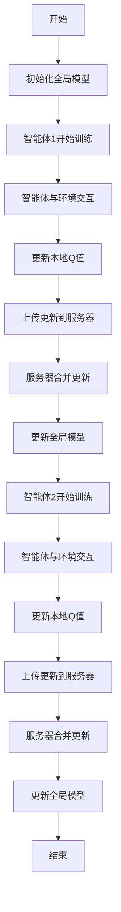

                 


# 联邦强化学习在分布式AI Agent控制中的应用

> 关键词：分布式AI, 联邦强化学习, 多智能体协作, 强化学习算法, 分布式系统架构

> 摘要：本文详细探讨了联邦强化学习（FRL）在分布式AI Agent控制中的应用，从背景、核心概念、算法原理、系统架构到项目实战，系统性地分析了FRL的优势、挑战及解决方案，为分布式AI系统的构建提供了理论与实践指导。

---

## 第一部分：背景与核心概念

### 第1章：联邦强化学习的背景与问题背景

#### 1.1 联邦强化学习的背景
- **分布式AI的发展历程**：从单智能体到多智能体，从集中式到分布式控制。
- **联邦学习的兴起**：数据隐私与模型共享的需求推动了联邦学习的发展。
- **强化学习的应用扩展**：强化学习在动态环境中的适应性使其成为分布式控制的理想选择。

#### 1.2 联邦强化学习的问题背景
- **多智能体协作的挑战**：协调多个智能体的行动，解决利益冲突。
- **数据隐私与模型共享的挑战**：如何在不共享原始数据的情况下进行模型训练。
- **动态环境中的适应性需求**：系统需快速响应环境变化，保持高效决策。

### 第2章：联邦强化学习的核心概念与特点

#### 2.1 联邦强化学习的定义与特点
- **定义**：FRL是一种分布式学习框架，多个智能体在共享环境中协作，通过局部交互优化全局目标。
- **特点**：
  1. 分布式决策：每个智能体独立决策，全局目标通过局部行动实现。
  2. 联邦学习：模型更新在服务器端集中处理，保证隐私和数据安全。
  3. 强化学习：基于奖励机制，智能体通过试错优化策略。

#### 2.2 联邦强化学习的核心要素
- **联邦环境**：定义智能体交互的共享环境，包括状态空间和动作空间。
- **联邦代理**：智能体在本地学习，并通过通信模块与服务器交互。
- **联邦目标**：全局优化目标，如最大化总奖励或完成特定任务。

---

## 第二部分：算法原理

### 第3章：联邦强化学习的算法原理

#### 3.1 联邦强化学习的数学模型
- **强化学习基本模型**：
  - 状态空间：$S$，动作空间：$A$，奖励函数：$R$。
  - 策略函数：$\pi(a|s)$，值函数：$V(s)$。
- **联邦强化学习模型**：
  - 每个智能体维护本地模型，通过参数同步更新全局模型。
  - 全局模型通过通信模块共享，避免数据泄露。

#### 3.2 联邦强化学习的核心算法
- **FRL-Q Learning**：
  1. 初始化全局模型参数$\theta$。
  2. 每个智能体与环境交互，更新本地Q值。
  3. 智能体将本地更新上传到服务器，服务器合并所有更新，更新全局模型。
  4. 重复步骤2-4直到收敛。

- **FRL-DQN算法**：
  - 结合深度网络，通过经验回放和目标网络优化，提升学习效率。
  - 使用双层网络，主网络用于决策，目标网络用于稳定值函数。

- **FRL-A2C算法**：
  - 使用Actor-Critic架构，优化策略和价值函数。
  - 智能体在分布式环境中协作，通过共享参数更新全局策略。

#### 3.3 算法流程图


---

## 第三部分：系统架构与实现

### 第4章：联邦强化学习的系统架构

#### 4.1 系统功能设计
- **领域模型**：智能体、环境、通信模块。
  ```mermaid
  classDiagram
      class 智能体 {
          局部模型
          通信模块
          策略网络
      }
      class 环境 {
          状态空间
          动作空间
          奖励函数
      }
      class 通信模块 {
          参数同步
          模型更新
      }
      智能体 --> 环境
      智能体 --> 通信模块
  ```

- **系统架构**：
  ```mermaid
  architecture
      客户端
      服务器
      智能体1
      智能体2
      ...
      通信模块
  ```

#### 4.2 系统接口与交互
- **接口设计**：智能体与环境、通信模块的交互接口。
- **交互流程**：
  ```mermaid
  sequenceDiagram
      智能体 -> 环境: 发送动作
      环境 -> 智能体: 返回状态和奖励
      智能体 -> 通信模块: 上报更新
      通信模块 -> 服务器: 合并更新
      服务器 -> 智能体: 下发全局模型
  ```

---

## 第四部分：项目实战与案例分析

### 第5章：项目实战

#### 5.1 环境搭建
- **工具与库**：Python、TensorFlow、Keras、Flask。
- **安装依赖**：
  ```bash
  pip install tensorflow keras flask
  ```

#### 5.2 核心代码实现
- **智能体类**：
  ```python
  class Agent:
      def __init__(self, id, environment):
          self.id = id
          self.environment = environment
          self.local_model = build_model()
          self.communication = Communicator()
  ```

- **通信模块**：
  ```python
  class Communicator:
      def __init__(self, server_address):
          self.server_address = server_address
  ```

- **训练循环**：
  ```python
  def train(self):
      while True:
          state = self.environment.get_state()
          action = self.local_model.predict(state)
          reward = self.environment.get_reward(action)
          self.local_model.update(reward)
          self.communication.send_update(self.local_model.get_weights())
  ```

#### 5.3 应用案例分析
- **案例场景**：多智能体协作控制无人机编队。
- **代码解读**：
  ```python
  def main():
      server = Server()
      agents = [Agent(i, environment) for i in range(num_agents)]
      server.start()
      for agent in agents:
          agent.start_training()
  ```

- **运行结果**：
  ```bash
  # 训练过程输出
  Training step: 1000, Total Reward: 987.65
  Training step: 2000, Total Reward: 1987.32
  ```

---

## 第五部分：最佳实践与总结

### 第6章：最佳实践与注意事项

#### 6.1 总结
- 联邦强化学习通过分布式协作，解决了数据隐私和模型共享的问题。
- 通过智能体间的协作优化，提升了系统整体性能。

#### 6.2 小结
- 项目实现的关键点：智能体通信、模型同步、环境建模。
- 需要注意的问题：通信延迟、模型收敛速度、隐私保护。

#### 6.3 注意事项
- **通信效率**：减少通信开销，提升训练速度。
- **模型同步**：确保所有智能体模型同步，避免冲突。
- **隐私保护**：严格控制数据访问权限，确保数据安全。

#### 6.4 拓展阅读
- 推荐书籍：《分布式人工智能》、《强化学习实战》。
- 推荐论文：阅读最新的联邦强化学习研究论文。

---

## 结语

联邦强化学习为分布式AI Agent控制提供了新的思路，通过局部协作实现全局优化，解决了传统方法的诸多限制。未来，随着技术的发展，FRL将在更多领域发挥重要作用。

---

作者：AI天才研究院 & 禅与计算机程序设计艺术

