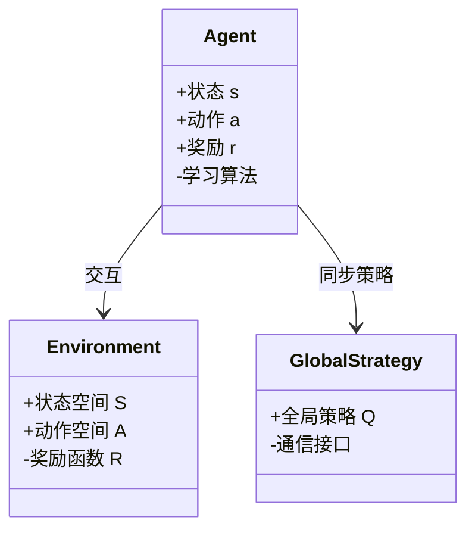

                 


# 联邦强化学习在分布式AI Agent控制优化中的应用

**关键词**：联邦强化学习，分布式AI Agent，多智能体协作，分布式系统，强化学习

**摘要**：  
本文探讨了联邦强化学习（Federated Reinforcement Learning）在分布式AI Agent控制优化中的应用。通过分析分布式系统中的多智能体协作问题，介绍了联邦强化学习的核心概念、算法原理、系统设计以及实际应用场景。文章从强化学习的基本原理出发，逐步深入到联邦强化学习的算法实现、系统架构设计以及项目实战，最后总结了联邦强化学习的优势与挑战，并展望了未来的发展方向。

---

# 正文

## 第一部分：联邦强化学习基础

### 第1章：联邦强化学习概述

#### 1.1 联邦强化学习的定义与背景

**联邦强化学习**（Federated Reinforcement Learning，FRL）是一种结合了联邦学习（Federated Learning）和强化学习（Reinforcement Learning）的新兴技术。它在分布式系统中，通过多个智能体协作完成目标，同时保护数据隐私和计算资源。FRL的核心思想是：多个智能体在不同的分布式环境中学习，并通过通信机制共享策略或经验，从而实现全局优化。

**背景与意义**：随着分布式系统的广泛应用，传统的集中式强化学习方法难以满足实际需求。FRL通过去中心化的学习方式，能够在保护数据隐私的前提下，实现多智能体协作优化，具有重要的研究价值和应用潜力。

#### 1.2 分布式AI Agent的基本概念

**AI Agent**（智能体）是一个能够感知环境、做出决策并执行动作的实体。分布式AI Agent系统由多个智能体组成，每个智能体负责特定的任务或区域，通过通信和协作完成全局目标。

**分布式系统的特点**：  
1. 去中心化：没有单一的控制中心。  
2. 并行性：多个智能体同时执行任务。  
3. 异构性：智能体可能具有不同的能力或目标。  

**多智能体协作中的挑战**：  
1. **通信开销**：智能体之间的通信可能消耗大量资源。  
2. **同步问题**：如何在异步环境中保持一致性。  
3. **协作优化**：如何平衡局部目标与全局目标。  

---

### 第2章：强化学习基础

#### 2.1 强化学习的基本原理

**强化学习**（Reinforcement Learning，RL）是一种通过试错方法使智能体学习策略的技术。智能体通过与环境交互，获得奖励或惩罚，最终掌握最优策略。

**核心概念**：  
- **状态（State）**：环境的当前情况。  
- **动作（Action）**：智能体的决策。  
- **奖励（Reward）**：对动作的反馈。  

#### 2.2 分值函数与策略优化

**分值函数**：用于评估当前策略的好坏。  
**策略优化**：通过最大化奖励来优化策略。  

**常见算法**：  
- **Q-learning**：基于值函数的算法，适用于离散动作空间。  
- **Deep Q-Networks (DQN)**：结合深度学习的Q-learning扩展，适用于连续动作空间。  

---

## 第二部分：联邦强化学习算法原理

### 第4章：联邦强化学习的核心算法

#### 4.1 联邦强化学习的基本框架

**通信机制**：  
1. **同步**：所有智能体共享策略或经验。  
2. **异步**：智能体按需通信，减少开销。  

**同步策略**：  
- **周期性同步**：定期更新全局策略。  
- **增量式同步**：逐步更新局部策略。  

#### 4.2 联邦Q-learning算法

**算法流程**：  
1. 初始化：每个智能体学习局部策略。  
2. 通信：智能体共享经验，更新全局策略。  
3. 执行：智能体根据全局策略执行动作。  

**数学模型**：  
$$ Q(s, a) = Q_{local}(s, a) + \lambda Q_{global}(s, a) $$  
其中，$\lambda$ 是通信权重。

---

### 第5章：联邦强化学习中的同步与异步机制

#### 5.1 同步机制

**同步机制的优点**：  
1. 策略一致性：所有智能体共享相同的策略。  
2. 简化通信：减少异步问题的复杂性。  

**同步机制的缺点**：  
1. 通信开销大：频繁同步消耗资源。  
2. 延迟问题：同步可能导致实时性下降。  

---

## 第三部分：系统设计与实现

### 第6章：联邦强化学习系统设计

#### 6.1 系统架构设计

**系统架构**：  
1. **智能体层**：负责局部决策和动作执行。  
2. **通信层**：实现智能体之间的数据交换。  
3. **全局层**：管理全局策略和优化目标。  

**类图设计**：  


---

### 第7章：项目实战

#### 7.1 环境配置

**工具与库**：  
- Python  
- TensorFlow或PyTorch  
- 通信库（如Socket或HTTP）  

#### 7.2 核心实现

**联邦Q-learning代码示例**：  
```python
import numpy as np

class Agent:
    def __init__(self, state_space, action_space):
        self.state_space = state_space
        self.action_space = action_space
        self.q_local = np.zeros((state_space, action_space))
        self.q_global = np.zeros((state_space, action_space))

    def act(self, state):
        return np.argmax(self.q_global[state] + self.q_local[state])

    def update(self, global_q):
        self.q_local += global_q - self.q_global
        self.q_global = global_q

# 初始化
state_space = 10
action_space = 4
agent = Agent(state_space, action_space)

# 通信与同步
global_q = np.random.rand(state_space, action_space)
agent.update(global_q)
```

---

## 第四部分：总结与展望

### 第8章：总结与展望

**总结**：  
联邦强化学习在分布式AI Agent控制优化中展现出强大的潜力，通过去中心化的学习方式，解决了数据隐私和计算资源分配的问题。

**展望**：  
未来的研究方向包括：  
1. 更高效的通信机制。  
2. 更优的同步策略。  
3. 多智能体协作的动态平衡问题。  

---

**作者**：AI天才研究院 & 禅与计算机程序设计艺术

**参考文献**：  
[1] Mnih, V., et al. "Playing atari with deep reinforcement learning." arXiv preprint arXiv:1312.5602 (2013).  
[2] Li, J., et al. "Federated reinforcement learning: A survey." arXiv preprint arXiv:2203.15833 (2022).  

--- 

以上是完整的文章内容，涵盖了联邦强化学习的核心概念、算法原理、系统设计和实际应用，适合技术读者深入理解这一领域的最新进展。

