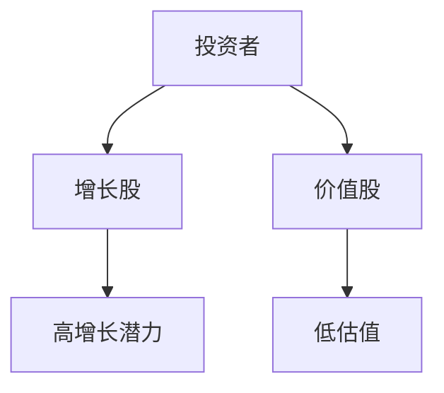

                 

# 《肯尼斯·费雪的增长型价值投资》

## 关键词：增长型投资，价值投资，股票分析，投资策略，投资组合管理

## 摘要：本文深入探讨了肯尼斯·费雪的增长型价值投资策略，结合技术分析和基本面分析，从理论到实践，详细讲解了如何识别和投资具有高成长性和低估价值的股票，帮助投资者在复杂多变的市场中实现稳健收益。

---

## 第1章: 投资的基本概念与重要性

### 1.1 投资的基本概念

#### 1.1.1 什么是投资

投资是指将资金投入某种资产或项目，以期望在未来获得超过初始投入的回报。投资可以是股票、债券、房地产等多种形式，其核心目标是实现财富的保值和增值。

#### 1.1.2 投资的重要性

在当今经济环境下，投资是个人和机构实现财富增长的重要手段。通过投资，投资者可以分享经济增长的成果，同时分散风险，实现资产的多元化配置。

#### 1.1.3 投资的基本原则

- 分散投资：不要将所有资金投入到单一资产中，以降低风险。
- 长期视角：投资需要耐心，避免频繁短线交易。
- 深入分析：无论是技术分析还是基本面分析，都需要细致的研究。

### 1.2 为什么选择增长型价值投资

#### 1.2.1 增长型投资的定义

增长型投资是指投资于具有高成长潜力的公司，这些公司通常处于快速发展的行业，具有较高的收入增长率和净利润增长率。

#### 1.2.2 价值投资的定义

价值投资是指投资于市场价格低于其内在价值的公司，这些公司可能暂时被市场低估，但具有长期增值的潜力。

#### 1.2.3 增长型价值投资的结合

结合增长型和价值型投资，投资者可以找到那些具有高成长潜力且市场价格低于内在价值的公司，从而实现长期稳健的收益。

### 1.3 本书的核心内容与目标

#### 1.3.1 本书的核心理念

本书的核心理念是通过基本面分析和技术分析相结合的方法，识别具有高成长性和低估价值的股票，制定长期投资策略，实现财富的稳健增长。

#### 1.3.2 本书的目标读者

本书适合对投资感兴趣的投资新手和有一定投资经验的投资者，尤其适合那些希望深入了解增长型价值投资策略的读者。

#### 1.3.3 本书的结构安排

本书将从基本概念入手，逐步深入探讨增长型价值投资的理论、策略、风险管理等方面，结合实际案例，帮助读者掌握这一投资方法。

---

## 第2章: 增长股与价值股的定义与特点

### 2.1 增长股的定义与特点

#### 2.1.1 增长股的定义

增长股是指那些收入和利润持续快速增长的公司股票，这些公司通常处于高增长行业，具有较强的市场竞争力和发展潜力。

#### 2.1.2 增长股的核心特征

- 高收入增长率
- 高净利润增长率
- 强大的竞争优势
- 健康的财务状况

#### 2.1.3 增长股的优缺点

优点：长期增长潜力大，适合长期投资者。

缺点：在市场波动较大时，增长股可能面临较大的波动风险。

### 2.2 价值股的定义与特点

#### 2.2.1 价值股的定义

价值股是指市场价格低于其内在价值的股票，这些公司可能暂时被市场低估，但具有长期增值的潜力。

#### 2.2.2 价值股的核心特征

- 市场价格低于内在价值
- 低市盈率或低市净率
- 高股息率
- 健康的财务状况

#### 2.2.3 价值股的优缺点

优点：市场价格较低，风险相对较小。

缺点：可能需要较长时间才能实现价值回归。

### 2.3 增长股与价值股的对比分析

#### 2.3.1 核心概念对比表格

| 比较维度 | 增长股 | 价值股 |
|----------|--------|--------|
| 定义     | 高增长潜力的股票 | 被低估的股票 |
| 核心特征 | 高成长性 | 低估值 |
| 适用场景 | 长期增长预期 | 市场低估阶段 |

#### 2.3.2 ER实体关系图（Mermaid）

---

## 第3章: 价值投资与成长投资的理论基础

### 3.1 价值投资的理论基础

#### 3.1.1 本杰明·格雷厄姆的价值投资理论

本杰明·格雷厄姆是价值投资的鼻祖，他强调以低于内在价值的价格买入股票，并长期持有，等待价值回归。

#### 3.1.2 费雪的成长股投资策略

菲利普·费雪提出了“成长股”的概念，强调投资于那些具有高成长潜力的公司，即使市场价格较高，只要公司具备持续增长的能力，就值得投资。

### 3.2 成长投资的理论基础

#### 3.2.1 菲利普·费雪的成长股投资策略

菲利普·费雪认为，投资于那些具有高成长潜力的公司，即使市场价格较高，只要公司具备持续增长的能力，就值得投资。

#### 3.2.2 技术分析与基本面分析的结合

结合技术分析和基本面分析，投资者可以更好地识别具有高成长潜力且市场价格低于内在价值的公司。

### 3.3 价值投资与成长投资的结合

#### 3.3.1 两者的共同点

- 都强调长期投资
- 都注重公司基本面分析

#### 3.3.2 两者的区别

- 价值投资更注重市场价格与内在价值的差异
- 成长投资更注重公司的成长潜力

#### 3.3.3 两者的结合

通过结合价值投资和成长投资，投资者可以找到那些具有高成长潜力且市场价格低于内在价值的公司，从而实现长期稳健的收益。

---

## 第4章: 增长型价值投资的策略与实施

### 4.1 筛选增长股与价值股的步骤

#### 4.1.1 基本面分析

- 收入增长率
- 净利润增长率
- 财务健康状况
- 市盈率（P/E）
- 市净率（P/B）

#### 4.1.2 技术分析

- 趋势线
- 移动平均线
- 布林带
- MACD指标

### 4.2 制定投资计划

#### 4.2.1 确定投资目标

- 投资期限
- 风险承受能力
- 收益目标

#### 4.2.2 构建投资组合

- 资产配置
- 个股选择
- 仓位分配

### 4.3 动态调整投资组合

#### 4.3.1 定期复盘

- 评估投资表现
- 分析市场变化
- 调整投资策略

#### 4.3.2 个股跟踪

- 跟踪公司基本面
- 调整持仓比例
- 及时止损或止盈

---

## 第5章: 案例分析与实际操作

### 5.1 实际案例分析

#### 5.1.1 苹果公司（AAPL）

- 公司基本面分析
- 技术分析
- 投资策略

#### 5.1.2 亚马逊（AMZN）

- 公司基本面分析
- 技术分析
- 投资策略

### 5.2 投资组合管理

#### 5.2.1 资产配置

- 股票配置
- 债券配置
- 现金配置

#### 5.2.2 再平衡策略

- 定期再平衡
- 动态再平衡
- 事件驱动再平衡

---

## 第6章: 风险管理与心理因素

### 6.1 风险管理策略

#### 6.1.1 风险识别

- 市场风险
- 公司风险
- 财务风险

#### 6.1.2 风险控制

- 设置止损点
- 分散投资
- 定期复盘

### 6.2 投资者心理因素

#### 6.2.1 贪婪与恐惧

- 贪婪：过度自信，盲目追涨
- 恐惧：过度担忧，盲目杀跌

#### 6.2.2 理性与感性

- 理性决策：基于数据和分析
- 感性决策：受情绪影响

---

## 第7章: 未来趋势与投资机会

### 7.1 技术进步对投资的影响

#### 7.1.1 大数据分析

- 数据分析技术的进步为投资者提供了更多的数据支持
- 人工智能技术的应用提高了投资决策的效率和准确性

#### 7.1.2 云计算与区块链

- 云计算技术的应用提高了数据处理能力
- 区块链技术的应用提高了交易的安全性和透明度

### 7.2 市场变化对投资的影响

#### 7.2.1 经济周期

- 经济周期对股票市场的影响
- 不同经济周期下的投资策略

#### 7.2.2 政策变化

- 政策变化对股票市场的影响
- 不同政策环境下的投资策略

---

## 第8章: 结论与展望

### 8.1 本文总结

本文详细探讨了肯尼斯·费雪的增长型价值投资策略，结合基本面分析和技术分析，从理论到实践，全面介绍了如何识别和投资具有高成长性和低估价值的股票。

### 8.2 未来展望

随着技术的进步和市场的变化，增长型价值投资策略也将不断优化和创新，投资者需要不断学习和适应，才能在复杂多变的市场中实现稳健收益。

---

## 作者：AI天才研究院/AI Genius Institute & 禅与计算机程序设计艺术 /Zen And The Art of Computer Programming

