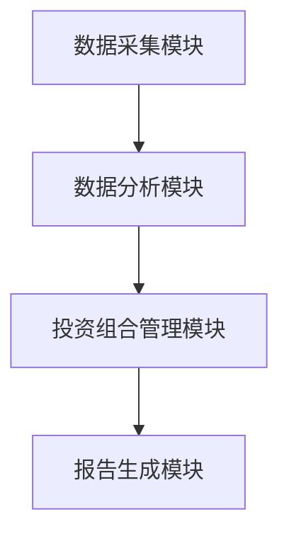
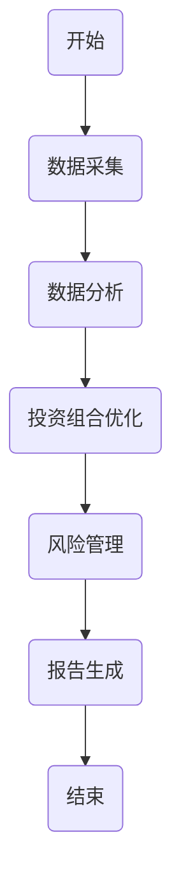
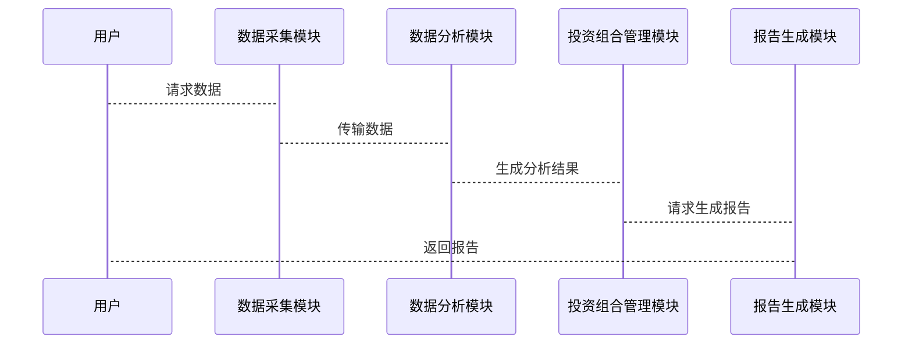

                 


# 肯尼斯·费雪的增长型价值投资：未来潜力股的发掘

## 关键词：价值投资，增长型投资，股票分析，投资策略，风险管理

## 摘要：  
本文深入探讨了肯尼斯·费雪的增长型价值投资理念，分析了其核心概念、投资策略和实际应用。通过系统化的分析和案例研究，揭示了如何识别未来潜力股，构建高效的投资组合，并进行有效的风险管理。文章从理论到实践，结合数学模型和系统架构设计，为读者提供了全面的指导。

---

## 第1章：价值投资的核心理念

### 1.1 价值投资的定义与背景

#### 1.1.1 价值投资的起源与发展  
价值投资是一种以股票内在价值为核心的投资策略，起源于20世纪初，由本杰明·格雷厄姆和大卫·多德共同提出。其核心理念是寻找市场价格低于内在价值的股票进行投资。  

#### 1.1.2 价值投资的核心理念  
- 股票的价值取决于其未来现金流的现值。  
- 市场价格围绕内在价值波动，短期内可能偏离，但长期会回归。  
- 投资者应关注企业的基本面，而非短期市场情绪。  

#### 1.1.3 价值投资与成长投资的区别  
| **维度**       | **价值投资**                | **成长投资**                |  
|------------------|-----------------------------|-----------------------------|  
| 核心目标         | 寻找低估股票                | 寻找高增长股票              |  
| 关注点           | 股票的内在价值              | 公司的收入和利润增长率      |  
| 风险承受能力     | 较低                       | 较高                       |  

---

## 第2章：增长型价值投资的核心概念

### 2.1 增长型投资的定义与特征

#### 2.1.1 增长型投资的定义  
增长型投资是一种结合了价值投资和成长投资的策略，旨在寻找那些具有持续增长潜力、市场价格低于内在价值的股票。  

#### 2.1.2 增长型投资的核心特征  
- **持续增长潜力**：公司未来收入和利润有稳定增长预期。  
- **合理估值**：市场价格低于基于未来现金流的内在价值。  
- **长期视角**：注重企业的长期竞争优势和行业地位。  

#### 2.1.3 增长型投资与价值投资的联系与区别  
| **维度**       | **增长型投资**              | **价值投资**                |  
|------------------|-----------------------------|-----------------------------|  
| 核心目标         | 寻找高增长、低估股票         | 寻找低估股票                |  
| 关注点           | 公司的未来增长潜力          | 股票的内在价值              |  
| 投资期限         | 中长期                     | 长期                        |  

---

## 第3章：增长型价值投资的策略与方法

### 3.1 增长型投资的选股策略

#### 3.1.1 基本面分析法  
基本面分析是增长型投资的核心方法，主要包括以下步骤：  
1. **财务指标分析**：关注收入增长率、净利润增长率、ROE（净资产收益率）等指标。  
2. **行业分析**：选择具有成长潜力的行业，如科技、医疗等。  
3. **竞争优势分析**：评估公司在行业中的地位、护城河等。  

#### 3.1.2 技术分析法  
技术分析通过股票价格和成交量的走势来预测未来的价格变动。常用的技术指标包括：  
- **移动平均线（MA）**：用于判断价格趋势。  
- **相对强弱指数（RSI）**：用于判断超买或超卖状态。  
- **MACD**：用于判断价格趋势和动能变化。  

#### 3.1.3 行业分析法  
通过分析行业的发展趋势、市场需求、政策影响等因素，选择具有增长潜力的行业。  

### 3.2 股票投资组合的构建

#### 3.2.1 投资组合的定义与作用  
投资组合是将资金分配到多种股票中，以分散风险并提高收益。  

#### 3.2.2 投资组合的优化策略  
- **资产配置**：根据风险承受能力和收益目标，分配股票、债券等资产的比例。  
- **分散投资**：选择不同行业、不同风险等级的股票，降低组合风险。  
- **定期调整**：根据市场变化和公司基本面，定期优化投资组合。  

#### 3.2.3 投资组合的风险管理  
- **止损策略**：设定止损点，避免重大损失。  
- **风险分散**：通过投资不同行业的股票降低行业风险。  
- **定期评估**：定期评估投资组合的表现，及时调整策略。  

### 3.3 股票投资的长期与短期策略

#### 3.3.1 长期投资策略  
长期投资注重股票的内在价值，适合风险承受能力强的投资者。  

#### 3.3.2 短期投资策略  
短期投资关注市场波动和交易机会，适合经验丰富的投资者。  

#### 3.3.3 两者的结合与应用  
结合长期和短期策略，可以在把握长期趋势的同时，抓住短期市场机会，提高投资收益。  

---

## 第4章：增长型价值投资的数学模型与分析

### 4.1 股票估值的数学模型

#### 4.1.1 股票内在价值的计算公式  
股票的内在价值可以通过 discounted cash flow（DCF）模型计算：  
$$ V = \frac{CF_1}{(1+r)^1} + \frac{CF_2}{(1+r)^2} + \cdots + \frac{CF_n}{(1+r)^n} $$  
其中，$CF_i$ 是未来第 $i$ 年的现金流，$r$ 是折现率。  

#### 4.1.2 市盈率与市净率的计算与应用  
- **市盈率（P/E）**：$$ P/E = \frac{\text{股价}}{\text{每股净利润}} $$  
- **市净率（P/B）**：$$ P/B = \frac{\text{股价}}{\text{每股净资产}} $$  
市盈率和市净率是常用的估值指标，可以帮助投资者判断股票是否被低估。  

#### 4.1.3 股票收益率的计算与分析  
- **总收益率**：$$ \text{总收益率} = \frac{\text{资本收益} + \text{股息收益}}{\text{初始投资}} $$  
- **年化收益率**：$$ \text{年化收益率} = \left(1 + \text{总收益率}\right)^{\frac{1}{n}} - 1 $$  

### 4.2 投资组合的风险与收益分析

#### 4.2.1 投资组合的期望收益率计算  
$$ E(R_p) = \sum_{i=1}^n w_i R_i $$  
其中，$w_i$ 是第 $i$ 只股票的投资比例，$R_i$ 是第 $i$ 只股票的预期收益率。  

#### 4.2.2 投资组合的风险度量与分析  
- **方差**：$$ \text{方差} = \sum_{i=1}^n \sum_{j=1}^n w_i w_j \text{Cov}(R_i, R_j) $$  
- **标准差**：$$ \text{标准差} = \sqrt{\text{方差}} $$  

#### 4.2.3 马科维茨投资组合理论的应用  
马科维茨理论认为，最优投资组合是在相同风险下收益最大化，或在相同收益下风险最小化的组合。  

### 4.3 股票市场的波动性与预测模型

#### 4.3.1 时间序列分析模型  
时间序列模型（如ARIMA）可以用于股票价格的短期预测。  

#### 4.3.2 随机游走模型  
随机游走模型假设股票价格的变化是随机的，无法通过技术分析预测未来价格。  

#### 4.3.3 机器学习在股票预测中的应用  
机器学习算法（如LSTM）可以用于股票价格的长期预测，但需要大量数据和计算资源。  

---

## 第5章：增长型价值投资的系统分析与架构设计

### 5.1 投资分析系统的功能设计

#### 5.1.1 系统功能模块划分  
- 数据采集模块：收集股票数据。  
- 数据分析模块：进行基本面和技术面分析。  
- 投资组合管理模块：优化投资组合并进行风险管理。  
- 报告生成模块：生成投资报告。  

#### 5.1.2 模块之间的关系与交互  


#### 5.1.3 系统功能流程图  


### 5.2 投资分析系统的架构设计

#### 5.2.1 系统架构图  


#### 5.2.2 数据流图  
```mermaid
dataflow
A[数据源] --> B[数据采集模块]
B --> C[数据分析模块]
C --> D[投资组合管理模块]
D --> E[报告生成模块]
E --> F[用户界面]
```

#### 5.2.3 系统交互图  


### 5.3 系统接口与数据源设计

#### 5.3.1 数据接口的设计  
- API接口：通过REST API获取股票数据。  
- 数据格式：JSON格式。  

#### 5.3.2 数据源的获取与处理  
- 数据来源：股票市场数据供应商（如Yahoo Finance、Google Finance）。  
- 数据处理：清洗、转换和存储。  

#### 5.3.3 数据存储与管理  
- 数据库选择：关系型数据库（如MySQL）或非关系型数据库（如MongoDB）。  
- 数据存储结构：设计合理的表结构，便于查询和分析。  

---

## 第6章：增长型价值投资的项目实战

### 6.1 项目环境与工具安装

#### 6.1.1 系统环境要求  
- 操作系统：Windows/Mac/Linux。  
- Python版本：3.8及以上。  

#### 6.1.2 开发工具的安装与配置  
- Python环境：安装Anaconda或miniconda。  
- 必要库：安装pandas、numpy、matplotlib、scikit-learn等库。  

#### 6.1.3 数据源的获取与处理  
- 数据获取：通过Yahoo Finance API获取股票数据。  
- 数据清洗：处理缺失值和异常值。  

### 6.2 核心算法与代码实现

#### 6.2.1 增长型股票筛选算法  
```python
import pandas as pd
import numpy as np

# 假设df是股票数据，包含'Adj Close'和'Volume'列
df['SMA_20'] = df['Adj Close'].rolling(20).mean()
df['SMA_50'] = df['Adj Close'].rolling(50).mean()
df['RSI'] = ta.RSI(df['Adj Close'], window=14)

# 筛选条件：SMA_20 < SMA_50 且 RSI < 30
df['Signal'] = 0
df.loc[df['SMA_20'] < df['SMA_50'] & df['RSI'] < 30, 'Signal'] = 1
```

#### 6.2.2 投资组合优化算法  
```python
import numpy as np

def optimize_portfolio(returns, weights):
    # 计算投资组合的预期收益和风险
    expected_return = np.sum(returns * weights)
    portfolio_variance = np.dot(weights.T, np.dot(returns.cov(), weights))
    return -expected_return + np.sqrt(portfolio_variance)
```

#### 6.2.3 风险管理算法  
```python
import pyfolio as pf

# 计算最大回撤
max_drawdown = pf.utils.max_drawdown(returns)
```

### 6.3 项目实现与案例分析

#### 6.3.1 实际案例的选择与分析  
选择科技行业中的某家成长型公司，分析其财务数据和市场表现。  

#### 6.3.2 算法的实现与验证  
通过回测验证算法的有效性，计算收益和风险指标。  

#### 6.3.3 投资组合的构建与优化  
根据筛选结果构建投资组合，并进行风险管理和优化。  

---

## 第7章：增长型价值投资的最佳实践

### 7.1 项目总结

#### 7.1.1 核心概念总结  
增长型价值投资结合了价值投资和成长投资的优点，注重股票的内在价值和未来增长潜力。  

#### 7.1.2 技术实现总结  
通过系统化的分析和算法实现，投资者可以更科学地进行股票筛选和投资组合管理。  

### 7.2 注意事项

#### 7.2.1 风险提示  
- 市场波动风险  
- 信息滞后风险  
- 模型假设的局限性  

#### 7.2.2 操作建议  
- 定期复盘和调整投资组合。  
- 保持对市场变化的敏感性。  

### 7.3 拓展阅读

#### 7.3.1 推荐书籍  
- 《价值》（The Intelligent Investor）——本杰明·格雷厄姆  
- 《股票做空》（The Art of Short Selling）——莎拉·艾斯林  

#### 7.3.2 推荐博客与网站  
- 知识分子博客（The Intelligentsia Blog）  
- 投资组合分析网站（Portfolio Analytics）  

---

## 作者：AI天才研究院/AI Genius Institute & 禅与计算机程序设计艺术 /Zen And The Art of Computer Programming

---

通过本文的系统分析和实战案例，读者可以深入了解增长型价值投资的策略和方法，并能够在实际投资中灵活运用这些理念和工具。希望本文能为投资者提供有价值的参考，帮助他们在复杂多变的股市中找到成功的投资策略。

